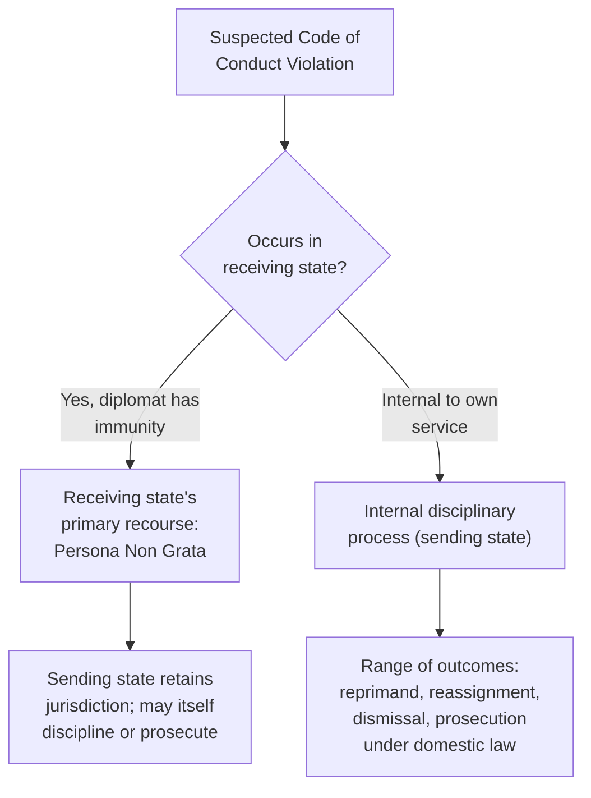

## Diplomatic Ethics and Codes of Conduct

### Overview

Diplomatic ethics concerns the standards of conduct expected of individuals who represent a state's interests to other states and international bodies, in a role that carries formal privileges (immunity, inviolability) alongside significant responsibility (fidelity to instructions, honesty in representation, stewardship of the relationship between states). Codes of conduct formalize these expectations into professional standards enforceable through diplomatic services' own disciplinary systems, distinct from — though sometimes overlapping with — international law governing diplomatic relations (notably the Vienna Convention on Diplomatic Relations, 1961). This item surveys the core ethical principles, the professional codes that codify them, and the recurring tension areas where diplomats face genuine moral difficulty.

### Foundational Ethical Principles in Diplomacy

**Key Points**

- **Fidelity to instructions** — a diplomat represents their government's position, not their personal views; ethical practice requires honestly conveying instructed positions even when the diplomat personally disagrees, while using internal channels (not public contradiction) to register dissent
- **Honesty and good faith in representation** — while diplomatic communication often involves calculated ambiguity, calibrated language, and strategic reticence (see constructive ambiguity, covered under multilateral writing), outright deception about facts or binding commitments is distinguished from legitimate diplomatic discretion
- **Confidentiality and discretion** — protecting sensitive information shared in confidence, whether by one's own government or a foreign counterpart, is both a legal/security obligation (see Managing Classified and Sensitive Information) and an ethical one rooted in trust
- **Impartial and professional conduct** — avoiding the use of diplomatic position for personal gain, and treating counterparts, subordinates, and local staff with fairness regardless of personal relationship or political alignment
- **Accountability to democratic or constitutional oversight** — in most systems, diplomats ultimately answer to elected or constitutionally established authority, distinguishing legitimate diplomatic discretion from unaccountable personal decision-making

[Inference] The relative weight given to each principle, and how conflicts between them are resolved in practice, varies by national diplomatic tradition and specific institutional culture; the framework above reflects widely shared general principles rather than a single universally codified hierarchy.

### The Vienna Convention on Diplomatic Relations as Ethical Backdrop

**Key Points**

- The 1961 Vienna Convention on Diplomatic Relations codifies the legal privileges and immunities of diplomats (inviolability of the diplomatic agent, immunity from criminal and generally civil jurisdiction, inviolability of mission premises and correspondence) alongside corresponding **duties**
- Article 41 of the Convention explicitly states that diplomats have a duty to respect the laws and regulations of the receiving state and not to interfere in its internal affairs — establishing that immunity is a functional protection for diplomatic work, not a license for unconstrained personal conduct
- The Convention also obligates receiving states to treat mission premises, archives, and correspondence as inviolable, creating reciprocal ethical and legal expectations
- Diplomatic immunity's ethical dimension is frequently debated: it exists to protect diplomatic function from coercion or harassment by the receiving state, not to shield individual misconduct, and most services maintain internal accountability mechanisms (including the option of waiving immunity or recalling an offending diplomat) precisely to address this tension

### National and Institutional Codes of Conduct

Most foreign services maintain formal codes of conduct or ethics regulations governing their diplomatic personnel, in addition to the general legal/constitutional obligations applicable to all civil servants.

**Key Points**

- Typical coverage areas include: conflicts of interest, acceptance of gifts, post-government employment restrictions ("revolving door" provisions), use of official position for personal benefit, financial disclosure requirements, and standards for personal conduct that could embarrass or compromise the state
- Codes commonly address **fraternization and relationship disclosure** — requirements to report close personal or romantic relationships with foreign nationals, particularly those with government or intelligence affiliations, due to potential compromise or coercion risk
- Many codes explicitly address **political neutrality in public service** — the expectation that a career diplomat implements the elected government's foreign policy regardless of personal political affiliation, distinguishing the professional diplomatic service from political appointees
- Whistleblower and dissent channels are frequently formalized (see Dissent Channel discussion below), reflecting institutional recognition that rigid instruction-following can itself create ethical risk if no legitimate outlet for disagreement exists

[Inference] The specific content, enforcement mechanisms, and legal status of codes of conduct vary considerably by country; general principles are described here without claiming uniformity across all foreign services.

### International and Multilateral Ethical Frameworks

**Key Points**

- The United Nations and other multilateral bodies maintain their own codes of conduct for staff and, in some cases, guidance for accredited diplomatic representatives, addressing conflicts of interest, use of privileged information, and standards of professional behavior within the organization
- Regional organizations (EU, African Union, others) similarly maintain codes governing their own diplomatic and civil-service personnel, often influenced by but distinct from national civil-service ethics frameworks
- Professional associations of former diplomats and academic bodies (e.g., international relations and diplomatic studies institutions) have periodically proposed model codes of diplomatic ethics, though these carry persuasive rather than binding authority absent adoption by a state or organization

### Core Tension Areas in Diplomatic Ethics

#### Loyalty to Instructions vs. Personal Conscience

**Key Points**

- A diplomat instructed to advocate a position they personally find morally objectionable faces a recurring tension between institutional loyalty and individual conscience
- Most services provide internal channels (formal dissent cables, internal policy debate processes) precisely to allow disagreement to be registered without public contradiction of stated policy
- Resignation is the recognized final recourse when a diplomat cannot in conscience continue implementing a specific policy, and historical instances of diplomats resigning over policy disagreement are a recurring feature of diplomatic practice
- [Inference] The practical availability and effectiveness of internal dissent channels varies significantly across foreign services and political contexts, and the choice between voicing internal dissent, requesting reassignment, or resigning is highly context-dependent

#### Transparency vs. Necessary Confidentiality

**Key Points**

- Effective negotiation frequently requires confidentiality (protecting fallback positions, ongoing internal deliberation, sensitive source information) that is in tension with democratic accountability and public transparency expectations
- Ethical practice generally distinguishes between confidentiality that serves legitimate negotiating or security functions and secrecy used to avoid accountability or conceal misconduct
- Declassification and historical release processes (see Managing Classified and Sensitive Information) function partly as an ethical safety valve, ensuring that confidentiality is time-limited rather than permanent concealment

#### Engagement with Repressive or Adversarial Governments

**Key Points**

- Diplomats are frequently required to maintain functioning relationships with governments whose human rights records or policies they may find objectionable, since diplomatic engagement itself (as opposed to severance of relations) is often judged the more effective tool for influencing behavior, managing risk, or protecting nationals
- This creates recurring ethical questions about complicity, the propriety of ceremonial courtesies extended to such governments, and how to balance relationship maintenance against expressing principled concern
- Practice generally distinguishes between the professional obligation to maintain functioning channels of communication and personal endorsement of a counterpart government's conduct — a distinction diplomats are trained to articulate clearly when challenged publicly or internally

#### Gifts, Hospitality, and Influence

**Key Points**

- Most codes set explicit thresholds and disclosure requirements for gifts and hospitality received in an official capacity, reflecting the ethical concern that undisclosed largesse could compromise impartial judgment or create the appearance of impropriety
- Reciprocal courtesies (a defining feature of diplomatic ceremonial practice, including toasts and formal receptions) are generally distinguished from prohibited personal enrichment through clear institutional guidance on what may be personally retained versus treated as state property

#### Local Staff and Duty of Care

**Key Points**

- Diplomatic missions frequently employ local national staff whose safety can be jeopardized by association with the mission, particularly in conflict, authoritarian, or politically volatile settings
- Ethical obligations toward local staff — fair treatment, appropriate compensation, and duty-of-care planning for crisis evacuation or protection — have received increased institutional attention following high-profile cases where local staff faced severe risk after a mission's departure
- This area intersects directly with source protection obligations (see Managing Classified and Sensitive Information) where local staff also serve informational or liaison functions

### Enforcement and Accountability Mechanisms

**Key Points**

- Internal disciplinary processes within foreign ministries handle code-of-conduct violations, ranging from formal reprimand to recall, dismissal, or referral for criminal prosecution under domestic law where applicable
- Diplomatic immunity complicates accountability for conduct in the receiving state; the sending state retains primary jurisdiction, and the receiving state's principal recourse for serious misconduct is to declare the individual persona non grata, effectively expelling them
- Financial disclosure and inspector-general/oversight bodies exist in many foreign services specifically to monitor compliance with conflict-of-interest and anti-corruption provisions
- Reputational and career consequences (beyond formal discipline) function as a significant informal enforcement mechanism within close-knit professional diplomatic communities

### Ethics Training and Institutional Culture

**Next Steps**

1. Complete formal ethics and code-of-conduct training as part of initial diplomatic service formation
2. Understand the specific dissent and internal disagreement channels available within one's own service
3. Familiarize oneself with gift, hospitality, and financial disclosure thresholds applicable to one's rank and posting
4. Understand duty-of-care obligations toward local staff, particularly before postings in higher-risk environments
5. Know the reporting channel for suspected ethical violations, including protections (where they exist) for good-faith reporting
6. Periodically revisit ethics guidance, as codes are updated over the course of a career and vary by posting jurisdiction

### Common Errors and Pitfalls

**Key Points**

- Conflating diplomatic immunity with personal license, rather than understanding it as a functional protection tied to official duties
- Failing to use available internal dissent channels before either publicly breaking with instructed policy or silently complying with something one believes is seriously wrong
- Inadequate disclosure of gifts, hospitality, or personal relationships that create real or perceived conflicts of interest
- Underestimating duty-of-care obligations toward local staff, particularly in deteriorating security environments
- Treating confidentiality as an unlimited license for secrecy rather than a time-bound, function-specific protection
- Assuming ethical codes are uniform across foreign services rather than recognizing significant national and institutional variation

**Related Topics**

- Managing Classified and Sensitive Information
- Vienna Convention on Diplomatic Relations and Legal Frameworks
- Diplomatic Immunity and Persona Non Grata Procedures
- Moral Reasoning in Foreign Policy Decision-Making
- Duty of Care and Crisis Management for Mission Staff
- Whistleblowing and Dissent Channels in Foreign Ministries
- Human Rights Considerations in Bilateral Engagement
- Anti-Corruption and Conflict-of-Interest Regulation in Public Service