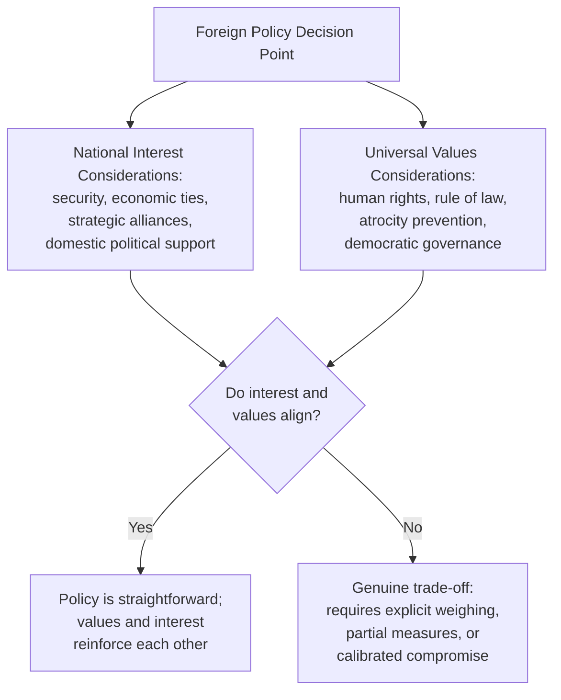

## Balancing National Interest and Universal Values

### Overview

One of the most persistent structural tensions in diplomatic practice is the relationship between **national interest** — the pursuit of a state's security, prosperity, and strategic position — and **universal values** — principles claimed to hold moral weight across all states and peoples, such as human rights, the rule of law, and prohibitions on atrocity. This tension is not a peripheral ethical puzzle but a recurring, structural feature of foreign policy formulation and diplomatic practice: nearly every significant bilateral or multilateral engagement requires some explicit or implicit weighing of interest against principle. This item surveys the major theoretical frameworks used to understand this tension, the practical mechanisms diplomats use to manage it, and recurring real-world patterns where the balance is contested.

### Theoretical Frameworks

#### Realism

**Key Points**

- Classical and structural realist traditions in international relations theory hold that states act primarily to secure survival and relative power, and that moral language in foreign policy is often instrumental — used to justify interest-based decisions rather than genuinely constraining them
- Realist-influenced diplomatic practice treats stated universal values as one consideration among many, generally subordinate to core security and economic interests when the two conflict
- Critics of pure realism argue it underestimates the extent to which normative commitments (alliance credibility, domestic public opinion, international legal obligation) function as genuine constraints on state behavior, not merely rhetorical cover

#### Liberal Internationalism

**Key Points**

- Liberal internationalist traditions hold that promoting democracy, human rights, and rules-based international order is not merely compatible with but often constitutive of long-term national interest — stable, rights-respecting states are argued to be more reliable partners and less prone to conflict
- This tradition underpins much of the institutional architecture of post-1945 multilateral diplomacy (UN human rights mechanisms, international humanitarian law, democracy-promotion programming)
- Critics argue that liberal internationalist policy has sometimes been applied selectively, reinforcing perceptions of inconsistency when values-based justifications are invoked against adversaries but muted toward allies

#### Constructivism

**Key Points**

- Constructivist approaches emphasize that both "national interest" and "universal values" are themselves socially constructed and evolve through interaction — what a state perceives as its interest is shaped by shared norms, identity, and historical experience rather than existing as a fixed, objective quantity
- This framework helps explain why the same underlying interest/values tension is resolved differently by different states, or by the same state at different historical moments, without requiring either side to be acting in bad faith

#### English School / Society of States

**Key Points**

- The English School tradition frames international relations as an "international society" bound by shared norms and diplomatic institutions (embassies, international law, diplomatic immunity itself) that create genuine, if limited, normative constraints even among states with divergent interests
- This tradition is often invoked to explain why diplomatic norms (non-interference, reciprocal recognition, treaty-keeping) persist even between adversarial states, functioning as a form of shared value distinct from either pure interest-maximization or full moral universalism

[Inference] These frameworks are academic simplifications of a more continuous and contested debate; practitioners in the field typically operate with pragmatic blends of multiple traditions rather than strict adherence to a single theoretical school.

### The Structural Sources of Tension

**Key Points**

- Tension is most acute when a state's security or economic interests depend on cooperation with a government whose human rights conduct or governance practices conflict with the values the state publicly espouses
- Tension also arises **within** the values category itself: prioritizing stability (which may argue for engagement with an authoritarian government to prevent state collapse or regional spillover) can conflict with prioritizing accountability (which may argue for isolation, sanctions, or public condemnation)
- Domestic political accountability adds a further layer: publics and legislatures in many states expect foreign policy to reflect the state's stated values, creating pressure that operates independently of the pure interest calculus pursued by career diplomats or executive branches

### Practical Mechanisms for Managing the Tension

Diplomats and foreign ministries have developed a range of practical tools to manage — rather than fully resolve — this tension in day-to-day practice.

**Key Points**

- **Quiet diplomacy vs. public condemnation** — raising human rights or governance concerns through confidential démarches (see Drafting Communiqués, Démarches, and Position Papers) rather than public statement, on the theory that private engagement is sometimes more effective at achieving actual behavioral change while preserving the broader relationship
- **Conditionality** — tying specific benefits (aid, trade preferences, defense cooperation) to measurable governance or human rights benchmarks, allowing engagement to continue while creating tangible incentives tied to values-based concerns
- **Selective engagement/differentiated relationships** — maintaining functional diplomatic and economic relations while explicitly limiting certain categories of cooperation (e.g., security assistance) on human rights grounds
- **Multilateral versus bilateral channels** — routing values-based concerns through multilateral human rights mechanisms (UN human rights bodies, regional courts) rather than bilateral confrontation, which can reduce the perception that criticism is politically selective or interest-driven
- **Explanations of position and formal reservations** — using the multilateral drafting tools covered in Effective Writing for Multilateral Settings to register principled objection to specific language or actions without blocking broader cooperation
- **Sanctions and targeted measures** — calibrated economic or travel restrictions aimed at specific individuals or sectors, designed to signal and pressure without severing the full relationship

### Consistency and the Charge of Double Standards

**Key Points**

- A recurring and consequential criticism of values-based foreign policy is selective application — invoking human rights or democratic principle vigorously against strategic adversaries while muting or excusing comparable conduct by allies or partners
- This charge carries real diplomatic cost: perceived inconsistency undermines the credibility of values-based arguments in multilateral fora and provides rhetorical ammunition to states resisting external criticism of their own conduct
- Some foreign services have responded with efforts toward more consistent, criteria-based human rights reporting and policy application, though achieving full consistency across a foreign policy portfolio driven by many competing strategic relationships remains, in practice, difficult
- [Inference] The extent to which any given state successfully achieves consistency, versus merely claiming to, is itself a matter of ongoing empirical and political dispute rather than settled fact, and assessments often diverge sharply along different observers' own political perspectives

### Case-Pattern Categories (Illustrative, Not Exhaustive)

**Key Points**

- **Strategic necessity override** — security or economic imperatives (counterterrorism cooperation, energy supply, great-power balancing) are judged to outweigh values-based concerns in a specific relationship, often accompanied by muted or calibrated public criticism
- **Values-led policy with real cost** — a state accepts tangible economic or strategic cost (lost trade, damaged alliance relationships) to maintain a principled stance, such as sustained sanctions regimes or arms embargoes despite commercial loss
- **Hybrid/conditional engagement** — the most common pattern in practice, where engagement continues but is explicitly modulated (partial sanctions, differentiated cooperation levels, calibrated public statements) rather than falling cleanly into either full engagement or full isolation
- **Multilateral norm-building as indirect leverage** — rather than confronting a specific state bilaterally, working through international legal and normative frameworks (treaty regimes, UN mechanisms) to establish standards that indirectly constrain behavior over the longer term

### Internal Decision-Making Process

**Next Steps**

1. Clear articulation of the specific interests and values at stake in a given decision, avoiding vague invocation of either without specifying what is actually being traded off
2. Interagency consultation (foreign ministry, defense, trade, intelligence, development counterparts) to surface the full range of considerations before a position is finalized
3. Assessment of available tools short of full engagement or full rupture (conditionality, calibrated statements, multilateral routing) before defaulting to an all-or-nothing framing
4. Explicit consideration of consistency with the state's stated positions in comparable prior cases, to manage the double-standards risk
5. Preparation of public and internal messaging that accurately reflects the actual balance struck, rather than overstating either pure principle or pure pragmatism
6. Periodic review as circumstances evolve, since the interest/values balance struck at one moment is rarely treated as permanently fixed

### Ethical Considerations for Individual Diplomats

**Key Points**

- Diplomats implementing a policy that prioritizes interest over values they personally hold face the loyalty-versus-conscience tension examined more broadly in Diplomatic Ethics and Codes of Conduct, with internal dissent channels serving as the primary legitimate outlet short of resignation
- Diplomats are frequently called upon to publicly defend or explain policy choices that involve genuine trade-offs, requiring the presentational skill (see Public Speaking and Presentation Skills for Diplomats) to articulate a defensible position without either overclaiming pure principle or appearing to abandon stated values entirely
- Career diplomats often develop working frameworks for personally reconciling this tension — for example, distinguishing between what they personally believe is ideal and what they judge is achievable or sustainable given real constraints — though such frameworks are individually held rather than uniformly prescribed

### Common Errors and Pitfalls

**Key Points**

- Framing the interest/values relationship as a simple binary (either pure principle or pure pragmatism) rather than recognizing the wide range of intermediate, calibrated policy tools available
- Overpromising values-based commitments that cannot be sustained once they conflict with a significant strategic interest, damaging credibility when the commitment is later abandoned
- Applying values-based criticism inconsistently across similar cases without acknowledgment, inviting the double-standards critique
- Underestimating the extent to which domestic political accountability operates as an independent constraint requiring values-based justification, even where career officials assess interest-based reasoning as sufficient
- Failing to explicitly identify what specific interest or value is actually at stake in a given decision, leading to muddled internal deliberation and inconsistent messaging

**Related Topics**

- Diplomatic Ethics and Codes of Conduct
- Human Rights Considerations in Bilateral Engagement
- Sanctions and Conditionality as Diplomatic Tools
- Multilateral Human Rights Mechanisms and Reporting
- Moral Reasoning in Foreign Policy Decision-Making
- Realism, Liberalism, and Constructivism in International Relations Theory
- Quiet Diplomacy and Confidential Démarche Practice
- Domestic Political Accountability in Foreign Policy Formulation