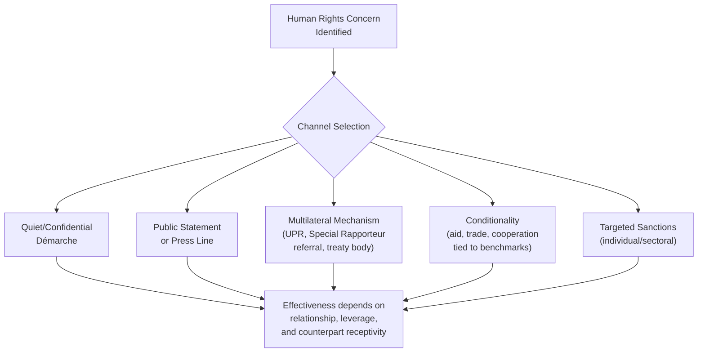

## Human Rights Considerations in Diplomatic Practice

<syllabot_broad_topic/>

### Overview

Human rights considerations run through nearly every dimension of contemporary diplomatic work — from bilateral relationship management and multilateral negotiation to reporting, public statements, and internal policy formulation. Unlike the broader interest/values tension examined separately (see Balancing National Interest and Universal Values), this item focuses specifically on the practical architecture of human rights work within diplomacy: the legal and institutional frameworks diplomats operate within, the tools available for raising and acting on human rights concerns, and the operational skills required to integrate human rights considerations into ordinary diplomatic practice.

### Legal and Institutional Architecture

**Key Points**

- **The Universal Declaration of Human Rights (1948)** — the foundational normative document, not itself legally binding but widely treated as reflecting customary international law in significant part, and the reference point for most subsequent human rights instruments
- **The International Covenants (ICCPR and ICESCR, 1966)** — legally binding treaties for ratifying states, covering civil/political rights and economic/social/cultural rights respectively, together with the UDHR often referred to as the "International Bill of Human Rights"
- **Regional human rights systems** — the European Convention on Human Rights and European Court of Human Rights, the Inter-American human rights system, the African Charter on Human and Peoples' Rights, and others, each with distinct enforcement mechanisms and jurisprudence
- **The UN Human Rights Council (and its predecessor, the UN Commission on Human Rights)** — the principal UN intergovernmental body addressing human rights, conducting the **Universal Periodic Review (UPR)** of all UN member states on a rotating cycle, and appointing thematic and country-specific **Special Rapporteurs**
- **The Office of the UN High Commissioner for Human Rights (OHCHR)** — the principal UN entity for human rights promotion and protection, supporting treaty bodies, special procedures, and field presences
- **Treaty bodies** — committees of independent experts (e.g., the Human Rights Committee for the ICCPR) that review state reports and, in some systems, individual complaints under optional protocols

[Inference] The binding force and practical enforcement strength of these instruments varies considerably — treaty obligations bind only ratifying states, and enforcement mechanisms range from legally binding court judgments (regional courts) to non-binding expert review and reporting (most UN treaty bodies and special procedures).

### Human Rights Reporting

Most foreign ministries produce structured human rights reporting as a distinct diplomatic writing genre, feeding into both internal policy formulation and, in many countries, mandated public reports.

**Key Points**

- **Country human rights reports** — comprehensive, typically annual assessments of a country's human rights conditions, covering civil/political rights, freedom of expression/assembly/religion, treatment of minorities, judicial independence, and other standard categories
- Reporting typically distinguishes between **documented incidents** (specific, sourced events) and **pattern assessment** (broader judgments about systemic conditions), mirroring the fact/assessment discipline central to cable-writing more broadly (see Reporting and Cable-Writing Conventions)
- Sourcing discipline is particularly important in human rights reporting given the political sensitivity and potential contestation of findings — credible reporting typically triangulates across multiple source types (local civil society, international NGOs, UN mechanisms, direct mission observation, government statements)
- Human rights reporting from missions feeds into policy decisions on conditionality, sanctions, public statements, and multilateral engagement (see mechanisms discussed under Balancing National Interest and Universal Values)

### Mechanisms for Raising Human Rights Concerns

**Key Points**

- **Quiet diplomacy** — confidential démarches raising specific concerns directly with a counterpart government, often judged more likely to produce behavioral change without triggering defensive public reaction, though harder to verify effectiveness from outside
- **Public statements and press lines** — used when quiet engagement has failed, when domestic or allied political pressure requires visible action, or when the severity of the situation is judged to warrant public pressure regardless of relationship cost
- **Multilateral referral** — raising concerns through UN human rights mechanisms (UPR recommendations, Special Rapporteur communications, treaty body reviews) rather than bilateral channels, which can reduce the perception of politically selective bilateral pressure
- **Conditionality** — tying specific cooperation, aid, or trade benefits to measurable human rights benchmarks
- **Targeted sanctions** (e.g., asset freezes, travel bans against specific officials implicated in serious violations) — a calibrated tool distinguishing individual accountability from broader economy-wide measures
- **Support for civil society and independent media** — programmatic and diplomatic support (funding, public engagement, protection advocacy) for local human rights defenders, journalists, and civil society organizations, itself a frequent point of friction with host governments

### Engagement with Civil Society and Human Rights Defenders

**Key Points**

- Missions frequently maintain direct contact with local human rights defenders, journalists, and civil society organizations, both to inform reporting and to provide visible diplomatic support
- This engagement raises acute **source protection** considerations (see Managing Classified and Sensitive Information), since association with a foreign mission can itself expose local contacts to risk in restrictive environments
- Attendance at trials of human rights defenders, prison visits, and public meetings with civil society figures are recognized diplomatic tools for signaling concern and providing a degree of protective visibility, though their practical protective effect varies by context
- Some foreign ministries maintain formal guidelines or dedicated personnel (human rights officers, protection focal points) specifically for this engagement, reflecting its distinct skill and risk profile compared to standard bilateral relationship management

[Inference] The practical protective value of diplomatic presence at trials or public engagement with human rights defenders is contested among practitioners and researchers, and likely varies significantly by the specific political context and the receiving government's sensitivity to international attention.

### Human Rights in Multilateral Negotiation

**Key Points**

- Human rights language in multilateral texts (resolutions, communiqués, outcome documents) is frequently among the most contested drafting terrain, given divergent views among states on the scope, universality, and prioritization of specific rights
- Recurring points of multilateral contestation include the relative weighting of civil/political versus economic/social/cultural rights, the concept of "universality versus cultural relativism," and the appropriate role of country-specific criticism within multilateral bodies versus thematic, non-country-specific standard-setting
- The drafting techniques covered under Effective Writing for Multilateral Settings — constructive ambiguity, calibrated operative verbs, explanations of position — are heavily used specifically in human-rights-related multilateral text, given the frequency of genuine underlying disagreement
- Country-specific resolutions (naming a specific state's human rights record) are typically more diplomatically contentious than thematic resolutions (addressing a right or issue generally), and votes on such resolutions are closely watched as indicators of bilateral relationship dynamics

### Integrating Human Rights into Routine Diplomatic Practice

**Key Points**

- **Human rights impact awareness in broader policy work** — trade negotiators, security cooperation officials, and development officers increasingly are expected to consider human rights implications within their own portfolios, not solely as the responsibility of a dedicated human rights office
- **Due diligence in security and development cooperation** — assessing human rights risk before providing security assistance, arms transfers, or development funding, sometimes formalized through "human rights vetting" requirements
- **Election observation and support** — a distinct diplomatic function involving both technical monitoring and public statements on electoral integrity, closely tied to broader democratic governance and human rights assessment
- **Crisis and atrocity prevention** — human rights reporting and early-warning analysis feeding into broader crisis prevention and response diplomacy, particularly relevant to situations of potential mass atrocity

### Balancing Advocacy and Relationship Management

**Key Points**

- Diplomats routinely must calibrate the intensity and visibility of human rights advocacy against the broader state of the bilateral relationship and other strategic priorities, a specific instance of the general interest/values tension
- Effective practice generally involves clear internal articulation of **why** a particular channel (quiet versus public, bilateral versus multilateral) is chosen for a specific concern, rather than defaulting to a single approach regardless of context
- Consistency concerns (see Balancing National Interest and Universal Values) are especially salient in human rights work, since selective application of human-rights-based criticism is a frequently cited critique of many states' foreign policies
- Career diplomats working substantially in human rights portfolios often develop specific expertise in the relevant legal frameworks, reporting methodologies, and civil society relationship management distinct from general political/economic diplomatic skill sets

### Practical Workflow for Human Rights Engagement

**Next Steps**

1. Establish and maintain reporting relationships with credible local civil society, international NGOs, and UN field presences to inform accurate assessment
2. Apply rigorous sourcing and fact/assessment discipline consistent with broader diplomatic reporting standards when documenting human rights conditions
3. Select the engagement channel (quiet démarche, public statement, multilateral referral, conditionality) deliberately, with explicit reasoning documented for policy coordination purposes
4. Coordinate with capital and, where relevant, allied missions to ensure consistency and avoid contradictory signaling
5. Apply source protection discipline rigorously when engaging local human rights defenders or civil society contacts
6. Review and adjust engagement strategy as conditions evolve, recognizing that human rights situations are frequently dynamic rather than static

### Common Errors and Pitfalls

**Key Points**

- Defaulting to a single engagement channel (always quiet, or always public) regardless of context, rather than matching the tool to the situation
- Inadequate source protection when engaging local human rights defenders, exposing contacts to retaliation risk
- Blending documented fact and broader pattern assessment without clear distinction in reporting, weakening the credibility and utility of the report
- Pursuing human rights advocacy inconsistently across comparable cases without acknowledgment, inviting valid criticism of selectivity
- Treating human rights work as siloed within a dedicated office rather than integrated into trade, security, and development portfolios where relevant risk exists
- Underestimating the protective or retaliatory dynamics created by public diplomatic engagement with human rights defenders in restrictive political contexts

**Related Topics**

- Balancing National Interest and Universal Values
- Diplomatic Ethics and Codes of Conduct
- Managing Classified and Sensitive Information
- Effective Writing for Multilateral Settings
- Reporting and Cable-Writing Conventions
- Sanctions and Conditionality as Diplomatic Tools
- Election Observation and Democratic Governance Support
- Atrocity Prevention and Crisis Early-Warning Diplomacy