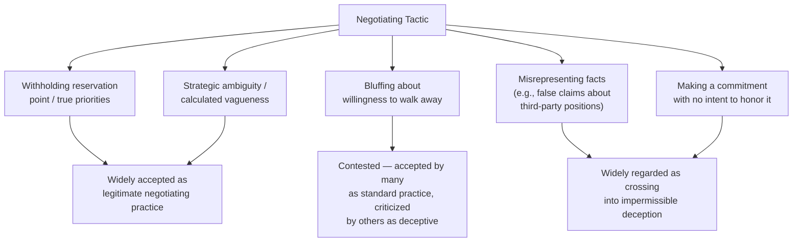

## Moral Dilemmas in Negotiation and Representation

### Overview

Negotiation and representation are the two core functional activities of diplomacy, and both routinely generate moral dilemmas distinct from the broader structural tensions examined elsewhere in this chapter (national interest versus universal values, loyalty versus conscience). Where those items address tensions between competing goods at the policy level, this item focuses on the situational, often acute moral choices individual diplomats face in the practice of negotiating and representing their state — questions about honesty in bargaining, whom to represent and how faithfully, and the personal ethical weight of specific negotiating and representational tactics.

### The Distinctive Moral Terrain of Negotiation

**Key Points**

- Negotiation is widely understood, even by ethicists sympathetic to strong general honesty norms, to permit a degree of **strategic non-disclosure** that would be considered deceptive in ordinary social contexts — not revealing one's true reservation point or maximum acceptable concession is standard, expected practice rather than a moral violation
- The moral difficulty lies in locating the boundary between legitimate strategic reticence and prohibited deception: withholding one's bottom line is broadly accepted; actively asserting a false bottom line, fabricating supporting facts, or making a commitment one does not intend to honor moves into more contested or clearly impermissible territory
- This boundary is not universally agreed upon even among negotiation ethicists, and practitioners often develop working distinctions through professional norms and institutional culture rather than a single settled philosophical rule

[Inference] The precise line between acceptable strategic reticence and impermissible deception in negotiation remains a genuinely contested question in both negotiation theory and practical ethics, and the framework presented here represents a common but not universally accepted distinction.

### Honesty and Deception in Bargaining: A Working Taxonomy

**Key Points**

- **Withholding true priorities and reservation points** sits at the least contested end — nearly universally treated as legitimate
- **Strategic ambiguity** (deliberately vague language, covered structurally under multilateral drafting as "constructive ambiguity") is a recognized, legitimate technique when used to build consensus rather than to conceal a specific intended deception
- **Bluffing** about willingness to walk away or about alternative options is more contested: some negotiation ethics frameworks treat it as an accepted convention of the "game" of negotiation (comparable to bluffing in poker, where all participants understand the rules), while others regard it as a form of deception that degrades trust over repeated interactions
- **Misrepresenting verifiable facts** (falsely claiming a third party has taken a certain position, fabricating data) is widely regarded as crossing into clearly impermissible deception, distinct from strategic reticence about one's own preferences
- **Making commitments without intent to honor them** is broadly condemned, both ethically and practically, since diplomatic relationships depend on reputation for reliability across repeated interactions over a career and across institutional memory

### Representation Dilemmas: Whose Voice, How Faithfully

**Key Points**

- A diplomat represents their government's instructed position, which may diverge from their personal assessment of the national interest, from expert technical advice, or from their own moral judgment — creating a recurring tension already examined structurally under Diplomatic Ethics and Codes of Conduct, but which manifests acutely and specifically in live negotiation
- **Fidelity versus initiative**: negotiators are typically given some discretion to adapt tactics within instructed parameters, but exceeding that discretion — making an unauthorized concession or commitment — creates both a professional accountability problem and, in some framings, an ethical one regarding honesty toward one's own government as well as the counterpart
- **Representing a position one privately doubts will succeed or believes is poorly conceived** — a common experience for working-level negotiators executing policy set at a more senior level, requiring the same internal-dissent-versus-external-loyalty balance discussed in Diplomatic Ethics and Codes of Conduct, but under the added pressure of live, real-time negotiation where hesitation itself can be read as a signal

### Third-Party and Multiparty Moral Complications

**Key Points**

- Negotiations affecting parties not present at the table (populations, minority groups, non-state actors, future generations in the case of environmental or resource negotiations) raise questions about whose interests a negotiator is obligated to weigh beyond their direct instructions
- Mediated or facilitated negotiations create a distinct role — the facilitator or mediator owes some duty of even-handedness that a direct party negotiator does not, and blurring these roles (a party acting as if impartial while pursuing partisan interest) is a recognized ethical hazard in multiparty and mediated settings
- Negotiations conducted with parties whose legitimacy or human rights conduct is contested (armed non-state actors, unrecognized governments, individuals implicated in serious violations) raise acute questions about whether engagement itself confers unwarranted legitimacy, distinct from but related to the broader engagement-with-repressive-governments tension discussed under Balancing National Interest and Universal Values

### Coercion, Power Asymmetry, and Fair Dealing

**Key Points**

- Negotiations between states of significantly unequal power raise questions about the fairness of outcomes reached under conditions the weaker party may experience as coercive even absent explicit threats — a persistent critique of historical and some contemporary treaty-making
- Diplomats representing more powerful states face a distinct ethical consideration regarding whether and how to exercise available leverage, separate from whether using that leverage is strategically effective
- Diplomats representing less powerful states face corresponding questions about the limits of acceptable concession under pressure, and when apparent "agreement" reflects genuine consent versus effectively constrained choice

[Inference] Assessments of when power asymmetry crosses from ordinary negotiating leverage into ethically problematic coercion are highly contested and often depend on normative judgments about legitimate versus illegitimate uses of state power that vary across political and academic perspectives.

### Confidentiality, Secrecy, and Back-Channel Ethics

**Key Points**

- Back-channel or secret negotiation — conducted outside normal public or even normal bureaucratic channels — has a long history in diplomacy and is sometimes credited with enabling breakthroughs that public negotiation could not achieve, since it allows exploration of positions without the domestic political cost of public commitment
- The ethical tension is between the practical value of confidentiality in enabling flexible exploration, and democratic accountability concerns when significant commitments are made or explored outside normal oversight structures
- Historical instances of secret diplomacy producing both celebrated breakthroughs and controversial, retrospectively criticized outcomes illustrate that the ethical assessment of back-channel negotiation is heavily dependent on outcome and process specifics rather than resolvable by a single general rule

### Representation of Uncomfortable or Contested National Positions

**Key Points**

- Diplomats are sometimes required to publicly defend or advocate positions — historical, territorial, or policy-related — that are contested by credible international opinion or that the diplomat may personally find difficult to defend
- The professional norm generally distinguishes between a diplomat's institutional role (representing the state's position) and personal endorsement, a distinction diplomats are trained to draw clearly when challenged, similar to the framing discussed for engagement with adversarial governments
- Sustained representation of a position a diplomat finds genuinely indefensible over time is one of the more commonly cited sources of career-level ethical strain in diplomatic service, sometimes resolved through internal dissent, reassignment request, or ultimately resignation

### Practical Frameworks for Navigating Negotiation Dilemmas

**Next Steps**

1. Internally distinguish, before entering a negotiation, between legitimate strategic reticence and tactics that would cross into factual misrepresentation, and hold that line consistently
2. Seek clarity on the scope of authorized discretion before live negotiation begins, to avoid inadvertent overreach under real-time pressure
3. Where representation of a difficult position is required, prepare a principled framing that distinguishes institutional role from personal endorsement
4. Flag concerns about a negotiation's fairness, legitimacy-conferring effects, or coercive dynamics through internal channels before or during the process, rather than only after an outcome is reached
5. Document commitments and understandings reached in back-channel or confidential settings carefully, to preserve institutional accountability even where public transparency is deferred
6. Debrief openly on ethically difficult negotiating episodes as part of institutional learning (see Briefing and Debriefing Techniques), building shared professional judgment over time

### Common Errors and Pitfalls

**Key Points**

- Treating all forms of negotiating "gamesmanship" as equally acceptable without distinguishing strategic reticence from outright factual misrepresentation
- Exceeding authorized negotiating discretion under real-time pressure, creating downstream accountability and trust problems with one's own government
- Engaging with illegitimate or seriously compromised parties without internal deliberation about the legitimacy-conferring effect of the engagement itself
- Assuming confidentiality in back-channel negotiation removes the obligation for eventual institutional accountability and documentation
- Failing to distinguish, when representing a difficult national position, between institutional role and personal endorsement — either overclaiming personal belief or appearing to undermine the position through visible discomfort
- Neglecting the interests of parties affected by but absent from the negotiation itself

**Related Topics**

- Diplomatic Ethics and Codes of Conduct
- Balancing National Interest and Universal Values
- Human Rights Considerations in Diplomatic Practice
- Negotiation Preparation and Strategy Development
- Crisis Communication and Back-Channel Diplomacy
- Mediation and Third-Party Facilitation in International Disputes
- Legitimacy and Recognition in International Relations
- Briefing and Debriefing Techniques