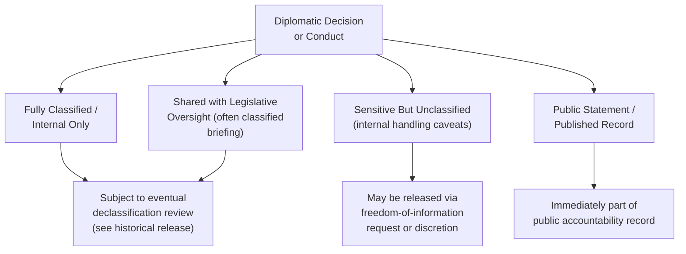

## Accountability and Transparency in Diplomatic Leadership

### Overview

Accountability and transparency occupy a distinctive and difficult position in diplomatic leadership: the profession's core function frequently depends on confidentiality (protected negotiating space, source protection, candid internal assessment), yet diplomatic leaders — ambassadors, senior officials, foreign ministers — remain subject to accountability structures (democratic oversight, legal frameworks, institutional hierarchy, public scrutiny) that presume some baseline of transparency. This item examines the structures, mechanisms, and leadership practices through which diplomatic leaders are held accountable, and the practical tensions leaders navigate in balancing necessary discretion against transparency obligations.

### Foundational Distinction: Accountability vs. Transparency

**Key Points**

- **Accountability** refers to the obligation of diplomatic leaders to answer for their decisions and conduct to a recognized authority — a legislature, an executive, an inspector-general function, or ultimately the public through democratic processes — and to face consequences for failures or misconduct
- **Transparency** refers to the degree to which decisions, reasoning, and information are made visible to those outside the immediate decision-making circle, whether the public, oversight bodies, or international partners
- The two are related but distinct: a leader can be substantively accountable (answering to oversight bodies in classified or closed settings) with limited public transparency, or nominally transparent (releasing information) while facing weak actual accountability if no consequences follow
- Diplomatic leadership requires navigating both dimensions simultaneously, often calibrating each independently depending on the specific decision or relationship at stake

### Structures of Accountability in Diplomatic Leadership

#### Hierarchical/Institutional Accountability

**Key Points**

- Ambassadors and senior diplomats answer to the foreign ministry leadership and, ultimately, to the head of government or state, through the chain of instructions and reporting examined under Reporting and Cable-Writing Conventions
- Performance evaluation, promotion, and assignment systems function as an internal accountability mechanism, incentivizing adherence to instructions, sound judgment, and institutional standards
- Inspector-general or internal audit functions, where they exist, provide a further layer of institutional accountability specifically targeting compliance, ethics, and management performance within missions and ministries

#### Legislative/Parliamentary Accountability

**Key Points**

- In most democratic systems, foreign ministers and sometimes senior diplomats are subject to legislative oversight — committee hearings, question periods, budget approval processes — that create a distinct accountability channel independent of the executive hierarchy
- Legislative oversight bodies frequently have access to classified briefings unavailable to the general public, allowing a degree of substantive accountability without full public transparency
- The strength and independence of legislative oversight over foreign policy and diplomatic conduct varies considerably across political systems, and is generally considered a key structural variable distinguishing different national approaches to diplomatic accountability

#### Legal Accountability

**Key Points**

- Domestic law governing civil service conduct, anti-corruption statutes, and classified information handling (see Managing Classified and Sensitive Information) provides a legal accountability layer distinct from internal institutional discipline
- International legal frameworks, including the Vienna Convention on Diplomatic Relations, establish certain accountability expectations (respecting receiving-state law, non-interference) though enforcement typically operates through the sending state itself or through the receiving state's option to declare an individual persona non grata (see Diplomatic Ethics and Codes of Conduct)
- Some jurisdictions maintain specific legal frameworks for whistleblower protection applicable to diplomatic personnel, intended to allow accountability-relevant disclosures through protected channels rather than only through unauthorized leaks

#### Public and Media Accountability

**Key Points**

- Investigative journalism, freedom-of-information/access-to-information requests, and public scrutiny function as an informal but often powerful accountability mechanism, particularly in cases of leaked cables, whistleblower disclosures, or high-profile diplomatic failures
- Public accountability operates on a different timeline and through different mechanisms than formal institutional accountability — it can surface issues rapidly but often lacks the structured investigative and consequence-imposing authority of formal oversight bodies
- Diplomatic leaders increasingly operate with awareness that internal communications may eventually become public (through declassification, leak, or legal discovery), which shapes both drafting discipline (see Reporting and Cable-Writing Conventions) and, some argue, substantive decision-making itself

### Transparency Mechanisms and Their Limits

**Key Points**

- Scheduled declassification and historical release processes (see Managing Classified and Sensitive Information) function as a deliberate, time-delayed transparency mechanism, balancing operational confidentiality needs against eventual public accountability and historical record
- Freedom-of-information and access-to-information laws in many jurisdictions create a formal, legally enforceable transparency mechanism for government records, subject to specific exemptions (national security, ongoing negotiations, personal privacy, source protection)
- Proactive transparency — leaders voluntarily publishing reasoning, criteria, or records ahead of legal requirement — is increasingly used as a leadership practice to build public trust, particularly regarding non-sensitive policy areas such as general foreign policy strategy documents
- Complete transparency is neither achievable nor, in most accountability frameworks, considered desirable in diplomacy — the operative question is typically where the line between necessary confidentiality and accountable transparency should sit for a given category of decision, rather than whether any confidentiality is justified at all

### Leadership Practices Supporting Accountability

**Key Points**

- **Clear decision documentation** — maintaining a written record of the reasoning behind significant decisions, even when the decision itself remains classified, supports later accountability review even if public transparency is deferred
- **Genuine internal dissent channels** — leaders who cultivate functioning internal challenge and dissent processes (see Diplomatic Ethics and Codes of Conduct) create a form of internal accountability that can catch problems before they escalate to external accountability failures
- **Consistent application of stated criteria** — leaders who apply publicly stated policy criteria (human rights benchmarks, conditionality thresholds) consistently across similar cases strengthen both their accountability position and their broader credibility, addressing the double-standards critique examined under Balancing National Interest and Universal Values
- **Willingness to acknowledge error** — institutional and personal willingness to acknowledge and correct diplomatic misjudgments, rather than defending indefensible positions, is widely regarded as a hallmark of accountable leadership, though it carries real political risk that leaders must weigh
- **Delegated accountability with clear authority limits** — effective leaders establish clear boundaries of delegated authority for subordinate negotiators and officers (see Moral Dilemmas in Negotiation and Representation), ensuring accountability can be properly located when decisions are questioned

### Tensions Specific to Diplomatic Leadership

#### Confidentiality as Operational Necessity vs. Accountability Deficit

**Key Points**

- Diplomatic leaders routinely make decisions — initiating back-channel talks, accepting or rejecting specific negotiating positions, managing crisis responses — under time pressure and confidentiality requirements that limit real-time external accountability
- This creates a structural accountability gap that most systems address through **retrospective** rather than real-time accountability: oversight and public scrutiny occurs after the fact, once operational confidentiality needs have diminished
- Leaders are generally expected to be prepared to explain and defend confidential decisions once circumstances permit disclosure, even though they could not be transparent about them in real time

#### Collective vs. Individual Accountability

**Key Points**

- Diplomatic decisions are frequently the product of extensive interagency and hierarchical process, making it genuinely difficult to locate individual accountability when outcomes are contested — a recurring challenge distinct from, though related to, the delegation-and-discretion issues discussed in negotiation ethics
- Leaders are generally expected to accept institutional accountability for decisions made under their authority even where the decision reflected extensive collective input, a norm sometimes summarized as accountability tracking authority rather than sole causal responsibility
- This creates a genuine leadership burden: senior diplomats and ministers may be held publicly accountable for decisions substantially shaped by career officials, intelligence assessments, or political direction from above, requiring leaders to exercise judgment about when to accept institutional responsibility versus clarify the actual decision-making process

#### Crisis Accountability

**Key Points**

- Crisis situations (evacuation failures, negotiation breakdowns, diplomatic incidents) generate acute, often rapid public accountability pressure that can precede the availability of a full, accurate factual record
- Effective crisis leadership generally involves providing what accurate information can be responsibly shared promptly, while explicitly flagging what remains under review, rather than either premature over-disclosure or prolonged silence that itself becomes a credibility problem
- After-action review processes (see Briefing and Debriefing Techniques) function as a structured, delayed accountability mechanism specifically for crisis performance, feeding lessons back into institutional practice

### Institutional Reforms and Contemporary Trends

**Key Points**

- Many foreign ministries have expanded formal ethics, ombudsperson, or inspector-general functions in recent decades, reflecting increased institutional emphasis on internal accountability infrastructure
- Digital records management and searchable institutional archives have changed the practical accountability landscape, making historical decision-making more traceable (and more discoverable in leaks or legal proceedings) than in earlier eras of purely paper-based recordkeeping
- Public expectations regarding transparency have generally increased over recent decades in many political systems, creating sustained pressure on diplomatic institutions historically organized around strong confidentiality norms to expand proactive disclosure practices
- [Inference] The pace and extent of this shift toward greater transparency varies substantially across countries and political systems, and some practitioners and scholars argue institutional change has been slower and more uneven than public expectations, while others emphasize genuine and significant reform in specific areas such as freedom-of-information law and declassification practice

### Practical Framework for Leaders

**Next Steps**

1. Establish clear, documented reasoning for significant decisions even when immediate public transparency is not possible, to support future accountability review
2. Maintain genuine internal dissent and challenge channels as a proactive accountability mechanism rather than relying solely on external oversight
3. Apply stated policy criteria consistently across comparable cases, and be prepared to explain deviations when they occur
4. Prepare crisis communication practices in advance that balance prompt, honest disclosure of confirmed information against premature speculation
5. Clarify authority and decision-making boundaries for subordinates to ensure accountability can be accurately located when outcomes are questioned
6. Engage constructively with legislative, legal, and public accountability mechanisms rather than treating them solely as adversarial constraints on diplomatic effectiveness

### Common Errors and Pitfalls

**Key Points**

- Treating all confidentiality as equally justified rather than distinguishing operationally necessary confidentiality from avoidance of legitimate accountability
- Failing to maintain adequate internal documentation of decision reasoning, undermining later accountability review even where the underlying decision was sound
- Inconsistent application of stated criteria across similar cases, inviting valid accountability challenges
- Premature public disclosure during a crisis before facts are confirmed, or conversely prolonged silence that itself becomes a credibility and accountability problem
- Diffusing accountability so thoroughly across collective process that no individual or institutional actor can meaningfully be held responsible for outcomes
- Underestimating the eventual discoverability of confidential decision-making through declassification, leaks, or legal processes when making real-time choices

**Related Topics**

- Diplomatic Ethics and Codes of Conduct
- Managing Classified and Sensitive Information
- Balancing National Interest and Universal Values
- Moral Dilemmas in Negotiation and Representation
- Briefing and Debriefing Techniques
- Crisis Communication and Back-Channel Diplomacy
- Institutional Memory and Knowledge Management in Foreign Ministries
- Legislative Oversight of Foreign Policy and Diplomatic Conduct