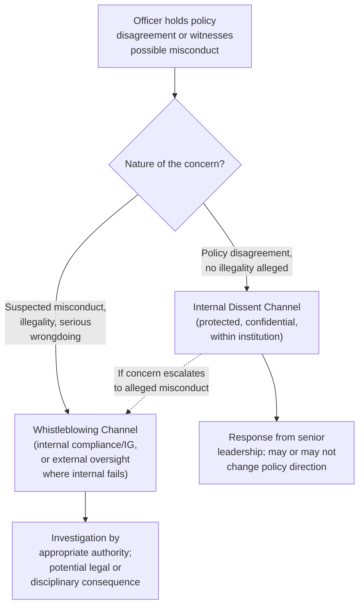

## Dissent and Whistleblowing Within Diplomatic Institutions

### Overview

Dissent and whistleblowing represent the pressure-release mechanisms through which diplomatic institutions surface internal disagreement, policy concern, or misconduct that would otherwise remain unaddressed within a hierarchical, instruction-following professional culture. This item distinguishes formal internal dissent (structured channels for registering policy disagreement without leaving the institution or violating confidentiality) from whistleblowing (disclosure of misconduct, illegality, or serious wrongdoing, sometimes to external authorities or the public), and examines the institutional mechanisms, protections, and practical dynamics governing both.

### Foundational Distinction: Dissent vs. Whistleblowing

**Key Points**

- **Internal dissent** concerns disagreement with policy direction or specific decisions — a diplomat believes a chosen course of action is unwise, poorly informed, or likely to fail, and seeks to register that view through recognized internal channels without alleging misconduct or illegality
- **Whistleblowing** concerns disclosure of conduct believed to be illegal, seriously unethical, or a significant abuse of authority — a fundamentally different category from policy disagreement, though the two can overlap in practice (a policy dissent can evolve into a whistleblowing disclosure if the underlying conduct is judged to cross into misconduct)
- This distinction matters institutionally because the appropriate channel, protection framework, and threshold for action differ significantly between the two — policy dissent is generally expected to stay within internal, often confidential channels, while whistleblowing frameworks in many jurisdictions explicitly contemplate disclosure beyond the immediate chain of command, including to independent oversight bodies or, in narrower circumstances, the public
- [Inference] The precise legal and institutional boundary between the two categories, and the point at which a policy disagreement becomes a legitimate whistleblowing matter, is often genuinely contested in specific cases rather than clearly demarcated in advance

### Formal Internal Dissent Channels

Many foreign services maintain structured mechanisms specifically designed to allow policy disagreement to be registered through legitimate internal process, reflecting institutional recognition that rigid instruction-following without any outlet for disagreement creates its own risks.

**Key Points**

- **Dissent channel cables/memoranda** — a formal mechanism, documented in some foreign services, allowing an officer to register substantive policy disagreement directly with senior leadership through a protected channel, separate from the normal chain-of-command reporting structure, often with an explicit guarantee that using the channel will not adversely affect the officer's career
- **Dissent awards/recognition** — some institutions have created formal recognition programs specifically honoring constructive, well-reasoned dissent, signaling that disagreement expressed through proper channels is valued rather than merely tolerated
- **Structured policy review processes** — interagency and internal review meetings where policy options are debated before final decisions are made, intended to surface disagreement during formulation rather than only after a decision has been implemented
- **Ombudsperson or inspector-general functions** — internal offices providing a channel for raising concerns (about either policy or conduct) outside the direct management chain, with varying degrees of independence and investigatory authority depending on the institution

[Inference] The existence, formal strength, and actual practical effectiveness of dedicated dissent channels varies considerably across foreign services; some have well-established, decades-old formal mechanisms, while others rely more heavily on informal internal debate culture without a codified protected channel.

### Whistleblowing Frameworks and Protections

**Key Points**

- Whistleblower protection frameworks, where they exist in law, typically aim to shield an individual from retaliation (dismissal, demotion, harassment) for good-faith disclosure of illegal conduct, serious safety risk, or significant abuse of authority
- Protections are frequently conditioned on following a prescribed disclosure sequence — often requiring internal reporting first, with external or public disclosure protected only if internal channels fail to act or are themselves compromised, and often requiring the discloser to have a genuine, reasonable belief in the wrongdoing reported
- Classified information handling creates a specific complication for diplomatic whistleblowing: disclosure of classified material, even in service of exposing genuine wrongdoing, typically remains subject to separate legal exposure under classification law (see Managing Classified and Sensitive Information), creating a distinct risk calculus compared to whistleblowing in non-classified professional contexts
- Some jurisdictions maintain specific statutory frameworks addressing government whistleblowing, including for national security and foreign affairs personnel, though the scope and strength of protection — and the specific carve-outs for classified information — vary substantially by country

[Inference] The practical effectiveness of formal whistleblower protections in the diplomatic and national security context is a matter of ongoing debate among practitioners, legal scholars, and advocacy organizations, with some documented cases of successful protected disclosure and other documented cases where practitioners experienced professional or legal consequences despite formal protection frameworks; this content does not take a position on the adequacy of any specific country's framework.

### Institutional Tensions Around Dissent

**Key Points**

- **Hierarchical culture vs. genuine openness to challenge**: diplomatic institutions are inherently hierarchical and instruction-based (see Diplomatic Ethics and Codes of Conduct), creating a structural tension with the goal of genuinely welcoming upward challenge, since career advancement incentives can implicitly discourage visible disagreement even where formal channels exist
- **Confidentiality vs. disclosure**: dissent channels are typically designed to operate confidentially precisely to protect the dissenting officer and preserve institutional cohesion, but this confidentiality can also mean dissent has limited visible impact on ultimate policy outcomes, a frequent critique of such mechanisms
- **Timing pressure**: foreign policy decisions are frequently made under significant time pressure, which can compress or effectively bypass structured dissent processes that assume adequate deliberation time
- **Chilling effects**: even where formal protection exists, informal social and career pressures within a close-knit professional community can discourage use of dissent or whistleblowing channels, a dynamic documented across many professional and governmental contexts beyond diplomacy specifically

### The Practical Decision Point: When to Escalate

Officers facing a policy disagreement or suspected misconduct typically weigh a sequence of considerations before determining whether and how to act.

**Key Points**

- **Severity and certainty assessment** — how serious is the disagreement or suspected wrongdoing, and how confident is the officer in their assessment, recognizing that incomplete information is common at any single point in a hierarchical reporting structure
- **Exhaustion of internal channels** — most frameworks, formal and informal, expect internal channels to be attempted first, both as an institutional norm and, in many legal whistleblower frameworks, as a condition of protection for any later external disclosure
- **Proportionality of response** — matching the escalation level (informal conversation with a supervisor, formal dissent channel, inspector-general referral, external whistleblowing) to the actual severity of the concern, rather than defaulting immediately to the most dramatic available option
- **Personal and institutional consequences** — a realistic assessment of career risk, legal exposure (particularly regarding classified information), and the likely actual effect of the disclosure on the underlying problem
- **Resignation as final recourse** — where an officer concludes they cannot in conscience continue implementing a policy and internal channels have not addressed the concern, resignation remains, as noted under Diplomatic Ethics and Codes of Conduct, a recognized final step distinct from whistleblowing, since it does not necessarily involve disclosure of information

### Historical and Institutional Patterns

**Key Points**

- Formal dissent channel mechanisms in some foreign services trace their institutional origins to periods of significant internal disagreement over major foreign policy decisions, reflecting a pattern where such mechanisms are often created or strengthened in the aftermath of episodes where the absence of a legitimate internal outlet was judged to have contributed to poor decision-making or delayed correction
- High-profile cases of diplomatic whistleblowing or dramatic public dissent (testimony, resignation statements, leaked disclosures) periodically renew public and institutional debate about the adequacy of existing internal mechanisms
- Institutional responses to such episodes have historically included both strengthening formal protections and, in some documented instances, tightening classification or disclosure restrictions, reflecting the genuinely contested nature of how institutions should balance internal accountability against operational confidentiality and security concerns

### Leadership Responsibilities Regarding Dissent

**Key Points**

- Senior diplomatic leaders bear specific responsibility for genuinely engaging with dissent submitted through formal channels, rather than allowing such mechanisms to become a formality without substantive response — a recurring theme connecting this item to the leadership accountability practices discussed under Accountability and Transparency in Diplomatic Leadership
- Leaders who visibly retaliate against, sideline, or informally penalize officers who use legitimate dissent channels undermine the channel's function for the entire institution, regardless of formal policy protections on paper
- Creating a culture where junior officers feel genuinely able to raise concerns — as distinct from merely having a formal channel that technically exists — is widely regarded as a leadership skill requiring sustained, deliberate effort rather than a one-time policy announcement

### Practical Guidance for Officers

**Next Steps**

1. Understand, before a crisis of conscience arises, what specific dissent and whistleblowing channels exist within one's own institution and their documented protections
2. Distinguish clearly, when a concern arises, whether it is a policy disagreement (appropriate for dissent channels) or a suspected misconduct/legal issue (appropriate for whistleblowing or inspector-general channels)
3. Attempt internal resolution first, both as institutional norm and often as a legal condition for later protection
4. Seek guidance from legal counsel or an ombudsperson function before disclosing classified information in any whistleblowing context, given the distinct legal exposure involved
5. Document concerns and the internal channels used, contemporaneously, to preserve an accurate record
6. Recognize resignation as a legitimate, distinct final option when policy disagreement cannot be resolved through internal process and does not itself involve disclosure of wrongdoing

### Common Errors and Pitfalls

**Key Points**

- Conflating policy disagreement with whistleblowing, leading to use of the wrong channel or mismatched expectations about protection and process
- Bypassing internal channels prematurely, which can both forfeit legal protections in many whistleblower frameworks and undermine the credibility of the disclosure
- Disclosing classified information in service of a whistleblowing concern without understanding the distinct and serious legal exposure this can create, separate from the underlying misconduct concern
- Institutional failure to substantively engage with dissent submitted through formal channels, reducing such mechanisms to symbolic rather than functional processes
- Retaliation, formal or informal, against officers who use legitimate dissent or whistleblowing channels, which damages the channel's credibility institution-wide
- Escalating disproportionately (e.g., immediate public disclosure) without first attempting calibrated internal steps appropriate to the severity of the concern

**Related Topics**

- Diplomatic Ethics and Codes of Conduct
- Accountability and Transparency in Diplomatic Leadership
- Managing Classified and Sensitive Information
- Moral Dilemmas in Negotiation and Representation
- Balancing National Interest and Universal Values
- Institutional Memory and Knowledge Management in Foreign Ministries
- Legal and Ethical Frameworks Governing Diplomatic Conduct
- Legislative Oversight of Foreign Policy and Diplomatic Conduct