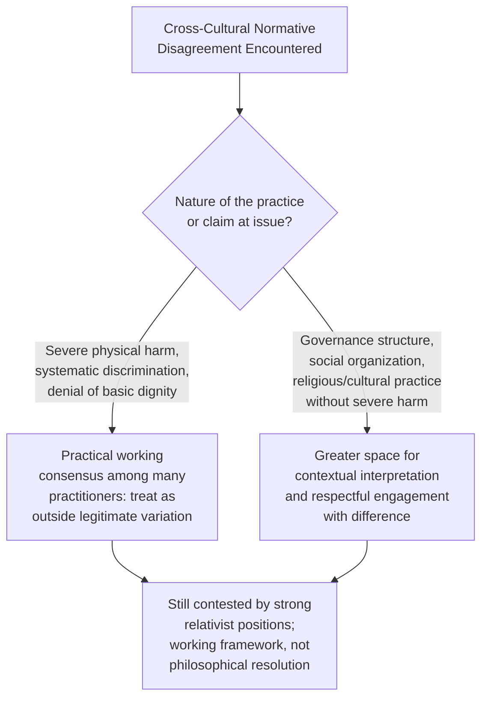

## Cultural Relativism Versus Universal Ethical Standards

### Overview

The tension between cultural relativism and universal ethical standards is one of the most philosophically foundational and practically consequential debates in diplomatic ethics. It asks whether moral and human rights standards can legitimately claim universal validity across all cultures and political systems, or whether ethical judgments are properly understood as culturally embedded and therefore not universally applicable across radically different societies. This debate underlies — often implicitly — nearly every diplomatic engagement involving human rights, governance standards, or cross-cultural normative disagreement, and diplomats routinely operate within it whether or not they engage with it explicitly as a philosophical question.

### The Core Philosophical Positions

#### Ethical/Cultural Relativism

**Key Points**

- Holds that moral standards, values, and practices are products of particular cultural, historical, and social contexts, and that no culture's moral framework can be legitimately judged as superior to another's using a supposedly neutral, external standard
- In its stronger forms, argues that concepts like "human rights" as codified in instruments such as the Universal Declaration of Human Rights reflect a particular (often characterized as Western liberal) cultural and historical tradition, and that imposing these standards on other cultures constitutes a form of ethical or cultural imperialism
- In weaker or more moderate forms, argues not that all moral claims are equally valid, but that cultural context must be taken seriously in interpreting and applying general principles, cautioning against rigid, context-blind application of any single standard
- Critics of relativism argue that it can function to shield genuinely harmful practices (e.g., practices causing serious physical harm, systematic discrimination) from legitimate criticism, and that it struggles to explain widely shared moral intuitions that appear to hold across very different cultural contexts

#### Ethical Universalism

**Key Points**

- Holds that certain moral principles — commonly cited examples include prohibitions on torture, genocide, and slavery, and basic protections of human dignity — hold validity across all cultures and political systems, independent of particular cultural or historical context
- Universalist frameworks underpin the international human rights architecture (see Human Rights Considerations in Diplomatic Practice), which explicitly claims universal applicability in its founding instruments
- Critics of strong universalism argue that claimed universal standards often reflect the specific historical and cultural origins of the states and traditions that were most influential in drafting them, and that universalist framings can be deployed selectively or instrumentally to serve the strategic interests of powerful states
- More moderate universalist positions argue for a core set of minimal, widely-shared standards (often focused on preventing severe physical harm and protecting basic dignity) while allowing for greater cultural variation in the interpretation and implementation of broader social, economic, and political rights

[Inference] This philosophical debate remains genuinely unresolved in academic ethics and international relations theory, and the framing presented here represents the major positions in the debate rather than a settled conclusion; practitioners and scholars across the political spectrum hold varying views on where the appropriate balance lies.

### The "Asian Values" and Comparable Debates

**Key Points**

- The "Asian values" debate of the 1990s, associated with arguments made by some East and Southeast Asian leaders, held that Western-style individual civil-political rights should be balanced against or subordinated to communitarian values, social order, and economic development priorities argued to be more consonant with certain Asian cultural and religious traditions
- Comparable arguments have been made in other regional and religious contexts, invoking distinct cultural, religious, or historical traditions to argue for context-specific interpretation or application of international human rights norms
- Critics of these arguments note that they have sometimes been invoked by governments facing external criticism of their human rights records, raising questions about whether the argument reflects genuine cultural difference or functions instrumentally to deflect accountability
- Proponents and some scholars argue that legitimate cultural and developmental-stage differences do bear on how rights are prioritized and sequenced, distinct from using cultural argument merely as a shield against accountability for clearly severe abuses

[Inference] Assessing the genuine versus instrumental character of any specific invocation of cultural or civilizational argument in a human rights debate requires case-specific analysis, and general claims about the sincerity or validity of such arguments across all instances would overstate what can be concluded at a general level.

### Practical Manifestations in Diplomatic Practice

#### Multilateral Human Rights Negotiation

**Key Points**

- The relativism/universalism tension surfaces directly and repeatedly in multilateral human rights drafting (see Effective Writing for Multilateral Settings and Human Rights Considerations in Diplomatic Practice), where states negotiate the precise scope, universality claims, and implementation language of human rights instruments
- The 1993 Vienna Declaration and Programme of Action, adopted at the World Conference on Human Rights, explicitly addressed this tension, affirming the universality of human rights while also stating that the significance of national and regional particularities and various historical, cultural, and religious backgrounds must be borne in mind
- This formulation — often read as a deliberate diplomatic compromise using constructive ambiguity — illustrates how multilateral diplomacy frequently manages rather than resolves the underlying philosophical tension, producing text that both sides can invoke in support of their broader position

#### Bilateral Engagement and Diplomatic Practice

**Key Points**

- Diplomats raising human rights or governance concerns bilaterally frequently encounter cultural relativist arguments deployed by counterpart governments as a response to criticism, requiring practical judgment about how to engage without either dismissing legitimate cultural context or accepting relativist arguments as blanket justification for serious abuse
- Practical diplomatic practice often distinguishes between engaging respectfully with genuine cultural and contextual difference in areas of legitimate variation (governance structures, social organization, religious practice) versus treating severe physical harm, systematic discrimination, or denial of basic dignity as outside the scope of legitimate cultural variation
- This distinction is itself contested and does not eliminate the underlying philosophical disagreement, but functions as a practical working framework many diplomats and human rights practitioners use to navigate specific cases

#### Development and Humanitarian Diplomacy

**Key Points**

- Development and humanitarian diplomacy frequently confronts practical versions of this tension — for example, whether development programming should condition assistance on governance or rights criteria understood in universal terms, or adapt more fully to local context and priorities as determined by recipient governments or communities
- Debates over gender, family structure, and social organization in development programming are a recurring specific site of this tension, with different states and organizations adopting varying practical approaches to balancing universal gender equality commitments against claims of cultural and religious variation

### Diplomatic Skills for Navigating the Tension

**Key Points**

- **Distinguishing legitimate cultural context from instrumental deflection** — developing practical judgment, informed by specific factual and historical knowledge of a given context, about when cultural argument reflects genuine difference versus functions to avoid accountability for serious harm
- **Precision in universal claims** — advocating for universal standards with specificity about which particular practices or harms are at issue, rather than broad, undifferentiated claims of cultural superiority, which tend to generate defensive reaction and reduce the practical effectiveness of the engagement
- **Engaging local and regional voices** — recognizing that critique of specific practices frequently originates from within the culture or society in question (local human rights defenders, reform movements, religious or community leaders), and that framing universal standards as externally imposed can obscure this internal diversity of view
- **Calibrating engagement channel** — applying the broader toolkit discussed under Human Rights Considerations in Diplomatic Practice (quiet diplomacy, multilateral routing, conditionality) with particular sensitivity to how the relativism/universalism framing affects the receptivity of a given engagement approach

### Institutional and Historical Context

**Key Points**

- The contemporary international human rights framework emerged substantially in the aftermath of the Second World War and is historically associated with a particular set of states and traditions prominent in its drafting, a historical fact frequently invoked in relativist critique regardless of the framework's subsequent broad, near-universal state ratification
- Subsequent decades have seen extensive engagement, contestation, and reinterpretation of international human rights norms by states and civil society actors from across all regions and traditions, complicating any simple narrative of the framework as belonging exclusively to any single cultural origin
- Contemporary diplomatic practice generally operates with awareness of this historical and philosophical complexity, even where specific policy positions ultimately favor a more universalist or more contextually flexible approach

### Practical Framework for Diplomats

**Next Steps**

1. Develop specific, contextual knowledge of the society or issue at hand rather than relying on generalized assumptions about "the culture's" position, recognizing that most societies contain significant internal diversity of view
2. When raising concerns about specific practices, be precise about the particular harm or standard at issue rather than making broad civilizational claims
3. Seek out and amplify local and regional voices engaged in relevant reform or advocacy, rather than positioning external diplomatic pressure as the primary or sole source of legitimate critique
4. Distinguish, in internal policy deliberation, between areas of legitimate contextual variation and practices widely recognized across traditions as causing severe harm
5. Remain aware of the historical and philosophical contestedness of universal claims when engaging in multilateral human rights drafting, anticipating and preparing for relativist counter-arguments
6. Apply consistency discipline (see Balancing National Interest and Universal Values) to avoid invoking universal standards selectively in ways that undermine the credibility of universalist argument

### Common Errors and Pitfalls

**Key Points**

- Treating all cultural or contextual argument as illegitimate deflection, foreclosing genuine engagement with legitimate variation in social and governance practice
- Treating all claims of cultural specificity as sufficient justification, without distinguishing practices involving severe harm from areas of legitimate cultural variation
- Making broad, undifferentiated civilizational claims rather than precise arguments about specific practices, which tends to provoke defensive reaction and reduce practical effectiveness
- Overlooking internal diversity of view within a given society, treating a government's official cultural-relativist position as representative of the full range of domestic opinion
- Applying universal standards inconsistently across different bilateral relationships, undermining the credibility of universalist claims through the double-standards dynamic discussed elsewhere in this chapter
- Failing to engage with the genuine philosophical difficulty of the debate, treating either pure relativism or pure universalism as an uncontested, settled position

**Related Topics**

- Human Rights Considerations in Diplomatic Practice
- Balancing National Interest and Universal Values
- Diplomatic Ethics and Codes of Conduct
- Effective Writing for Multilateral Settings
- Moral Dilemmas in Negotiation and Representation
- Post-Colonial Perspectives in International Relations
- Multilateral Human Rights Mechanisms and Reporting
- Cross-Cultural Communication in Diplomatic Practice