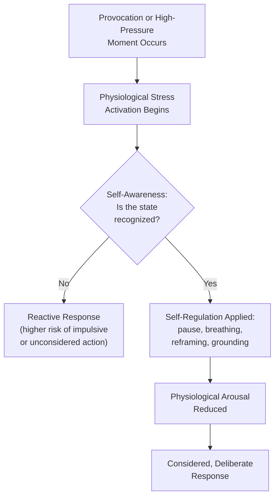

## Self-Awareness and Self-Regulation Under Pressure

### Overview

Self-awareness and self-regulation form the foundational, internally-directed pillars of emotional intelligence as applied to diplomatic practice. Where later items in this chapter address reading and responding to others, this item addresses the diplomat's capacity to accurately perceive their own emotional and cognitive state, and to manage that state effectively under the high-stakes, often adversarial or time-pressured conditions characteristic of diplomatic work — negotiations, crisis response, hostile press exchanges, and sustained high-consequence decision-making. Self-awareness and self-regulation are widely treated in emotional intelligence frameworks (notably that popularized by psychologist Daniel Goleman) as prerequisite competencies underlying social awareness and relationship management, making them foundational to the interpersonal skills examined elsewhere in this chapter.

### Self-Awareness: Core Components

**Key Points**

- **Emotional self-awareness** — accurately identifying one's own emotional state in real time, including subtler or mixed emotional states (e.g., distinguishing frustration from genuine anger, or professional concern from personal anxiety) rather than only recognizing emotion once it has become intense or disruptive
- **Accurate self-assessment** — realistic understanding of one's own strengths, limitations, and triggers, including awareness of specific topics, tactics, or counterpart behaviors likely to provoke a strong personal reaction
- **Self-confidence calibrated to genuine competence** — a stable sense of one's own capability that neither inflates (leading to overconfidence in negotiation or crisis judgment) nor undermines (leading to excessive deference or hesitation) effective diplomatic performance
- **Awareness of physiological stress signals** — recognizing the bodily indicators of stress activation (elevated heart rate, muscle tension, shallow breathing, cognitive narrowing) as an early warning system, since physiological arousal typically precedes conscious recognition of the emotional state driving it

[Inference] The specific physiological and cognitive markers of stress activation vary somewhat between individuals, and self-awareness practice typically involves each practitioner learning their own personal pattern of stress signals rather than applying a single universal checklist.

### The Physiology of Pressure: Why Self-Regulation Matters

**Key Points**

- Acute stress activates the sympathetic nervous system ("fight-or-flight" response), producing physiological changes (increased heart rate, redirected blood flow, heightened alertness) that were evolutionarily adaptive for physical threat but can impair the sustained, nuanced cognitive processing required for negotiation, careful listening, and diplomatic judgment
- Under high stress activation, cognitive functions associated with the prefrontal cortex — including working memory, flexible reasoning, and impulse control — become measurably less available, while more reflexive, emotionally-driven responses become more likely, a pattern frequently described in stress and performance research
- This creates a direct practical stake for diplomats: a negotiator or crisis manager operating in a high-stress-activation state is more prone to impulsive statements, misreading a counterpart's intent, or making decisions that would appear clearly unwise once the acute stress response subsides
- [Inference] While the general pattern of stress impairing complex cognition is well-established in psychological and physiological research, the precise degree of impairment varies by individual, by the specific type of task, and by an individual's trained capacity for stress regulation, so this should be understood as a general tendency rather than a fixed, universal degree of impairment

### Self-Regulation Strategies

#### In-the-Moment Techniques

**Key Points**

- **Tactical pausing** — deliberately inserting a brief pause before responding to a provocative statement or difficult question, using the pause both to regulate physiological arousal and to formulate a considered rather than reactive response
- **Controlled breathing** — slow, deliberate breathing techniques (e.g., extending the exhale relative to the inhale) are widely used and supported by physiological research as a rapid means of down-regulating sympathetic nervous system activation in real time
- **Cognitive reframing** — consciously reinterpreting a provocative statement or hostile tactic as a strategic move by the counterpart rather than a personal attack, which can reduce the emotional charge of the interaction and preserve analytical clarity
- **Physical grounding** — subtle physical techniques (feet firmly planted, relaxed but upright posture, deliberate muscle relaxation) that can help interrupt escalating physiological stress response without being visible or disruptive to the interaction
- **Internal narration/labeling** — silently naming one's own emotional state ("I am noticing irritation") has some support in psychological research as a technique that can reduce the intensity of an emotional response, distinct from suppressing or ignoring the emotion

#### Preparation-Based Techniques

**Key Points**

- **Pre-briefing for anticipated triggers** — reviewing likely difficult moments in an upcoming negotiation or engagement in advance (anticipated hostile questions, known counterpart tactics, sensitive topics) reduces the surprise element that often drives acute stress reactivation
- **Scenario rehearsal** — practicing responses to anticipated difficult exchanges, sometimes through formal role-play preparation, builds familiarity that reduces stress activation when the actual situation arises
- **Adequate physical preparation** — attention to sleep, hydration, and general physical condition before high-stakes engagements, recognizing that baseline physiological state affects stress resilience during the engagement itself
- **Clarity on personal and institutional boundaries in advance** — knowing in advance what one is and is not authorized or willing to concede reduces in-the-moment decision load and associated stress during live negotiation

### Self-Regulation in Sustained High-Stress Contexts

**Key Points**

- Crisis diplomacy and extended negotiation rounds often involve sustained rather than acute stress, requiring distinct regulation strategies focused on pacing, rest, and cumulative fatigue management rather than only momentary in-the-moment techniques
- **Recognizing decision fatigue** — awareness that judgment quality can degrade over extended periods of sustained high-stakes decision-making, and building in deliberate breaks or handoffs where institutionally possible
- **Distinguishing productive urgency from harmful rushing** — sustained crisis pressure can create a bias toward premature closure or action to relieve the discomfort of prolonged uncertainty, a dynamic self-aware practitioners learn to recognize and counteract
- **Team-based regulation support** — in institutional settings, colleagues and supervisors can help identify when an individual's stress state may be affecting judgment, functioning as an external check complementing individual self-awareness

### Self-Regulation and Diplomatic Composure

**Key Points**

- Visible composure under provocation or pressure is treated elsewhere in this curriculum (see Public Speaking and Presentation Skills for Diplomats) as a professionally significant signal — a visible loss of composure is read as a loss of control over the state's position, not merely a personal lapse
- Effective self-regulation is distinct from suppression: genuinely managing one's internal state (through the techniques above) tends to produce more sustainable and less costly composure than simply masking visible distress while internal stress activation remains high, which research on emotional suppression suggests carries its own cognitive and physiological costs over time
- [Inference] The relative effectiveness of active emotional regulation versus surface suppression is an active area of psychological research, and this general distinction reflects a common though not universally settled view within that research

### Common Triggers Specific to Diplomatic Contexts

**Key Points**

- Direct personal or national insults, provocative characterizations, or bad-faith accusations from a counterpart, particularly in public or press settings where a response is being observed and potentially reported
- High-stakes ambiguity — situations where the correct course of action is genuinely unclear and consequences of error are severe, generating anxiety distinct from provocation-driven stress
- Time pressure combined with incomplete information, common in crisis diplomacy
- Internal institutional pressure (conflicting instructions, unclear authority, disagreement with a colleague or superior) occurring simultaneously with external negotiation pressure, compounding cognitive and emotional load

### Developing Self-Awareness and Self-Regulation as a Skill

**Next Steps**

1. Engage in regular reflective practice (structured debriefing, journaling, or mentorship conversation) to build accurate awareness of personal patterns, triggers, and typical stress responses over time
2. Learn and practice specific in-the-moment regulation techniques (breathing, pausing, reframing) in lower-stakes settings before relying on them in high-stakes diplomatic encounters
3. Incorporate scenario rehearsal and pre-briefing for anticipated difficult moments into standard negotiation and crisis preparation
4. Seek structured feedback from colleagues and supervisors on observed composure and reactivity patterns, since self-assessment alone often has blind spots
5. Attend to baseline physical and institutional conditions (rest, workload, decision-making support structures) that affect stress resilience, rather than treating self-regulation purely as an individual, in-the-moment skill
6. Debrief explicitly on moments of strong emotional reaction after significant engagements, treating them as data for improving future self-awareness rather than simply moving on

### Common Errors and Pitfalls

**Key Points**

- Conflating composure with suppression, masking visible distress while internal stress activation remains unaddressed, which can degrade judgment quality even when outward behavior appears controlled
- Failing to recognize early physiological stress signals, allowing reactive rather than considered responses to provocation
- Underestimating cumulative fatigue effects during extended negotiations or crises, leading to degraded judgment without conscious recognition of the cause
- Relying solely on in-the-moment techniques without adequate preparation-based groundwork (pre-briefing, scenario rehearsal), reducing their effectiveness when genuinely tested
- Treating self-awareness as a fixed trait rather than a skill developed through deliberate, sustained practice and feedback
- Neglecting institutional and team-based supports for stress and fatigue management in favor of relying entirely on individual self-regulation

**Related Topics**

- Reading and Responding to Counterpart Emotions
- Building Rapport and Trust in Diplomatic Relationships
- Public Speaking and Presentation Skills for Diplomats
- Crisis Communication and Back-Channel Diplomacy
- Negotiation Preparation and Strategy Development
- Cross-Cultural Communication in Diplomatic Practice
- Moral Dilemmas in Negotiation and Representation
- Team Dynamics and Delegation Management in Diplomatic Missions