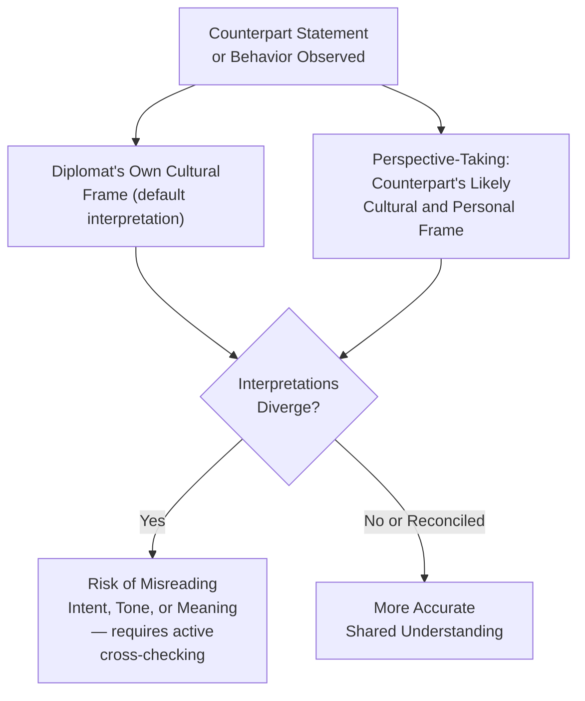

## Empathy and Perspective-Taking Across Cultures

### Overview

Empathy and perspective-taking are core social-awareness competencies in emotional intelligence frameworks, and in diplomatic practice they carry particular weight because effective negotiation, relationship-building, and conflict resolution depend on accurately understanding a counterpart's interests, constraints, and emotional experience — which are frequently shaped by cultural context substantially different from the diplomat's own. This item examines the distinction between empathy and sympathy, the cognitive mechanics of perspective-taking, the specific challenges cross-cultural context introduces, and practical techniques for developing and applying these skills in diplomatic settings.

### Foundational Distinctions

**Key Points**

- **Empathy** — the capacity to accurately understand and, to some degree, share another person's emotional state and perspective, without necessarily agreeing with their position or approving of their conduct
- **Sympathy** — feeling compassion or concern for another's situation, which can occur with or without accurate understanding of their actual perspective, and is a related but distinct capacity
- **Cognitive empathy (perspective-taking)** — the intellectual capacity to accurately model another person's thoughts, reasoning, priorities, and constraints, sometimes distinguished in psychological literature from **affective empathy** (sharing or resonating with another's emotional state)
- Diplomatic practice draws heavily on cognitive empathy/perspective-taking as an analytical tool — accurately understanding a counterpart's actual position and constraints — while affective empathy plays a more selective role, particularly relevant to relationship-building and crisis/humanitarian contexts
- Empathy is explicitly distinguished from **agreement or endorsement**: accurately understanding why a counterpart holds a position, including a position a diplomat's government opposes, is a professional skill fully compatible with vigorously advocating against that position

### Why Perspective-Taking Is a Distinct Diplomatic Skill

**Key Points**

- Accurately modeling a counterpart's actual interests, domestic political constraints, and red lines — rather than assuming they share the diplomat's own framework or priorities — is frequently what distinguishes effective negotiators from less effective ones, since proposals crafted without accurate perspective-taking often fail even when substantively reasonable from the proposer's own viewpoint
- Perspective-taking supports **anticipation** — accurately predicting how a counterpart is likely to react to a specific proposal, statement, or development, which is directly useful in negotiation preparation (see Negotiation Preparation and Strategy Development) and crisis response
- Perspective-taking failures are a recurring, well-documented source of diplomatic and negotiation breakdown, including cases where one party assumes the other shares an unstated assumption, value, or priority that is not in fact shared

### The Cross-Cultural Dimension

Cross-cultural context adds specific complications to perspective-taking beyond the general challenge of understanding any individual counterpart's viewpoint.

**Key Points**

- **Differing cultural frameworks for communication, hierarchy, and negotiation style** mean that behaviors carrying one meaning in a diplomat's own cultural context may carry a substantially different meaning in a counterpart's context — directness, silence, deference, and emotional expressiveness are frequently cited examples where cultural norms diverge significantly
- **High-context versus low-context communication cultures** — a widely referenced framework distinguishing cultures where meaning is conveyed substantially through context, relationship, and implication (high-context) from those where meaning is conveyed primarily through explicit verbal statement (low-context); miscalibrated expectations about which mode a counterpart is operating in is a frequent source of cross-cultural misunderstanding
- **Individual versus collective framing** — counterparts from more individualist cultural contexts may frame interests and decisions differently than those from more collectivist contexts, affecting how proposals should be framed and how decisions are actually made (individually versus through group/consensus process)
- **Risk of over-reliance on cultural generalization** — while broad cross-cultural frameworks (such as those developed in intercultural communication research) provide useful orientation, individual counterparts vary substantially within any cultural group, and treating a general cultural pattern as a reliable predictor of a specific individual's behavior is a recognized analytical error

[Inference] Cross-cultural communication frameworks such as high-context/low-context distinctions are widely used heuristic tools in diplomatic and intercultural training, but their predictive power for any specific individual interaction is limited, and over-reliance on broad cultural typologies without attention to individual and situational variation is a documented critique of some popular intercultural training approaches.

### Practical Techniques for Cross-Cultural Perspective-Taking

**Key Points**

- **Active, structured curiosity** — approaching an unfamiliar cultural or individual context with deliberate inquiry (asking clarifying questions, seeking local and cultural-expert input) rather than assuming familiarity based on general knowledge or prior experience in a different context
- **Checking interpretation rather than assuming it** — explicitly verifying understanding of a counterpart's statement or position, particularly where high-context or indirect communication styles may mean the literal words do not fully convey the intended meaning
- **Consulting local and cultural expertise** — drawing on locally engaged staff, area specialists, and cultural advisors within a mission (see Team Dynamics discussion elsewhere in this chapter) to supplement a diplomat's own perspective-taking, recognizing the limits of any individual's cross-cultural fluency
- **Distinguishing position from underlying interest** — a core negotiation technique (drawn from principled negotiation frameworks) that is particularly valuable cross-culturally, since the stated position may be shaped by cultural norms around how demands are appropriately framed, while the underlying interest may be more directly comparable across cultural contexts
- **Reflective perspective-taking exercises** — deliberately articulating (internally or in preparatory discussion) how a proposal or statement is likely to be received from the counterpart's specific cultural and institutional vantage point before delivering it

### Empathy in Adversarial and High-Stakes Settings

**Key Points**

- Accurate perspective-taking remains valuable, and arguably becomes more valuable, in adversarial negotiations and crisis diplomacy, since understanding an adversary's actual constraints and red lines — as opposed to assumed or projected ones — is often what enables a workable agreement or de-escalation pathway
- Empathy in this context is explicitly analytical and strategic rather than necessarily warm or personally sympathetic — understanding why a hostile counterpart is taking a particular position (domestic political pressure, genuine security concern, institutional constraint) supports more effective diplomatic response even absent personal sympathy for that counterpart or their government
- Humanitarian and crisis diplomacy (hostage situations, evacuation negotiations, atrocity-prevention engagement) frequently call on a more affective register of empathy, particularly when engaging directly with affected populations or their representatives, distinct from the primarily cognitive perspective-taking used in standard interstate negotiation

### Empathy Fatigue and Its Management

**Key Points**

- Diplomats engaged extensively in crisis, humanitarian, or emotionally demanding contexts (conflict zones, atrocity documentation, hostage negotiation) can experience empathy or compassion fatigue — a documented phenomenon in which sustained engagement with others' distress leads to emotional depletion and reduced capacity for continued empathic engagement
- This connects directly to the self-regulation and sustained-stress management techniques discussed under Self-Awareness and Self-Regulation Under Pressure, and is increasingly recognized as a legitimate occupational health consideration for diplomatic and humanitarian personnel in high-exposure roles
- Institutional support structures (structured debriefing, rotation policies, access to psychological support) are increasingly incorporated into duty-of-care frameworks for personnel in emotionally demanding postings

### Building Perspective-Taking Capacity Over a Career

**Next Steps**

1. Seek deliberate exposure to diverse cultural and professional contexts, including language study, area studies training, and extended postings, to build genuine rather than superficial cross-cultural fluency
2. Practice structured perspective-taking exercises during negotiation preparation — explicitly articulating the counterpart's likely view before finalizing an approach
3. Cultivate relationships with local staff and cultural experts as an ongoing perspective-taking resource, rather than treating cross-cultural competence as fully internalized after initial training
4. Build habits of checking interpretation explicitly during interactions rather than assuming accurate understanding, particularly in high-context or unfamiliar cultural settings
5. Monitor for signs of empathy fatigue during sustained high-exposure assignments, and engage available institutional support resources proactively
6. Reflect critically on the limits of broad cultural generalizations, continually updating understanding based on specific individual and situational experience rather than relying solely on general frameworks

### Common Errors and Pitfalls

**Key Points**

- Assuming a counterpart shares the diplomat's own default communication style, priorities, or decision-making process without verification
- Over-relying on broad cultural generalizations as predictors of individual behavior, neglecting significant within-culture variation
- Conflating empathy with agreement, either avoiding necessary firmness out of misplaced empathic reluctance, or conversely refusing genuine perspective-taking out of concern it implies endorsement
- Failing to distinguish a counterpart's stated position from their underlying interest, particularly where cultural norms shape how demands are conventionally framed
- Neglecting available local and cultural expertise in favor of relying solely on one's own general cross-cultural training or prior experience in different contexts
- Underestimating and inadequately managing empathy fatigue during sustained engagement with high-distress humanitarian or crisis contexts

**Related Topics**

- Self-Awareness and Self-Regulation Under Pressure
- Cross-Cultural Communication in Diplomatic Practice
- Building Rapport and Trust in Diplomatic Relationships
- Negotiation Preparation and Strategy Development
- Moral Dilemmas in Negotiation and Representation
- Crisis Communication and Back-Channel Diplomacy
- Team Dynamics and Delegation Management in Diplomatic Missions
- Cultural Relativism Versus Universal Ethical Standards