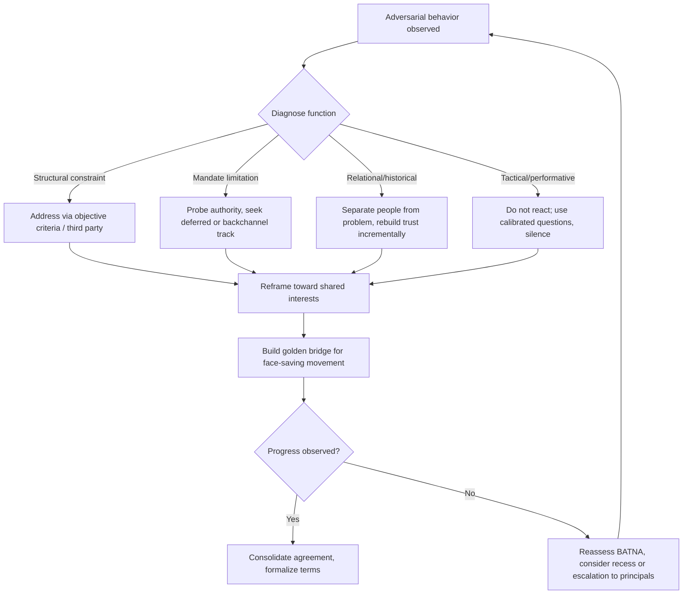

## Managing Difficult Counterparts and Adversarial Dynamics

### Definition and Scope

Managing difficult counterparts refers to the diplomat's or negotiator's capacity to sustain productive engagement with interlocutors who employ obstruction, aggression, deception, emotional manipulation, or structural leverage to resist agreement or extract concessions. Adversarial dynamics describe the systemic patterns—power asymmetries, historical grievance, zero-sum framing, domestic political pressure on the counterpart—that generate this behavior. The discipline draws from diplomatic practice, hostage negotiation, labor mediation, and behavioral psychology.

The core premise is that difficult behavior is usually instrumental rather than purely personality-driven: it serves a strategic function (testing resolve, buying time, playing to a domestic audience, masking weakness). Effective management requires diagnosing the function before selecting a response.

### Taxonomy of Difficult Counterpart Behaviors

**Key Points**

- **Stonewalling**: refusal to engage substantively, repetition of fixed positions, procedural delay.
- **Aggressive/Intimidation Tactics**: raised voice, personal attacks, walkouts, ultimatums, threats of escalation.
- **Deceptive Maneuvering**: misrepresentation of facts, false deadlines, fake constraints ("my capital won't allow it"), selective leaks.
- **Emotional Volatility**: manufactured outrage, guilt induction, victim framing.
- **Anchoring and Extreme Demands**: opening with maximalist positions to shift the perceived midpoint.
- **Good Cop/Bad Cop**: coordinated role division within the counterpart's delegation.
- **Salami Tactics**: extracting concessions in small increments to avoid triggering resistance.
- **Nibbling**: last-minute additional demands after apparent agreement.

### Diagnostic Framework: Why Counterparts Turn Adversarial

Before selecting a response, diplomats assess the source of adversarial behavior across four dimensions:

1. **Structural** — genuine power asymmetry or scarce resources creating a perceived zero-sum situation.
2. **Mandate-driven** — the counterpart is constrained by instructions from a principal (government, board, constituency) and has limited authority to concede.
3. **Relational** — historical mistrust, unresolved grievance, or reputational stakes from prior interactions.
4. **Tactical/Performative** — behavior calculated for effect, often reversible once its function is served (e.g., posturing for a domestic audience or media presence in the room).

Distinguishing tactical performance from genuine constraint is an interpretive judgment made in real time and is inherently uncertain [Inference].

### The Interests-Positions Distinction

Adversarial counterparts typically entrench around **positions** (stated demands) rather than revealing **interests** (underlying needs, fears, and goals). A foundational technique, drawn from principled negotiation theory, is to probe beneath stated positions to find interests that may be compatible even when positions appear irreconcilable.

**Example**

A counterpart insists: "We will never withdraw troops from the border region." The position is fixed. Underlying interests might include: security guarantees against future incursion, domestic political survival for the leader, or control over a resource corridor. Addressing the interest (e.g., a demilitarized buffer zone with third-party monitoring) can resolve the dispute without either side "losing" on the stated position.

### Core Techniques for Managing Adversarial Counterparts

#### 1. Separating People from the Problem

Depersonalize the conflict by externalizing the issue as a shared problem to be solved jointly rather than a contest between individuals. This reduces face-threat and defensiveness.

#### 2. Active and Tactical Listening

- **Mirroring**: repeating the last few words a counterpart says to encourage elaboration and signal engagement.
- **Labeling**: naming the emotion or concern observed ("It sounds like there's real frustration about the timeline") without agreeing or disagreeing with its validity.
- **Summarizing/Paraphrasing**: confirming understanding, which slows escalation and surfaces misunderstandings.

#### 3. Strategic Silence and Pacing

Allowing silence after a hostile statement avoids reactive escalation and often prompts the counterpart to fill the gap with clarifying or concessionary information.

#### 4. Reframing

Converting accusatory or zero-sum language into problem-solving language. "You're trying to cheat us on the quota" reframed as "Let's look at how the quota allocation formula was derived and whether it still reflects current conditions."

#### 5. Going to the Balcony

A metacognitive discipline of mentally stepping back from the emotional charge of an exchange to observe the interaction pattern objectively before responding. This is a widely taught heuristic in negotiation pedagogy rather than an empirically measured technique [Unverified].

#### 6. Building a Golden Bridge

Constructing a face-saving path for the counterpart to move away from an entrenched position without appearing to capitulate—often through incremental reframing, third-party cover, or attributing the new position to external circumstances rather than personal concession.

#### 7. Using Objective Criteria

Redirecting disputes toward independent, legitimate standards (market value, precedent, international law, scientific data) rather than a contest of will, which reduces the leverage of raw aggression or stonewalling.

#### 8. Calibrated Questions

Open-ended, non-accusatory questions beginning with "What" or "How" (rarely "Why," which can sound accusatory) that shift cognitive load onto the counterpart and invite them to solve the problem collaboratively. Example: "How would your side propose we verify compliance?"

### Responding to Specific Adversarial Tactics

| Tactic | Underlying Function | Response Strategy |
| --- | --- | --- |
| Ultimatums | Force premature closure | Test credibility; do not react to the deadline itself; ask what happens if it passes |
| Walkouts | Signal resolve / gain leverage | Avoid chasing; maintain back-channel; leave door open without appearing anxious |
| Personal attacks | Destabilize emotionally, extract reaction | Label the tactic aloud if persistent; do not match tone; redirect to substance |
| False deadlines | Manufacture urgency | Verify independently; decouple your pace from their stated urgency |
| Extreme anchors | Shift reference point | Do not counter-anchor emotionally; restate objective criteria; use your own credible anchor |
| Good cop/bad cop | Create pressure to side with "reasonable" party | Address both as a single negotiating unit; do not treat the "good cop" as an ally |
| Nibbling | Extract late concessions | Reciprocity rule: any late addition requires a matching late addition from them |

### The BATNA as a Stabilizing Tool

A well-developed **Best Alternative to a Negotiated Agreement (BATNA)** is the single most important structural safeguard against adversarial pressure. A diplomat with a strong, credible alternative is less susceptible to intimidation, artificial deadlines, or extreme anchoring because walking away is a viable option rather than a bluff.

$$\text{Reservation Value} = f(\text{BATNA strength}, \text{cost of delay}, \text{reputational stakes})$$

Diplomats should continuously reassess their BATNA and, where possible, signal (without explicitly stating) that a credible alternative exists, which shifts the counterpart's calculation of how much pressure will actually yield results.

### Emotional Regulation and Self-Management

**Key Points**

- **Recognize physiological arousal** (elevated heart rate, defensiveness) as an early warning signal, not a call to action.
- **Use a delay mechanism**: a scripted pause phrase ("Let me make sure I understand your position fully before responding") buys regulation time.
- **Avoid reciprocal escalation**: matching hostility typically reinforces the adversarial frame rather than de-escalating it [Inference, context-dependent].
- **Preserve strategic patience**: many adversarial postures soften over multi-session engagements once the counterpart has "performed" sufficiently for their audience.

Behavioral responses to stress vary by individual and cultural context, and prescribed techniques should be understood as general heuristics rather than guaranteed outcomes.

### Coalition and Third-Party Leverage

When bilateral engagement stalls, diplomats often employ:

- **Mediators/facilitators** to reduce direct confrontation and introduce procedural legitimacy.
- **Multilateral framing** to dilute a single adversarial counterpart's leverage by bringing in additional stakeholders with aligned interests.
- **Track II channels** (unofficial, non-binding dialogues involving academics, former officials, or civil society) to test proposals and de-escalate before formal negotiation resumes.

### Process Diagram: Adaptive Response Cycle

### Illustrative Case Pattern (Composite, Not a Specific Historical Event)

<svg xmlns="http://www.w3.org/2000/svg" viewBox="0 0 700 320">
<title>Escalation vs. De-escalation Response Paths (svg_diagram)</title>
<rect width="700" height="320" fill="#ffffff" stroke="#cccccc" />
<text x="20" y="30" font-size="16" font-weight="bold" fill="#222222">Escalation vs. De-escalation Response Paths (svg_diagram)</text>
<line x1="60" y1="280" x2="660" y2="280" stroke="#333333" stroke-width="2" />
<line x1="60" y1="280" x2="60" y2="60" stroke="#333333" stroke-width="2" />
<text x="30" y="70" font-size="11" fill="#333333">Tension</text>
<text x="600" y="300" font-size="11" fill="#333333">Time</text>
<polyline points="60,260 150,150 240,80 330,70 420,90 510,110 600,120" fill="none" stroke="#c0392b" stroke-width="2" />
<text x="420" y="60" font-size="11" fill="#c0392b">Reciprocal escalation (matched hostility)</text>
<polyline points="60,260 150,220 240,190 330,200 420,160 510,120 600,90" fill="none" stroke="#1e8449" stroke-width="2" />
<text x="330" y="240" font-size="11" fill="#1e8449">Calibrated de-escalation (labeling, silence, reframe)</text>
<circle cx="150" cy="220" r="4" fill="#1e8449" />
<circle cx="150" cy="150" r="4" fill="#c0392b" />
<text x="160" y="140" font-size="10" fill="#c0392b">Ultimatum issued</text>
<circle cx="330" cy="70" r="4" fill="#c0392b" />
<text x="340" y="65" font-size="10" fill="#c0392b">Peak conflict / walkout risk</text>
<circle cx="420" cy="160" r="4" fill="#1e8449" />
<text x="340" y="180" font-size="10" fill="#1e8449">Golden bridge offered</text>
</svg>

### Common Pitfalls

- **Mirroring hostility**, which validates the adversarial frame and can lock both parties into positional combat.
- **Over-conceding to preserve harmony**, which rewards adversarial tactics and invites repetition (a moral-hazard dynamic).
- **Misreading tactical posturing as genuine intransigence**, leading to premature escalation or walkout by the diplomat's own side.
- **Ignoring the counterpart's domestic audience constraints**, which can make private concessions publicly untenable for them.
- **Failing to update BATNA analysis** as circumstances shift during protracted negotiations.

### Measuring Effectiveness

There is no universally standardized metric for "success" in managing adversarial dynamics; practitioners typically assess:

- Movement from positional to interest-based dialogue (qualitative).
- Reduction in walkout frequency or procedural obstruction over successive sessions.
- Durability of agreements reached (whether concessions hold post-agreement, an indicator of whether adversarial tactics masked unresolved core interests).

These are process indicators rather than guaranteed predictors of long-term diplomatic outcomes, which remain subject to external political factors beyond the negotiator's control.

**Related Topics**

- Principled Negotiation and Interest-Based Bargaining
- Cross-Cultural Communication in Diplomatic Settings
- BATNA and Power Asymmetry Analysis
- Crisis Communication and De-escalation Protocols
- Track II Diplomacy and Backchannel Negotiation
- Psychological Resilience and Stress Inoculation for Negotiators
- Coalition-Building and Multilateral Leverage
- Mediation and Third-Party Facilitation Techniques