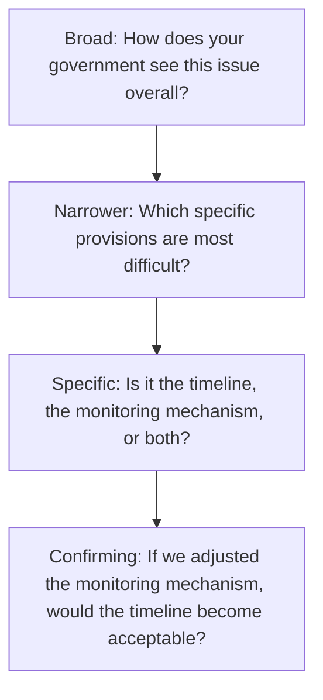
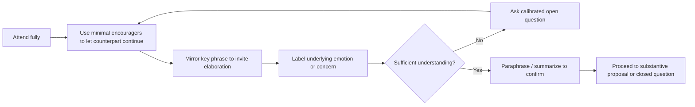

## Active Listening and Questioning Techniques

### Definition and Scope

Active listening is a structured communication discipline in which the listener deliberately processes, verifies, and reflects the speaker's verbal and non-verbal content to build accurate understanding and signal engagement, rather than passively receiving or preparing a rebuttal while the counterpart speaks. Questioning techniques are the complementary set of interrogative tools used to extract information, test assumptions, and guide a diplomatic conversation without triggering defensiveness. Together, these form the foundational interpersonal skill set underlying nearly all other negotiation and diplomatic competencies.

### Why This Matters in Diplomatic Contexts

**Key Points**

- Diplomatic communication frequently occurs across language, cultural, and institutional barriers where meaning is easily distorted.
- Counterparts under political pressure often communicate indirectly; literal words may diverge from underlying intent.
- Perceived attentiveness itself carries diplomatic value — feeling heard reduces defensiveness and increases willingness to disclose interests.
- Errors in listening (misattribution, selective hearing, premature assumption) can cascade into strategic miscalculation at a national level.

### The Core Components of Active Listening

#### 1. Attending

Full physical and cognitive orientation toward the speaker — eye contact (calibrated to cultural norms), open posture, minimal distraction. Attending signals respect and primes the listener to notice nuance.

#### 2. Following

Using minimal encouragers ("I see," "go on," brief nods) that permit the speaker to continue without interruption, preserving their narrative flow and surfacing information that direct questioning might suppress.

#### 3. Reflecting

- **Paraphrasing**: restating content in the listener's own words to confirm understanding of facts. Example: "So the delay is primarily due to the ratification process in your legislature, not a change in position."
- **Reflecting feeling**: naming the emotional undertone. Example: "It sounds like there's concern about how this will be perceived domestically."
- **Summarizing**: consolidating multiple points into a structured recap, typically used at transitions or before moving to a new agenda item.

#### 4. Labeling

A tactical variant of reflecting feeling, borrowed from crisis negotiation practice, in which the listener explicitly names an observed emotion or dynamic without judgment, using tentative framing ("It seems like..." or "It sounds like..."). Labeling invites correction, which itself elicits further information, and tends to reduce the intensity of the named emotion.

#### 5. Mirroring

Repeating the last one to three words (or a key phrase) the speaker used, delivered with a slight upward inflection. This is a low-effort technique that encourages elaboration and signals close attention without introducing the listener's own interpretation.

**Example**

Counterpart: "We simply cannot accept these terms given the pressure we're under."

Mirror: "Pressure you're under?"

This typically prompts the counterpart to elaborate on the specific source of pressure, surfacing information that a direct question might not.

### Non-Verbal Dimensions

- **Paralanguage**: tone, pitch, pace, and volume often carry more diagnostic information than literal word choice, particularly when a counterpart is constrained in what they can say explicitly.
- **Silence as a listening tool**: withholding response after a statement, especially an emotionally charged one, often prompts the speaker to continue, clarify, or soften their position.
- **Congruence checking**: noting mismatches between stated words and body language, tone, or contextual behavior, which may indicate constrained authority, discomfort, or deception. This inference should be held provisionally rather than treated as confirmed, since non-verbal cues are influenced by culture, personality, and individual variation [Inference].

### Questioning Techniques

#### Open vs. Closed Questions

| Type | Function | Example |
| --- | --- | --- |
| Open | Invites elaboration, surfaces interests | "How does your delegation view the timeline?" |
| Closed | Confirms specific facts, narrows scope | "Is the deadline fixed at the end of the quarter?" |
| Leading (generally avoided) | Risks biasing the response | "You'd agree this approach is unreasonable, wouldn't you?" |

#### Calibrated Questions

Open-ended questions beginning with "What" or "How" rather than "Why," designed to shift the cognitive burden of problem-solving onto the counterpart while avoiding the accusatory tone that "why" questions often carry.

**Example**

Instead of: "Why won't you agree to this clause?"

Use: "What about this clause creates a problem for your side?" or "How could we adjust this clause to address your concern?"

#### Funnel Questioning

A sequence moving from broad, open questions to progressively narrower, specific ones — used to first understand the general landscape of a counterpart's position before drilling into actionable detail.

#### Diagnostic Questions

Questions designed to surface underlying interests rather than restate positions. Example: "What outcome would make this a success for your side, beyond the specific terms on the table?"

#### Hypothetical/Conditional Questions

Used to test flexibility without requiring commitment. Example: "If the verification mechanism were handled by a neutral third party, would that change your position?" This allows the counterpart to explore movement without losing face by formally conceding.

#### Clarifying Questions

Used to resolve ambiguity before proceeding, particularly important across linguistic or cultural gaps. Example: "When you say 'immediate,' do you mean within days, or within the current negotiating round?"

### Barriers to Effective Listening in Diplomatic Settings

- **Rehearsing**: mentally preparing a response instead of processing incoming information.
- **Filtering**: selectively hearing only what confirms existing assumptions about the counterpart's position.
- **Judging**: evaluating the speaker's credibility or motives prematurely, which distorts subsequent interpretation.
- **Cultural translation loss**: idiomatic expressions, honorifics, or indirect speech norms that do not map cleanly across languages, sometimes compounded by interpreter compression of nuance.
- **Status and protocol pressure**: in hierarchical diplomatic settings, junior officials may hesitate to seek clarification from senior counterparts, leading to unaddressed ambiguity.

### Interpreter-Mediated Listening

When communication passes through interpreters, additional discipline is required:

- Maintain eye contact with the counterpart, not the interpreter, to preserve relational engagement.
- Speak in shorter segments to reduce compression loss.
- Debrief with the interpreter afterward on tone, hesitation, or ambiguity that may not have translated cleanly — interpreters often notice paralinguistic cues that principals miss while focused on formulating their own responses.

### Integration: A Structured Listening-Questioning Cycle

### Common Pitfalls

- **Premature problem-solving**: offering solutions before fully understanding the counterpart's concern, which can feel dismissive and cut off valuable information.
- **Over-mirroring**: excessive repetition without variation can appear mechanical or insincere if not calibrated naturally.
- **Interrogation tone**: a rapid sequence of closed questions can resemble cross-examination rather than dialogue, increasing defensiveness.
- **Ignoring silence**: rushing to fill pauses undermines their diagnostic and de-escalating value.
- **Assuming universal non-verbal meaning**: gestures, eye contact norms, and emotional expression vary significantly by culture; a single interpretive framework applied universally risks systematic misreading.

### Skill Development and Practice Methods

- **Structured paraphrase drills**: practicing summarizing a counterpart's position in under three sentences before responding.
- **Recorded negotiation review**: reviewing transcripts or recordings of past sessions to identify missed cues, premature interruptions, or effective labeling.
- **Cross-cultural simulation exercises**: role-play scenarios with deliberately indirect or high-context communication styles to build interpretive flexibility.
- **Real-time note-taking discipline**: capturing key phrases verbatim during dialogue to support accurate later paraphrasing without relying solely on memory.

**Related Topics**

- Principled Negotiation and Interest-Based Bargaining
- Managing Difficult Counterparts and Adversarial Dynamics
- Cross-Cultural Communication in Diplomatic Settings
- Non-Verbal Communication and Protocol Awareness
- Interpreter Management in High-Stakes Negotiations
- Emotional Labeling and De-escalation Techniques
- Building Trust and Rapport in Early-Stage Diplomatic Engagement