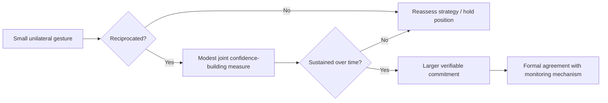

## Trust-Building in High-Stakes Settings

### Definition and Scope

Trust-building in high-stakes diplomatic settings refers to the deliberate set of behaviors, sequencing choices, and signaling mechanisms used to establish sufficient mutual confidence between parties to permit information-sharing, risk-taking, and durable agreement — under conditions of significant consequence, time pressure, historical grievance, or existential stakes (security, sovereignty, economic survival). Unlike routine interpersonal trust, diplomatic trust must often be built despite structural incentives to deceive, limited repeated interaction, and the presence of domestic audiences monitoring each party's concessions.

### Why Trust Is Structurally Difficult in Diplomacy

**Key Points**

- **Security dilemma logic**: actions taken for defensive reassurance can be perceived as offensive preparation by the counterpart, creating a self-reinforcing suspicion cycle.
- **Principal-agent constraints**: negotiators often cannot fully commit their own government, making promises inherently conditional and harder to credibly signal.
- **Asymmetric information**: parties have private information about intentions and capabilities that cannot be costlessly verified.
- **One-shot or low-repetition interactions**: unlike commercial relationships, some diplomatic engagements involve single high-stakes encounters where reputational consequences for defection are less immediately enforceable.
- **Domestic audience costs**: leaders who appear to trust an adversary too readily may face political backlash, creating incentives to perform distrust even when private assessments differ.

### Theoretical Foundations

#### Trust as a Calculated, Not Purely Emotional, Construct

In high-stakes diplomacy, trust is frequently modeled as a rational assessment of a counterpart's *predictability* and *benevolence/competence*, rather than a purely affective bond. A useful working formulation distinguishes:

- **Calculus-based trust**: grounded in the expectation that the costs of betrayal outweigh its benefits for the counterpart.
- **Knowledge-based trust**: grounded in accumulated experience and predictability of the counterpart's behavior over time.
- **Identification-based trust**: grounded in shared values, identity, or goals — rare and slow to form in adversarial contexts, but highly durable once established [Inference, context-dependent].

$$\text{Perceived Trustworthiness} \approx f(\text{Predictability}, \text{Benevolence}, \text{Competence}, \text{Integrity})$$

This is a conceptual heuristic drawn from organizational trust research rather than a precise measurable formula.

#### The Reciprocity Principle

Trust-building typically proceeds through incremental, reciprocated signals rather than unilateral declarations. Each party tests the relationship with a small, potentially costly gesture and observes whether it is reciprocated before escalating commitment — a pattern consistent with tit-for-tat dynamics studied in iterated game theory.

### Mechanisms for Building Trust

#### 1. Costly Signals

Actions that would be irrational or expensive if the sender did not genuinely intend to follow through. In diplomacy, costly signals include unilateral confidence-building measures (troop withdrawals, transparency disclosures, prisoner releases) that carry real risk if reciprocity fails.

**Example**

A state unilaterally halting a contested military exercise ahead of talks signals genuine intent at some strategic cost, distinguishing it from cheap talk (a mere verbal assurance that costs nothing to make or break).

#### 2. Incremental Reciprocal Exchanges

Structuring negotiations as a sequence of small, verifiable exchanges rather than a single all-or-nothing agreement. Each successful exchange builds a track record that lowers the perceived risk of the next, larger step.

#### 3. Consistency and Predictability

Reliable follow-through on small commitments (punctuality, accurate information, honoring informal understandings) establishes a behavioral track record that counterparts use to forecast reliability on larger commitments, even absent formal guarantees.

#### 4. Transparency of Constraints

Explicitly disclosing one's own limitations (domestic political constraints, legal restrictions, mandate boundaries) rather than concealing them can paradoxically build trust — it signals honesty about what is and is not possible, reducing the counterpart's fear of hidden agendas.

#### 5. Third-Party Guarantors and Verification Mechanisms

Where direct trust is insufficient, structural substitutes can bridge the gap: neutral monitoring bodies, escrow-like mechanisms, phased implementation with independent verification at each stage, or mediator-held commitments. These reduce the trust burden on the parties themselves by making defection observable and costly.

#### 6. Informal and Backchannel Engagement

Track II or unofficial dialogues (academics, retired officials, civil society intermediaries) allow exploratory trust-building and idea-testing without the formal commitment risk of official negotiation, often preceding and enabling formal trust once channels prove productive.

#### 7. Personal Rapport and Repeated Interaction

Direct, sustained personal engagement between key individuals — shared meals, informal conversation, extended session time — builds identification-based trust more effectively than formal sessions alone, particularly in cultures where relationship precedes transaction. The strength of this effect varies considerably by individual and cultural context [Inference].

### The Role of Vulnerability

Deliberate, calibrated vulnerability — admitting uncertainty, acknowledging past mistakes, or revealing genuine constraints — can accelerate trust formation by signaling authenticity. This must be carefully calibrated: excessive or poorly timed vulnerability in adversarial settings can be read as weakness and exploited rather than reciprocated. The optimal degree of disclosure depends heavily on the specific counterpart and context, making this a judgment call rather than a fixed rule [Inference].

### Trust Erosion and Repair

#### Common Trust-Breaking Events

- Broken commitments, even minor or procedural ones.
- Perceived bad-faith negotiating tactics (deliberate misrepresentation, exploiting disclosed vulnerabilities).
- Leaks of confidential discussions to domestic or international media.
- Sudden reversals attributed to internal political shifts, even when not the counterpart's fault.

#### Repair Strategies

- **Acknowledgment**: direct, specific recognition of the breach rather than vague or deflected apology.
- **Explanation without excuse**: providing context for the failure (e.g., a genuine change in domestic political circumstance) without using it to evade responsibility.
- **Demonstrated behavioral change**: repair is generally established through a subsequent pattern of reliable behavior rather than verbal reassurance alone.
- **Third-party mediation**: when direct repair attempts fail or trust has broken down severely, a neutral intermediary can re-establish minimal communication channels.

Trust repair timelines and success rates vary substantially by relationship history, stakes, and cultural context; general claims about "how long" repair takes should be treated as illustrative rather than predictive [Speculation].

### Cultural Dimensions of Trust-Building

| Orientation | Characteristics | Implication for Trust-Building |
| --- | --- | --- |
| Relationship-first cultures | Trust precedes substantive negotiation; time invested in personal rapport is expected | Rushing to business terms can be read as disrespect or insincerity |
| Transaction-first cultures | Trust is built through demonstrated competence and reliable deal performance | Excessive relationship-building before substance may be read as evasive |
| High-context communication | Trust signals conveyed indirectly, through tone, gesture, and context | Requires calibrated listening (see Active Listening) to detect trust signals |
| Low-context communication | Trust signals conveyed explicitly and verbally | Direct verbal reassurance carries more weight than in high-context settings |

These are general tendencies, not fixed rules; individual variation within any culture is substantial, and treating cultural generalizations as deterministic risks stereotyping [Inference].

### Trust in Multilateral and Asymmetric Settings

- **Multilateral trust** is more complex than bilateral trust because reputational consequences are distributed across multiple observing parties, which can either reinforce good-faith behavior (reputational stakes are higher) or create free-rider problems (any single party's defection can be diffused across the group).
- **Asymmetric power settings**: the weaker party often requires more visible and costly signals from the stronger party to overcome a rational fear of exploitation, since the stronger party has less structural incentive to honor informal commitments.

### Common Pitfalls

- **Over-trusting early rapport**: mistaking pleasant personal interaction for genuine alignment of interests.
- **Conflating trust with agreement**: parties can trust each other's sincerity while still holding fundamentally incompatible interests.
- **Unilateral over-disclosure**: revealing too much strategic information too early, based on premature trust, which can be exploited without reciprocal benefit.
- **Neglecting verification**: relying purely on interpersonal trust in high-stakes agreements without structural safeguards, which exposes the agreement to risk if personnel change or political will shifts.
- **Ignoring domestic audience constraints**: failing to account for why a counterpart's trust-signaling capacity is limited by their own political environment.

### Illustrative Trust-Building Trajectory

<svg xmlns="http://www.w3.org/2000/svg" viewBox="0 0 700 320">
<title>Incremental Trust-Building Trajectory in High-Stakes Negotiation (svg_diagram)</title>
<rect width="700" height="320" fill="#ffffff" stroke="#cccccc" />
<text x="20" y="30" font-size="15" font-weight="bold" fill="#222222">Incremental Trust-Building Trajectory (svg_diagram)</text>
<line x1="60" y1="280" x2="660" y2="280" stroke="#333333" stroke-width="2" />
<line x1="60" y1="280" x2="60" y2="50" stroke="#333333" stroke-width="2" />
<text x="20" y="60" font-size="11" fill="#333333">Trust Level</text>
<text x="600" y="300" font-size="11" fill="#333333">Time / Interactions</text>
<polyline points="60,260 140,240 140,240 220,200 300,195 380,150 460,145 540,100 620,90" fill="none" stroke="#1e8449" stroke-width="2" />
<circle cx="140" cy="240" r="4" fill="#1e8449" />
<text x="90" y="255" font-size="9" fill="#1e8449">Small gesture</text>
<circle cx="300" cy="195" r="4" fill="#1e8449" />
<text x="240" y="210" font-size="9" fill="#1e8449">Reciprocated CBM</text>
<circle cx="380" cy="150" r="4" fill="#c0392b" />
<text x="330" y="140" font-size="9" fill="#c0392b">Minor breach</text>
<polyline points="380,150 420,190" fill="none" stroke="#c0392b" stroke-width="2" stroke-dasharray="4" />
<circle cx="460" cy="145" r="4" fill="#1e8449" />
<text x="420" y="130" font-size="9" fill="#1e8449">Repair + consistency</text>
<circle cx="620" cy="90" r="4" fill="#1e8449" />
<text x="560" y="80" font-size="9" fill="#1e8449">Verified agreement</text>
</svg>

### Practical Application Checklist

- **Sequence** disclosures and concessions incrementally rather than front-loading vulnerability.
- **Pair verbal commitments with observable, costly actions** wherever feasible.
- **Build in verification mechanisms** so agreements do not depend solely on interpersonal trust.
- **Track behavioral consistency** across sessions as the primary trust indicator, rather than rhetoric alone.
- **Anticipate the counterpart's domestic constraints** on their capacity to signal trust openly.
- **Prepare a repair protocol in advance** for likely breach scenarios, given the high probability of at least minor friction in prolonged high-stakes engagement.

**Related Topics**

- Managing Difficult Counterparts and Adversarial Dynamics
- Active Listening and Questioning Techniques
- Confidence-Building Measures in International Relations
- Track II and Backchannel Diplomacy
- Cross-Cultural Communication in Diplomatic Settings
- Game Theory Foundations for Negotiation (Iterated Prisoner's Dilemma, Signaling Theory)
- Crisis Communication and De-escalation Protocols
- Verification and Monitoring Mechanisms in Treaty Design