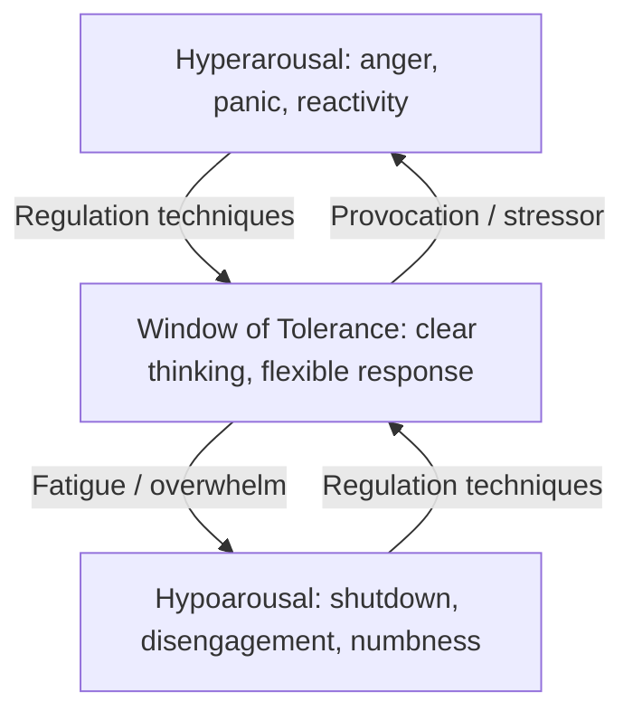

## Emotional Regulation During Conflict

### Definition and Scope

Emotional regulation during conflict refers to the deliberate cognitive and behavioral strategies a diplomat uses to monitor, modulate, and direct their own emotional responses while engaged in high-stakes, adversarial, or crisis interactions — preserving strategic judgment and interpersonal effectiveness despite provocation, threat, frustration, or fatigue. This is distinct from emotion suppression; effective regulation involves managing the *expression and influence* of emotion on decision-making, not eliminating the emotional response itself.

### Why This Matters in Diplomatic Contexts

**Key Points**

- Diplomatic conflict frequently involves deliberate provocation designed to elicit reactive, poorly calculated responses.
- Emotionally reactive statements from officials can have consequences disproportionate to their intent (public commitments, escalatory signaling, loss of negotiating leverage).
- Prolonged high-stakes engagement (crisis negotiations, multi-day summits) produces cumulative fatigue that degrades regulatory capacity over time.
- A negotiator's emotional state is often read by counterparts as information about resolve, confidence, or desperation — meaning regulation has direct strategic signaling value, not just personal wellbeing value.

### Theoretical Foundations

#### The Appraisal Model of Emotion

Emotional responses are generally understood to arise not directly from events themselves but from the individual's interpretation (appraisal) of those events — their meaning, threat level, and implications for goals. This model underlies most modern emotion-regulation technique, since it implies that changing the appraisal (reframing) can change the emotional response, even when the external event is unchanged.

$$\text{Emotional Response} = f(\text{Event}, \text{Appraisal}, \text{Regulatory Capacity})$$

This is a widely used conceptual model in psychology rather than a precise quantifiable equation.

#### The Window of Tolerance

A commonly referenced heuristic describing the zone of physiological and emotional arousal within which an individual can think clearly, process information, and respond effectively. Outside this window — in states of hyperarousal (fight/flight activation) or hypoarousal (shutdown/freeze) — cognitive function, particularly complex reasoning and perspective-taking, is measurably impaired.

### Physiological Basis of Emotional Reactivity

Under perceived threat, the sympathetic nervous system activates a stress response (elevated heart rate, cortisol release, narrowed attentional focus) that historically served survival functions but can impair the nuanced judgment required in negotiation. Recognizing early physiological cues — tension, shallow breathing, heat in the face, clenched jaw — allows a diplomat to intervene before reactivity escalates into overt behavior. The precise physiological threshold at which judgment becomes impaired varies by individual and cannot be generalized with precision [Inference].

### Core Regulation Techniques

#### 1. Pre-Emptive Regulation (Before Engagement)

- **Scenario rehearsal**: mentally simulating likely provocations and pre-scripting calm responses reduces in-the-moment reactivity by converting novel threats into anticipated ones.
- **Physiological readiness**: adequate sleep, hydration, and food intake measurably affect regulatory capacity; fatigue and hunger are well-documented amplifiers of emotional reactivity.
- **Setting intention**: consciously establishing a goal for the interaction ("stay curious, not defensive") before entering the room anchors behavior under pressure.

#### 2. In-the-Moment Regulation (During Conflict)

**Tactical Pause**

A brief, deliberate delay before responding to a provocative statement — achieved through scripted phrases ("Let me think about how to respond to that"), requesting a short recess, or simply extending silence. This interrupts the automatic reactive cycle and re-engages deliberate cognitive processing.

**Physiological Down-Regulation**

- **Controlled breathing**: slow, extended exhalation (e.g., a longer out-breath than in-breath) is associated with parasympathetic activation and reduced physiological arousal.
- **Grounding through sensory anchoring**: briefly noticing tactile or environmental detail (the weight of a pen, the texture of the table) to interrupt escalating internal narrative.

**Cognitive Reappraisal**

Deliberately reinterpreting the meaning of a provocative statement or event to reduce its emotional charge. Example: reframing a counterpart's aggressive outburst from "a personal attack on me" to "a performance for their domestic audience that has little to do with me personally."

**Going to the Balcony**

A metacognitive technique of mentally stepping outside the immediate interaction to observe the dynamic — including one's own reaction — from a detached, analytical vantage point before formulating a response.

**Labeling One's Own Emotion**

Silently or explicitly naming the emotional state ("I notice I'm feeling defensive right now") has been associated in psychological research with reduced amygdala reactivity, a process sometimes summarized as "name it to tame it." This finding is drawn from affective neuroscience research and individual results may vary [Unverified].

#### 3. Post-Engagement Regulation (After Conflict)

- **Structured debrief**: reviewing the interaction with a trusted colleague or advisor to process residual emotional charge and extract strategic lessons separately.
- **Physical discharge**: physical activity following high-stress engagement is commonly used to metabolize residual stress hormones, though the precise mechanism and efficacy vary by individual.
- **Cognitive closure practices**: deliberately marking the end of an engagement (a ritual, a written note, a debrief conversation) to prevent rumination from carrying into subsequent sessions.

### Distinguishing Productive and Counterproductive Emotional Expression

| Expression Type | Function | Strategic Effect |
| --- | --- | --- |
| Calibrated firmness | Signals genuine resolve without hostility | Can strengthen credibility of a position |
| Authentic controlled frustration | Signals a genuine limit has been reached | Can accelerate movement if used sparingly and credibly |
| Reactive anger | Uncontrolled response to provocation | Typically damages credibility, cedes information, risks escalation |
| Suppressed/masked emotion | Emotion hidden entirely | May reduce short-term reactivity but can produce detectable incongruence, and sustained suppression carries cognitive cost |
| Performed emotion | Deliberate display for strategic effect | Distinct from regulation; carries risk of detection and trust erosion if perceived as manipulative |

**Example**

A diplomat who allows visible, calibrated frustration after a counterpart breaks a prior commitment — briefly and without escalation — can strategically signal that a genuine limit exists, which uncontrolled anger or complete emotional suppression would not accomplish as credibly.

### Emotional Contagion and Group Dynamics

In delegation settings, one individual's emotional state can propagate through the group, amplifying collective reactivity or, conversely, stabilizing it if a senior figure models regulated composure under pressure. Diplomats leading delegations carry a disproportionate regulatory responsibility, since their visible state is often read as a signal by both their own team and the opposing delegation.

### Cultural Variation in Emotional Display Norms

| Norm | Characteristics | Implication |
| --- | --- | --- |
| High emotional expressiveness norms | Visible emotion is socially acceptable and may carry communicative intent | Restrained counterparts should not assume absence of strong feeling |
| Restrained/high-control norms | Emotional display is minimized publicly, especially in formal settings | Visible emotion may be a stronger-than-apparent signal precisely because it deviates from norm |
| Face-preservation cultures | Public loss of composure is highly costly | Provoking visible reactivity may be a deliberate tactic to damage a counterpart's standing |

Display norms vary substantially by culture, institution, and individual, and should not be treated as deterministic predictors of internal emotional state [Inference].

### Common Pitfalls

- **Conflating regulation with suppression**: chronic suppression without processing can produce delayed reactivity, decision fatigue, or degraded wellbeing over prolonged engagements.
- **Over-relying on willpower**: without pre-emptive preparation (rest, rehearsal, intention-setting), in-the-moment regulation techniques are harder to access under acute stress.
- **Misreading a counterpart's regulated calm as weakness or disengagement**, when it may in fact reflect discipline rather than lack of resolve.
- **Failing to recognize hypoarousal**: shutdown or disengagement can be mistaken for calm when it in fact reflects impaired processing capacity requiring recovery time, not more pressure.
- **Neglecting recovery between sessions**: cumulative fatigue across multi-day negotiations erodes regulatory capacity progressively if not actively managed.

### Illustrative Regulation Cycle

<svg xmlns="http://www.w3.org/2000/svg" viewBox="0 0 700 300">
<title>Emotional Regulation Cycle During Conflict (svg_diagram)</title>
<rect width="700" height="300" fill="#ffffff" stroke="#cccccc" />
<text x="20" y="30" font-size="15" font-weight="bold" fill="#222222">Emotional Regulation Cycle (svg_diagram)</text>
<circle cx="150" cy="160" r="55" fill="#fdecea" stroke="#c0392b" stroke-width="2" />
<text x="105" y="155" font-size="11" fill="#c0392b">Provocation</text>
<text x="112" y="172" font-size="11" fill="#c0392b">/ Trigger</text>
<circle cx="350" cy="160" r="55" fill="#fdf2e3" stroke="#d68910" stroke-width="2" />
<text x="300" y="150" font-size="11" fill="#d68910">Physiological</text>
<text x="310" y="167" font-size="11" fill="#d68910">arousal</text>
<text x="320" y="184" font-size="11" fill="#d68910">noticed</text>
<circle cx="550" cy="160" r="55" fill="#eafaf1" stroke="#1e8449" stroke-width="2" />
<text x="500" y="150" font-size="11" fill="#1e8449">Regulation</text>
<text x="505" y="167" font-size="11" fill="#1e8449">technique</text>
<text x="512" y="184" font-size="11" fill="#1e8449">applied</text>
<line x1="205" y1="160" x2="295" y2="160" stroke="#333333" stroke-width="2" marker-end="url(#arrow)" />
<line x1="405" y1="160" x2="495" y2="160" stroke="#333333" stroke-width="2" marker-end="url(#arrow)" />
<path d="M 550 215 C 550 260, 150 260, 150 215" fill="none" stroke="#333333" stroke-width="2" marker-end="url(#arrow)" />
<text x="280" y="255" font-size="10" fill="#333333">Deliberate, calibrated response re-enters interaction</text>
</svg>

### Skill Development and Practice Methods

- **Stress inoculation training**: structured, progressively challenging simulated provocations used to build regulatory capacity under controlled conditions before real high-stakes exposure.
- **Mindfulness and interoceptive awareness practice**: routine practice in noticing physiological states has been associated with improved early detection of rising arousal, supporting earlier intervention.
- **After-action review with emotional annotation**: reviewing past negotiation transcripts or recordings and annotating one's own emotional state at each juncture to build pattern recognition of personal triggers.
- **Peer coaching and shadow feedback**: trusted colleagues observing and providing feedback on visible emotional cues the individual may not self-detect.

**Related Topics**

- Managing Difficult Counterparts and Adversarial Dynamics
- Active Listening and Questioning Techniques
- Trust-Building in High-Stakes Settings
- Crisis Communication and De-escalation Protocols
- Psychological Resilience and Stress Inoculation for Negotiators
- Cross-Cultural Communication in Diplomatic Settings
- Cognitive Biases in High-Stakes Decision-Making