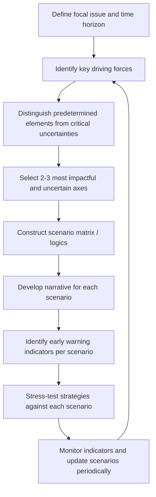
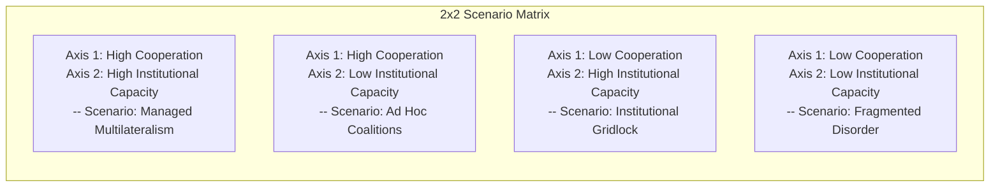

## Scenario Planning and Futures Analysis

### Definition and Scope

Scenario planning and futures analysis is a structured methodology for exploring multiple plausible future states of a strategic environment under conditions of deep uncertainty, in order to stress-test policy options, identify early warning indicators, and build organizational adaptability. Unlike forecasting, which attempts to predict a single most-likely outcome, scenario planning deliberately constructs multiple divergent, internally consistent futures to widen decision-makers' peripheral vision and reduce vulnerability to surprise.

### Distinguishing Scenario Planning from Forecasting and Prediction

**Key Points**

- **Forecasting** assumes sufficient historical regularity to extrapolate a probable single outcome; it performs poorly under structural discontinuity or genuine novelty.
- **Scenario planning** does not assign a single "most likely" future; it deliberately explores a bounded set of divergent futures to reveal robust strategies that perform acceptably across multiple outcomes.
- **Prediction markets/point forecasts** are useful for well-defined, short-horizon, data-rich questions; scenario planning is suited to long-horizon, structurally uncertain, multi-causal strategic environments — the typical condition of diplomatic and geopolitical foresight.
- Scenario planning's value lies primarily in the *process* of structured imagination and organizational learning, not in the accuracy of any single scenario as a prediction.

### Historical and Institutional Origins

Scenario planning in its modern strategic form is most closely associated with military planning methodologies developed at the RAND Corporation in the mid-20th century, and was subsequently adapted for corporate strategic use — most notably by Royal Dutch Shell's scenario planning team in the 1970s, which is widely credited with improving the company's strategic responsiveness ahead of major oil market disruptions. The methodology was later adopted extensively by government foresight units, intelligence agencies, and international organizations for geopolitical and policy planning.

### Core Methodology: The Scenario Development Process

#### 1. Defining the Focal Issue and Time Horizon

The process begins with a precisely scoped strategic question (e.g., "How might regional security architecture evolve over the next decade?") and an explicit time horizon, since driving forces and their relative importance shift substantially across short, medium, and long horizons.

#### 2. Identifying Driving Forces

Systematic scanning across major categories of forces shaping the focal issue, commonly organized under frameworks such as:

| Category | Examples in Diplomatic Context |
| --- | --- |
| Political | Regime stability, alliance structures, electoral cycles |
| Economic | Trade dependencies, resource scarcity, currency dynamics |
| Social | Demographic shifts, migration, public opinion trends |
| Technological | Emerging military technology, cyber capability diffusion, AI-enabled statecraft |
| Environmental | Climate-driven resource stress, disaster frequency |
| Legal/Institutional | Treaty regimes, international court rulings, multilateral institution capacity |

This is frequently referred to by the mnemonic **PESTLE** (Political, Economic, Social, Technological, Legal, Environmental) analysis.

#### 3. Predetermined Elements vs. Critical Uncertainties

- **Predetermined elements**: forces whose trajectory is highly likely regardless of scenario (e.g., demographic aging trends over a 10-year horizon) — these appear consistently across all scenarios and need not be varied.
- **Critical uncertainties**: forces whose outcome is both highly impactful and genuinely unpredictable (e.g., whether a leadership transition produces continuity or rupture) — these form the axes around which scenarios diverge.

#### 4. Constructing the Scenario Matrix

The most common technique selects the two most impactful and most uncertain driving forces and arrays them as intersecting axes, producing a 2x2 matrix of four distinct scenarios. This is a widely used simplification device rather than a claim that only two variables matter; more complex methods (morphological analysis, cross-impact analysis) can incorporate additional axes at the cost of tractability.

#### 5. Narrative Development

Each quadrant is developed into an internally consistent, plausible narrative describing how the world arrived at that state and what it looks like in practice — not merely a label, but a causally coherent story that decision-makers can vividly imagine and test their intuitions against.

#### 6. Early Warning Indicators

For each scenario, analysts identify observable, trackable indicators that would signal the world is moving toward that particular future, enabling ongoing monitoring rather than a one-time exercise.

**Example**

For a "Fragmented Disorder" scenario in a regional security context, indicators might include: rising frequency of unilateral military exercises, declining multilateral summit attendance, increasing bilateral-only trade agreements displacing regional frameworks, and rising defense spending as a percentage of GDP among key regional actors.

### Alternative and Complementary Methodologies

#### Morphological Analysis

A more granular technique that decomposes the problem into multiple independent dimensions (not limited to two), generates the full combinatorial space of possible states, and then filters for internally consistent, plausible combinations — used when the strategic environment cannot be adequately captured by a simple two-axis matrix.

#### Cross-Impact Analysis

A method assessing how the occurrence of one event changes the probability of other events, used to model interdependencies between driving forces that a simple matrix approach may treat as independent.

#### The Delphi Method

A structured, iterative expert elicitation process in which a panel of experts anonymously provides estimates or judgments, receives aggregated feedback from the group, and revises their estimates across multiple rounds — used to build a more robust range of expert judgment on uncertain futures while mitigating groupthink and status-driven bias.

#### Backcasting

Rather than projecting forward from the present, backcasting starts from a defined desirable (or undesirable) future state and works backward to identify the sequence of decisions and events required to reach it — useful for normative policy planning (e.g., "what pathway leads to a stable ceasefire within five years?").

#### Wild Cards and Weak Signals Analysis

Systematic scanning for low-probability, high-impact events (wild cards) and early, ambiguous indicators of emerging change (weak signals) that traditional trend extrapolation would miss. This draws on horizon-scanning practice widely used in government foresight units.

### Applying Scenarios to Diplomatic Strategy

#### Robust Strategy Identification

The central strategic output of scenario planning is not selecting the "correct" scenario but identifying strategies and policy options that perform acceptably — or at minimum, avoid catastrophic failure — across the majority of plausible scenarios. Options that only succeed in a single narrow scenario are higher-risk and should be flagged as such.

| Strategy Type | Characteristic |
| --- | --- |
| Robust strategy | Performs adequately across most/all scenarios |
| Contingent strategy | Performs well only in specific scenarios; requires trigger-based activation |
| High-risk/high-reward strategy | Excellent in one scenario, poor in others; requires explicit risk acceptance |

#### Wind Tunneling

The practice of testing existing or proposed policy options against each constructed scenario ("flying" the strategy through each future) to identify vulnerabilities, necessary contingencies, and options requiring modification before commitment.

#### Scenario-Informed Contingency Planning

Linking specific early warning indicators to pre-agreed decision triggers, allowing an institution to shift posture or activate contingency plans as reality begins to track toward a particular scenario, rather than waiting for full certainty.

### Common Pitfalls in Scenario Planning

- **Scenario proliferation without prioritization**: generating too many scenarios dilutes decision-making focus; the discipline of narrowing to 2-4 scenarios forces genuine prioritization of the most critical uncertainties.
- **Treating scenarios as predictions**: reverting to selecting a single "most likely" scenario for planning purposes defeats the core purpose of building resilience across multiple futures.
- **Insufficient internal consistency**: narratives that combine incompatible elements (e.g., high cooperation alongside rapid unilateral military buildup) undermine analytical credibility.
- **Anchoring on present trends**: insufficient imagination in constructing genuinely divergent futures, producing scenarios that are merely variations of the status quo.
- **Neglecting indicator monitoring**: treating scenario planning as a one-time exercise rather than an ongoing monitoring discipline tied to evolving indicators.
- **Groupthink in driving force selection**: homogeneous planning teams may systematically overlook certain categories of driving forces (e.g., technological disruption, social movements) — mitigated by deliberately diverse participation, including dissenting or contrarian perspectives ("red team" input).

### Organizational Integration

- **Recurring foresight cycles**: leading government and corporate foresight units typically revisit and update scenarios on a periodic basis (commonly annual or biennial) rather than treating a single exercise as permanent.
- **Cross-functional participation**: effective scenario planning draws on diverse expertise (regional specialists, economists, technologists, military planners) to avoid narrow disciplinary blind spots.
- **Communicating uncertainty to leadership**: scenario outputs must be presented in ways that preserve their conditional, exploratory nature rather than being compressed into false-certainty briefing points — a common distortion risk when foresight products move up a hierarchical chain.

### Illustrative Scenario Development Timeline

<svg xmlns="http://www.w3.org/2000/svg" viewBox="0 0 700 260">
<title>Scenario Planning Process Timeline (svg_diagram)</title>
<rect width="700" height="260" fill="#ffffff" stroke="#cccccc" />
<text x="20" y="28" font-size="15" font-weight="bold" fill="#222222">Scenario Planning Process Timeline (svg_diagram)</text>
<line x1="50" y1="140" x2="650" y2="140" stroke="#333333" stroke-width="2" />
<circle cx="90" cy="140" r="6" fill="#2874a6" />
<text x="55" y="170" font-size="10" fill="#2874a6">Scope focal issue</text>
<circle cx="220" cy="140" r="6" fill="#2874a6" />
<text x="180" y="170" font-size="10" fill="#2874a6">Identify drivers</text>
<circle cx="350" cy="140" r="6" fill="#2874a6" />
<text x="300" y="170" font-size="10" fill="#2874a6">Select axes / matrix</text>
<circle cx="480" cy="140" r="6" fill="#2874a6" />
<text x="435" y="170" font-size="10" fill="#2874a6">Build narratives</text>
<circle cx="610" cy="140" r="6" fill="#2874a6" />
<text x="560" y="170" font-size="10" fill="#2874a6">Monitor indicators</text>
<path d="M 610 140 C 610 90, 90 90, 90 140" fill="none" stroke="#7f8c8d" stroke-width="1.5" stroke-dasharray="4" marker-end="url(#arrow2)" />
<text x="270" y="80" font-size="10" fill="#7f8c8d">Periodic review and update cycle</text>
</svg>

### Limitations and Epistemic Caveats

Scenario planning does not eliminate uncertainty or guarantee that the actual future will resemble any constructed scenario; its value is in improving organizational preparedness, decision flexibility, and early-warning sensitivity rather than predictive accuracy. Empirical assessment of scenario planning's effectiveness is methodologically difficult, since success is measured by counterfactual resilience (avoided surprise) rather than a directly observable outcome, and claims about its overall track record across organizations should be treated as an area of ongoing debate rather than settled fact [Unverified].

**Related Topics**

- Risk Assessment and Early Warning Systems in Diplomacy
- Cognitive Biases in High-Stakes Decision-Making
- Horizon Scanning and Weak Signal Detection
- Red Teaming and Structured Analytic Techniques
- Crisis Anticipation and Contingency Planning
- Geopolitical Risk Analysis Frameworks
- Decision-Making Under Deep Uncertainty