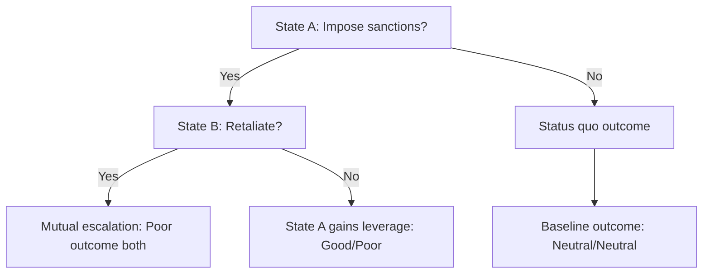
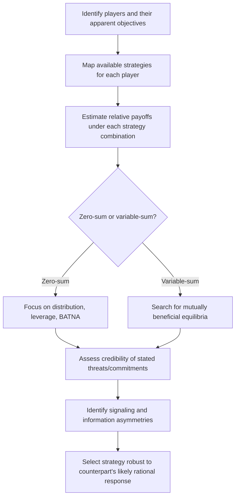

## Game Theory Fundamentals for Strategic Interaction

### Definition and Scope

Game theory is the formal mathematical study of strategic decision-making among rational actors whose outcomes depend not only on their own choices but on the choices of others. In diplomatic contexts, game theory provides a structured vocabulary and set of analytical tools for anticipating counterpart behavior, designing credible commitments, evaluating negotiation leverage, and understanding why cooperation, conflict, or stalemate emerge from a given strategic structure.

### Core Concepts and Terminology

**Key Points**

- **Players**: the decision-making actors (states, delegations, individuals) whose choices interact.
- **Strategies**: the complete set of possible actions available to each player.
- **Payoffs**: the outcomes (utility) each player receives from a given combination of strategies chosen by all players.
- **Information**: what each player knows at the time of decision — complete vs. incomplete, perfect vs. imperfect.
- **Equilibrium**: a stable outcome from which no player has incentive to unilaterally deviate, given the strategies of others.

### The Nash Equilibrium

A **Nash equilibrium** is a set of strategies, one for each player, such that no player can improve their own payoff by unilaterally changing their strategy while all other players' strategies remain fixed. This is the foundational solution concept in non-cooperative game theory and underlies most strategic analysis of diplomatic standoffs.

$$\text{Strategy profile } (s_1^*, s_2^*, \ldots, s_n^*) \text{ is a Nash equilibrium if } u_i(s_i^*, s_{-i}^*) \geq u_i(s_i, s_{-i}^*) \, \forall s_i, \forall i$$

A Nash equilibrium describes a *stable* outcome, not necessarily an *optimal* or *fair* one — a critical distinction in diplomatic application, since mutually destructive equilibria (arms races, prolonged stalemate) can be perfectly stable in game-theoretic terms while being collectively suboptimal.

### Classic Games Relevant to Diplomacy

#### The Prisoner's Dilemma

Two players each choose to cooperate or defect without knowing the other's choice. Mutual cooperation yields a good outcome for both; mutual defection yields a worse outcome for both; but each player is individually incentivized to defect regardless of what the other does, since defection improves their own payoff whether the other cooperates or defects. This produces a Nash equilibrium of mutual defection even though mutual cooperation would be better for both — the central tension explaining why rational actors can fail to cooperate even when cooperation is mutually beneficial.

|  | Counterpart Cooperates | Counterpart Defects |
| --- | --- | --- |
| **You Cooperate** | Good/Good | Bad/Great (for defector) |
| **You Defect** | Great/Bad | Poor/Poor |

**Example**

Bilateral arms control: both states would benefit from mutual restraint, but each has an individual incentive to arm unilaterally in case the other does, producing an arms race even when both sides would prefer mutual restraint.

#### Iterated Prisoner's Dilemma

When the same game is played repeatedly between the same players, cooperation can emerge as a stable equilibrium strategy because future interaction creates the possibility of reciprocity and punishment for defection. The strategy **tit-for-tat** (cooperate first, then mirror the counterpart's previous move) has been extensively studied as a robust cooperative strategy in repeated interaction, forming a key theoretical basis for how sustained diplomatic relationships can escape the single-shot dilemma's pessimistic prediction.

#### Chicken (Hawk-Dove)

Two players drive toward each other; swerving avoids catastrophe but is perceived as weakness/loss, while neither swerving produces mutual catastrophe. This models brinkmanship dynamics in crisis diplomacy — each side has incentive to appear committed to not backing down (to induce the other to swerve first), but if neither swerves, both suffer severe consequences.

**Example**

Nuclear crisis standoffs are frequently analyzed through a Chicken-game lens: each side benefits from appearing maximally resolved, but mutual maximal resolve risks catastrophic escalation, making credible signaling and face-saving off-ramps strategically essential.

#### Stag Hunt

Two players can cooperate to hunt a stag (higher payoff, requires mutual cooperation) or individually hunt a hare (lower but guaranteed payoff). Both mutual cooperation and mutual defection are Nash equilibria, but mutual cooperation requires sufficient trust that the other party will also cooperate — modeling coordination problems in multilateral agreements where the cooperative outcome is superior but requires overcoming a trust/assurance barrier rather than a pure incentive-to-defect problem as in the Prisoner's Dilemma.

#### Battle of the Sexes (Coordination with Conflicting Preferences)

Two players benefit from coordinating on the same choice but disagree on which option is preferable. Models situations where parties agree cooperation is better than non-cooperation but disagree over the specific terms — relevant to negotiations over the *form* a cooperative agreement should take (e.g., which state hosts a summit, which currency underpins a trade agreement).

### Sequential Games and Extensive Form

Unlike the simultaneous-move games above, many diplomatic interactions unfold sequentially, with each player observing prior moves before acting. These are represented as **extensive form games** (decision trees) and solved using **backward induction** — reasoning from the final possible outcomes backward to determine optimal choices at each earlier decision point.

Backward induction from this tree: if State B would rationally choose not to retaliate (since retaliation triggers mutual escalation, a worse outcome for B than accepting the leverage loss), then State A can anticipate this and confidently impose sanctions — the credible prediction of B's downstream response shapes A's optimal initial move.

### Credibility and Commitment Devices

A central finding of game theory with direct diplomatic application: threats and promises are only strategically effective if they are **credible** — meaning the counterpart believes the player will actually follow through, even though following through may no longer be in the player's interest once the triggering moment arrives.

#### Mechanisms for Establishing Credibility

- **Burning bridges / removing the option to back down**: publicly committing in ways that make reversal costly (domestic political commitments, legal constraints, treaty ratification).
- **Delegation to a committed agent**: assigning enforcement to an actor with less flexibility or different incentives than the principal (e.g., automatic trigger mechanisms, legally binding sanctions regimes).
- **Reputation across repeated interactions**: building a track record of following through on stated commitments, which increases credibility in future strategic encounters at some cost in the current one.
- **Costly signals**: taking actions that would be irrational unless the underlying commitment were genuine (see also Trust-Building in High-Stakes Settings).

### Incomplete and Asymmetric Information

Most real diplomatic interactions occur under **incomplete information** — players do not know each other's true payoffs, capabilities, or resolve with certainty. This gives rise to:

- **Signaling**: actions taken specifically to convey private information to the counterpart (e.g., costly military mobilization signaling genuine resolve rather than bluff).
- **Screening**: designing choices that cause different types of counterparts to reveal information about themselves through how they respond (e.g., offering terms that only a genuinely flexible counterpart would accept).
- **Bayesian updating**: rationally revising beliefs about a counterpart's type or intentions as new information (statements, actions, leaks) is observed.

**Example**

A state uncertain whether a counterpart's declared "red line" is genuine or bluff may probe it with a calibrated, low-cost provocation, observing the response to update its belief about the line's credibility before committing to a higher-stakes action.

### Cooperative Game Theory and Coalition Formation

Distinct from the non-cooperative games above, **cooperative game theory** analyzes how players might form binding coalitions and divide the resulting joint gains, relevant to multilateral negotiation and alliance formation.

- **Shapley value**: a solution concept allocating the gains from cooperation among coalition members based on their marginal contribution across all possible orderings of coalition formation, offering one principled (though computationally demanding) approach to "fair" division of joint gains.
- **Core of a game**: the set of allocations from which no subgroup of players could profitably break away and do better on their own — relevant to assessing the stability of multilateral agreements against defection by sub-coalitions.

### Zero-Sum vs. Non-Zero-Sum Framing

A critical diplomatic application of game theory is correctly diagnosing whether an interaction is genuinely **zero-sum** (one party's gain is exactly the other's loss, as in fixed territorial division) or **non-zero-sum/variable-sum** (joint gains or joint losses are possible, as in most trade and environmental negotiations). Misdiagnosing a variable-sum interaction as zero-sum is a common strategic error that forecloses mutually beneficial agreements; this connects directly to the interests-vs-positions distinction in negotiation practice.

### Limitations of Game-Theoretic Analysis in Diplomacy

- **Bounded rationality**: real decision-makers do not always act as the fully rational, payoff-maximizing agents assumed by classical game theory; cognitive biases, emotion, and domestic political constraints systematically shape real behavior in ways formal models simplify away.
- **Payoff measurement difficulty**: unlike controlled experimental settings, real diplomatic payoffs (prestige, domestic legitimacy, historical grievance) are difficult to quantify precisely, limiting the model's predictive precision even when its qualitative structure is illuminating.
- **Multiple equilibria**: many strategic situations admit more than one Nash equilibrium, and game theory alone often cannot determine which one will emerge without additional assumptions about focal points, history, or communication.
- **Model as heuristic, not prediction engine**: game theory is most reliably used in diplomatic practice as a structured heuristic for clarifying incentive structures and identifying strategic traps, rather than as a precise predictive tool for specific outcomes [Inference].

### Practical Application Framework for Diplomats

### Common Pitfalls

- **Assuming perfect rationality**: treating a counterpart as a purely payoff-maximizing rational agent while ignoring domestic political constraints, emotional factors, or bounded information.
- **Static analysis of dynamic relationships**: applying single-shot game logic (e.g., Prisoner's Dilemma defection incentives) to what is actually a repeated, reputation-sensitive relationship, where iterated logic and reciprocity substantially change the strategic calculus.
- **Overlooking commitment credibility**: issuing threats or promises without establishing genuine credibility, resulting in counterparts rationally discounting the signal (cheap talk).
- **Zero-sum misdiagnosis**: treating fundamentally variable-sum negotiations as pure distributive conflict, foreclosing efficient joint gains.
- **Ignoring multiple equilibria**: assuming a single "rational" outcome exists when the strategic structure in fact admits several stable outcomes, requiring additional tools (focal points, historical precedent, explicit communication) to resolve which will emerge.

**Related Topics**

- Scenario Planning and Futures Analysis
- Trust-Building in High-Stakes Settings
- Managing Difficult Counterparts and Adversarial Dynamics
- Negotiation Theory: BATNA and Reservation Values
- Signaling Theory and Costly Signals in International Relations
- Cognitive Biases in High-Stakes Decision-Making
- Coalition Formation and Multilateral Bargaining Power