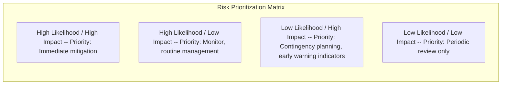
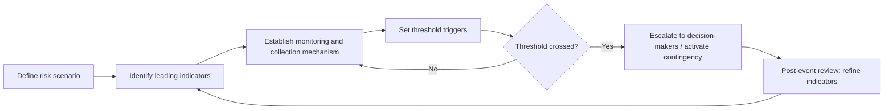

## Risk Assessment and Uncertainty Management

### Definition and Scope

Risk assessment and uncertainty management is the systematic discipline of identifying, characterizing, evaluating, and responding to threats and unknowns that could affect diplomatic objectives, negotiations, or national interests. It encompasses both **risk** (situations where possible outcomes and their probabilities can be reasonably estimated) and **uncertainty** (situations where outcomes, probabilities, or even the full range of possibilities cannot be reliably specified) — a distinction with significant implications for which analytical tools are appropriate.

### The Risk-Uncertainty Distinction

**Key Points**

- **Risk** (Knightian risk): measurable probability distributions can be assigned to known possible outcomes (e.g., historical base rates of treaty non-compliance).
- **Uncertainty** (Knightian uncertainty): probabilities cannot be reliably estimated, or the full set of possible outcomes is not even known in advance (e.g., the emergence of a wholly novel geopolitical actor or technology).
- **Ambiguity**: outcomes and probabilities may be estimable in principle, but conflicting or incomplete information makes any single estimate highly contestable.
- Treating genuine uncertainty as if it were measurable risk (false precision) is a common and consequential analytical error in strategic assessment.

$$\text{Risk} = \text{Probability} \times \text{Impact}, \quad \text{whereas Uncertainty resists this quantification}$$

### Core Components of Risk Assessment

#### 1. Risk Identification

Systematic scanning for potential threats, vulnerabilities, and disruptive events across relevant domains — commonly structured using frameworks such as PESTLE (Political, Economic, Social, Technological, Legal, Environmental) or domain-specific checklists for diplomatic contexts (alliance stability, domestic political risk in counterpart states, economic interdependency exposure, escalation pathways).

#### 2. Risk Characterization

For each identified risk, analysts typically assess:

- **Likelihood**: probability or qualitative likelihood band of occurrence within the relevant time horizon.
- **Impact/severity**: magnitude of consequence if the risk materializes, often assessed across multiple dimensions (strategic, economic, reputational, humanitarian).
- **Velocity**: how quickly the risk could materialize and how much warning time is realistically available.
- **Interconnectedness**: whether the risk could trigger or compound with other risks (cascading or systemic risk).

#### 3. Risk Prioritization

A **risk matrix** (likelihood × impact grid) is the most common tool for visually prioritizing risks and allocating limited analytical and policy attention to the highest-priority combinations.

#### 4. Risk Response Strategies

| Strategy | Description | Diplomatic Example |
| --- | --- | --- |
| Avoid | Eliminate exposure to the risk source entirely | Declining to enter a negotiation with unacceptable exposure |
| Mitigate | Reduce likelihood or impact through action | Building redundant communication channels ahead of a crisis |
| Transfer | Shift risk burden to another party or mechanism | Third-party guarantees, insurance-like multilateral mechanisms |
| Accept | Consciously bear the risk, typically when mitigation cost exceeds benefit | Accepting minor reputational risk to preserve a larger strategic gain |
| Exploit (for opportunities) | Actively pursue favorable uncertain outcomes | Positioning early in an emerging multilateral framework |

### Structured Analytic Techniques for Uncertainty

Because much of diplomatic risk involves genuine uncertainty rather than measurable probability, intelligence and foreign policy analysis communities have developed structured analytic techniques designed to counteract cognitive bias and improve judgment quality under ambiguity, rather than relying on informal intuition alone.

#### Analysis of Competing Hypotheses (ACH)

A technique requiring analysts to explicitly list all plausible hypotheses explaining available evidence, then systematically evaluate each piece of evidence against every hypothesis (rather than seeking evidence to confirm a single preferred hypothesis), disconfirming rather than confirming hypotheses wherever possible. This directly counters confirmation bias by forcing comparative evaluation.

#### Red Teaming

Assigning a designated team or individual to argue against the prevailing assessment, adopt an adversarial perspective, or actively search for disconfirming evidence — institutionalizing dissent to counteract groupthink and premature consensus, particularly valuable in hierarchical diplomatic institutions where junior dissent may otherwise be suppressed.

#### Key Assumptions Check

Explicitly listing and interrogating the assumptions underlying a given assessment, since flawed or outdated assumptions (rather than flawed logic) are a frequent source of analytical failure — particularly relevant when assessments are inherited or updated incrementally over long periods without re-examining foundational premises.

#### Devil's Advocacy

A structured variant of red teaming in which an individual is formally tasked with challenging a proposed course of action or consensus assessment, distinct from informal dissent in that it is procedurally mandated and therefore carries institutional legitimacy.

#### Pre-Mortem Analysis

Before finalizing a decision, the team imagines that the decision has already failed and works backward to identify plausible causes of failure — a technique shown in decision-science literature to surface risks that forward-looking planning tends to underweight, by legitimizing critical thinking that direct criticism of a plan in progress might otherwise suppress socially.

### Probabilistic Reasoning and Calibration

#### Superforecasting Principles

Research on geopolitical forecasting accuracy (notably the Good Judgment Project) has identified practices associated with superior forecasting performance: using granular probability estimates rather than vague verbal terms, actively seeking disconfirming evidence, decomposing complex questions into tractable sub-questions, and systematically tracking forecast accuracy over time to improve calibration.

#### The Problem with Vague Probability Language

Terms like "likely," "possible," or "unlikely" are interpreted very differently by different readers unless explicitly calibrated to numeric ranges — a documented source of miscommunication in intelligence and policy assessments. Many analytic communities now use standardized probability language conventions (e.g., "almost certain" = 95-99%, "likely" = 55-80%, "unlikely" = 20-45%) to reduce this ambiguity, though exact conventions vary by institution [Unverified — conventions are institution-specific and not universally standardized].

#### Calibration and Overconfidence

Analysts and decision-makers are frequently subject to **overconfidence bias**, in which stated confidence in an assessment exceeds its actual accuracy rate when tracked over time. Structured forecasting practice — recording explicit probability estimates and later scoring them against outcomes — is one of the few reliable methods for improving calibration through feedback.

### Cognitive Biases Affecting Risk Assessment

| Bias | Description | Diplomatic Manifestation |
| --- | --- | --- |
| Confirmation bias | Favoring information that confirms existing beliefs | Interpreting ambiguous counterpart signals as confirming a pre-existing assessment of their intentions |
| Availability heuristic | Overweighting vivid or recent events in probability judgment | Overestimating recurrence risk of a recent crisis while underweighting less memorable but more probable risks |
| Groupthink | Suppression of dissent for the sake of consensus/cohesion | Premature convergence on a shared threat assessment within a delegation |
| Anchoring | Over-reliance on an initial estimate or reference point | Persistent influence of an early, possibly outdated, risk assessment on subsequent judgments |
| Mirror-imaging | Assuming a counterpart reasons and values outcomes the way one's own side does | Misjudging an adversary's risk tolerance or red lines based on one's own strategic culture |
| Base rate neglect | Ignoring statistical base rates in favor of case-specific narrative | Overweighting a compelling but atypical historical analogy |

Mirror-imaging is considered a particularly consequential bias in diplomatic and intelligence risk assessment because it can systematically distort estimates of an adversary's rationality, values, or thresholds for escalation, especially across differing strategic cultures [Inference].

### Managing Deep Uncertainty (Beyond Traditional Risk Tools)

For situations where even structured probability estimation is not credible (deep or radical uncertainty), complementary approaches are often preferred over standard risk-matrix methods:

- **Scenario planning**: exploring multiple divergent plausible futures rather than estimating point probabilities (see Scenario Planning and Futures Analysis).
- **Robust decision-making (RDM)**: selecting strategies that perform acceptably across a very wide range of possible futures rather than optimizing for a single projected outcome, explicitly designed for conditions where probability distributions are not credible.
- **Adaptive/dynamic policy pathways**: designing initial commitments with built-in decision points and flexibility to adjust course as uncertainty resolves over time, rather than committing irreversibly to a single long-term plan upfront.
- **Real options thinking**: treating flexibility itself as having strategic value — preserving the ability to act later as conditions clarify, rather than foreclosing options prematurely for the sake of early decisiveness.

### Early Warning Systems

Structured mechanisms for continuous monitoring of leading indicators associated with escalating risk, enabling earlier intervention than reactive crisis response.

**Example**

An early warning system for potential treaty breakdown might track indicators such as: increased frequency of public criticism by counterpart officials, delayed compliance reporting, reduced working-level diplomatic contact, and shifts in domestic political coalitions within the counterpart state — each weighted and monitored against pre-agreed thresholds that trigger escalated attention.

### Risk Communication to Decision-Makers

Effective risk assessment is only as useful as its communication to those with decision authority. Key practices include:

- **Explicit uncertainty framing**: distinguishing what is known, what is estimated with reasonable confidence, and what is genuinely unknown, rather than presenting all judgments with uniform apparent certainty.
- **Avoiding false precision**: resisting pressure to provide single-point estimates or false specificity when the underlying uncertainty does not support that level of precision.
- **Separating analysis from recommendation**: clearly distinguishing the assessed facts and probabilities from the analyst's policy recommendation, preserving decision-makers' ability to weigh the evidence independently.
- **Timely updating**: communicating material changes to risk assessments promptly rather than waiting for scheduled reporting cycles, particularly for fast-moving situations.

### Common Pitfalls

- **False precision**: assigning specific numeric probabilities to fundamentally uncertain (not merely risky) situations, creating misleading confidence.
- **Single-scenario planning**: preparing for only the most likely outcome rather than maintaining contingencies across a plausible range.
- **Static risk registers**: treating a risk assessment as a one-time deliverable rather than a continuously updated living process.
- **Suppressing dissent**: institutional or hierarchical pressure that discourages analysts from flagging risks that contradict a preferred policy direction.
- **Conflating absence of evidence with evidence of absence**: assuming a risk is low simply because it has not yet been observed, particularly dangerous for low-probability, high-impact ("tail") risks.
- **Neglecting cascading/systemic risk**: assessing risks in isolation without considering how multiple simultaneous or sequential risks could compound.

### Illustrative Risk Assessment Workflow

<svg xmlns="http://www.w3.org/2000/svg" viewBox="0 0 700 280">
<title>Risk Assessment and Uncertainty Management Workflow (svg_diagram)</title>
<rect width="700" height="280" fill="#ffffff" stroke="#cccccc" />
<text x="20" y="28" font-size="15" font-weight="bold" fill="#222222">Risk Assessment Workflow (svg_diagram)</text>
<rect x="30" y="60" width="140" height="55" rx="6" fill="#eaf2f8" stroke="#2874a6" stroke-width="1.5" />
<text x="45" y="92" font-size="11" fill="#2874a6">Identify risks</text>
<rect x="200" y="60" width="140" height="55" rx="6" fill="#eaf2f8" stroke="#2874a6" stroke-width="1.5" />
<text x="210" y="85" font-size="11" fill="#2874a6">Characterize</text>
<text x="210" y="100" font-size="11" fill="#2874a6">(likelihood/impact)</text>
<rect x="370" y="60" width="140" height="55" rx="6" fill="#eaf2f8" stroke="#2874a6" stroke-width="1.5" />
<text x="390" y="92" font-size="11" fill="#2874a6">Prioritize (matrix)</text>
<rect x="540" y="60" width="140" height="55" rx="6" fill="#eaf2f8" stroke="#2874a6" stroke-width="1.5" />
<text x="555" y="85" font-size="11" fill="#2874a6">Select response</text>
<text x="555" y="100" font-size="11" fill="#2874a6">strategy</text>
<line x1="170" y1="88" x2="200" y2="88" stroke="#333333" stroke-width="2" marker-end="url(#arrow3)" />
<line x1="340" y1="88" x2="370" y2="88" stroke="#333333" stroke-width="2" marker-end="url(#arrow3)" />
<line x1="510" y1="88" x2="540" y2="88" stroke="#333333" stroke-width="2" marker-end="url(#arrow3)" />
<rect x="200" y="180" width="300" height="55" rx="6" fill="#fdf2e3" stroke="#d68910" stroke-width="1.5" />
<text x="230" y="205" font-size="11" fill="#d68910">Continuous monitoring via</text>
<text x="230" y="220" font-size="11" fill="#d68910">early warning indicators</text>
<path d="M 610 115 C 610 160, 500 180, 500 200" fill="none" stroke="#7f8c8d" stroke-width="1.5" marker-end="url(#arrow3)" />
<path d="M 200 207 C 150 207, 100 150, 100 115" fill="none" stroke="#7f8c8d" stroke-width="1.5" stroke-dasharray="4" marker-end="url(#arrow3)" />
</svg>

**Related Topics**

- Scenario Planning and Futures Analysis
- Game Theory Fundamentals for Strategic Interaction
- Cognitive Biases in High-Stakes Decision-Making
- Structured Analytic Techniques and Intelligence Analysis
- Crisis Anticipation and Contingency Planning
- Decision-Making Under Deep Uncertainty
- Geopolitical Risk Analysis Frameworks