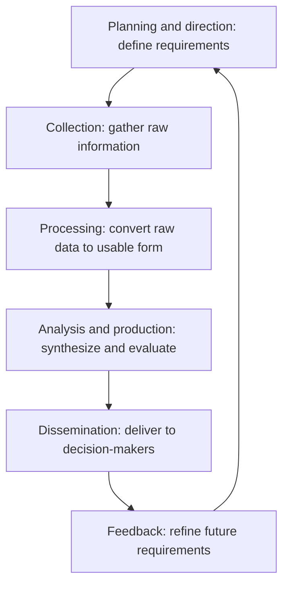
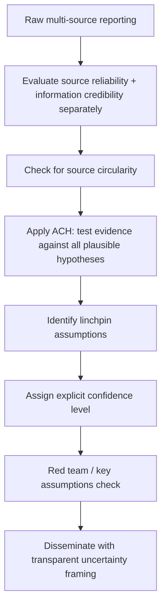

## Intelligence Analysis and Information Synthesis

### Definition and Scope

Intelligence analysis and information synthesis is the disciplined process of collecting, evaluating, integrating, and interpreting raw information from multiple sources to produce actionable, decision-relevant judgments for diplomatic and policy purposes. It transforms fragmented, uncertain, and often contradictory data into coherent assessments while explicitly preserving honest representation of confidence levels and analytical uncertainty. Though rooted in intelligence community practice, its methods are broadly applicable to any diplomatic function requiring synthesis of complex, multi-source information under time pressure.

### The Intelligence Cycle

**Key Points**

The traditional intelligence cycle provides the foundational process architecture underlying most formal analytic production, though real-world practice is typically far more iterative and non-linear than the idealized sequence suggests.

#### 1. Planning and Direction

Defining specific intelligence requirements based on decision-maker needs — a critical stage often under-resourced in practice, since poorly specified requirements cascade into unfocused collection and analysis downstream.

#### 2. Collection

Gathering raw information across multiple disciplines (see Sources of Intelligence below), each with distinct strengths, access limitations, and vulnerability to manipulation.

#### 3. Processing and Exploitation

Converting raw collected material (intercepted communications, imagery, documents) into a form usable by analysts — translation, decryption, image enhancement, data structuring.

#### 4. Analysis and Production

The core synthesis stage: integrating multi-source information, applying structured analytic techniques, evaluating source reliability, and producing a coherent assessment with explicit confidence levels.

#### 5. Dissemination

Delivering finished analysis to decision-makers in a format and timeframe suited to their needs — a stage requiring its own tailored communication discipline (see Risk Communication in the Risk Assessment topic).

#### 6. Feedback

Decision-maker response informing refinement of future collection priorities and analytic focus, closing the loop.

### Sources of Intelligence (INTs)

| Discipline | Description | Key Strengths | Key Limitations |
| --- | --- | --- | --- |
| HUMINT (Human Intelligence) | Information from human sources | Access to intent, context, and closed environments | Reliability variance, deception risk, access constraints |
| SIGINT (Signals Intelligence) | Intercepted communications and electronic signals | High volume, real-time potential | Encryption, volume overload, context stripped from raw signal |
| OSINT (Open-Source Intelligence) | Publicly available information (media, academic, commercial) | Low cost, high volume, low legal/ethical risk | Saturation with noise and deliberate disinformation |
| IMINT/GEOINT (Imagery/Geospatial) | Satellite and aerial imagery, geospatial data | Objective visual verification of physical facts | Limited insight into intent; interpretation-dependent |
| MASINT (Measurement and Signature Intelligence) | Technical sensor data (radar, acoustic, nuclear signatures) | Detects activity other disciplines cannot observe | Highly technical, requires specialized expertise to interpret |
| DIPLINT / Reporting from diplomatic channels | Direct diplomatic engagement and observation | Direct access to official positions and informal signals | Subject to the source's own biases and incentives to shape perception |

**All-source analysis** — integrating multiple INT disciplines rather than relying on any single source — is widely regarded as best practice, since each discipline's blind spots and vulnerabilities differ, and convergence across independent source types materially increases confidence in an assessment.

### Source Evaluation and Reliability

A foundational discipline in intelligence analysis is the systematic, separate evaluation of **source reliability** (the general trustworthiness of the source based on track record) and **information credibility** (the plausibility of this specific piece of reporting), commonly represented using standardized rating scales (e.g., source reliability from "completely reliable" to "unreliable," and information credibility from "confirmed by other sources" to "improbable"). Treating these as two independent dimensions — rather than collapsing them into a single trust judgment — prevents a generally reliable source's occasional bad reporting from being over-credited, and vice versa.

### Analytic Synthesis Techniques

#### Multi-Source Corroboration

Assessing confidence based on the degree of independent corroboration across distinct sources and collection disciplines. A single-source claim, however credible the source, generally warrants lower confidence than a claim corroborated by independent sources with different access and potential biases.

#### Analysis of Competing Hypotheses (ACH)

Explicitly enumerating all plausible explanations for the available evidence and systematically testing each piece of evidence against every hypothesis, rather than selectively marshaling evidence to support a single preferred explanation. This structurally counters confirmation bias in synthesis.

#### Linchpin Analysis

Identifying the key assumptions or "linchpin" judgments on which an entire assessment depends, and explicitly flagging these to decision-makers so that a downstream failure of that specific assumption is well understood as a distinct risk, rather than an assessment collapsing without any acknowledgment of which premise proved wrong.

#### Deception Detection

Systematic assessment of whether adversarial actors may be deliberately shaping the information environment (disinformation, denial, controlled leaks) to manipulate analytic conclusions — particularly critical in OSINT-heavy environments where deliberate disinformation campaigns can be engineered to match analysts' expectations and confirmation biases.

### Confidence Levels and Analytic Rigor

Professional intelligence analysis distinguishes between the **probability** that a judgment is correct and the analyst's **confidence** in that probability estimate, which depends on the quality, quantity, and corroboration of the underlying source base.

$$\text{Confidence Level} = f(\text{source reliability}, \text{corroboration}, \text{analytic tradecraft rigor}, \text{consistency with existing knowledge})$$

Standard practice requires explicitly stating both the substantive judgment ("Country X is likely to...") and the associated confidence level ("...with moderate confidence, based on limited and partially corroborated reporting") rather than presenting all judgments with uniform apparent certainty.

### Structured Analytic Techniques (Applied to Synthesis)

- **Key Assumptions Check**: interrogating the foundational assumptions underlying a synthesized assessment before finalizing it.
- **Quality of Information Check**: systematically reviewing whether key judgments rest on solid sourcing or on weaker, unconfirmed reporting that has simply been repeated across multiple products (a phenomenon known as **source circularity**, where the same original report is mistaken for independent corroboration as it circulates and is re-cited).
- **What-If Analysis**: exploring how an assessment would change under a specified alternative premise, useful for pressure-testing conclusions that rest on a single pivotal assumption.
- **Red Team/Devil's Advocacy**: formally tasking a reviewer to challenge the synthesized conclusion before it is finalized and disseminated.

### Common Analytic Pitfalls (Failure Modes)

| Pitfall | Description |
| --- | --- |
| Source circularity | Mistaking repeated citation of the same original report for independent corroboration |
| Confirmation bias | Selectively weighting evidence that supports a pre-existing assessment |
| Mirror-imaging | Assuming an adversary's decision-making follows the analyst's own cultural or strategic logic |
| Premature closure | Settling on a conclusion before adequately exploring alternative hypotheses |
| Layering | Building successive analytic judgments atop earlier uncertain judgments without revisiting the foundational uncertainty, producing false compounding confidence |
| Politicization pressure | Analytic conclusions consciously or unconsciously shaped to align with a preferred policy outcome |
| Signal-to-noise degradation | High-volume collection (especially OSINT/SIGINT) overwhelming analytic capacity to distinguish relevant signal from irrelevant volume |

**Example**

A historically cited intelligence failure pattern involves early, uncertain single-source reporting being repeated across multiple subsequent products without re-verification; because the claim appears in several independently authored reports, it can be mistakenly perceived as multiply-corroborated when it in fact traces back to one original, unconfirmed source — illustrating why tracing sourcing lineage is a critical analytic discipline rather than a bureaucratic formality.

### Synthesis for Policy Audiences

Effective intelligence synthesis must bridge the gap between the complexity of raw analytic material and the decision-relevant clarity policymakers require, without sacrificing honest uncertainty representation:

- **Bottom-line-up-front (BLUF) structure**: leading with the key judgment before supporting detail, respecting policymakers' time constraints while still providing the analytic basis for those who need it.
- **Explicit uncertainty language**: using calibrated probability terms rather than vague qualifiers (see Risk Assessment and Uncertainty Management for standardized probability conventions).
- **Separating analysis from policy recommendation**: preserving the distinction between "what we assess is happening/likely to happen" and "what we recommend doing about it," so decision-makers can weigh the evidence independently of any embedded policy preference.
- **Visual and structured presentation**: using matrices, timelines, and network diagrams to convey complex multi-source synthesis more efficiently than dense prose alone.

### The Role of Open-Source Intelligence (OSINT) in Contemporary Practice

The volume and accessibility of open-source material (social media, satellite imagery marketplaces, commercially available data, academic and think-tank publications) has substantially expanded in recent years, shifting practice toward greater integration of OSINT alongside traditional classified disciplines. This creates both opportunity (lower-cost, rapidly updatable synthesis, crowd-verification of claims) and risk (higher exposure to deliberate disinformation and the sheer volume challenge of separating signal from noise). The optimal balance between OSINT and traditional sources continues to be an active area of institutional practice and debate rather than a settled methodology [Unverified].

### Common Pitfalls in Practice

- **Analysis-collection disconnect**: collection priorities poorly aligned with actual decision-maker requirements, producing large volumes of irrelevant material.
- **Overreliance on a single INT discipline**: failing to seek corroboration across independent source types.
- **Confidence-probability conflation**: presenting a low-confidence judgment with the same rhetorical certainty as a high-confidence one.
- **Ignoring denial and deception**: failing to consider that adversarial actors may be actively shaping the information environment analysts rely on.
- **Institutional politicization pressure**: allowing anticipated policy preferences to shape analytic conclusions, consciously or unconsciously.
- **Neglecting dissemination timing**: producing technically excellent analysis that arrives too late to inform the relevant decision window.

**Related Topics**

- Risk Assessment and Uncertainty Management
- Scenario Planning and Futures Analysis
- Cognitive Biases in High-Stakes Decision-Making
- Structured Analytic Techniques and Red Teaming
- Disinformation and Information Warfare
- Crisis Anticipation and Early Warning Systems
- Open-Source Intelligence (OSINT) Methodology