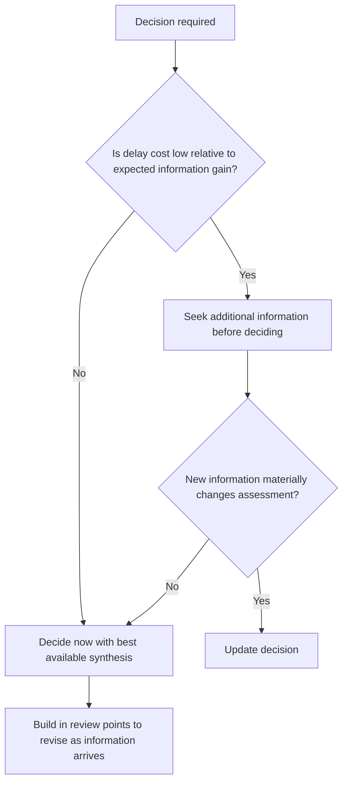

## Decision-Making Under Incomplete Information

### Definition and Scope

Decision-making under incomplete information refers to the structured processes and cognitive disciplines diplomats and policymakers use to reach sound judgments and commit to action when critical facts, counterpart intentions, or future consequences cannot be fully known at the time a decision must be made. This condition is the diplomatic norm rather than the exception, distinguishing high-stakes strategic decision-making from domains where complete information can realistically be obtained before acting.

### Distinguishing Types of Informational Deficiency

**Key Points**

- **Incomplete information**: some relevant facts are simply unavailable or unknown at decision time, though they may in principle be knowable.
- **Asymmetric information**: information exists but is distributed unevenly between parties, with a counterpart possessing knowledge a decision-maker lacks (and vice versa).
- **Ambiguous information**: available information admits multiple plausible interpretations, none clearly dominant.
- **Uncertainty (Knightian)**: not merely missing facts but genuinely unknowable probabilities or outcome sets, distinct from measurable risk (see Risk Assessment and Uncertainty Management).
- Different deficiency types call for different decision strategies; treating all informational gaps identically is itself a common source of error.

### The Cost of Waiting vs. the Cost of Acting Prematurely

A foundational tension in decision-making under incomplete information is balancing the **value of additional information** (reduced error probability, better-calibrated action) against the **cost of delay** (lost opportunity, adversary first-mover advantage, deteriorating conditions, decision windows closing).

$$\text{Expected Value of Waiting} = \text{Value of Information Gained} - \text{Cost of Delay}$$

This is a conceptual framing rather than a precisely calculable formula in most real diplomatic situations, since both terms are themselves estimated under uncertainty [Inference].

### Core Decision Frameworks

#### Expected Value and Expected Utility

A classical decision-theoretic approach: for each option, multiply the estimated probability of each possible outcome by its value (or utility) and sum across outcomes, selecting the option with the highest expected value. This requires genuine probability estimates, making it best suited to situations of measurable risk rather than deep uncertainty, where credible probabilities cannot be assigned.

$$EU(A) = \sum_{i} P(O_i \mid A) \cdot U(O_i)$$

#### Minimax and Maximin Strategies

Used when probabilities cannot be credibly estimated (genuine uncertainty rather than measurable risk):

- **Maximin**: choose the option whose *worst-case* outcome is the best among all options' worst cases — a risk-averse strategy prioritizing downside protection.
- **Minimax regret**: choose the option that minimizes the maximum possible *regret* (the gap between the chosen option's outcome and the best outcome that could have been achieved with perfect foresight) across all possible future states — useful when the decision-maker wants to avoid being catastrophically wrong in hindsight, even if it means forgoing the highest possible upside.

**Example**

A state deciding whether to commit resources to a contested diplomatic initiative with uncertain success odds might apply minimax regret: comparing the regret of committing and having the initiative fail versus the regret of not committing and later observing it would have succeeded, selecting the path that limits the worst plausible regret rather than optimizing for a single probability-weighted expectation it cannot confidently compute.

#### Satisficing

Rather than seeking the theoretically optimal decision (which may be unattainable or prohibitively costly to identify under incomplete information), satisficing selects the first option that meets a pre-defined acceptability threshold. This reflects the recognition, associated with bounded rationality research, that real decision-makers operate under cognitive and time constraints that make exhaustive optimization impractical in most live diplomatic situations.

#### Robust Decision-Making (RDM)

Rather than optimizing against a single projected future, RDM stress-tests candidate strategies against a wide range of plausible futures and selects the option that performs adequately across the broadest range, explicitly designed for conditions where probability distributions over future states are not credible (see also Scenario Planning and Futures Analysis).

### Bayesian Updating Under Incomplete Information

A structured approach to revising beliefs incrementally as new, partial information arrives, rather than either ignoring new information or over-reacting to each new data point in isolation.

$$P(H \mid E) = \frac{P(E \mid H) \cdot P(H)}{P(E)}$$

In practice, diplomatic analysts rarely perform formal Bayesian calculation, but the underlying discipline — starting from a prior assessment, weighing new evidence by how diagnostic it is (how much more likely it would be under one hypothesis than alternatives), and updating proportionally rather than all-or-nothing — is widely used as a structured heuristic for incremental judgment revision.

**Example**

A diplomat holds a moderate prior belief that a counterpart government intends to honor a prior commitment. A new intelligence report of internal dissent within the counterpart's cabinet is only weakly diagnostic (such dissent is common regardless of ultimate intent) and should shift the assessment only modestly, whereas a credible report of formal cabinet-level reversal would be strongly diagnostic and warrant substantial updating.

### Heuristics for Practical Decision-Making

#### Satisficing Thresholds and "Good Enough" Criteria

Establishing in advance what level of information and confidence is "good enough" to act, preventing both premature action on inadequate information and paralysis from pursuing unattainable certainty.

#### Pre-Commitment to Decision Triggers

Defining specific, observable conditions in advance that will trigger a decision, reducing the risk of ad hoc rationalization or excessive delay once those conditions are met — closely related to the early warning indicator methodology used in risk management and scenario planning.

#### Reversibility Assessment

Distinguishing between decisions that are largely reversible (where acting on incomplete information carries lower risk, since course correction remains possible) and those that are largely irreversible (where the bar for acting under incomplete information should be substantially higher, and additional information-gathering or hedging is more strongly warranted).

| Decision Type | Appropriate Posture Under Incomplete Information |
| --- | --- |
| Reversible, low-stakes | Act promptly on reasonable information; adjust as needed |
| Reversible, high-stakes | Act with contingency plans and close monitoring |
| Irreversible, low-stakes | Moderate information-gathering; act once basic threshold met |
| Irreversible, high-stakes | Maximum feasible information-gathering; consider phased/staged commitment to preserve partial reversibility |

#### Staged or Phased Commitment

Where a fully irreversible decision is not immediately necessary, structuring commitment in incremental stages (each contingent on confirming key assumptions) preserves optionality and allows incorporation of new information before full commitment — directly related to real options thinking in risk management.

### Cognitive Biases That Distort Decision-Making Under Incomplete Information

| Bias | Effect |
| --- | --- |
| Overconfidence | Underestimating the true degree of uncertainty in one's own assessment |
| Ambiguity aversion | Irrationally avoiding options with unknown probabilities even when expected value may favor them, in favor of options with clearer (but possibly worse) known probabilities |
| Premature closure | Committing to a judgment before adequately exploring available information or alternative hypotheses |
| Analysis paralysis | Excessive information-seeking that delays necessary decisions past the point of diminishing returns |
| Sunk cost fallacy | Continuing a course of action because of prior investment rather than current expected value |
| Status quo bias | Systematic preference for inaction or existing commitments, independent of their actual merit under current information |

Ambiguity aversion in particular has been extensively documented in behavioral decision research (associated with the Ellsberg paradox) and is relevant to diplomacy because negotiators may irrationally prefer known, worse terms over ambiguous, potentially better ones purely because the ambiguous option's probabilities cannot be specified [Inference — degree of effect varies by individual and context].

### Structured Techniques for Group Decision-Making Under Incomplete Information

- **Delphi method**: iterative anonymous expert elicitation with feedback rounds, used to aggregate judgment under uncertainty while reducing status-driven distortion (see Scenario Planning topic for full description).
- **Devil's advocacy / red teaming**: formally assigned dissent to stress-test a converging consensus before commitment.
- **Structured brainstorming with independent initial input**: collecting individual judgments before group discussion to avoid anchoring on the first-stated opinion or senior voice in the room.
- **Explicit confidence polling**: having each participant independently state a probability or confidence level before group discussion, surfacing the actual range of views rather than allowing premature apparent consensus.

### The Role of Time Pressure

Diplomatic crises frequently compress the available decision window, intensifying the tension between information-gathering and timely action. Structured crisis decision protocols typically pre-establish:

- **Minimum viable information thresholds** for different categories of decisions, agreed upon before a crisis occurs.
- **Delegated decision authority** at appropriate levels to avoid bottlenecking urgent decisions through slow-moving approval chains.
- **Pre-scripted decision trees** for anticipated crisis scenarios (see Scenario Planning), reducing the cognitive load of constructing a novel decision process under acute time pressure.

### Common Pitfalls

- **False certainty framing**: presenting or acting on judgments with more confidence than the underlying information supports.
- **Paralysis by analysis**: continuing to seek information past the point where further delay costs exceed the marginal value of additional certainty.
- **Ignoring reversibility**: applying the same decision threshold to reversible and irreversible decisions, over- or under-investing in information-gathering accordingly.
- **Anchoring on the first available frame**: allowing an early, possibly incomplete interpretation of a situation to unduly shape all subsequent updating.
- **Neglecting to pre-define decision triggers**: leading to ad hoc, inconsistent decision-making as a crisis unfolds rather than principled, pre-committed responses.
- **Groupthink under pressure**: time-constrained group decisions are particularly vulnerable to premature consensus, making structured dissent mechanisms especially valuable precisely when they are hardest to implement.

### Illustrative Decision Process Under Incomplete Information

<svg xmlns="http://www.w3.org/2000/svg" viewBox="0 0 700 300">
<title>Decision-Making Process Under Incomplete Information (svg_diagram)</title>
<rect width="700" height="300" fill="#ffffff" stroke="#cccccc" />
<text x="20" y="28" font-size="15" font-weight="bold" fill="#222222">Decision Process Under Incomplete Information (svg_diagram)</text>
<rect x="30" y="60" width="150" height="50" rx="6" fill="#eaf2f8" stroke="#2874a6" stroke-width="1.5" />
<text x="45" y="90" font-size="10" fill="#2874a6">Assess reversibility</text>
<rect x="220" y="60" width="150" height="50" rx="6" fill="#eaf2f8" stroke="#2874a6" stroke-width="1.5" />
<text x="235" y="82" font-size="10" fill="#2874a6">Set satisficing</text>
<text x="235" y="97" font-size="10" fill="#2874a6">threshold</text>
<rect x="410" y="60" width="150" height="50" rx="6" fill="#eaf2f8" stroke="#2874a6" stroke-width="1.5" />
<text x="425" y="82" font-size="10" fill="#2874a6">Gather info until</text>
<text x="425" y="97" font-size="10" fill="#2874a6">threshold or deadline</text>
<line x1="180" y1="85" x2="220" y2="85" stroke="#333333" stroke-width="2" marker-end="url(#arrow4)" />
<line x1="370" y1="85" x2="410" y2="85" stroke="#333333" stroke-width="2" marker-end="url(#arrow4)" />
<rect x="220" y="180" width="260" height="50" rx="6" fill="#fdf2e3" stroke="#d68910" stroke-width="1.5" />
<text x="240" y="202" font-size="10" fill="#d68910">Decide; if reversible, stage</text>
<text x="240" y="217" font-size="10" fill="#d68910">commitment and monitor</text>
<path d="M 485 110 C 485 145, 350 165, 350 180" fill="none" stroke="#333333" stroke-width="2" marker-end="url(#arrow4)" />
<path d="M 220 205 C 150 205, 100 150, 100 110" fill="none" stroke="#7f8c8d" stroke-width="1.5" stroke-dasharray="4" marker-end="url(#arrow4)" />
<text x="90" y="145" font-size="9" fill="#7f8c8d">Revise as new</text>
<text x="90" y="158" font-size="9" fill="#7f8c8d">info arrives</text>
</svg>

**Related Topics**

- Risk Assessment and Uncertainty Management
- Intelligence Analysis and Information Synthesis
- Game Theory Fundamentals for Strategic Interaction
- Scenario Planning and Futures Analysis
- Cognitive Biases in High-Stakes Decision-Making
- Crisis Decision-Making Protocols
- Bounded Rationality and Behavioral Decision Theory