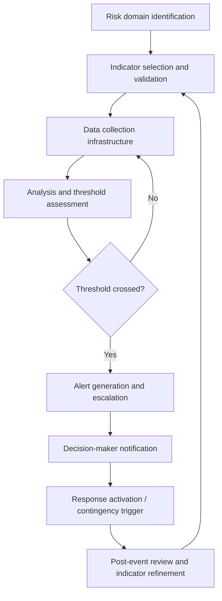

## Anticipatory Governance and Early-Warning Systems

### Definition and Scope

Anticipatory governance is an institutional and policy approach that systematically builds foresight, adaptive capacity, and proactive response mechanisms into governmental and diplomatic decision-making structures, aiming to shift institutions from reactive crisis management toward sustained anticipation of emerging risks and opportunities. Early-warning systems are the operational infrastructure — analytical, technical, and organizational — that detect and signal emerging threats with sufficient lead time to enable meaningful preventive or mitigating action. Together, they represent the institutionalization of foresight practice (scenario planning, risk assessment, intelligence synthesis) into standing governance architecture rather than ad hoc exercises.

### Why Anticipatory Governance Matters in Diplomacy

**Key Points**

- Traditional bureaucratic and diplomatic institutions are structurally biased toward reactive response, since resources, political attention, and organizational incentives typically concentrate around visible, already-materialized crises rather than prevention of unrealized ones.
- Prevention is frequently more cost-effective than crisis response, but the political and institutional rewards for successful prevention are diffuse and often invisible (a crisis that did not happen generates no headline), creating a structural incentive misalignment that anticipatory governance seeks to correct.
- Complex, interconnected global risks (climate-security nexus, pandemic-economic cascades, hybrid/cyber threats) increasingly cross traditional institutional silos, requiring anticipatory structures explicitly designed for cross-domain coordination.

### Core Principles of Anticipatory Governance

#### 1. Institutionalized Foresight

Embedding scenario planning, horizon scanning, and risk assessment as standing organizational functions with dedicated staff, budget, and reporting lines to leadership — rather than treating foresight as an occasional consulting exercise disconnected from operational decision-making.

#### 2. Cross-Domain Integration

Structuring anticipatory functions to explicitly bridge traditionally siloed domains (security, economic, environmental, health, technological), since many contemporary risks originate at domain intersections that single-mandate institutions are poorly positioned to detect.

#### 3. Adaptive Policy Design

Designing policies with built-in flexibility, review triggers, and adjustment mechanisms rather than fixed, one-time commitments — allowing institutions to respond to emerging information without requiring a full policy redesign process each time conditions shift (connects to adaptive policy pathways discussed in Decision-Making Under Incomplete Information).

#### 4. Distributed Sensing and Participatory Foresight

Drawing on diverse information sources — including frontline diplomatic staff, civil society networks, academic expertise, and affected communities — rather than relying solely on centralized analytic units, on the premise that early signals of emerging risk are often first visible at the periphery of an institution rather than its center.

#### 5. Institutional Incentive Realignment

Deliberately building recognition and accountability mechanisms for successful anticipation and prevention, counteracting the natural bias toward rewarding visible crisis response over invisible crisis avoidance.

### Early-Warning System Architecture

#### 1. Risk Domain Identification and Scoping

Determining which categories of risk the system is designed to detect (armed conflict onset, economic crisis, mass displacement, disease outbreak, institutional breakdown), since indicator selection and data infrastructure differ substantially by domain.

#### 2. Indicator Selection

Identifying observable, measurable variables with demonstrated or theoretically grounded predictive relationships to the risk of concern. Effective indicators typically balance:

- **Validity**: genuine relationship to the underlying risk, not merely correlation with unrelated factors.
- **Timeliness**: sufficient lead time before the risk materializes to enable meaningful response.
- **Measurability**: consistent, reliable data collection feasible across the relevant geography and time horizon.
- **Sensitivity vs. specificity trade-off**: indicators set to trigger too easily generate false alarms and alert fatigue; indicators set too conservatively risk missing genuine emerging crises.

#### 3. Data Collection and Fusion

Integrating data from multiple sources — structured reporting, open-source and social media monitoring, remote sensing, field-based observation networks, economic and demographic statistics — into a common analytical framework, often requiring significant technical infrastructure for data standardization and fusion across heterogeneous source types.

#### 4. Threshold-Setting and Alert Logic

Establishing pre-agreed trigger points at which indicator movement generates escalating levels of alert, ideally calibrated using historical case comparison and, where available, statistical or machine-learning-assisted pattern recognition, while retaining human analytic judgment in the loop given the high cost of both false positives and false negatives in this domain.

#### 5. Alert Dissemination and Response Linkage

An early-warning system's value depends entirely on whether alerts reach decision-makers with sufficient clarity and authority to prompt action — a persistent structural weakness across many historical early-warning efforts is the "early warning, late response" gap, where accurate warnings were generated but did not translate into timely preventive action due to political, bureaucratic, or resource constraints.

### The Early Warning–Early Response Gap

**Key Points**

A well-documented pattern across conflict prevention and crisis anticipation literature is that technical early-warning capability has historically outpaced institutional early-response capacity — warnings are generated but not acted upon in time, due to:

- Political reluctance to act on a risk that has not yet fully materialized (absence of a visible crisis to justify costly preventive action).
- Diffusion of responsibility across multiple institutions or jurisdictions, none of which has clear mandate or resources to act unilaterally.
- Resource pre-commitment to existing crises, leaving limited capacity for emerging ones.
- Institutional risk-aversion toward acting on probabilistic warnings that may not materialize, given the reputational cost of visible "wasted" preventive action versus the invisible cost of inaction.

This gap is considered by much of the conflict-prevention and foresight literature to be a more significant bottleneck than the technical accuracy of warning systems themselves, though the relative weighting of this claim varies across specific case studies and institutional contexts [Inference].

### Institutional Models for Anticipatory Governance

| Model | Description | Example Domain |
| --- | --- | --- |
| Dedicated foresight units | Standing offices within a ministry or international body tasked with horizon scanning and scenario development | National foreign ministries, UN system foresight functions |
| Cross-agency fusion centers | Structures explicitly designed to integrate information and analysis across traditionally separate agencies | Counter-terrorism and hybrid-threat coordination bodies |
| Independent early-warning networks | Semi-autonomous monitoring bodies, sometimes involving civil society or academic partners, providing warnings somewhat insulated from immediate political pressure | Conflict early-warning networks, epidemic intelligence networks |
| Multilateral/international monitoring mechanisms | Treaty-based or institutionally mandated monitoring with reporting obligations to a broader membership | Arms control verification regimes, international health regulations reporting |

### Applying Anticipatory Governance to Specific Risk Domains

#### Conflict Prevention

Structured conflict early-warning systems typically track indicators such as: political exclusion of minority groups, hate speech proliferation, security force defections or unusual movements, economic shock indicators, and historical analog pattern-matching against prior conflict onsets in comparable contexts.

#### Economic and Financial Risk

Early-warning indicators for economic crisis commonly include currency reserve depletion rates, sovereign debt sustainability metrics, capital flight indicators, and banking sector stress indicators, often modeled using composite early-warning indices developed in economic crisis literature.

#### Public Health

Epidemic intelligence systems combine syndromic surveillance, laboratory reporting networks, and increasingly, digital and social-media-based signal detection to identify outbreak clusters before formal case confirmation, illustrating the value of combining traditional and non-traditional (open-source) indicator streams.

#### Climate-Security Nexus

An increasingly prominent anticipatory governance domain examining how climate-driven resource stress, displacement, and agricultural disruption interact with existing political and social fault lines to elevate conflict risk — a paradigmatic case of cross-domain risk requiring integration across environmental, economic, and security analytic communities that traditional single-mandate institutions struggle to bridge effectively.

### Technology and Anticipatory Governance

Advances in data availability and analytical tooling — satellite imagery analysis, natural language processing of open-source reporting, machine-learning-assisted pattern detection across large historical datasets — have expanded the technical capacity of early-warning systems in recent years. However, these tools generally augment rather than replace analytic judgment, given persistent challenges around data quality, algorithmic bias in training data (particularly for underrepresented regions and languages), and the risk of false confidence in automated pattern detection applied to genuinely novel situations that differ structurally from historical training data [Inference].

### Common Pitfalls

- **Warning without response infrastructure**: building sophisticated detection capability without corresponding institutional mechanisms and political will to act on warnings generated.
- **Indicator overfitting to past crises**: calibrating indicators too closely to the specific pattern of the last crisis, reducing sensitivity to genuinely novel risk pathways.
- **Alert fatigue**: excessive false positives eroding decision-maker trust in and responsiveness to the warning system over time.
- **Siloed foresight**: maintaining separate, uncoordinated early-warning functions across security, economic, health, and environmental domains, missing cross-domain risk interactions.
- **Politicization of warnings**: warnings being suppressed, delayed, or distorted due to political sensitivity, particularly when the warning implicates a state's own policies or a politically sensitive counterpart relationship.
- **Insufficient local/field-level integration**: centralized systems that underweight frontline and community-level signals, which are often the earliest available indicators of emerging instability.

### Illustrative Early Warning to Response Pipeline

<svg xmlns="http://www.w3.org/2000/svg" viewBox="0 0 700 260">
<title>Early Warning to Response Pipeline (svg_diagram)</title>
<rect width="700" height="260" fill="#ffffff" stroke="#cccccc" />
<text x="20" y="28" font-size="15" font-weight="bold" fill="#222222">Early Warning to Response Pipeline (svg_diagram)</text>
<rect x="20" y="70" width="130" height="50" rx="6" fill="#eaf2f8" stroke="#2874a6" stroke-width="1.5" />
<text x="35" y="100" font-size="10" fill="#2874a6">Indicator monitoring</text>
<rect x="190" y="70" width="130" height="50" rx="6" fill="#eaf2f8" stroke="#2874a6" stroke-width="1.5" />
<text x="205" y="100" font-size="10" fill="#2874a6">Threshold alert</text>
<rect x="360" y="70" width="130" height="50" rx="6" fill="#fdf2e3" stroke="#d68910" stroke-width="1.5" />
<text x="375" y="92" font-size="10" fill="#d68910">Decision-maker</text>
<text x="375" y="107" font-size="10" fill="#d68910">notification</text>
<rect x="530" y="70" width="150" height="50" rx="6" fill="#fdecea" stroke="#c0392b" stroke-width="1.5" />
<text x="545" y="92" font-size="10" fill="#c0392b">Response gap risk:</text>
<text x="545" y="107" font-size="10" fill="#c0392b">political/resource barriers</text>
<line x1="150" y1="95" x2="190" y2="95" stroke="#333333" stroke-width="2" marker-end="url(#arrow5)" />
<line x1="320" y1="95" x2="360" y2="95" stroke="#333333" stroke-width="2" marker-end="url(#arrow5)" />
<line x1="490" y1="95" x2="530" y2="95" stroke="#333333" stroke-width="2" marker-end="url(#arrow5)" />
<rect x="230" y="180" width="240" height="45" rx="6" fill="#eafaf1" stroke="#1e8449" stroke-width="1.5" />
<text x="245" y="207" font-size="10" fill="#1e8449">Preventive action (goal outcome)</text>
<path d="M 605 120 C 605 160, 470 180, 470 190" fill="none" stroke="#7f8c8d" stroke-width="1.5" stroke-dasharray="4" marker-end="url(#arrow5)" />
<text x="500" y="160" font-size="9" fill="#7f8c8d">Requires closing the gap</text>
</svg>

### Practical Recommendations for Diplomatic Practitioners

- **Advocate for dedicated foresight capacity** within one's own institution rather than relying solely on ad hoc analysis during active crises.
- **Build relationships with frontline and field-level information sources** before a crisis emerges, since these networks take time to establish and are difficult to construct reactively.
- **Pre-negotiate response authority and resource triggers** tied to specific warning thresholds, addressing the early warning–response gap structurally rather than relying on real-time political will alone.
- **Integrate cross-domain expertise** (economic, environmental, security) into standing foresight processes rather than convening it only after a crisis has already crossed domain boundaries.
- **Institutionalize post-event review** of both warning accuracy and response adequacy, feeding lessons back into indicator refinement.

**Related Topics**

- Scenario Planning and Futures Analysis
- Risk Assessment and Uncertainty Management
- Intelligence Analysis and Information Synthesis
- Crisis Anticipation and Contingency Planning
- Conflict Prevention and Peacebuilding Frameworks
- Climate-Security Nexus and Environmental Diplomacy
- Institutional Design for Cross-Domain Coordination