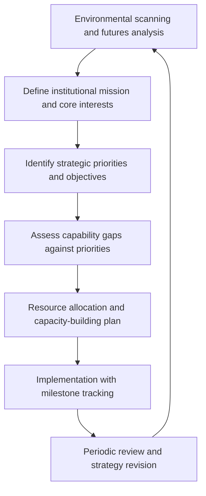

## Long-Range Strategic Planning for Diplomatic Institutions

### Definition and Scope

Long-range strategic planning for diplomatic institutions is the structured process by which foreign ministries, embassies, multilateral bodies, and other diplomatic organizations define multi-year objectives, allocate resources, and build institutional capacity in alignment with anticipated shifts in the global strategic environment. Unlike operational or crisis planning, which addresses immediate demands, long-range strategic planning typically spans three to twenty-year horizons and must reconcile the tension between institutional continuity and adaptive responsiveness to a changing geopolitical landscape.

### Why Long-Range Planning Is Distinctively Difficult in Diplomatic Institutions

**Key Points**

- Diplomatic institutions operate within political cycles (elections, leadership transitions) that frequently span far shorter timeframes than the strategic horizons being planned for, creating a structural mismatch between planning ambition and institutional continuity.
- Budgetary and staffing cycles in many foreign ministries are annual or biennial, complicating multi-year resource commitment to long-range priorities.
- Diplomatic institutions must plan for a strategic environment shaped by other sovereign actors' decisions, which cannot be controlled and are often only partially predictable — unlike corporate strategic planning, which operates within a market the firm can influence but not fully control, diplomatic planning contends with additional layers of sovereign unpredictability and reciprocal strategic behavior.
- Legacy institutional structures, regional bureau divisions, and career incentive systems built for a prior strategic era can create substantial inertia against reorganization around emerging priorities.

### Core Components of the Strategic Planning Process

#### 1. Environmental Scanning and Futures Analysis

Systematic assessment of long-term geopolitical, economic, technological, demographic, and environmental trends likely to shape the institution's operating environment — drawing directly on scenario planning and horizon-scanning methodologies (see Scenario Planning and Futures Analysis) rather than treating strategic planning and foresight as separate disciplines.

#### 2. Mission and Core Interest Definition

Articulating the enduring national or organizational interests that should remain relatively stable across the planning horizon, distinguished from the specific policies and initiatives that will necessarily evolve as circumstances change — a foundational distinction that allows institutions to maintain strategic coherence while remaining tactically adaptive.

#### 3. Strategic Priority Setting

Translating broad interests into a finite, prioritized set of strategic objectives, since resource constraints make comprehensive engagement across all possible priorities infeasible. Effective prioritization requires explicit trade-off decisions rather than aspirational lists that implicitly assume unconstrained resources.

#### 4. Capability Gap Assessment

Systematically comparing current institutional capabilities (personnel expertise, language capacity, regional presence, technological infrastructure, relationship networks) against what the strategic priorities will require, identifying where investment or restructuring is needed.

#### 5. Resource Allocation and Capacity-Building

Translating strategic priorities into concrete budgetary, staffing, training, and infrastructure decisions — the stage at which strategic plans most commonly fail to translate into institutional reality if not tightly linked to actual resource authority.

#### 6. Implementation and Milestone Tracking

Establishing measurable interim milestones and accountability mechanisms to track progress against long-range objectives, since multi-year horizons without interim checkpoints tend to lose institutional momentum and accountability.

#### 7. Periodic Review and Adaptive Revision

Building formal review cycles into the strategic plan itself, allowing revision as the environmental scanning process identifies material shifts — connecting long-range planning to the adaptive policy design principles discussed under Anticipatory Governance.

### Strategic Planning Frameworks Adapted from Other Sectors

#### SWOT Analysis (Strengths, Weaknesses, Opportunities, Threats)

A widely used structuring framework for assessing an institution's internal capabilities against external environmental factors, providing an accessible entry point for strategic prioritization discussions, though its simplicity can encourage superficial analysis if not paired with more rigorous environmental scanning.

#### Balanced Scorecard Approaches

Adapted from corporate strategic management, balanced scorecard methodologies track performance across multiple dimensions (not solely budgetary or headline diplomatic outcomes, but also institutional capability development, relationship network strength, and internal process effectiveness) — useful for diplomatic institutions because diplomatic success is often poorly captured by any single quantitative metric.

#### Portfolio Approaches to Strategic Engagement

Treating diplomatic engagement priorities analogously to an investment portfolio — diversifying across regions, issue areas, and engagement types to manage risk, rather than concentrating institutional capacity narrowly on a small set of priorities that may prove less relevant as circumstances shift. This connects to robust decision-making principles discussed in Risk Assessment and Uncertainty Management.

### Balancing Continuity and Adaptability

A central design tension in long-range diplomatic strategic planning is preserving sufficient institutional continuity (relationship capital, accumulated expertise, credibility of long-term commitments) while remaining adaptable to a changing strategic environment.

| Approach | Characteristics | Trade-off |
| --- | --- | --- |
| Fixed long-range plan | High predictability and commitment credibility | Risk of obsolescence if environment shifts materially |
| Rolling/adaptive plan | Regularly revised based on updated scanning | Risk of perceived unreliability if revised too frequently |
| Core-periphery structure | Stable core priorities with flexible peripheral initiatives | Requires clear, disciplined distinction between the two categories |

**Example**

A foreign ministry might maintain a stable multi-decade core priority (e.g., alliance relationship management in a specific region) while structuring adjacent initiatives (technology governance engagement, climate diplomacy positioning) as more adaptive, periodically revised components of the same overall strategy — preserving credibility on enduring commitments while remaining responsive on emerging issue areas.

### Institutional Capacity-Building for Long-Range Priorities

#### Human Capital Development

Long-range strategic priorities often require personnel capabilities (regional expertise, technical fluency in emerging domains like cyber or climate diplomacy, language skills) that take years to develop through training and career-track investment — meaning capability gaps identified in strategic planning frequently cannot be closed on short timelines, reinforcing the importance of genuinely long-range (not merely annual) capacity planning.

#### Institutional Structure Alignment

Reassessing whether existing organizational structures (geographic bureaus, functional offices) remain well-suited to emerging strategic priorities that may cut across traditional divisions (e.g., technology governance issues spanning economic, security, and human rights bureaus) — a recurring source of institutional friction when strategic priorities evolve faster than organizational structure.

#### Knowledge Management and Institutional Memory

Systems for retaining and transferring accumulated diplomatic knowledge and relationship capital across personnel rotations, which are a structural feature of most diplomatic services and can otherwise cause significant loss of continuity precisely in long-range priority areas requiring sustained relationship-building.

### Multilateral and Alliance-Level Strategic Planning

Beyond single-institution planning, coordinated long-range strategic planning across allied states or within multilateral institutions introduces additional complexity:

- **Alignment across differing national planning cycles and political systems**, requiring flexible coordination mechanisms rather than assuming synchronized planning horizons.
- **Burden-sharing and complementary capability development**, avoiding duplicative investment across allied institutions while ensuring collective capability gaps are addressed by at least one party.
- **Consensus-based strategic documents** (alliance strategic concepts, multilateral institutional strategies) that must balance specificity (to provide genuine strategic direction) against the need for sufficiently broad language to secure consensus across diverse member interests.

### Common Pitfalls in Long-Range Diplomatic Strategic Planning

- **Aspirational planning disconnected from resource reality**: producing ambitious strategic documents without corresponding budgetary or staffing commitment, resulting in plans that exist on paper but do not shape actual institutional behavior.
- **Excessive rigidity**: treating a long-range plan as fixed despite material shifts in the strategic environment, sacrificing adaptability for the appearance of consistency.
- **Excessive volatility**: revising strategic priorities so frequently that the institution cannot build the sustained expertise and relationships long-range priorities require, undermining the credibility of stated commitments.
- **Insufficient environmental scanning rigor**: basing long-range plans on simple extrapolation of current trends rather than genuine engagement with scenario planning and structural uncertainty.
- **Political cycle mismatch**: failing to build sufficient cross-administration or cross-leadership consensus, resulting in strategic plans that are abandoned or reversed with each political transition.
- **Metric misalignment**: measuring success using easily quantifiable but strategically shallow indicators (number of meetings held, agreements signed) rather than genuine progress toward long-range strategic objectives.

### Illustrative Strategic Planning Cycle

<svg xmlns="http://www.w3.org/2000/svg" viewBox="0 0 700 280">
<title>Long-Range Strategic Planning Cycle for Diplomatic Institutions (svg_diagram)</title>
<rect width="700" height="280" fill="#ffffff" stroke="#cccccc" />
<text x="20" y="28" font-size="14" font-weight="bold" fill="#222222">Long-Range Strategic Planning Cycle (svg_diagram)</text>
<circle cx="350" cy="160" r="90" fill="none" stroke="#cccccc" stroke-width="1" stroke-dasharray="3" />
<circle cx="350" cy="70" r="8" fill="#2874a6" />
<text x="290" y="55" font-size="10" fill="#2874a6">Environmental scanning</text>
<circle cx="440" cy="100" r="8" fill="#2874a6" />
<text x="450" y="95" font-size="10" fill="#2874a6">Priority setting</text>
<circle cx="440" cy="220" r="8" fill="#2874a6" />
<text x="450" y="240" font-size="10" fill="#2874a6">Resource allocation</text>
<circle cx="350" cy="250" r="8" fill="#2874a6" />
<text x="290" y="270" font-size="10" fill="#2874a6">Implementation</text>
<circle cx="260" cy="220" r="8" fill="#2874a6" />
<text x="130" y="240" font-size="10" fill="#2874a6">Milestone tracking</text>
<circle cx="260" cy="100" r="8" fill="#2874a6" />
<text x="110" y="95" font-size="10" fill="#2874a6">Capability gap assessment</text>
<path d="M 350 70 A 90 90 0 0 1 440 100" fill="none" stroke="#333333" stroke-width="1.5" marker-end="url(#arrow6)" />
<path d="M 440 100 A 90 90 0 0 1 440 220" fill="none" stroke="#333333" stroke-width="1.5" marker-end="url(#arrow6)" />
<path d="M 440 220 A 90 90 0 0 1 350 250" fill="none" stroke="#333333" stroke-width="1.5" marker-end="url(#arrow6)" />
<path d="M 350 250 A 90 90 0 0 1 260 220" fill="none" stroke="#333333" stroke-width="1.5" marker-end="url(#arrow6)" />
<path d="M 260 220 A 90 90 0 0 1 260 100" fill="none" stroke="#333333" stroke-width="1.5" marker-end="url(#arrow6)" />
<path d="M 260 100 A 90 90 0 0 1 350 70" fill="none" stroke="#333333" stroke-width="1.5" marker-end="url(#arrow6)" />
</svg>

### Practical Recommendations

- **Separate enduring interests from specific policy positions** explicitly in planning documents, so revision of tactical positions does not require abandoning the underlying strategic plan.
- **Build interim milestones with genuine accountability** into any multi-year plan, avoiding purely aspirational endpoints with no intermediate checkpoints.
- **Invest deliberately in long-lead-time capabilities** (language training, regional expertise, technical fluency) well ahead of anticipated need, given multi-year development timelines.
- **Institutionalize periodic strategic review** as a standing process rather than a one-time exercise tied to a single leadership transition.
- **Seek cross-political consensus on core strategic priorities** where feasible, to improve continuity across leadership transitions.

**Related Topics**

- Scenario Planning and Futures Analysis
- Anticipatory Governance and Early-Warning Systems
- Risk Assessment and Uncertainty Management
- Institutional Design for Cross-Domain Coordination
- Diplomatic Capacity-Building and Human Capital Development
- Alliance Management and Multilateral Coordination
- Resource Allocation and Budgetary Strategy in Foreign Policy