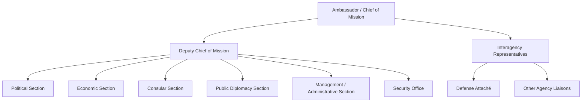
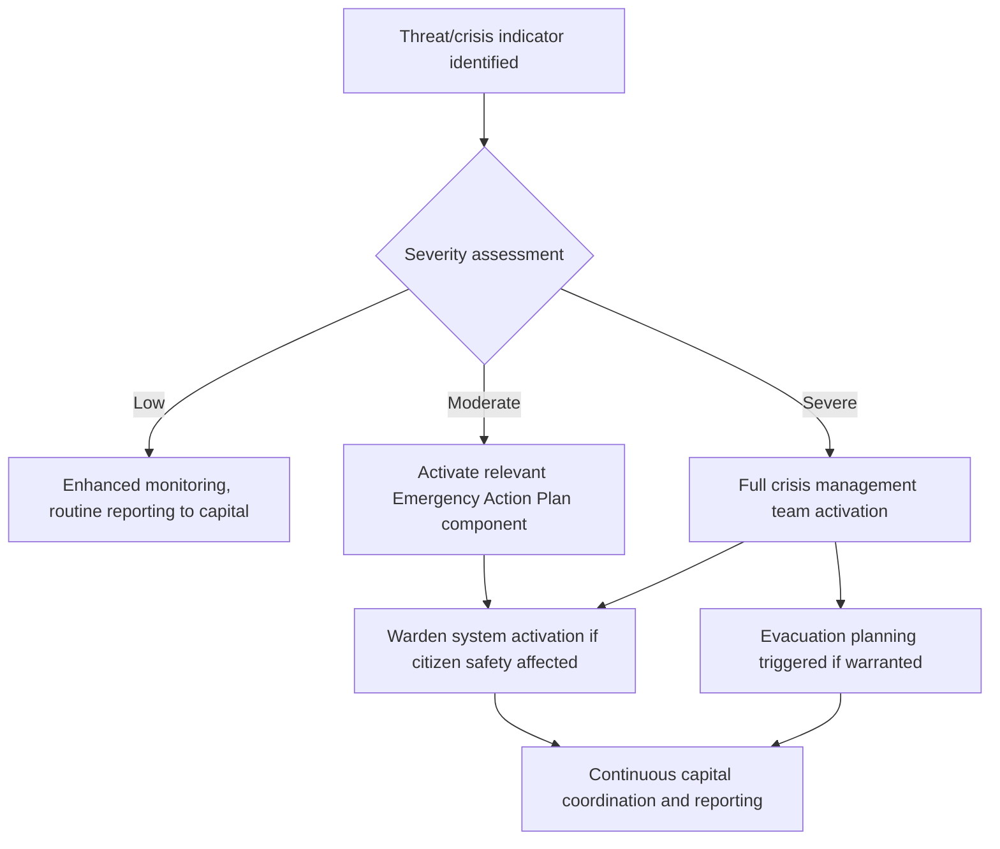

## Running an Embassy or Diplomatic Mission

### Definition and Scope

Running an embassy or diplomatic mission encompasses the full range of organizational leadership, administrative management, and operational coordination functions required to lead a sovereign state's official representative office in a host country. This spans political and economic reporting, consular services, public diplomacy, security management, personnel leadership, and interagency coordination — combining the responsibilities of a chief executive, a diplomat, and a security-conscious institutional administrator within a single leadership role, typically vested in an Ambassador (Chief of Mission) supported by a Deputy Chief of Mission and section heads.

### Organizational Structure of a Typical Mission

**Key Points**

- **Chief of Mission (Ambassador)**: overall leadership, chief representative to the host government, final authority on mission policy and operations.
- **Deputy Chief of Mission (DCM)**: day-to-day management of mission operations, often serves as Chargé d'Affaires in the Ambassador's absence.
- **Functional sections**: typically include Political, Economic, Consular, Public Diplomacy, Management/Administrative, and Security sections, though exact structure varies by mission size and host country priorities.
- **Interagency presence**: larger missions often host representatives from multiple government agencies beyond the foreign ministry (defense attachés, intelligence liaison, trade or development agency staff, law enforcement liaison), each reporting through distinct institutional chains while operating under Chief of Mission authority.
- **Locally engaged staff**: host-country nationals employed by the mission, providing continuity, local expertise, and language capacity that rotating diplomatic staff cannot replicate — often the institutional memory backbone of a mission.

### Chief of Mission Authority

A foundational organizational principle in most diplomatic systems is that the Chief of Mission holds authority over all executive branch personnel within the mission, regardless of their home agency — intended to ensure unified strategic direction and prevent fragmented or contradictory engagement with the host government across different agency representatives operating in the same country. In practice, this authority coexists with each interagency representative's separate technical reporting chain to their home agency, requiring active coordination skill from mission leadership to manage rather than a simple command hierarchy [Inference — practical balance varies by mission and personalities involved].

### Core Functional Responsibilities

#### Political Reporting and Analysis

Continuous monitoring, analysis, and reporting on host-country political developments, government policy, and bilateral relationship dynamics — the traditional core diplomatic function, feeding directly into the broader intelligence and policy synthesis functions discussed elsewhere in this curriculum (see Intelligence Analysis and Information Synthesis).

#### Economic and Commercial Work

Monitoring host-country economic conditions, advocating for bilateral trade and investment interests, and supporting the home country's commercial and economic diplomacy objectives, often in close coordination with trade promotion agencies.

#### Consular Services

Direct services to citizens of the home country residing in or visiting the host country (passport services, emergency assistance, welfare and whereabouts cases) and visa/immigration processing for host-country nationals seeking to travel to the home country — a function combining routine administrative service delivery with occasional acute crisis response (citizen arrests, deaths, natural disasters, evacuations).

#### Public Diplomacy

Cultural, educational, and media engagement intended to build mutual understanding and favorable sentiment toward the home country among the host country's public and civil society, distinct from official government-to-government political engagement.

#### Management and Administration

The operational backbone of the mission: budget management, human resources, procurement, information technology, property management, and general services — functions that, while less visible than political reporting, determine whether the mission can operate effectively at all.

#### Security

Protection of mission personnel, facilities, and information, spanning physical security, personnel security, information security, and emergency/crisis response planning — an increasingly central function given the elevated threat environment many missions face.

### Crisis Management and Contingency Planning

**Key Points**

- **Emergency Action Plans (EAPs)**: standing, regularly rehearsed protocols for a range of contingencies (natural disaster, civil unrest, terrorist attack, mass casualty event, evacuation), typically required of missions in most diplomatic services and reviewed on a periodic basis.
- **Warden systems**: structured networks for communicating with and accounting for citizens of the home country in the host country during a crisis, often organized geographically with designated volunteer coordinators.
- **Evacuation planning**: pre-established procedures, transportation arrangements, and decision criteria for partial or full mission drawdown or evacuation under deteriorating security conditions.
- **Duty officer systems**: rotating around-the-clock staff coverage ensuring the mission can respond to emergencies outside normal business hours.

### Personnel Leadership in a Mission Context

#### Managing a Multi-Agency, Multi-Cultural Workforce

Mission leadership must integrate personnel from multiple home-country agencies (each with distinct institutional cultures and reporting structures), rotating diplomatic staff, and locally engaged staff (host-country nationals with distinct employment terms, career trajectories, and cultural context) into a coherent working team — a leadership challenge combining standard organizational management with cross-cultural and cross-institutional integration demands.

#### Rotational Staffing Challenges

Most diplomatic services rotate personnel through postings on a periodic cycle (commonly two to four years), creating continuous leadership challenges around institutional memory retention, relationship continuity with host-country counterparts, and onboarding efficiency — locally engaged staff often serve as the primary continuity mechanism bridging successive rotations of diplomatic personnel.

#### Morale and Hardship Post Management

Missions in difficult operating environments (security risk, family separation due to restricted postings, harsh climate or health conditions, isolation) require deliberate leadership attention to staff morale, mental health support, and family welfare, given documented links between mission environment hardship and both individual wellbeing and organizational performance.

### Interagency and Whole-of-Government Coordination

A central leadership challenge for mission chiefs is coordinating the sometimes divergent priorities, timelines, and institutional cultures of multiple home-government agencies operating within a single mission, while maintaining a unified strategic posture toward the host government. This typically requires:

- **Regular country team meetings**: structured, recurring coordination sessions bringing together section and agency heads to align priorities and share information.
- **Clear communication of Chief of Mission priorities**: ensuring all agency representatives understand and operate consistently with overall mission strategic objectives, even while pursuing agency-specific mandates.
- **Conflict resolution mechanisms**: structured processes for resolving disagreements between agency priorities and overall mission strategy, ideally resolved at the mission level before escalating to capital-level interagency disputes.

### Host Government and Diplomatic Community Relations

#### Bilateral Relationship Management

Sustained relationship-building with host-government counterparts across ministries and levels of seniority, recognizing that effective crisis-period engagement depends heavily on relationship capital built during ordinary, non-crisis periods.

#### Diplomatic Corps Engagement

Coordination and relationship-building with other countries' missions in the host country, including intelligence and information sharing (within appropriate limits), coordinated positions on multilateral or host-country issues, and mutual support during crises affecting the broader diplomatic community.

#### Protocol and Privileges/Immunities Management

Ensuring the mission's activities and personnel conduct remain consistent with the host country's diplomatic protocol expectations and the framework of privileges and immunities under international law (notably the Vienna Convention on Diplomatic Relations), while also managing the practical implications of immunity for mission personnel conduct and accountability.

### Budget and Resource Management

Missions typically operate under multi-year or annual budget allocations from the home foreign ministry, requiring mission leadership to make resource trade-off decisions across competing functional priorities (staffing, physical security investment, public diplomacy programming, representational activities) — a function requiring genuine administrative and financial management competency alongside diplomatic skill, and one that is sometimes underweighted in traditional diplomatic training relative to its practical importance to mission effectiveness [Inference].

### Common Pitfalls in Mission Leadership

- **Siloed section operation**: functional sections operating without adequate coordination, producing fragmented or inconsistent engagement with the host government and missed cross-section synergies.
- **Interagency friction left unmanaged**: allowing divergent agency priorities to produce visible inconsistency in the mission's engagement with the host government.
- **Underinvestment in locally engaged staff relationships**: failing to adequately value, retain, and integrate locally engaged staff, resulting in preventable loss of institutional memory and local expertise.
- **Crisis plan atrophy**: treating Emergency Action Plans as a compliance exercise rather than a genuinely rehearsed, updated operational capability, resulting in poor real-world performance when an actual crisis occurs.
- **Neglecting management fundamentals**: prioritizing visible diplomatic and political work at the expense of the administrative and management functions that determine whether the mission can operate effectively at all.
- **Insufficient succession planning**: inadequate preparation for leadership transitions during rotational staffing cycles, risking discontinuity in strategic priorities and key relationships.

### Illustrative Mission Coordination Model

<svg xmlns="http://www.w3.org/2000/svg" viewBox="0 0 700 260">
<title>Whole-of-Mission Coordination Model (svg_diagram)</title>
<rect width="700" height="260" fill="#ffffff" stroke="#cccccc" />
<text x="20" y="28" font-size="14" font-weight="bold" fill="#222222">Whole-of-Mission Coordination Model (svg_diagram)</text>
<circle cx="350" cy="140" r="55" fill="#eaf2f8" stroke="#2874a6" stroke-width="2" />
<text x="300" y="135" font-size="11" fill="#2874a6">Chief of Mission</text>
<text x="310" y="150" font-size="11" fill="#2874a6">/ Country Team</text>
<rect x="40" y="30" width="120" height="40" rx="6" fill="#eafaf1" stroke="#1e8449" stroke-width="1.5" />
<text x="55" y="55" font-size="10" fill="#1e8449">Political Section</text>
<rect x="40" y="90" width="120" height="40" rx="6" fill="#eafaf1" stroke="#1e8449" stroke-width="1.5" />
<text x="55" y="115" font-size="10" fill="#1e8449">Economic Section</text>
<rect x="40" y="150" width="120" height="40" rx="6" fill="#eafaf1" stroke="#1e8449" stroke-width="1.5" />
<text x="55" y="175" font-size="10" fill="#1e8449">Consular Section</text>
<rect x="540" y="30" width="120" height="40" rx="6" fill="#fdf2e3" stroke="#d68910" stroke-width="1.5" />
<text x="555" y="55" font-size="10" fill="#d68910">Defense Attaché</text>
<rect x="540" y="90" width="120" height="40" rx="6" fill="#fdf2e3" stroke="#d68910" stroke-width="1.5" />
<text x="555" y="115" font-size="10" fill="#d68910">Other Agencies</text>
<rect x="540" y="150" width="120" height="40" rx="6" fill="#fdf2e3" stroke="#d68910" stroke-width="1.5" />
<text x="555" y="175" font-size="10" fill="#d68910">Security Office</text>
<line x1="160" y1="50" x2="300" y2="120" stroke="#333333" stroke-width="1.2" />
<line x1="160" y1="110" x2="300" y2="140" stroke="#333333" stroke-width="1.2" />
<line x1="160" y1="170" x2="300" y2="160" stroke="#333333" stroke-width="1.2" />
<line x1="540" y1="50" x2="400" y2="120" stroke="#333333" stroke-width="1.2" />
<line x1="540" y1="110" x2="400" y2="140" stroke="#333333" stroke-width="1.2" />
<line x1="540" y1="170" x2="400" y2="160" stroke="#333333" stroke-width="1.2" />
<text x="200" y="230" font-size="10" fill="#7f8c8d">Locally engaged staff provide continuity across all sections (svg_diagram)</text>
</svg>

### Practical Recommendations for Mission Leadership

- **Establish regular, structured country team coordination** early in a leadership tenure to build the interagency alignment habits that prevent fragmented engagement.
- **Invest deliberately in relationships with locally engaged staff**, recognizing their disproportionate contribution to institutional continuity and effectiveness.
- **Treat Emergency Action Plans as living operational tools**, with genuine periodic rehearsal rather than static compliance documents.
- **Balance representational and political engagement with sustained attention to management fundamentals**, since operational failures in administration or security can undermine even excellent diplomatic engagement.
- **Build succession continuity practices** into leadership transitions, given the structural discontinuity inherent in rotational diplomatic staffing.

**Related Topics**

- Crisis Anticipation and Contingency Planning
- Interagency Coordination and Whole-of-Government Diplomacy
- Diplomatic Privileges and Immunities Under International Law
- Public Diplomacy and Cultural Engagement Strategy
- Personnel Leadership Across Cultural and Institutional Boundaries
- Consular Crisis Response and Citizen Protection
- Budget and Resource Management in Foreign Affairs Institutions