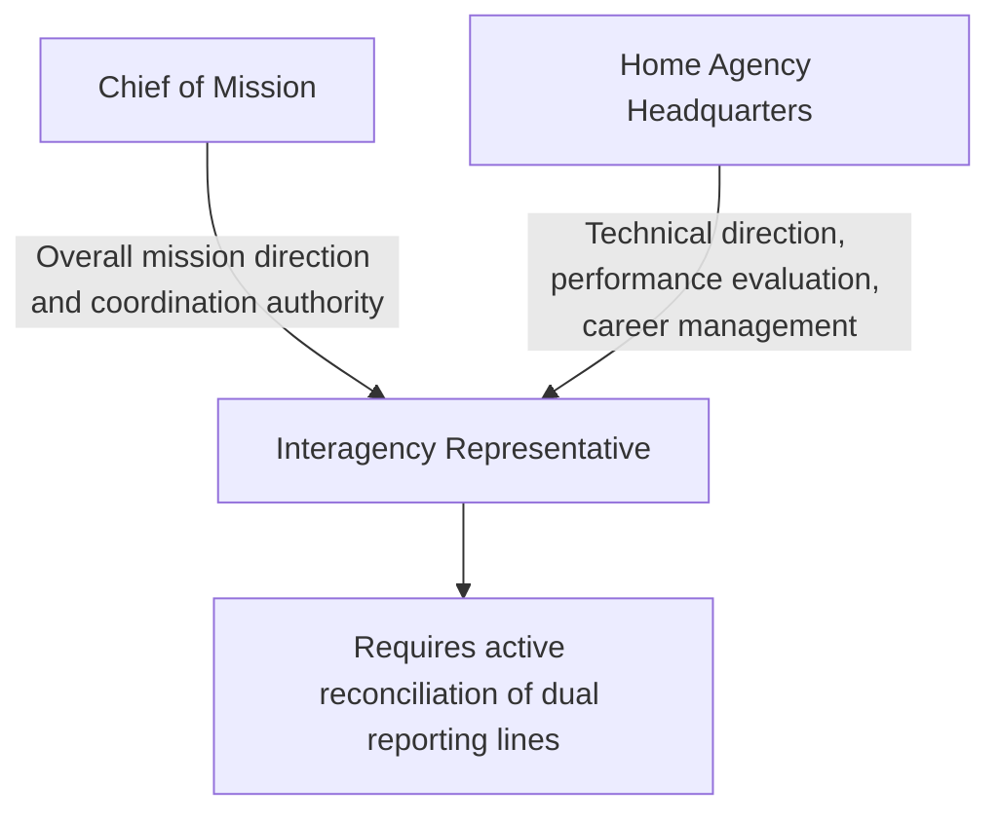
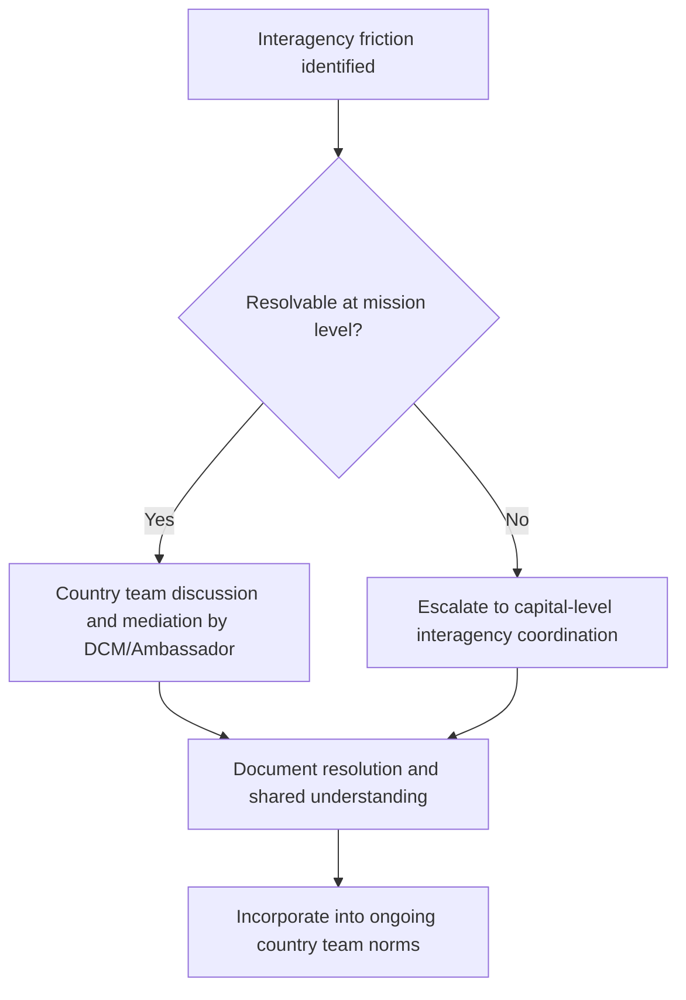

## Managing Diplomatic Staff and Interagency Teams

### Definition and Scope

Managing diplomatic staff and interagency teams is the leadership discipline of directing, developing, and coordinating personnel within a diplomatic institution — spanning career diplomats, locally engaged staff, and representatives from multiple home-government agencies with distinct institutional mandates, cultures, and reporting chains. This function combines conventional organizational management (performance, development, morale) with the distinctive challenges of cross-agency coordination, rotational staffing, cross-cultural team composition, and operation under hierarchical authority structures that do not map neatly onto standard corporate management models.

### Distinctive Features of Diplomatic Personnel Management

**Key Points**

- **Rotational assignment cycles**: diplomatic personnel typically rotate to new postings every two to four years, meaning managers routinely lead teams with limited institutional tenure and must build effective working relationships and rapid onboarding under compressed timeframes.
- **Dual-hatted authority structures**: interagency representatives within a mission report both to the Chief of Mission (for overall mission coordination) and to their home agency (for technical direction and career management), creating a matrixed authority structure that requires active coordination rather than simple hierarchical command.
- **Locally engaged staff continuity**: host-country national staff typically remain in position far longer than rotating diplomatic personnel, making them a disproportionately important source of institutional memory, local relationship capital, and operational continuity.
- **High-stakes, low-margin-for-error environments**: personnel decisions and team dynamics in diplomatic settings can have consequences extending beyond organizational performance to bilateral relationship health and, in crisis contexts, personnel safety.

### Organizational Authority Models

This matrixed structure means effective interagency team management depends less on formal hierarchical command and more on relationship-building, clear communication of shared objectives, and skilled conflict resolution when agency-specific priorities diverge from overall mission strategy — a leadership skill set closer to cross-functional program management than traditional line management [Inference].

### Core Personnel Management Functions

#### 1. Performance Management Across Institutional Boundaries

Managing performance for personnel who may be formally evaluated by their home agency rather than the mission's own leadership requires mission managers to develop influence and feedback mechanisms that do not rely on direct formal authority — informal feedback, documented input to home-agency evaluations, and relationship-based accountability often substitute for direct command authority over interagency personnel.

#### 2. Onboarding and Rapid Integration

Given short rotation cycles, effective onboarding processes are disproportionately important to overall team effectiveness — structured onboarding typically includes handover documentation from outgoing personnel, deliberate relationship introductions to key host-government and local contacts, and accelerated context-briefing on ongoing priorities and sensitivities.

#### 3. Team Cohesion Across Cultural and Institutional Lines

Building a cohesive "country team" culture across personnel from different home agencies (each with distinct institutional norms, risk tolerances, and communication styles) and locally engaged staff (operating within the host country's own professional and cultural norms) requires deliberate team-building investment rather than assuming cohesion will emerge organically from co-location alone.

#### 4. Talent Development and Career Progression

Supporting career development for rotating diplomatic staff (through assignment selection, mentorship, and skills development) while also investing in professional growth opportunities for locally engaged staff, who often have more constrained formal career ladders within a foreign diplomatic service but whose retention and engagement substantially affects mission performance.

### Managing Locally Engaged Staff

**Key Points**

- Locally engaged staff (LES) typically make up a substantial proportion of total mission personnel and provide language capability, cultural and political context, and continuity that rotating diplomatic staff cannot replicate on their own.
- LES employment terms, benefits, and legal protections are generally governed by host-country labor law and mission-specific policy, differing structurally from the employment terms of rotating diplomatic personnel — mission managers must navigate this distinct framework competently.
- Security vetting and information-access limitations for LES (given their host-country citizenship) create inherent constraints on their role in the most sensitive mission functions, requiring thoughtful role design that maximizes their substantial value while respecting legitimate security boundaries.
- LES retention is a significant institutional risk factor: loss of experienced LES staff during periods of high diplomatic staff turnover can compound to produce serious institutional memory loss.

**Example**

A mission facing simultaneous rotation of its political counselor, economic officer, and DCM within the same several-month window faces substantially elevated institutional memory risk; a well-managed LES team with deep, continuous institutional knowledge can significantly mitigate this risk by briefing incoming officers and maintaining continuity in ongoing engagement threads — illustrating why LES retention and development is a strategic, not merely administrative, management priority.

### Conflict Resolution in Interagency Teams

#### Sources of Interagency Friction

- **Divergent risk tolerance**: agencies with different mandates (diplomatic engagement versus security or law enforcement functions, for example) often have structurally different institutional risk tolerances, producing friction over engagement approach.
- **Competing reporting priorities**: interagency personnel may face pressure from their home agency to prioritize agency-specific objectives that do not fully align with overall mission strategic priorities.
- **Resource competition**: shared mission resources (security support, administrative services, representational budget) can become a source of interagency friction absent clear allocation principles.
- **Information-sharing asymmetries**: differing classification and information-sharing norms across agencies can create friction and mistrust if not proactively managed.

#### Structured Resolution Approaches

- **Regular country team meetings** as a standing forum for surfacing and resolving interagency friction before it escalates to capital-level disputes.
- **Clear articulation of Chief of Mission priorities**, providing a shared reference point that helps reconcile competing agency-specific pressures.
- **Escalation protocols** for disputes that cannot be resolved at the mission level, with clearly understood mechanisms for elevating to capital-level interagency coordination where necessary.
- **Relationship investment during non-crisis periods**, since interagency trust built during routine operations substantially improves coordination effectiveness during high-stakes crisis response.

### Leadership Styles Suited to Diplomatic Team Management

| Style Element | Application in Diplomatic Context |
| --- | --- |
| Servant/facilitative leadership | Effective given the matrixed authority structure, where influence often substitutes for direct command |
| Transparent communication of priorities | Reduces ambiguity across personnel with differing institutional reporting lines |
| Cultural humility and adaptability | Essential for leading genuinely multicultural, multi-institutional teams |
| Consistent, calibrated accountability | Necessary despite limited formal authority over interagency personnel, achieved through relationship-based influence rather than command |
| Proactive relationship-building | Particularly critical during onboarding given compressed rotation timelines |

### Cross-Cultural Team Dynamics

Managing teams composed of home-country diplomatic personnel and host-country locally engaged staff requires active navigation of differing communication norms, hierarchy expectations, and professional conventions. Leadership approaches effective within one national diplomatic service's culture may require adaptation when applied to genuinely multicultural mission teams — assuming a single universal management style will translate seamlessly across this context risks friction and disengagement [Inference].

### Crisis-Period Team Management

During active crises, personnel management demands intensify substantially:

- **Extended duty and fatigue management**: crisis response often requires extended working hours across personnel from multiple agencies, requiring deliberate leadership attention to fatigue and burnout risk even amid urgent operational demands.
- **Clear, centralized coordination**: crisis conditions generally require more centralized, directive coordination than routine operations, given the premium on speed and coherence of response.
- **Psychological support**: personnel exposed to high-stress crisis conditions (evacuations, security incidents, mass casualty response) benefit from structured post-crisis psychological support, an area of growing institutional attention within diplomatic personnel management practice.

### Succession Planning and Institutional Continuity

Given structural rotation cycles, deliberate succession planning is a core rather than optional management function:

- **Overlap periods**: where feasible, structuring incoming and outgoing personnel overlap periods to enable direct handover rather than relying solely on written documentation.
- **Systematic handover documentation**: standardized practices for capturing ongoing priorities, key relationships, and unresolved issues for incoming personnel.
- **LES-anchored continuity**: leveraging locally engaged staff institutional memory explicitly as part of formal succession planning rather than treating it as an informal byproduct.

### Common Pitfalls

- **Treating interagency personnel as directly subordinate**: underestimating the matrixed nature of authority and applying a command approach poorly suited to personnel with separate home-agency reporting lines.
- **Underinvesting in locally engaged staff development and retention**: treating LES roles as purely administrative rather than recognizing their strategic institutional value.
- **Neglecting onboarding investment**: given short rotation cycles, inadequate onboarding compounds across successive personnel transitions, producing chronic institutional inefficiency.
- **Allowing interagency friction to go unaddressed**: permitting unresolved tension between agency representatives to affect the mission's coherence in engaging the host government.
- **Insufficient succession planning**: failing to build deliberate continuity mechanisms, resulting in preventable loss of institutional knowledge and relationship capital at each rotation.
- **Uniform management approach across a diverse team**: applying a single leadership or communication style without adapting to the genuinely multicultural, multi-institutional composition of most diplomatic teams.

### Illustrative Team Management Framework

<svg xmlns="http://www.w3.org/2000/svg" viewBox="0 0 700 260">
<title>Diplomatic Team Management Framework (svg_diagram)</title>
<rect width="700" height="260" fill="#ffffff" stroke="#cccccc" />
<text x="20" y="28" font-size="14" font-weight="bold" fill="#222222">Diplomatic Team Management Framework (svg_diagram)</text>
<rect x="30" y="60" width="150" height="50" rx="6" fill="#eaf2f8" stroke="#2874a6" stroke-width="1.5" />
<text x="45" y="82" font-size="10" fill="#2874a6">Rotating diplomatic</text>
<text x="45" y="97" font-size="10" fill="#2874a6">personnel</text>
<rect x="30" y="150" width="150" height="50" rx="6" fill="#eafaf1" stroke="#1e8449" stroke-width="1.5" />
<text x="45" y="172" font-size="10" fill="#1e8449">Locally engaged</text>
<text x="45" y="187" font-size="10" fill="#1e8449">staff (continuity anchor)</text>
<rect x="280" y="105" width="150" height="50" rx="6" fill="#fdf2e3" stroke="#d68910" stroke-width="1.5" />
<text x="300" y="127" font-size="10" fill="#d68910">Mission leadership</text>
<text x="300" y="142" font-size="10" fill="#d68910">(facilitative style)</text>
<rect x="530" y="60" width="150" height="50" rx="6" fill="#fdecea" stroke="#c0392b" stroke-width="1.5" />
<text x="545" y="82" font-size="10" fill="#c0392b">Interagency reps</text>
<text x="545" y="97" font-size="10" fill="#c0392b">(dual reporting)</text>
<rect x="530" y="150" width="150" height="50" rx="6" fill="#fdecea" stroke="#c0392b" stroke-width="1.5" />
<text x="545" y="172" font-size="10" fill="#c0392b">Home agency</text>
<text x="545" y="187" font-size="10" fill="#c0392b">headquarters</text>
<line x1="180" y1="90" x2="280" y2="125" stroke="#333333" stroke-width="1.2" />
<line x1="180" y1="175" x2="280" y2="140" stroke="#333333" stroke-width="1.2" />
<line x1="430" y1="120" x2="530" y2="90" stroke="#333333" stroke-width="1.2" />
<line x1="530" y1="90" x2="605" y2="150" stroke="#333333" stroke-width="1.2" stroke-dasharray="4" />
<text x="490" y="200" font-size="9" fill="#7f8c8d">Dashed: separate technical reporting line</text>
</svg>

### Practical Recommendations

- **Explicitly map dual reporting structures** for interagency personnel early in a leadership tenure, clarifying expectations for both mission coordination and home-agency reporting.
- **Invest in structured onboarding processes** given the recurring cost of rotation-driven discontinuity.
- **Treat locally engaged staff development and retention as a strategic priority**, not an administrative afterthought.
- **Establish regular country team coordination forums** as the primary venue for surfacing and resolving interagency friction before escalation.
- **Build explicit succession and handover protocols** into standard mission practice rather than relying on ad hoc, personality-dependent continuity.

**Related Topics**

- Running an Embassy or Diplomatic Mission
- Interagency Coordination and Whole-of-Government Diplomacy
- Cross-Cultural Communication in Diplomatic Settings
- Crisis Anticipation and Contingency Planning
- Talent Development and Career Progression in Foreign Service
- Organizational Culture-Building in Multinational Teams