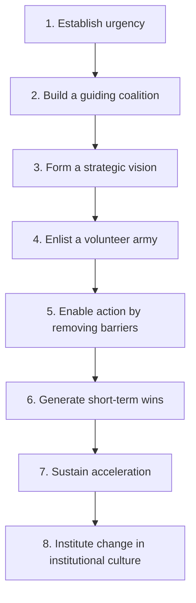
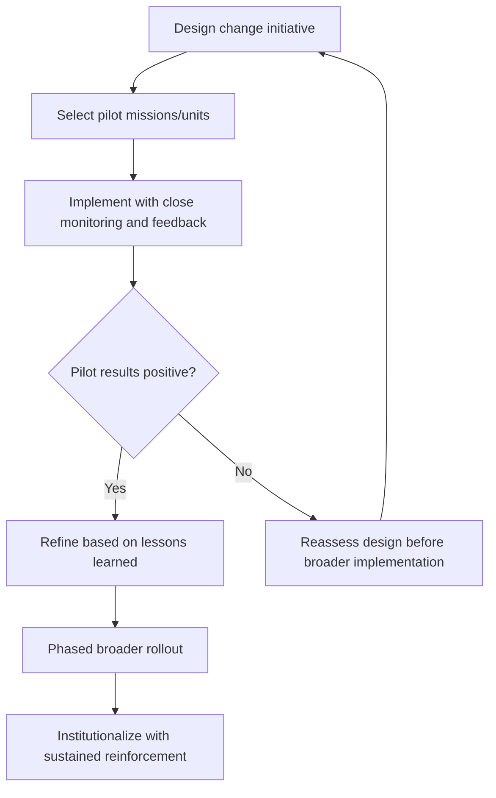

## Institutional Change Management in Foreign Ministries

### Definition and Scope

Institutional change management in foreign ministries is the deliberate leadership discipline of designing, implementing, and sustaining structural, procedural, or cultural transformation within diplomatic institutions — spanning reorganizations, technology adoption, doctrinal shifts, personnel system reform, and strategic reorientation. Foreign ministries present a distinctive change-management environment characterized by hierarchical career structures, strong institutional traditions, geographically dispersed operations, political leadership turnover, and a professional culture that often prizes continuity and caution as core diplomatic virtues — factors that can both necessitate and complicate deliberate change efforts.

### Why Foreign Ministries Present Distinctive Change Management Challenges

**Key Points**

- **Career-based personnel systems** with strong internal promotion norms and professional identity tied to established institutional practice can create structural resistance to changes perceived as threatening established career pathways or professional status.
- **Political leadership turnover** at senior levels, occurring on a different cycle than the career civil service, means change initiatives launched under one political leadership may lose momentum or be reversed under the next, requiring change management approaches resilient to leadership transition.
- **Geographic dispersion** across a global network of missions makes centrally directed change initiatives inherently more difficult to implement consistently than in a single-location organization, given variable local conditions, communication lag, and mission-level autonomy.
- **Risk-averse institutional culture**: diplomatic institutions often develop strong cultural norms around caution and precedent, reflecting the genuinely high stakes of many diplomatic decisions — a rational institutional adaptation that can nonetheless create disproportionate resistance to procedural or structural change unrelated to the underlying risk logic.
- **Dual-track authority structures**: the coexistence of career civil service leadership and politically appointed leadership creates distinct change-management dynamics not present in purely career-based or purely politically-appointed organizations.

### Established Change Management Frameworks Applied to Foreign Ministries

#### Kotter's Eight-Step Model

A widely referenced organizational change framework providing a useful, if generic, structuring device for foreign ministry reform initiatives:

Applied to a foreign ministry context, "establishing urgency" often requires overcoming the institutional tendency to treat gradual environmental shifts as manageable through existing practice rather than requiring structural change — a documented challenge in institutions where the costs of inaction are diffuse and delayed relative to the visible costs of disruptive reform.

#### The ADKAR Model (Awareness, Desire, Knowledge, Ability, Reinforcement)

A framework focused on individual-level change adoption, useful for foreign ministry contexts because much institutional change ultimately depends on individual diplomats and staff genuinely adopting new practices rather than merely complying with directives — particularly relevant given the substantial professional discretion diplomatic personnel typically exercise in their day-to-day work.

#### Lewin's Unfreeze-Change-Refreeze Model

A simpler three-stage model emphasizing the need to deliberately destabilize existing norms and practices ("unfreeze") before new practices can take hold, and then consciously reinforce and institutionalize the new practice ("refreeze") to prevent reversion — relevant to foreign ministries given the strong institutional pull toward established practice absent deliberate reinforcement.

### Common Categories of Foreign Ministry Institutional Change

| Change Type | Description | Distinctive Challenge |
| --- | --- | --- |
| Structural reorganization | Reshaping bureau/division structures, often to better align with emerging cross-cutting priorities | Entrenched bureaucratic interests tied to existing structures; loss of established relationship networks |
| Technology adoption | Modernizing communication, data management, and analytical tools | Security and classification constraints limiting standard commercial technology adoption; uneven technical capacity across a global mission network |
| Personnel system reform | Changes to recruitment, promotion, evaluation, or assignment systems | Direct impact on career incentives, generating strong stakeholder resistance from those advantaged by existing systems |
| Doctrinal/strategic reorientation | Shifting institutional priorities toward emerging issue areas (e.g., climate, technology governance, economic statecraft) | Requires new expertise development and potential resource reallocation from traditional priority areas |
| Cultural change initiatives | Efforts to shift institutional norms (e.g., risk tolerance, diversity and inclusion, work-life balance) | Particularly difficult to measure and sustain; vulnerable to superficial compliance without genuine adoption |

### Stakeholder Analysis and Coalition-Building

#### Identifying Change Stakeholders

Effective change management in foreign ministries requires explicit mapping of stakeholder groups by their likely disposition toward a given change initiative — career civil service at various seniority levels, politically appointed leadership, labor/professional associations where they exist, regional and functional bureau leadership, and locally engaged staff across the mission network, each with distinct interests and influence channels.

#### The Guiding Coalition Approach

Rather than relying solely on top-down directive authority (which faces the structural resistance factors noted above), successful institutional change efforts typically build a coalition of credible internal champions across seniority levels and institutional divisions — since foreign ministry culture often accords substantial weight to peer and senior-colleague endorsement over purely hierarchical directive, particularly among career professional staff who may outlast politically appointed leadership pushing a given reform.

#### Managing Resistance

- **Distinguishing resistance types**: resistance grounded in legitimate operational or risk concerns (which should inform and potentially modify the change design) versus resistance grounded primarily in status quo preference or career self-interest (which requires different management approaches).
- **Early and transparent communication**: given the reputational and status sensitivity of many diplomatic personnel, poorly communicated change initiatives are particularly prone to generating rumor-driven resistance and anxiety.
- **Incentive alignment**: where feasible, structuring career incentives (promotion criteria, assignment opportunities) to reward adoption of desired new practices, recognizing that purely directive change absent incentive alignment often produces superficial rather than genuine adoption.

### Piloting and Phased Implementation

Given the risk-averse institutional culture and geographic dispersion characteristic of foreign ministries, phased or pilot-based implementation approaches are frequently preferred over simultaneous global rollout:

**Example**

A foreign ministry introducing a new digital case-management system for consular services might pilot the system in a small number of missions with varying operational contexts (a large multi-officer consular section, a small single-officer post, missions with differing technical infrastructure) before committing to global rollout — surfacing implementation challenges specific to different mission types while limiting the institutional risk of a failed simultaneous global deployment.

### Sustaining Change Beyond Political Leadership Transitions

A distinctive foreign ministry change-management challenge is designing initiatives resilient to the transition between political leadership cycles, since reform efforts closely identified with a single political appointee are structurally vulnerable to reversal or abandonment upon leadership transition.

- **Institutionalizing change in formal processes and systems** (regulations, standard operating procedures, information systems) rather than relying solely on informal leadership emphasis, since formal institutionalization is more resistant to reversal than culture or practice sustained purely through leadership attention.
- **Building career civil service ownership**, since institutionalized support among career professional staff (who typically remain across political transitions) provides continuity that purely political sponsorship cannot.
- **Documenting the evidence base for the change**, so successor leadership inherits a demonstrated rationale rather than requiring the change to be re-justified from first principles.

### Measuring Institutional Change Success

Foreign ministry change initiatives face particular measurement challenges given the difficulty of isolating institutional change effects from the broader, complex diplomatic environment:

- **Process adoption metrics**: tracking actual usage/adoption rates of new systems, procedures, or practices, distinguishing genuine adoption from superficial compliance.
- **Stakeholder feedback mechanisms**: structured surveys or feedback channels to assess whether the change is being experienced as intended across affected personnel.
- **Outcome-linked indicators where feasible**: connecting the change initiative to downstream institutional performance indicators, while acknowledging that attribution is often methodologically difficult given the many confounding factors affecting diplomatic institutional performance [Inference].
- **Longitudinal tracking**: given foreign ministry change initiatives often require multi-year timeframes to fully institutionalize, short-term assessment windows may understate or overstate eventual success.

### Common Pitfalls

- **Underestimating the guiding coalition requirement**: relying on directive authority alone without building genuine coalition support across career professional staff, resulting in superficial compliance that reverts once direct oversight attention shifts elsewhere.
- **Change fatigue from poorly sequenced initiatives**: launching multiple simultaneous or rapidly sequential change efforts without adequate consolidation time, producing cynicism and disengagement.
- **Insufficient institutionalization**: failing to embed change in formal systems and processes, leaving it vulnerable to reversal upon leadership transition.
- **Ignoring locally engaged staff and mission-level variation**: designing change initiatives around headquarters conditions without adequately accounting for the substantial variation in operating context across a global mission network.
- **Treating resistance as uniformly illegitimate**: failing to distinguish operationally grounded resistance (which may warrant design modification) from purely status-quo-preserving resistance.
- **Premature declaration of success**: treating early pilot results or initial adoption metrics as confirming successful institutionalization before change has genuinely taken root across the full organization and time horizon.

### Illustrative Change Management Arc

<svg xmlns="http://www.w3.org/2000/svg" viewBox="0 0 700 260">
<title>Institutional Change Management Arc in a Foreign Ministry (svg_diagram)</title>
<rect width="700" height="260" fill="#ffffff" stroke="#cccccc" />
<text x="20" y="28" font-size="14" font-weight="bold" fill="#222222">Institutional Change Management Arc (svg_diagram)</text>
<line x1="50" y1="220" x2="650" y2="220" stroke="#333333" stroke-width="2" />
<line x1="50" y1="220" x2="50" y2="40" stroke="#333333" stroke-width="2" />
<text x="15" y="50" font-size="10" fill="#333333">Adoption</text>
<text x="580" y="240" font-size="10" fill="#333333">Time</text>
<polyline points="50,210 130,195 210,150 290,170 370,120 450,100 530,80 610,60" fill="none" stroke="#2874a6" stroke-width="2" />
<circle cx="130" cy="195" r="4" fill="#2874a6" />
<text x="80" y="185" font-size="9" fill="#2874a6">Pilot launch</text>
<circle cx="290" cy="170" r="4" fill="#c0392b" />
<text x="240" y="160" font-size="9" fill="#c0392b">Resistance/dip</text>
<circle cx="450" cy="100" r="4" fill="#1e8449" />
<text x="400" y="90" font-size="9" fill="#1e8449">Coalition traction builds</text>
<circle cx="610" cy="60" r="4" fill="#1e8449" />
<text x="555" y="50" font-size="9" fill="#1e8449">Institutionalized</text>
</svg>

### Practical Recommendations

- **Invest in a genuine guiding coalition** across seniority levels and institutional divisions before broad rollout, rather than relying on directive authority alone.
- **Pilot in varied mission contexts** to surface implementation challenges before committing to global rollout.
- **Institutionalize changes in formal systems and regulations**, not merely leadership emphasis, to improve resilience across political leadership transitions.
- **Distinguish and separately address legitimate operational resistance versus status-quo-preserving resistance**, adapting the change design where the former is well-founded.
- **Build in longitudinal measurement**, recognizing that genuine institutionalization in foreign ministry contexts typically requires a multi-year horizon.

**Related Topics**

- Long-Range Strategic Planning for Diplomatic Institutions
- Running an Embassy or Diplomatic Mission
- Managing Diplomatic Staff and Interagency Teams
- Organizational Culture-Building in Multinational Teams
- Anticipatory Governance and Early-Warning Systems
- Talent Development and Career Progression in Foreign Service