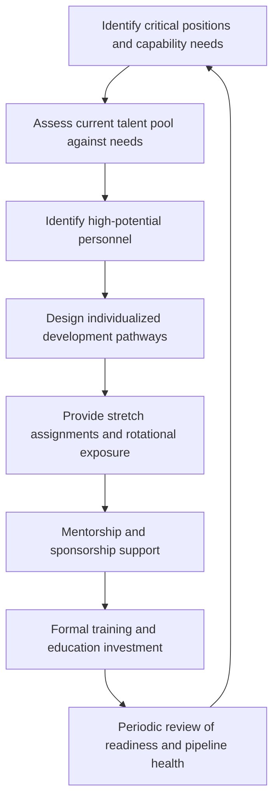

## Talent Development and Succession Planning

### Definition and Scope

Talent development and succession planning is the deliberate, systematic process of identifying, cultivating, and preparing personnel within a diplomatic institution to assume positions of increasing responsibility over time, ensuring institutional continuity, leadership readiness, and sustained mission effectiveness despite the structural turnover inherent in rotational diplomatic career systems. Unlike ad hoc career progression driven purely by individual initiative or vacancy timing, structured talent development links individual growth to identified institutional capability needs, while succession planning specifically addresses continuity of critical leadership and specialist positions.

### Why This Function Is Distinctively Important in Diplomatic Institutions

**Key Points**

- **Structural rotation cycles** mean diplomatic institutions face continuous, predictable leadership and expertise turnover at a scale rarely matched in other organizational contexts, making systematic succession planning a core operational necessity rather than an optional best practice.
- **Long development timelines for specialized expertise** (regional knowledge, language proficiency, technical domain fluency such as arms control or trade law) mean capability gaps identified reactively often cannot be closed on short timelines, elevating the strategic importance of forward-looking talent development.
- **High consequence of leadership gaps**: unlike many private-sector contexts where a temporary leadership vacancy carries primarily internal costs, gaps in diplomatic leadership positions can have direct consequences for bilateral relationship management and crisis response capacity.
- **Career-based promotion systems** in most foreign services create both an advantage (institutionalized professional development pathways) and a constraint (slower lateral entry of outside expertise compared to organizations with more open external hiring).

### Core Components of a Talent Development System

#### 1. Critical Position and Capability Identification

Systematically identifying which positions and expertise areas are most critical to institutional strategic priorities and most vulnerable to succession gaps — not merely senior leadership roles, but also specialized technical positions (rare language capability, deep regional expertise, specific legal or technical domains) where the talent pool may be narrow.

#### 2. Talent Pool Assessment

Structured assessment of current personnel against identified capability needs, commonly using competency frameworks spanning technical/functional skills, leadership capability, and cross-cultural or interpersonal effectiveness — ideally through multi-source input (supervisor assessment, peer feedback, self-assessment) rather than relying on a single evaluator's judgment.

#### 3. High-Potential Identification

Identifying personnel demonstrating strong performance and leadership potential for accelerated development — a process requiring deliberate safeguards against bias, since informal or purely reputation-based identification processes are vulnerable to systematic favoritism toward personnel who resemble existing leadership in background, communication style, or career path, rather than the full diversity of institutional talent [Inference].

#### 4. Individualized Development Pathways

Tailored development plans combining assignment sequencing, formal training, mentorship, and stretch opportunities aligned to both individual career aspirations and identified institutional capability needs — most effective when genuinely individualized rather than applying a uniform template regardless of role trajectory or personal circumstance.

### Development Mechanisms

#### Rotational and Stretch Assignments

Deliberately sequencing assignments to build a broadened skill and experience base — combining, for example, headquarters policy experience with field mission experience, functional and regional assignments, and progressively larger management responsibility — recognizing that leadership readiness for senior diplomatic positions typically requires breadth of experience that a single career track cannot provide.

#### Mentorship and Sponsorship

- **Mentorship**: informal or formal relationships providing guidance, feedback, and career advice, valuable for professional development broadly.
- **Sponsorship**: distinct from mentorship in that a senior figure actively advocates for a junior colleague's advancement, opening opportunities and visibility that mentorship alone does not guarantee — increasingly recognized in organizational research as a distinct and often more consequential mechanism for career advancement than mentorship alone, particularly relevant to addressing representation gaps in leadership pipelines [Inference].

#### Formal Training and Professional Education

Structured training programs — language training, area studies, leadership development courses, technical skill certification (negotiation, crisis management, economic analysis) — typically delivered through dedicated foreign service institutes or equivalent training institutions, combined with external professional education (university programs, interagency training) for specialized capability development.

#### Cross-Agency and External Exposure

Assignments or exchanges with other government agencies, international organizations, or, in some systems, private sector or academic institutions, broadening perspective and building relationship networks beyond the home institution — increasingly valued given the cross-domain nature of many contemporary diplomatic priorities (technology governance, economic statecraft, climate diplomacy) that benefit from exposure beyond traditional diplomatic training.

### Succession Planning Methodology

#### Succession Depth Assessment

For each identified critical position, assessing not merely whether a successor exists but the **depth** of the succession pipeline — how many potential successors are ready now, ready within one to two years, or in earlier-stage development — providing a more nuanced risk picture than a simple binary "successor identified" assessment.

| Readiness Category | Description | Institutional Risk Implication |
| --- | --- | --- |
| Ready now | Could assume the position immediately with minimal transition support | Low succession risk |
| Ready in 1-2 years | On track but requires specific additional development or experience | Moderate risk; requires monitoring |
| Longer-term potential | Shows promise but requires substantial further development | Higher risk if position vacancy occurs unexpectedly |
| No identified successor | Critical gap requiring active recruitment or accelerated development | Significant institutional risk |

#### Succession Planning for Specialized Expertise

Beyond leadership positions, succession planning must address narrow but critical technical and linguistic expertise, where the talent pool may be genuinely small — requiring longer lead-time planning given the multi-year development timelines for advanced language proficiency or deep regional/technical specialization.

**Example**

A foreign ministry identifying that only two officers currently hold advanced proficiency in a strategically important but rarely taught language, both approaching retirement eligibility, faces a critical succession gap requiring immediate action — accelerated language training investment for identified successor candidates, given that advanced language proficiency typically requires multi-year development that cannot be compressed to address an emergent vacancy.

### Diversity, Equity, and Representation in Talent Pipelines

Structured talent development and succession planning processes provide an institutional mechanism for addressing representation gaps in diplomatic leadership, since informal, reputation-based advancement processes are more vulnerable to unconscious bias reproducing existing demographic patterns in leadership. Many foreign services have incorporated explicit attention to broadening the diversity of identified high-potential talent pools and sponsorship networks as part of talent development reform, reflecting both equity objectives and the practical recognition that diplomatic institutions benefit from leadership perspectives representative of the broader society and population they serve [Inference — specific policy approaches and their effectiveness vary substantially by institution].

### Balancing Career-Based Systems with External Talent Needs

Most foreign services rely predominantly on internal career-based promotion, which offers strong institutional socialization and cumulative experience benefits but can create capability gaps in rapidly emerging domains (cyber policy, advanced technology governance, certain economic specializations) where external expertise may be scarce within the traditional career pipeline. Balancing internal talent development with selective lateral entry or interagency detail mechanisms is an increasingly salient design question for foreign ministries navigating fast-evolving strategic priorities.

### Common Pitfalls

- **Reactive rather than proactive succession planning**: only addressing succession when a vacancy is imminent or has already occurred, rather than maintaining an ongoing forward-looking pipeline assessment.
- **Overreliance on informal, reputation-based identification**: allowing high-potential identification to proceed without structured, multi-source assessment, increasing vulnerability to bias and inconsistent standards.
- **Narrow definition of critical positions**: focusing succession planning exclusively on senior leadership roles while neglecting narrow but mission-critical technical and linguistic expertise.
- **Uniform development templates**: applying identical development pathways regardless of role trajectory, individual strengths, or career stage, reducing the actual effectiveness of development investment.
- **Underinvestment in sponsorship**: assuming mentorship alone is sufficient for career advancement, neglecting the distinct and often more consequential role of active senior-level advocacy.
- **Neglecting locally engaged staff development**: in mission contexts, failing to extend structured talent development thinking to locally engaged staff, who represent a significant and often underutilized talent pool for institutional continuity (see Managing Diplomatic Staff and Interagency Teams).

### Illustrative Succession Pipeline Visualization

<svg xmlns="http://www.w3.org/2000/svg" viewBox="0 0 700 260">
<title>Succession Pipeline Depth Assessment (svg_diagram)</title>
<rect width="700" height="260" fill="#ffffff" stroke="#cccccc" />
<text x="20" y="28" font-size="14" font-weight="bold" fill="#222222">Succession Pipeline Depth Assessment (svg_diagram)</text>
<rect x="40" y="60" width="600" height="40" fill="#1e8449" opacity="0.85" />
<text x="250" y="85" font-size="11" fill="#ffffff">Ready Now (2 candidates)</text>
<rect x="40" y="105" width="600" height="40" fill="#d68910" opacity="0.85" />
<text x="220" y="130" font-size="11" fill="#ffffff">Ready in 1-2 years (3 candidates)</text>
<rect x="40" y="150" width="600" height="40" fill="#e67e22" opacity="0.6" />
<text x="210" y="175" font-size="11" fill="#ffffff">Longer-term potential (4 candidates)</text>
<rect x="40" y="195" width="600" height="40" fill="#c0392b" opacity="0.85" />
<text x="230" y="220" font-size="11" fill="#ffffff">No identified successor -- gap</text>
</svg>

### Practical Recommendations

- **Establish a standing succession review process** for critical positions, not limited to senior leadership but including narrow technical and linguistic expertise.
- **Use structured, multi-source assessment** for high-potential identification to reduce bias vulnerability inherent in purely informal, reputation-driven processes.
- **Actively cultivate sponsorship, not just mentorship**, recognizing its distinct role in advancing career progression, particularly for underrepresented talent.
- **Extend talent development thinking to locally engaged staff** in mission contexts, recognizing their institutional continuity value.
- **Invest early in long-lead-time capability development** (rare language proficiency, deep technical specialization), given multi-year development timelines that cannot be compressed to address emergent gaps.

**Related Topics**

- Managing Diplomatic Staff and Interagency Teams
- Institutional Change Management in Foreign Ministries
- Long-Range Strategic Planning for Diplomatic Institutions
- Running an Embassy or Diplomatic Mission
- Organizational Culture-Building in Multinational Teams
- Leadership Development for Senior Diplomatic Roles