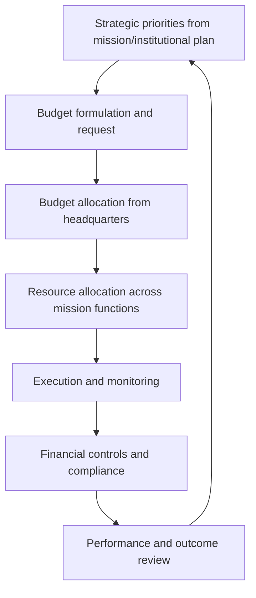
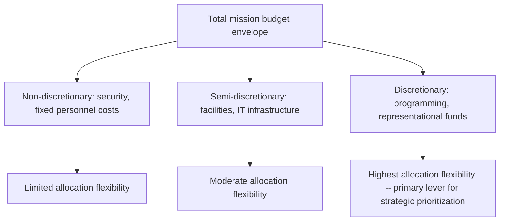

## Budgeting and Resource Management for Missions

### Definition and Scope

Budgeting and resource management for missions is the operational leadership discipline of planning, allocating, controlling, and accounting for the financial and physical resources required to sustain a diplomatic mission's functions — spanning personnel costs, physical infrastructure, security investment, representational activities, program funding, and administrative operations. This function sits at the intersection of financial management, strategic prioritization, and diplomatic judgment, since resource allocation decisions directly shape which strategic priorities a mission can meaningfully pursue.

### Why Resource Management Is a Distinctive Leadership Function in Diplomatic Missions

**Key Points**

- Mission leadership typically operates within budget allocations set by the home foreign ministry, constraining discretion even as leadership bears full accountability for effective resource use.
- Budget cycles (often annual) frequently mismatch the multi-year timeframes of many diplomatic priorities and relationship-building efforts, creating persistent tension between short-cycle financial planning and long-range strategic objectives.
- Security costs represent a growing and often non-discretionary share of mission budgets in many operating environments, compressing the resource envelope available for other functions.
- Resource allocation decisions carry diplomatic signaling value beyond their administrative function — visible investment or disinvestment in a mission, program, or activity can itself communicate priority (or lack thereof) to host governments and other observers.

### Core Components of Mission Resource Management

#### 1. Budget Formulation and Justification

Translating strategic priorities into a structured budget request, typically requiring mission leadership to build a credible case linking resource requests to specific strategic objectives and anticipated outcomes — a function requiring genuine facility with financial planning and persuasive communication to headquarters resource-allocation processes.

#### 2. Resource Allocation Across Competing Functions

Distributing available resources across mission functions (political/economic reporting, consular services, public diplomacy, security, administration) under conditions where near-universal excess demand relative to available resources requires explicit prioritization and trade-off decisions rather than simple proportional distribution.

#### 3. Execution and Monitoring

Ongoing tracking of actual expenditure against budget allocation, identifying variances early enough to allow corrective action, and maintaining the financial discipline necessary to avoid both underspending (which can signal poor planning or forfeited opportunity) and overspending (which creates compliance and accountability risk).

#### 4. Financial Controls and Compliance

Ensuring mission financial operations comply with home-government financial regulations, procurement rules, and anti-corruption/accountability requirements — a function carrying particular reputational stakes given the public accountability expectations typically attached to government diplomatic spending.

### Categories of Mission Resource Allocation

| Category | Description | Typical Resource Dynamics |
| --- | --- | --- |
| Personnel costs | Salaries, benefits, housing, and related costs for diplomatic and locally engaged staff | Often the largest budget category; substantially fixed in the short term given existing staffing commitments |
| Physical security | Facility hardening, security personnel, protective equipment and systems | Frequently non-discretionary given duty-of-care obligations; can grow disproportionately in high-threat environments |
| Facilities and infrastructure | Real property acquisition, maintenance, and operations | Long-term capital planning horizon distinct from annual operating budget cycles |
| Program and public diplomacy funding | Cultural, educational, and engagement programming | Often among the more discretionary categories, and correspondingly vulnerable to budget pressure from less flexible categories |
| Representational funds | Hosting, entertainment, and relationship-building expenditure | Relatively small in absolute terms but disproportionately important to relationship-building function |
| Information technology | Communications infrastructure, cybersecurity, data systems | Growing category given increasing digitalization of diplomatic operations and rising cybersecurity investment needs |

### Budget Cycle Dynamics and Mismatches

**Key Points**

- **Annual budget cycles** are the norm in most foreign ministries, creating structural tension with multi-year strategic priorities that require sustained resource commitment to achieve results (see Long-Range Strategic Planning for Diplomatic Institutions).
- **Execution-year constraints**: funds are often only available for obligation within a specific fiscal year, creating pressure toward year-end spending that may not reflect optimal resource use timing — a documented dynamic in public-sector budgeting generally, not unique to diplomatic institutions [Inference].
- **Supplemental and emergency funding mechanisms**: most foreign ministries maintain some capacity for emergency or supplemental resource allocation to address unanticipated crises (evacuation costs, emergency security upgrades), distinct from routine annual budget processes.
- **Multi-year capital planning**: physical infrastructure investment (new facility construction, major security upgrades) typically requires planning horizons substantially longer than the annual operating budget cycle, requiring separate capital planning processes.

### Resource Allocation Under Constraint: Prioritization Frameworks

#### Zero-Based Budgeting Principles

An approach requiring each budget category to be justified from a baseline of zero rather than incrementally adjusted from the prior year's allocation, useful for periodically challenging embedded spending patterns that may no longer reflect current strategic priorities — though administratively more demanding than incremental budgeting and not universally practical for annual application across an entire resource base.

#### Priority-Based Resource Allocation

Explicitly ranking mission functions and initiatives by strategic priority and allocating resources accordingly, with clear articulation of what would be cut first if the resource envelope contracts — providing decision-making clarity and institutional transparency that purely incremental, precedent-based allocation does not.

#### Core-Versus-Discretionary Distinction

Distinguishing genuinely non-discretionary costs (security obligations, fixed personnel costs, treaty-mandated functions) from discretionary allocation (programming, representational activity, certain administrative investments) to clarify where genuine trade-off flexibility exists within an otherwise constrained budget.

### Security Cost Growth and Budget Compression

A widely observed trend across many diplomatic services is the growing share of mission budgets consumed by physical and personnel security costs, driven by an elevated threat environment in numerous operating contexts. This creates a structural budget compression dynamic in which discretionary categories (programming, public diplomacy, representational activity) face disproportionate pressure even when overall mission budgets remain stable or grow modestly — a dynamic documented across multiple foreign services though its precise magnitude varies by institution and threat environment [Inference].

### Financial Accountability and Oversight

#### Internal Controls

Standard financial management practice requiring segregation of duties (separating authorization, custody, and record-keeping functions), regular reconciliation, and documented approval processes for expenditure — foundational safeguards against both inadvertent error and deliberate misuse of public funds.

#### External Audit and Oversight

Most foreign ministries operate under periodic external audit requirements (national audit institutions, legislative oversight bodies) requiring mission financial management to maintain audit-ready documentation and compliance with applicable financial regulations.

#### Procurement Integrity

Government procurement processes typically impose specific competitive bidding, documentation, and conflict-of-interest requirements distinct from private-sector procurement norms, requiring mission administrative leadership to maintain genuine procurement compliance expertise.

### Resource Management as a Leadership (Not Purely Administrative) Function

Effective mission leaders increasingly recognize resource management as integral to strategic leadership rather than a purely administrative function delegable entirely to management staff — since resource allocation decisions directly determine which strategic priorities receive the sustained investment required for success, and since credibility with headquarters resource-allocation processes depends on demonstrated leadership engagement with the mission's financial planning and justification.

**Example**

A mission Ambassador who delegates budget formulation entirely to administrative staff without engaging in the underlying strategic prioritization risks producing a budget request that reflects historical spending patterns rather than genuine current strategic priorities — weakening both the mission's resource competitiveness relative to other missions and its ability to fund emerging priority areas identified in strategic planning.

### Common Pitfalls

- **Incremental budgeting without strategic review**: allowing budget allocation to simply extrapolate from prior-year patterns without periodic re-examination against current strategic priorities.
- **Underinvestment in long-lead-time categories**: neglecting multi-year capital and capability investment planning in favor of near-term operational spending, given the mismatch between annual budget cycles and longer investment horizons.
- **Security cost crowd-out unaddressed**: allowing growing security costs to silently erode discretionary programming without explicit strategic acknowledgment and prioritization discussion.
- **Weak linkage between budget requests and strategic plans**: submitting budget justifications disconnected from the mission's actual strategic priorities, weakening both resource competitiveness and accountability.
- **Insufficient financial control rigor**: inadequate segregation of duties or documentation practices, creating both compliance risk and vulnerability to error or misuse.
- **Treating resource management as purely administrative**: mission leadership disengagement from budget strategy, ceding influence over what should be a core strategic leadership function.

### Illustrative Mission Budget Allocation Model

<svg xmlns="http://www.w3.org/2000/svg" viewBox="0 0 700 260">
<title>Illustrative Mission Budget Allocation Breakdown (svg_diagram)</title>
<rect width="700" height="260" fill="#ffffff" stroke="#cccccc" />
<text x="20" y="28" font-size="14" font-weight="bold" fill="#222222">Illustrative Mission Budget Allocation (svg_diagram)</text>
<rect x="50" y="60" width="600" height="40" fill="#2874a6" />
<text x="230" y="85" font-size="11" fill="#ffffff">Personnel costs (largest share)</text>
<rect x="50" y="105" width="240" height="30" fill="#c0392b" />
<text x="80" y="125" font-size="10" fill="#ffffff">Security (growing share)</text>
<rect x="290" y="105" width="120" height="30" fill="#7f8c8d" />
<text x="300" y="125" font-size="9" fill="#ffffff">Facilities/IT</text>
<rect x="410" y="105" width="100" height="30" fill="#d68910" />
<text x="420" y="125" font-size="9" fill="#ffffff">Programming</text>
<rect x="510" y="105" width="140" height="30" fill="#1e8449" />
<text x="530" y="125" font-size="9" fill="#ffffff">Representation/other</text>
<text x="50" y="160" font-size="10" fill="#333333">Note: relative proportions illustrative only -- actual allocation varies substantially by mission size, threat environment, and priorities.</text>
</svg>

### Practical Recommendations

- **Engage directly in budget formulation as a strategic leadership function**, not merely a delegated administrative task.
- **Distinguish non-discretionary from discretionary categories explicitly**, clarifying where genuine trade-off flexibility exists.
- **Build multi-year capital and capability planning processes** separate from annual operating budget cycles, given the mismatch in relevant planning horizons.
- **Maintain rigorous financial controls and documentation practice**, anticipating external audit and oversight requirements.
- **Periodically apply zero-based or priority-ranked review** to challenge embedded spending patterns rather than relying solely on incremental adjustment.

**Related Topics**

- Running an Embassy or Diplomatic Mission
- Long-Range Strategic Planning for Diplomatic Institutions
- Managing Diplomatic Staff and Interagency Teams
- Institutional Change Management in Foreign Ministries
- Crisis Anticipation and Contingency Planning
- Public Diplomacy and Cultural Engagement Strategy