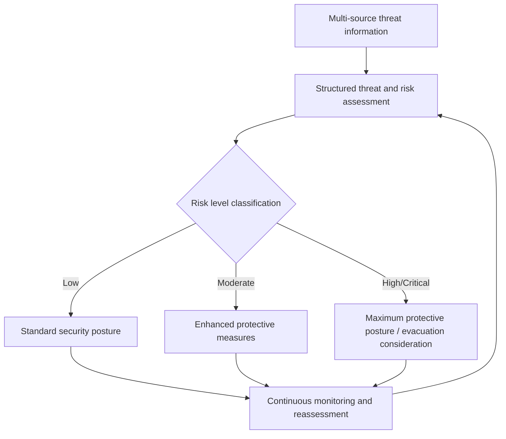
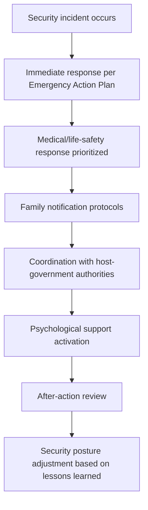

## Security Management for Diplomatic Personnel

### Definition and Scope

Security management for diplomatic personnel is the systematic discipline of protecting diplomatic staff, their families, mission facilities, and sensitive information from physical, informational, and operational threats across the full range of diplomatic postings and activities. It encompasses physical security infrastructure, personnel security protocols, information and communications security, threat assessment and intelligence integration, and crisis response planning — combining elements of protective security, risk management, and institutional duty-of-care obligations within a single integrated leadership function.

### Why Security Management Is a Distinctive Leadership Priority

**Key Points**

- Diplomatic personnel and facilities occupy a distinctive threat position: simultaneously protected under international law (Vienna Convention on Diplomatic Relations) and, in many contexts, symbolically and practically targeted precisely because of that representative status.
- Threat environments vary enormously across postings, requiring security management approaches calibrated to genuinely differentiated risk levels rather than uniform protocol application.
- Security failures carry consequences extending beyond the immediate personnel affected — to bilateral relationship damage, institutional credibility, and broader diplomatic mission viability in a given context.
- Mission leadership bears direct duty-of-care responsibility for personnel safety, creating both a legal/institutional accountability dimension and a profound leadership responsibility distinct from most administrative functions.

### Threat Landscape and Risk Assessment

#### Categories of Threat

| Threat Category | Description | Representative Examples |
| --- | --- | --- |
| Terrorism | Deliberate attacks targeting diplomatic personnel or facilities for political/ideological purposes | Facility attacks, kidnapping, targeted assassination |
| Criminal activity | Threats driven by financial or opportunistic criminal motive rather than political targeting | Robbery, kidnapping for ransom, burglary |
| Civil unrest | Threats arising from broader host-country political instability rather than direct targeting of the mission | Riots, protests turning violent, general breakdown of public order |
| State-sponsored threats | Hostile action by host-government or third-country state actors | Surveillance, harassment, detention, coercive pressure on personnel |
| Cyber and information threats | Attacks targeting mission information systems and communications | Network intrusion, phishing, communications interception |
| Natural and environmental hazards | Non-malicious but significant risk to personnel safety | Earthquakes, severe weather, disease outbreak, infrastructure failure |
| Insider threats | Security risks originating from personnel with legitimate access | Espionage, information compromise, negligent security practice |

#### Structured Threat and Risk Assessment

Effective security management requires continuous, structured threat assessment integrating multiple information sources (host-government liaison, intelligence community input, local security contractor reporting, open-source monitoring) to produce a dynamically updated risk picture, rather than relying on a static, periodically refreshed assessment disconnected from evolving conditions — directly connecting to the intelligence analysis and risk assessment disciplines discussed elsewhere in this curriculum.

### Physical Security Infrastructure

#### Facility Hardening

Physical protective measures for mission facilities, typically including perimeter security (fencing, vehicle barriers, setback distances from public roadways), access control systems, blast-resistant construction standards in higher-threat contexts, and layered security zones distinguishing public-access, controlled-access, and restricted areas within a facility.

#### Residential Security

Protective measures extending to diplomatic personnel housing, particularly in higher-threat postings — ranging from basic physical security upgrades (secure doors, alarm systems, safe-haven rooms) to, in the highest-threat contexts, dedicated residential security personnel and protective details.

#### Protective Details and Personal Security

In elevated-threat contexts, dedicated protective security personnel for senior diplomatic officials or personnel facing specific individual threat indicators — a resource-intensive measure requiring careful threat-based prioritization given the substantial cost and operational footprint of sustained personal protective details.

### Personnel Security Protocols

#### Movement Security

Structured protocols governing personnel movement in higher-threat environments — varied routing to avoid predictable patterns, secure transportation standards, movement notification and tracking systems, and restrictions on movement during periods of elevated threat.

#### Personal Security Awareness Training

Training diplomatic personnel and accompanying family members in situational awareness, surveillance detection, and appropriate response protocols — recognizing that individual behavior and awareness constitute a meaningful layer of protection alongside institutional physical security measures, particularly relevant given that personnel often face genuine security risk during personal, non-official activity outside formal mission security perimeters.

#### Family Security Considerations

Security planning that explicitly accounts for accompanying family members, including dependent children's school security, spousal employment and movement patterns, and family-specific emergency response protocols — an often underweighted dimension of security planning relative to its practical importance to overall personnel wellbeing and mission effectiveness [Inference].

### Information and Communications Security

#### Classification and Information Handling

Systematic protocols for classifying and handling sensitive diplomatic information, governing storage, transmission, and access based on sensitivity level — foundational to protecting both the substantive content of diplomatic communication and the safety of sources and personnel referenced within it.

#### Cybersecurity

Protection of mission information systems and communications infrastructure against network intrusion, phishing, and other cyber threats — an increasingly central and resource-intensive security domain given the growing sophistication of state-sponsored and criminal cyber threat actors targeting diplomatic communications specifically for their intelligence value.

#### Secure Communications Infrastructure

Dedicated secure communication systems for sensitive diplomatic reporting and coordination, distinct from routine unclassified communication channels, reflecting the layered sensitivity of diplomatic information across different classification levels.

#### Technical Surveillance Countermeasures

Systematic efforts to detect and mitigate covert surveillance of mission facilities and communications, particularly relevant in high-threat or adversarial host-country contexts where technical espionage risk is elevated.

### Crisis and Emergency Security Response

**Key Points**

- **Emergency Action Plans** (see also Running an Embassy or Diplomatic Mission) provide the operational framework linking security threat escalation to specific institutional response protocols.
- **Duty officer and alert systems**: continuous around-the-clock capability to receive, assess, and respond to emerging security threats outside normal business hours.
- **Evacuation planning and thresholds**: pre-established criteria and logistical planning for partial or full mission drawdown under deteriorating security conditions, requiring advance coordination given the operational complexity of evacuating personnel and, where applicable, dependent family members under time pressure.
- **Post-incident response**: structured protocols for managing the aftermath of a security incident, including medical response, family notification, psychological support, and after-action review to inform future security posture adjustments.

### Coordination with Host-Government Security Authorities

Diplomatic missions operate within a framework requiring host-government cooperation for aspects of physical security (under obligations set out in the Vienna Convention on Diplomatic Relations regarding host-state responsibility to protect diplomatic missions), while simultaneously maintaining independent mission-controlled security measures. Effective security management requires sustained, proactive relationship-building with host-government security and law enforcement counterparts — relationship capital that, consistent with broader trust-building principles discussed elsewhere in this curriculum, is best established during stable periods rather than constructed reactively during an active crisis.

### Risk-Based Resource Allocation for Security

Given that security budgets are frequently constrained relative to the full range of theoretically beneficial protective measures, security management requires disciplined risk-based prioritization:

$$\text{Security Investment Priority} \approx f(\text{Threat Likelihood}, \text{Consequence Severity}, \text{Mitigation Cost-Effectiveness})$$

This connects directly to the risk assessment and prioritization matrix methodology discussed in Risk Assessment and Uncertainty Management, applied specifically to the security domain — prioritizing investment toward high-likelihood, high-consequence risks where cost-effective mitigation is available, rather than attempting uniform maximum protection across all theoretically conceivable threats.

### Balancing Security and Diplomatic Effectiveness

A persistent tension in security management is balancing genuinely necessary protective measures against the risk that excessive security posture can impede the relationship-building and accessibility that effective diplomatic engagement often requires — a fortress-like mission posture can inadvertently undermine public diplomacy and host-government relationship objectives even as it enhances physical protection. Effective security leadership requires calibrated judgment rather than defaulting to maximum protective posture regardless of context, informed by genuine risk assessment rather than either complacency or excessive risk-aversion [Inference].

### Common Pitfalls

- **Static threat assessment**: treating security risk assessment as a periodic compliance exercise rather than a continuously updated operational discipline.
- **Underinvestment in family security planning**: focusing security planning narrowly on official personnel while underweighting the practical security needs of accompanying family members.
- **Insufficient host-government relationship investment**: failing to build proactive security-related relationships with host-government counterparts before a crisis requires urgent cooperation.
- **Security-diplomacy imbalance**: allowing security posture to become so restrictive that it undermines the mission's core relationship-building and engagement functions without commensurate risk justification.
- **Emergency Action Plan atrophy**: treating crisis response plans as static compliance documents rather than genuinely rehearsed, regularly updated operational capabilities.
- **Neglecting insider threat and information security discipline**: focusing security attention primarily on external physical threats while underweighting information security and insider threat risk.
- **Uniform protocol application regardless of differentiated risk**: applying identical security measures across postings with genuinely different threat profiles, misallocating limited security resources.

### Illustrative Security Management Framework

<svg xmlns="http://www.w3.org/2000/svg" viewBox="0 0 700 260">
<title>Integrated Diplomatic Security Management Framework (svg_diagram)</title>
<rect width="700" height="260" fill="#ffffff" stroke="#cccccc" />
<text x="20" y="28" font-size="14" font-weight="bold" fill="#222222">Integrated Security Management Framework (svg_diagram)</text>
<circle cx="350" cy="150" r="50" fill="#eaf2f8" stroke="#2874a6" stroke-width="2" />
<text x="310" y="145" font-size="10" fill="#2874a6">Threat/risk</text>
<text x="315" y="160" font-size="10" fill="#2874a6">assessment</text>
<rect x="30" y="60" width="140" height="40" rx="6" fill="#eafaf1" stroke="#1e8449" stroke-width="1.5" />
<text x="45" y="85" font-size="10" fill="#1e8449">Physical security</text>
<rect x="30" y="200" width="140" height="40" rx="6" fill="#eafaf1" stroke="#1e8449" stroke-width="1.5" />
<text x="45" y="225" font-size="10" fill="#1e8449">Personnel protocols</text>
<rect x="530" y="60" width="140" height="40" rx="6" fill="#fdf2e3" stroke="#d68910" stroke-width="1.5" />
<text x="545" y="85" font-size="10" fill="#d68910">Information/cyber</text>
<rect x="530" y="200" width="140" height="40" rx="6" fill="#fdf2e3" stroke="#d68910" stroke-width="1.5" />
<text x="545" y="225" font-size="10" fill="#d68910">Crisis response</text>
<line x1="170" y1="80" x2="300" y2="130" stroke="#333333" stroke-width="1.2" />
<line x1="170" y1="220" x2="300" y2="170" stroke="#333333" stroke-width="1.2" />
<line x1="530" y1="80" x2="400" y2="130" stroke="#333333" stroke-width="1.2" />
<line x1="530" y1="220" x2="400" y2="170" stroke="#333333" stroke-width="1.2" />
</svg>

### Practical Recommendations

- **Maintain continuous, multi-source threat assessment** rather than treating security review as a periodic compliance exercise.
- **Extend security planning explicitly to accompanying family members**, not solely official personnel.
- **Build host-government security relationships proactively during stable periods**, given their critical importance during crisis response.
- **Apply risk-based, differentiated resource allocation** rather than uniform protocol application across genuinely different threat environments.
- **Regularly rehearse Emergency Action Plans** as operational capability, not static documentation.
- **Calibrate security posture to avoid undermining core diplomatic engagement functions**, balancing protection with mission effectiveness through genuine risk-informed judgment.

**Related Topics**

- Running an Embassy or Diplomatic Mission
- Risk Assessment and Uncertainty Management
- Crisis Anticipation and Contingency Planning
- Diplomatic Privileges and Immunities Under International Law
- Intelligence Analysis and Information Synthesis
- Managing Diplomatic Staff and Interagency Teams