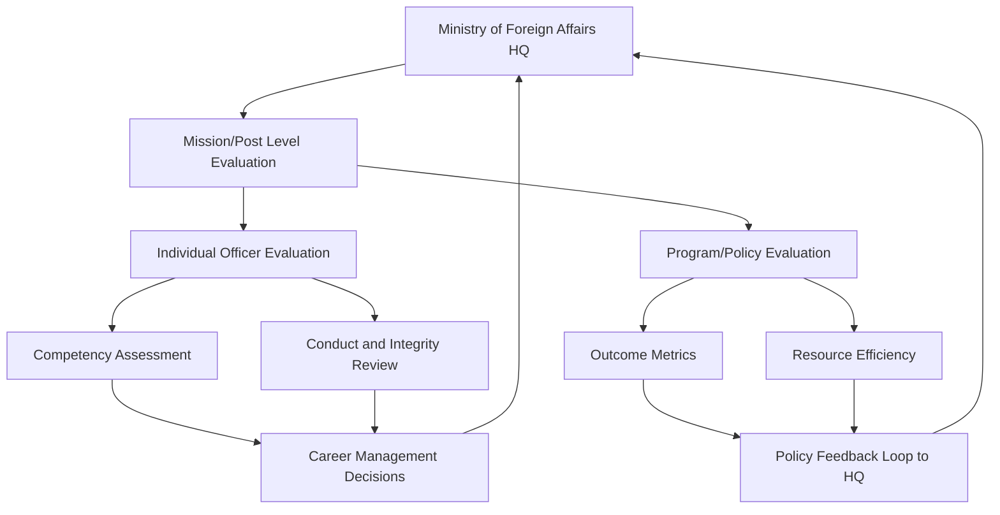
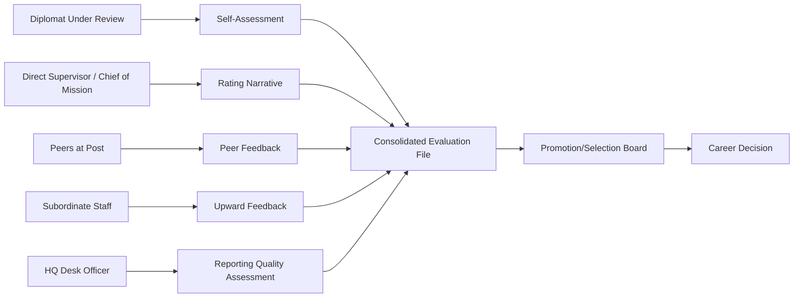

## Performance Evaluation in Diplomatic Institutions

### Overview

Performance evaluation in diplomatic institutions is the structured process by which foreign ministries, embassies, and multilateral missions assess the effectiveness, conduct, and developmental progress of diplomatic personnel and, at an aggregate level, of missions themselves. Unlike conventional corporate appraisal systems, diplomatic performance evaluation must account for classified or sensitive work, politically ambiguous outcomes, long feedback cycles (negotiations or relationship-building may take years to bear fruit), and dual accountability to both the sending state's foreign ministry and, informally, to host-country relationships.

### Purpose and Functions

**Key Points**

- **Accountability**: Ensures diplomats and missions are answerable for the use of public resources and the pursuit of national interests.
- **Career Management**: Informs promotion, posting rotation, and assignment to specialized tracks (economic, political, consular, public diplomacy).
- **Talent Development**: Identifies skill gaps and training needs (negotiation, language proficiency, crisis management).
- **Institutional Learning**: Aggregated evaluations feed into ministry-level policy review and best-practice dissemination.
- **Risk Management**: Flags conduct issues, security lapses, or ethical breaches before they escalate into diplomatic incidents.

### Levels of Evaluation

Diplomatic performance evaluation typically operates at three interlocking levels:

1. **Individual Officer Level** — Annual or biannual appraisal of a diplomat's competencies, deliverables, and conduct.
2. **Mission/Post Level** — Evaluation of an embassy, consulate, or permanent mission as an organizational unit (efficiency, bilateral outcomes, resource use).
3. **Program/Policy Level** — Assessment of specific initiatives (e.g., a trade negotiation round, a public diplomacy campaign, a humanitarian response).

### Core Evaluation Criteria

**Key Points**

- **Substantive Competence**: Quality of political/economic analysis, reporting accuracy, and policy recommendations.
- **Negotiation Effectiveness**: Ability to advance national interests in bilateral or multilateral settings, often assessed through case reviews rather than hard metrics.
- **Relationship Management**: Depth and utility of the diplomat's network with host-government officials, civil society, and other missions.
- **Administrative and Leadership Skills**: For senior officers, management of staff, budget discipline, and mission morale.
- **Language and Cultural Proficiency**: Measured through standardized proficiency scales (e.g., the U.S. Foreign Service Institute's [ILR scale](https://www.govtilr.org/), or similar frameworks used by other ministries).
- **Conduct and Integrity**: Adherence to codes of conduct, protocol, and confidentiality obligations under instruments such as the [Vienna Convention on Diplomatic Relations](https://legal.un.org/ilc/texts/instruments/english/conventions/9_1_1961.pdf) (1961).
- **Crisis Response**: Performance during emergencies (evacuations, natural disasters, political unrest).

### Common Evaluation Instruments

| Instrument | Description | Typical Use |
| --- | --- | --- |
| Annual Performance Appraisal (APA) | Structured written review by supervisor, often with self-assessment component | Most foreign services (career track officers) |
| 360-Degree Feedback | Input gathered from peers, subordinates, and sometimes host-country counterparts | Senior leadership and management-track evaluation |
| Promotion Boards / Selection Boards | Panel-based review comparing officers across a cohort for promotion eligibility | U.S. Foreign Service, UK Diplomatic Service, and similar merit-based systems |
| Post Inspection Reports | Periodic audits of an entire mission's operations, conducted by an internal Inspector General or equivalent | Institutional-level accountability |
| Management by Objectives (MBO) | Officers and supervisors jointly set measurable goals at the start of a cycle, reviewed at the end | Mission-level program management |
| 360-degree plus Chief of Mission Rating | Ambassador's direct rating combined with peer input | Common in career Foreign Service systems |

### Illustrative Framework: U.S. Foreign Service EER System

The U.S. Department of State's Employee Evaluation Report (EER) exemplifies a formalized diplomatic evaluation instrument.

**Example**

- Officers draft a self-assessment narrative describing accomplishments against pre-set work requirements.
- A **Rating Officer** (direct supervisor) provides narrative commentary and forwards it to a **Reviewing Officer** (next-level supervisor).
- The completed EER feeds into a centralized **Selection Board** process, where panels of senior officers rank candidates for promotion within specific cones (political, economic, consular, management, public diplomacy).
- Promotion Boards apply relative-ranking methodology, comparing officers against peers at the same grade rather than against an absolute standard.

[Inference] The relative-ranking (forced distribution) approach used in boards of this kind tends to create strong incentives for narrative differentiation in self-assessments, which is a recognized critique of similar systems in comparative public administration literature.

### Metrics and Indicators

Diplomatic outcomes are frequently qualitative, so institutions blend quantitative and qualitative indicators:

**Quantitative Indicators**

- Number and timeliness of cables/reports submitted
- Visa/consular case processing times and error rates
- Budget variance and procurement compliance
- Number of high-level meetings facilitated
- Trade or investment figures attributable to economic diplomacy efforts

**Qualitative Indicators**

- Narrative assessment of negotiation outcomes
- Peer and host-government perception (informal, but often influential)
- Quality of political/economic reporting as judged by desk officers at headquarters
- Contribution to policy formulation

$$\text{Composite Score} = w_1 \cdot Q_{\text{quant}} + w_2 \cdot Q_{\text{qual}} + w_3 \cdot C_{\text{conduct}}$$

Where $w_1, w_2, w_3$ are ministry-defined weightings, $Q_{\text{quant}}$ represents normalized quantitative indicators, $Q_{\text{qual}}$ represents panel-scored qualitative assessment, and $C_{\text{conduct}}$ represents a conduct/integrity multiplier or modifier. [Inference] This weighted-composite approach is a generalized model reflecting common practice; exact formulas are rarely published by foreign ministries and vary by country.

### Challenges Unique to Diplomatic Evaluation

**Key Points**

- **Attribution Problem**: Diplomatic outcomes (e.g., a trade deal, a peace accord) result from multi-actor processes, making individual attribution difficult.
- **Long Time Horizons**: Relationship-building and trust generation may not yield visible results within a single posting cycle (typically 2–4 years).
- **Confidentiality Constraints**: Much substantive work (intelligence liaison, sensitive negotiations) cannot be fully documented in an evaluation record.
- **Cross-Cultural Bias**: Raters may unconsciously penalize officers whose diplomatic style (indirect vs. direct communication) differs from the evaluator's cultural norms.
- **Politicization Risk**: Evaluations can be influenced by political appointees or factional loyalty rather than merit, particularly in systems with significant political-appointee presence (e.g., ambassadorial appointments).
- **Rotational Discontinuity**: Frequent staff rotation (often every 2–3 years) disrupts continuity of evaluation and institutional memory.

### Comparative Institutional Models

**United States (Department of State)**

Formalized EER and Selection Board system, tenure and promotion tied closely to competitive boards; up-or-out promotion timelines exist for certain grades.

**United Kingdom (Foreign, Commonwealth & Development Office)**

Uses a Civil Service-wide performance framework, with objectives set against the FCDO's core competency framework, calibrated across grades through moderation panels.

**European External Action Service (EEAS)**

Blends EU civil service appraisal rules with diplomatic-specific competencies; annual appraisal reports feed into reclassification/promotion exercises.

**United Nations System**

Uses instruments such as the Performance Appraisal System (PAS) or, more recently, results-based management frameworks tied to UN Secretariat staff regulations; evaluation is complicated by the multinational, seconded nature of diplomatic-adjacent UN staff.

[Unverified] Specific current internal procedures for any single ministry may have changed since publicly available descriptions were last updated; official current-year circulars should be consulted for procedural specifics.

### 360-Degree and Multi-Source Feedback Architecture

### Mission-Level Inspection Process

Post/mission-level evaluation typically follows a structured inspection cycle conducted by an internal oversight body (e.g., an Office of Inspector General).

**Example**

1. **Pre-Inspection Review**: Desk officers and financial auditors compile background data on the mission's budget, staffing, and prior inspection findings.
2. **On-Site Inspection**: A team visits the post, interviews staff, reviews security compliance, and audits consular/financial operations.
3. **Draft Report**: Findings are compiled into strengths, weaknesses, and formal recommendations.
4. **Mission Response**: The Chief of Mission responds to findings, often committing to corrective action timelines.
5. **Follow-Up**: A subsequent inspection or compliance check verifies remediation.

### Integrity and Conduct Review

Diplomatic conduct evaluation intersects with codes of ethics and, in many systems, anti-corruption oversight. Reviewers assess:

- Conflicts of interest (e.g., business dealings with host-country entities)
- Compliance with financial disclosure requirements
- Use of diplomatic privileges (customs, immunity) in accordance with the Vienna Convention
- Interpersonal conduct, including harassment and workplace climate concerns

[Inference] Because breaches of conduct can carry reputational risk disproportionate to their scale, many institutions apply a lower evidentiary threshold for conduct-related evaluation flags than for substantive performance ratings, though exact thresholds are institution-specific and not always publicly documented.

### Technology and Digital Evaluation Systems

Modern foreign ministries increasingly use digital human-resource platforms to manage evaluation workflows:

**Key Points**

- **e-Performance Portals**: Centralized systems for submitting self-assessments, supervisor ratings, and tracking promotion board timelines (analogous to SAP SuccessFactors or custom government HR systems).
- **Data Analytics for Aggregate Trends**: HQ units analyze evaluation data across posts to detect systemic issues (e.g., consistently low morale scores at a specific mission).
- **Secure Handling**: Given the sensitivity of personnel files, these systems require strict access controls, often segregated from general government IT infrastructure.

[Speculation] The adoption of AI-assisted drafting tools for narrative evaluation writing is an emerging trend across public-sector HR generally; specific adoption rates within foreign ministries are not well documented in available literature and should be treated as an emerging practice rather than an established standard.

### Sample Evaluation Rubric Structure

**Example**

| Competency Area | Rating Scale | Weight |
| --- | --- | --- |
| Policy Analysis & Reporting | 1–5 | 25% |
| Negotiation & Advocacy | 1–5 | 20% |
| Interpersonal & Network Building | 1–5 | 15% |
| Leadership & Management (if applicable) | 1–5 | 15% |
| Language/Cultural Proficiency | 1–5 | 10% |
| Conduct & Integrity | Pass/Fail gate | Gating |
| Crisis/Adaptability | 1–5 | 15% |

A "Fail" on the Conduct & Integrity gate typically overrides an otherwise strong composite score, reflecting the zero-tolerance posture most ministries adopt toward ethical breaches.

### Diagram: Evaluation Cycle Timeline (SVG)

<svg xmlns="http://www.w3.org/2000/svg" viewBox="0 0 800 220">
<text x="400" y="25" font-size="16" font-weight="bold" text-anchor="middle" fill="#1a1a1a">Diplomatic Performance Evaluation Cycle (svg_diagram)</text>
<line x1="50" y1="120" x2="750" y2="120" stroke="#333" stroke-width="2" />
<circle cx="90" cy="120" r="8" fill="#2563eb" />
<text x="90" y="150" font-size="12" text-anchor="middle">Goal Setting</text>
<text x="90" y="165" font-size="10" text-anchor="middle" fill="#555">(Start of Cycle)</text>
<circle cx="250" cy="120" r="8" fill="#2563eb" />
<text x="250" y="150" font-size="12" text-anchor="middle">Mid-Cycle Check-in</text>
<circle cx="410" cy="120" r="8" fill="#2563eb" />
<text x="410" y="150" font-size="12" text-anchor="middle">Self-Assessment</text>
<circle cx="560" cy="120" r="8" fill="#2563eb" />
<text x="560" y="150" font-size="12" text-anchor="middle">Supervisor Rating</text>
<circle cx="710" cy="120" r="8" fill="#2563eb" />
<text x="710" y="150" font-size="12" text-anchor="middle">Board Review</text>
<text x="710" y="165" font-size="10" text-anchor="middle" fill="#555">(Promotion Decision)</text>
<path d="M90 100 Q 170 60 250 100" stroke="#9ca3af" stroke-width="1.5" fill="none" stroke-dasharray="4,3" />
<path d="M410 100 Q 480 60 560 100" stroke="#9ca3af" stroke-width="1.5" fill="none" stroke-dasharray="4,3" />
</svg>

### Reform Debates and Criticism

**Key Points**

- **Merit vs. Loyalty Tension**: Critics argue that political appointees at senior levels (ambassadorships awarded for political reasons in some systems) can distort meritocratic evaluation norms.
- **Forced-Ranking Critique**: Relative-ranking promotion boards are criticized for discouraging collaboration, as officers may be indirectly compared against colleagues at the same post.
- **Diversity and Bias Concerns**: Studies and internal reviews in several foreign services have raised concerns about rating disparities by gender, race, or origin of officer; ministries have introduced bias-awareness training for raters in response. [Unverified: specific statistics vary by country and year and should be checked against current official reports.]
- **Outcome vs. Effort Measurement**: Ongoing debate over whether evaluations should reward measurable outcomes (deals signed, treaties concluded) versus process quality (thoroughness of analysis, relationship cultivation) given the long lag between diplomatic effort and visible outcome.

### Conclusion

Performance evaluation in diplomatic institutions must reconcile the need for rigorous accountability with the inherently ambiguous, long-horizon, and often confidential nature of diplomatic work. Effective systems combine structured quantitative metrics, narrative qualitative review, multi-source feedback, and strict conduct gating, while remaining sensitive to the attribution and cross-cultural challenges unique to foreign service work. Institutional maturity is often reflected not in the sophistication of the rubric itself, but in the credibility, consistency, and perceived fairness with which it is applied across postings and grades.

**Related Topics**

- Promotion and Career Path Structures in Foreign Services
- Code of Conduct and Ethics Enforcement in Diplomatic Missions
- Mission Inspection and Internal Audit Mechanisms
- Talent Management and Officer Rotation Policy
- Cross-Cultural Competency Assessment for Diplomats
- Political Appointee vs. Career Officer Evaluation Models
- Results-Based Management in Multilateral Diplomacy
- Leadership Development Programs for Senior Diplomats
- Whistleblower and Grievance Mechanisms in Foreign Ministries
- Digital Transformation of Diplomatic HR Systems