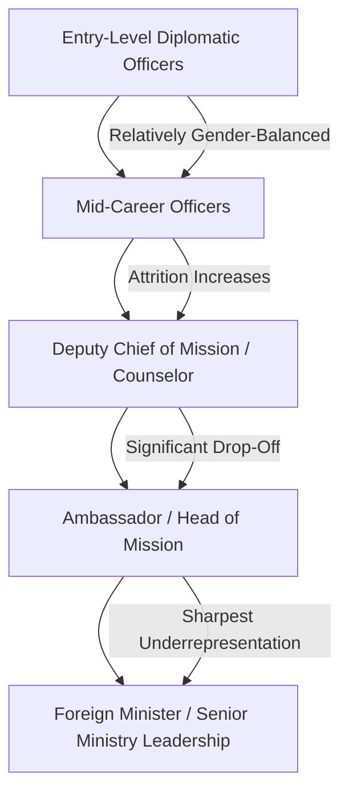
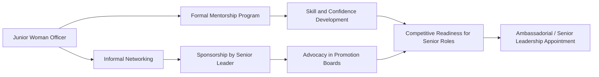

## Women in Diplomacy and Leadership Pathways

### Overview

Women in Diplomacy and Leadership Pathways examines the historical trajectory, structural barriers, institutional reforms, and career mechanisms shaping women's advancement into senior diplomatic and foreign policy leadership roles. This encompasses ambassadorial appointments, foreign ministry leadership, multilateral organization posts, and the policy frameworks (quotas, mentorship programs, family-support policies) designed to close persistent gender gaps in representation, particularly at the highest ranks.

### Historical Context

**Key Points**

- Women were formally excluded from most diplomatic services until the mid-20th century; many foreign ministries only began admitting women to career diplomatic tracks in the 1970s–1980s.
- Early barriers included marriage bars (requiring female diplomats to resign upon marriage), a policy that persisted in several Western foreign services (including the U.S. and UK) into the 1970s.
- Alexandra Kollontai (Soviet Union) is frequently cited as one of the first women to hold ambassadorial rank in the modern era (Norway, 1923).
- The proportion of women in ambassadorial roles has increased substantially since the 1990s but remains below parity in the majority of foreign services globally.

[Unverified] Specific historical dates and "firsts" vary by source and by how "diplomat" or "ambassador" is defined (career vs. political appointee); figures cited here reflect commonly referenced benchmarks in diplomatic history literature and should be cross-checked against primary ministry archives for precision.

### Current State of Representation

Global data consistently show a "pyramid" pattern: women are relatively well-represented at entry and mid-career levels but underrepresented at the ambassadorial and senior-leadership tiers.

**Key Points**

- Multiple studies by organizations such as the [Council on Foreign Relations](https://www.cfr.org/) and national foreign ministries' own diversity reports document a persistent "leaky pipeline," where attrition of women accelerates at mid-to-senior career stages.
- Representation varies significantly by country and region; Nordic countries and Canada have historically reported higher proportions of women in ambassadorial roles compared to global averages.
- Multilateral bodies (UN, EU institutions) have set explicit gender-parity targets for senior appointments, with mixed progress toward full parity.

[Inference] Because publicly available representation statistics change year to year and are updated by individual foreign ministries and multilateral bodies at different intervals, any specific current percentage should be verified against the most recent official report rather than treated as a fixed figure.

### Structural Barriers

**Key Points**

- **Mobility and Family Constraints**: Frequent international rotation conflicts with dual-career partnerships and childcare responsibilities, disproportionately affecting women in many social contexts.
- **Unequal Access to "Prestige" Postings**: Assignments to hardship posts or high-visibility political/economic roles (which build promotion-relevant experience) have historically been allocated unevenly.
- **Informal Networks**: Senior sponsorship and mentorship relationships, historically male-dominated, can limit access to informal career advancement channels.
- **Bias in Evaluation**: Cross-cultural and gender bias in performance evaluation and promotion board processes (see also: Performance Evaluation in Diplomatic Institutions).
- **Host-Country Protocol Norms**: In some postings, host-society gender norms can complicate a female diplomat's ability to access certain official counterparts or informal networking spaces.
- **Security and Safety Concerns**: Certain hardship or conflict-zone postings carry gender-specific safety considerations that may factor into assignment decisions, sometimes in ways that inadvertently limit career-building opportunities.

### Institutional Reform Mechanisms

**Example**

| Mechanism | Description | Illustrative Adopters |
| --- | --- | --- |
| Gender Parity Targets | Numeric goals for women in ambassadorial or senior roles by a target year | Canada's Feminist International Assistance Policy; EU gender balance targets for Heads of Delegation |
| Sponsorship Programs | Formal pairing of senior leaders with high-potential women officers for career advocacy | Various national foreign services and multilateral bodies |
| Flexible/Tandem Posting Policies | Accommodating dual-career diplomatic couples or spousal employment support | U.S. Department of State's Family Liaison Office; EEAS tandem couple policies |
| Unconscious Bias Training | Mandatory training for promotion board members and raters | Widely adopted across OECD-country foreign ministries |
| Feminist Foreign Policy Frameworks | National policy frameworks explicitly embedding gender equality into foreign policy objectives and, indirectly, institutional HR practice | Sweden (originator, though later revised), Canada, Mexico, Germany, France, Chile |
| Parental Leave and Childcare Support at Post | Policies ensuring postings do not penalize parental leave uptake in evaluation cycles | Varies significantly by ministry |

### Feminist Foreign Policy as an Institutional Lever

Feminist Foreign Policy (FFP) frameworks, beginning with Sweden's 2014 announcement, have been adopted or referenced by a growing number of states to varying degrees. While primarily framed as a foreign-policy orientation (applying a gender lens to diplomacy, aid, trade, and security), FFP frameworks often carry parallel institutional commitments to increasing women's representation in the diplomatic corps itself.

[Inference] The degree to which FFP commitments translate into measurable internal-leadership gains (as opposed to external policy focus) varies substantially by country and is a subject of ongoing academic and policy evaluation rather than settled consensus.

### Leadership Pathway Models

**Key Points**

- **Career Track Progression**: Standard rotational advancement through grades, requiring competitive selection boards at each promotion threshold (see Performance Evaluation in Diplomatic Institutions for evaluation mechanics).
- **Political Appointment Track**: In systems where ambassadorships can be politically appointed (e.g., a portion of U.S. ambassadorial posts), advocacy and visibility outside the career service can also serve as a pathway, though this track has its own gender-representation dynamics.
- **Multilateral/International Organization Track**: Parallel pathway through UN agencies, EU institutions, or regional bodies, sometimes offering different advancement dynamics than bilateral national services.
- **Lateral Entry from Academia, Law, or Civil Society**: Some foreign services allow senior lateral entry, which can serve as an alternate pathway for women with relevant expertise who did not enter via the traditional junior-officer track.

### Mentorship and Sponsorship Architecture

**Key Points on Mentorship vs. Sponsorship**

- **Mentorship** provides guidance, feedback, and skill development but does not necessarily involve active advocacy in promotion decisions.
- **Sponsorship** involves a senior leader actively using their own credibility and influence to advocate for a candidate's advancement — research in organizational leadership literature (outside the diplomatic field specifically) suggests sponsorship has a stronger causal link to promotion outcomes than mentorship alone. [Inference] This finding originates primarily from broader corporate leadership research; its direct applicability to diplomatic promotion boards specifically is a reasonable extension but not a diplomatic-sector-specific empirical finding.

### Notable Structural Case Studies

**Example**

- **Nordic Model**: Countries such as Sweden and Norway have combined generous parental leave policies, tandem-posting accommodations, and explicit internal diversity targets, frequently cited as producing comparatively higher female ambassadorial representation.
- **Canada's Feminist International Assistance Policy (2017)**: Paired external policy commitments with internal Global Affairs Canada targets for women in leadership roles, including Heads of Mission.
- **EU External Action Service**: Has published internal gender balance targets for Head of Delegation appointments, with periodic public reporting on progress.
- **U.S. Department of State**: Has implemented tandem-couple accommodation policies and internal affinity/mentorship groups (e.g., Foreign Service women's associations), alongside broader Diversity and Inclusion Strategic Plans.

[Unverified] Specific current-year statistics or policy statuses for any of the above should be checked against the respective ministry's most recent official publication, as targets, leadership, and reporting frequently update annually.

### Intersectionality Considerations

**Key Points**

- Gender barriers in diplomatic leadership frequently intersect with other axes of identity — race, ethnicity, disability, LGBTQ+ status, and socioeconomic background — compounding representation gaps for women who hold multiple marginalized identities.
- Some foreign ministries have begun disaggregating diversity data beyond binary gender metrics to capture intersectional representation gaps, though this practice is not yet universal.
- Diplomatic postings in states with restrictive social or legal environments can pose distinct challenges for LGBTQ+ women diplomats and their families, an area increasingly addressed in duty-of-care policy frameworks.

### Measurement and Accountability Frameworks

**Example**

| Metric | Purpose |
| --- | --- |
| % Women in Ambassadorial/HOM Roles | Headline representation indicator |
| % Women in Deputy Chief of Mission Roles | Pipeline health indicator |
| Attrition Rate by Gender at Mid-Career | Identifies "leaky pipeline" stages |
| % Women on Promotion Boards | Assesses decision-making body composition |
| Time-to-Promotion by Gender | Detects potential pacing disparities |
| Post-Assignment Gender Distribution (hardship vs. non-hardship) | Assesses equitable access to career-building postings |

$$\text{Representation Gap}_{\text{level}} = P_{\text{entry}} - P_{\text{level}}$$

Where $P_{\text{entry}}$ is the proportion of women at entry level and $P_{\text{level}}$ is the proportion at a given senior level; a widening gap across successive levels indicates pipeline attrition rather than entry-level exclusion. [Inference] This is a standard analytical framing used in workforce pipeline analysis generally; exact formulations used internally by specific foreign ministries may differ.

### Diagram: Barriers and Interventions Map (SVG)

<svg xmlns="http://www.w3.org/2000/svg" viewBox="0 0 800 320">
<text x="400" y="25" font-size="16" font-weight="bold" text-anchor="middle" fill="#1a1a1a">Barriers and Institutional Interventions (svg_diagram)</text>
<rect x="40" y="60" width="320" height="220" fill="none" stroke="#dc2626" stroke-width="1.5" rx="8" />
<text x="200" y="85" font-size="13" font-weight="bold" text-anchor="middle" fill="#dc2626">Structural Barriers</text>
<text x="60" y="115" font-size="11" fill="#333">- Mobility/family conflict</text>
<text x="60" y="140" font-size="11" fill="#333">- Unequal prestige postings</text>
<text x="60" y="165" font-size="11" fill="#333">- Informal male networks</text>
<text x="60" y="190" font-size="11" fill="#333">- Evaluation bias</text>
<text x="60" y="215" font-size="11" fill="#333">- Host-norm constraints</text>
<text x="60" y="240" font-size="11" fill="#333">- Safety/security factors</text>
<rect x="440" y="60" width="320" height="220" fill="none" stroke="#16a34a" stroke-width="1.5" rx="8" />
<text x="600" y="85" font-size="13" font-weight="bold" text-anchor="middle" fill="#16a34a">Institutional Interventions</text>
<text x="460" y="115" font-size="11" fill="#333">- Parity targets</text>
<text x="460" y="140" font-size="11" fill="#333">- Sponsorship programs</text>
<text x="460" y="165" font-size="11" fill="#333">- Tandem posting policy</text>
<text x="460" y="190" font-size="11" fill="#333">- Bias training for boards</text>
<text x="460" y="215" font-size="11" fill="#333">- Feminist foreign policy</text>
<text x="460" y="240" font-size="11" fill="#333">- Parental leave protection</text>
<path d="M360 170 L 440 170" stroke="#2563eb" stroke-width="2" marker-end="url(#arrow)" />
</svg>

### Debates and Open Questions

**Key Points**

- **Quotas vs. Merit-Based Advocacy**: Ongoing policy debate over whether formal numeric targets/quotas are more effective than culture-change and bias-mitigation approaches, with critics of quotas raising concerns about perceived legitimacy of appointments.
- **Measuring Feminist Foreign Policy Impact**: Scholars and practitioners continue to debate appropriate metrics for assessing whether FFP frameworks produce substantive internal institutional change versus primarily symbolic external positioning.
- **Global Variation**: Pathways and barriers differ substantially by country, political system, and cultural context; a single global model does not adequately describe all foreign services.
- **Retention vs. Recruitment Focus**: Increasing debate over whether institutional resources are better directed toward recruiting more women at entry level or addressing the specific structural factors driving mid-career attrition.

### Conclusion

Advancing women into diplomatic leadership requires addressing both the front-end recruitment pipeline and, more critically, the structural and cultural barriers that produce disproportionate attrition at mid-to-senior career stages. Effective institutional reform tends to combine measurable accountability mechanisms (parity targets, disaggregated data tracking), structural accommodations (tandem posting, parental leave protection), and cultural interventions (sponsorship, bias training). Sustainable progress depends on integrating these mechanisms directly into core career-management processes — including performance evaluation and promotion board design — rather than treating gender equity as a parallel or supplementary initiative.

**Next Steps**

- Comparative Analysis of Feminist Foreign Policy Frameworks by Country
- Intersectionality in Diplomatic Diversity Data Collection
- Tandem Career Couples and Dual-Diplomat Household Policy
- Sponsorship vs. Mentorship Program Design in Foreign Services
- Gender Bias in Promotion Board Decision-Making
- Duty-of-Care Policy for LGBTQ+ Diplomats in Restrictive Postings
- Women's Leadership in Multilateral Institutions (UN, EU, AU)
- Case Study: Nordic Model of Gender-Balanced Diplomatic Corps