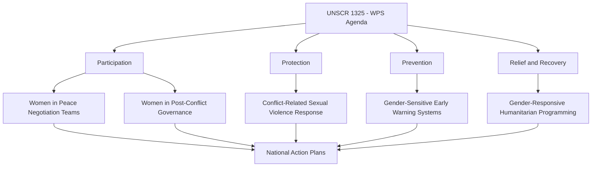
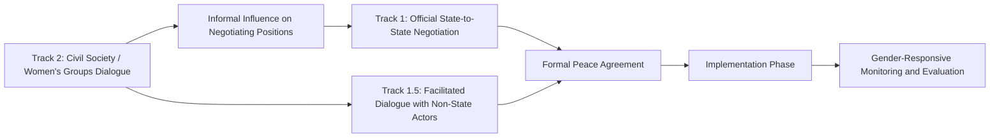

## Gender-Responsive Diplomacy and Negotiation

### Overview

Gender-Responsive Diplomacy and Negotiation refers to the practice of systematically integrating gender analysis into diplomatic processes, negotiation design, and outcome assessment. It encompasses both the *content* of diplomacy (ensuring policy outcomes account for differentiated gender impacts) and the *process* of diplomacy (ensuring negotiation teams, mediation processes, and diplomatic institutions themselves are inclusive and responsive to gender dynamics). This distinguishes it from "Women in Diplomacy," which focuses primarily on representation and career pathways; gender-responsive diplomacy focuses on methodology, negotiation design, and substantive policy outcomes.

### Conceptual Foundations

**Key Points**

- **Gender Mainstreaming**: The practice of assessing the implications for women and men of any planned diplomatic action, including legislation, policies, or programs, across all areas and levels — a concept formalized in the [UN's 1997 ECOSOC Agreed Conclusions](https://www.un.org/womenwatch/osagi/pdf/ECOSOCAC1997.2.PDF).
- **Women, Peace and Security (WPS) Agenda**: Anchored by [UN Security Council Resolution 1325](https://digitallibrary.un.org/record/426075) (2000), which called for women's equal participation in conflict prevention, resolution, and peacebuilding processes.
- **Gender Analysis in Negotiation**: Systematic examination of how gender shapes negotiating parties' interests, power dynamics, and likely differentiated impacts of proposed agreements.
- **Feminist Foreign Policy (FFP)**: A broader policy framework (see Women in Diplomacy and Leadership Pathways) under which gender-responsive negotiation practice is often institutionally housed.

### The Women, Peace and Security (WPS) Framework

UNSCR 1325 and its successor resolutions (1820, 1888, 1889, 1960, 2106, 2122, 2242, 2467, 2493) form the normative backbone of gender-responsive diplomacy in peace and security contexts.

**Key Points**

- **Participation Pillar**: Advocates for women's inclusion in peace negotiations, ceasefire talks, and post-conflict governance bodies.
- **Protection Pillar**: Addresses conflict-related sexual violence and protection of women's and girls' rights during conflict.
- **Prevention Pillar**: Integrates gender perspectives into conflict early-warning and prevention mechanisms.
- **Relief and Recovery Pillar**: Ensures humanitarian response and post-conflict reconstruction address gender-differentiated needs.
- **National Action Plans (NAPs)**: Many UN member states have adopted National Action Plans operationalizing WPS commitments domestically and in their diplomatic engagement.

### Evidence on Women's Participation in Peace Processes

**Key Points**

- Research from organizations including [UN Women](https://www.unwomen.org/) and the [Council on Foreign Relations' Women's Power Index](https://www.cfr.org/womens-power-index) has examined correlations between women's participation in peace processes and agreement durability.
- Frequently cited research (e.g., studies referenced by the [Georgetown Institute for Women, Peace and Security](https://giwps.georgetown.edu/)) suggests that peace agreements are associated with greater durability when women's groups have meaningful influence over the negotiation process, though [Inference] the specific causal mechanisms and effect sizes vary across studies and remain an active area of peace-and-security research rather than a single settled figure.
- Despite this evidence base, women remain a small minority of signatories, mediators, and witnesses in formal peace processes globally, a gap frequently documented in UN Secretary-General annual reports on WPS implementation.

[Unverified] Specific current statistics on the percentage of peace agreements including women signatories or the percentage of women mediators change as new UN reporting cycles are published; figures should be verified against the most recent UN Secretary-General WPS report.

### Gender-Responsive Negotiation Methodology

**Key Points**

- **Stakeholder Mapping by Gender**: Identifying how negotiating positions and interests may differ across gender lines among both principal parties and affected populations.
- **Differentiated Impact Assessment**: Analyzing how proposed agreement terms (e.g., resource-sharing, security arrangements, land rights) may affect women, men, and gender minorities differently.
- **Inclusive Process Design**: Structuring consultation mechanisms (women's civil society forums, advisory boards) that feed into formal negotiation tracks without necessarily requiring formal seat-at-the-table status — often termed "Track 1.5" or "Track 2" inclusion.
- **Gender-Balanced Delegation Composition**: Deliberate efforts to include women as principal negotiators, technical experts, and support staff rather than only in advisory or symbolic roles.
- **Gender-Sensitive Language in Agreement Texts**: Ensuring final agreement language does not default to gender-neutral framing that obscures differentiated implementation needs (e.g., explicit provisions for women's land tenure rights in peace agreements).

### Multi-Track Diplomacy and Gender Inclusion

**Key Points on Track Structure**

- **Track 1** negotiations (formal state actors) have historically had the lowest rates of women's direct participation.
- **Track 2** processes (civil society, women's organizations, academic/expert dialogues) have served as a more accessible entry point for gender-responsive input, with advocates working to formalize stronger linkages ("Track 1.5" mechanisms) between Track 2 input and Track 1 formal outcomes.

### Institutional Mechanisms Supporting Gender-Responsive Diplomacy

**Example**

| Mechanism | Function |
| --- | --- |
| National Action Plans (NAPs) on WPS | Domestic policy frameworks translating UNSCR 1325 commitments into ministry-level action |
| Gender Advisors/Focal Points at Missions | Dedicated staff embedded in embassies or negotiating delegations to provide gender analysis |
| UN Women's Peace and Security Section | Technical and normative support for gender-responsive peace processes |
| Gender-Responsive Budgeting in Foreign Ministries | Allocating diplomatic and development resources with explicit attention to gender impact |
| Mediation Support Units with Gender Expertise | e.g., UN Department of Political and Peacebuilding Affairs' Mediation Support Unit, which maintains gender expert rosters |
| Women Mediators Networks | Regional and global networks (e.g., the Mediterranean Women Mediators Network, African Women Leaders Network) that build rosters of qualified women mediators for deployment |

### Case Study Patterns (Illustrative)

**Example**

- **Colombia Peace Process (2012–2016)**: Frequently cited as a reference case for gender-responsive peace negotiation due to the establishment of a dedicated Gender Sub-Commission within the formal talks between the Colombian government and FARC-EP, which reviewed the draft agreement text for gender-differentiated provisions.
- **Liberia**: Women's civil society mobilization (documented in accounts of the Women of Liberia Mass Action for Peace movement) is widely referenced in WPS literature as an example of grassroots pressure influencing formal negotiation dynamics, though the mechanisms of influence are debated among scholars.
- **Northern Ireland (Good Friday Agreement, 1998)**: The Northern Ireland Women's Coalition secured formal representation in multi-party talks, an often-cited example of formal Track 1 inclusion of a women's political grouping.

[Inference] These cases are widely referenced in WPS and peace-negotiation literature as illustrative examples; the degree to which they represent generalizable "best practice" models versus context-specific outcomes remains debated among peace process scholars, and outcomes in each case involved many contributing factors beyond gender-inclusive design alone.

### Gender-Responsive Negotiation in Non-Conflict Diplomatic Contexts

Gender-responsive approaches extend beyond peace and security into broader diplomatic domains:

**Key Points**

- **Trade Diplomacy**: Assessing differentiated impacts of trade agreements on women-owned enterprises and women in informal economic sectors; some trade agreements now include dedicated gender chapters (e.g., certain Canada and Chile bilateral trade agreements).
- **Climate Diplomacy**: Integrating gender-differentiated climate vulnerability and adaptation capacity into climate negotiation positions, reflected in frameworks like the [UNFCCC Gender Action Plan](https://unfccc.int/gender).
- **Humanitarian and Development Diplomacy**: Ensuring bilateral aid negotiations and humanitarian diplomacy account for gender-differentiated needs in service delivery.
- **Consular and Migration Diplomacy**: Addressing gender-specific vulnerabilities in migration negotiations, including trafficking prevention and protection of migrant domestic workers, a population disproportionately female in many migration corridors.

### Measurement and Evaluation Frameworks

**Example**

| Indicator | Purpose |
| --- | --- |
| % Women Among Signatories to Peace Agreements | Tracks formal participation |
| % Women Among Mediators/Chief Negotiators | Tracks leadership-level inclusion |
| Presence of Gender Provisions in Final Agreement Text | Assesses substantive policy responsiveness |
| Existence and Implementation Status of National WPS Action Plan | Institutional commitment indicator |
| Gender-Disaggregated Impact Assessments Conducted Pre-Negotiation | Process-quality indicator |

$$GRI = \frac{1}{n}\sum_{i=1}^{n} w_i \cdot x_i$$

Where $GRI$ is a composite Gender-Responsiveness Index, $x_i$ represents normalized scores across $n$ indicators (e.g., participation rate, provision inclusion, NAP implementation status), and $w_i$ represents indicator-specific weights. [Inference] This is a generalized illustrative composite-index structure consistent with common practice in gender-responsive M&E frameworks; no single universally standardized formula is used across all institutions, and specific indices (where they exist) are defined by the issuing body.

### Diagram: Gender-Responsive Negotiation Process Design (SVG)

<svg viewBox="0 0 800 260" xmlns="http://www.w3.org/2000/svg">
<text x="400" y="25" font-size="16" font-weight="bold" text-anchor="middle" fill="#1a1a1a">Gender-Responsive Negotiation Process (svg_diagram)</text>
<rect x="30" y="60" width="160" height="70" rx="6" fill="#eff6ff" stroke="#2563eb"/>
<text x="110" y="90" font-size="11" text-anchor="middle">Pre-Negotiation</text>
<text x="110" y="108" font-size="10" text-anchor="middle" fill="#555">Gender Impact</text>
<text x="110" y="121" font-size="10" text-anchor="middle" fill="#555">Assessment</text>
<rect x="230" y="60" width="160" height="70" rx="6" fill="#eff6ff" stroke="#2563eb"/>
<text x="310" y="90" font-size="11" text-anchor="middle">Delegation Design</text>
<text x="310" y="108" font-size="10" text-anchor="middle" fill="#555">Balanced Composition</text>
<text x="310" y="121" font-size="10" text-anchor="middle" fill="#555">+ Gender Advisor</text>
<rect x="430" y="60" width="160" height="70" rx="6" fill="#eff6ff" stroke="#2563eb"/>
<text x="510" y="90" font-size="11" text-anchor="middle">Negotiation Phase</text>
<text x="510" y="108" font-size="10" text-anchor="middle" fill="#555">Track 2 Input</text>
<text x="510" y="121" font-size="10" text-anchor="middle" fill="#555">Integration</text>
<rect x="630" y="60" width="140" height="70" rx="6" fill="#eff6ff" stroke="#2563eb"/>
<text x="700" y="90" font-size="11" text-anchor="middle">Agreement Text</text>
<text x="700" y="108" font-size="10" text-anchor="middle" fill="#555">Gender Provisions</text>
<text x="700" y="121" font-size="10" text-anchor="middle" fill="#555">Review</text>
<path d="M190 95 L 230 95" stroke="#333" stroke-width="1.5" marker-end="url(#arrow2)"/>
<path d="M390 95 L 430 95" stroke="#333" stroke-width="1.5" marker-end="url(#arrow2)"/>
<path d="M590 95 L 630 95" stroke="#333" stroke-width="1.5" marker-end="url(#arrow2)"/>
<rect x="230" y="180" width="360" height="50" rx="6" fill="#f0fdf4" stroke="#16a34a"/>
<text x="410" y="210" font-size="11" text-anchor="middle">Implementation Monitoring (Gender-Responsive M&E)</text>
<path d="M510 130 L 410 180" stroke="#16a34a" stroke-width="1.5" marker-end="url(#arrow2)"/>
<defs>
<marker id="arrow2" markerWidth="10" markerHeight="10" refX="8" refY="3" orient="auto" markerUnits="strokeWidth">
<path d="M0,0 L0,6 L9,3 z" fill="#333"/>
</marker>
</defs>
</svg>

### Critiques and Open Debates

**Key Points**

- **Tokenism Risk**: Critics caution that adding women to negotiating delegations without addressing substantive process design or decision-making authority can produce symbolic rather than meaningful inclusion.
- **Essentialism Critique**: Some scholars caution against assuming women negotiators uniformly bring "more peaceful" or homogenous approaches, arguing this risks reducing gender-responsive diplomacy to identity-based assumptions rather than substantive methodological practice.
- **Measurement Difficulty**: Establishing rigorous causal evidence linking gender-inclusive process design to specific negotiation or agreement-durability outcomes remains methodologically challenging, given the multi-causal nature of peace processes.
- **Resourcing and Political Will Gaps**: National Action Plans on WPS are frequently critiqued in UN and academic reviews for being under-resourced relative to their stated ambitions, limiting practical implementation.
- **Uneven Application Across Diplomatic Domains**: Gender-responsive frameworks are comparatively more developed in peace-and-security diplomacy than in areas such as trade or bilateral political diplomacy, where integration is less standardized.

### Conclusion

Gender-responsive diplomacy and negotiation moves beyond questions of who sits at the table to address how negotiation processes are designed, whose interests are analyzed, and what substantive provisions final agreements contain. Anchored institutionally by the WPS agenda and increasingly extended into trade, climate, and development diplomacy, the field combines normative frameworks (UNSCR 1325 and successors), practical methodology (gender impact assessment, inclusive process design), and ongoing measurement challenges. Its effectiveness depends heavily on translating formal commitments — National Action Plans, gender advisor positions, delegation composition targets — into substantive influence over negotiation content and outcomes, rather than procedural inclusion alone.

**Next Steps**

- UNSCR 1325 and the Women, Peace and Security Resolution Series in Depth
- Track 2 and Multi-Track Diplomacy Design
- Gender Provisions in Peace Agreement Drafting
- Women Mediators Networks and Rosters
- Gender-Responsive Budgeting in Foreign Ministries
- Case Study: Colombia Peace Process Gender Sub-Commission
- Intersection of Feminist Foreign Policy and Negotiation Practice
- Gender Analysis Methodology for Trade and Climate Negotiations