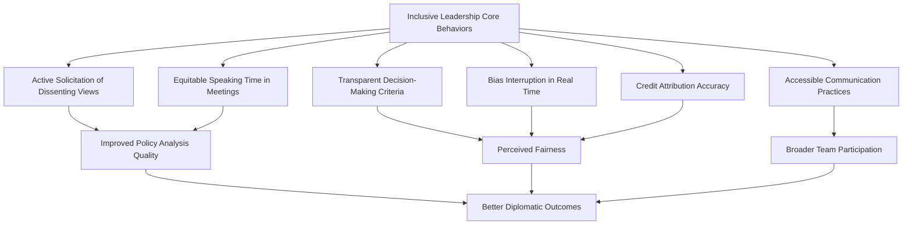

## Inclusive Leadership Practices

### Overview

Inclusive Leadership Practices refers to the behaviors, structures, and institutional mechanisms diplomatic leaders use to ensure that staff of diverse backgrounds — across gender, race, ethnicity, disability status, sexual orientation, socioeconomic origin, and other identity dimensions — have equitable access to voice, opportunity, and advancement within diplomatic missions and foreign ministries. Distinct from representation metrics (who is present) or specific policy areas (gender-responsive diplomacy, WPS), inclusive leadership focuses on the day-to-day practice of leading diverse teams effectively: how a Chief of Mission, ministry director, or team lead creates conditions in which diverse perspectives are genuinely heard, valued, and integrated into decision-making.

### Conceptual Foundations

**Key Points**

- **Diversity vs. Inclusion vs. Belonging**: Diversity refers to the presence of difference within a group; inclusion refers to the degree to which diverse individuals are able to participate fully and influence outcomes; belonging refers to the subjective sense of being valued and psychologically safe within the group. Inclusive leadership practice targets the latter two, which do not automatically follow from diversity alone.
- **Psychological Safety**: A concept developed primarily in organizational behavior research (notably associated with Harvard Business School's Amy Edmondson) describing a shared belief that a team is safe for interpersonal risk-taking, such as voicing dissent or admitting error — widely cited as a foundational precondition for inclusive team functioning.
- **Inclusive Leadership Competency Models**: Several frameworks (e.g., those developed by Deloitte's diversity research practice) identify recurring traits associated with inclusive leaders, including cognizance of bias, curiosity about others' perspectives, cultural intelligence, collaboration, and commitment to inclusion as a stated value.

[Inference] Most inclusive-leadership competency frameworks originate in general corporate and organizational-behavior research rather than diplomacy-specific studies; their application to diplomatic institutions is a reasonable extension given structural similarities in hierarchical, mission-based organizations, but diplomacy-specific empirical validation of these exact frameworks is limited in publicly available literature.

### Why Inclusive Leadership Matters in Diplomatic Contexts

**Key Points**

- **Analytical Quality**: Diplomatic reporting and policy analysis benefit from diverse perspectives, particularly when interpreting host-country social, cultural, and political dynamics that may be more visible to staff with relevant lived experience or background.
- **Representational Legitimacy**: Missions and delegations that reflect the diversity of their sending country can strengthen the credibility and relatability of public diplomacy efforts.
- **Talent Retention**: Inclusive team environments are associated in broader workforce research with lower attrition among underrepresented staff, directly relevant to the "leaky pipeline" issues discussed in diplomatic career pathway literature.
- **Crisis Resilience**: Diverse teams with genuine psychological safety are better positioned to surface dissenting analysis during high-stakes decision-making, a factor relevant to avoiding groupthink in crisis diplomacy.
- **Host-Country Relationship Building**: Staff with diverse linguistic, cultural, or diaspora backgrounds can offer access to networks and perspectives that homogenous teams may lack.

### Core Inclusive Leadership Behaviors

**Example**

- **Active Solicitation of Dissenting Views**: A Chief of Mission explicitly invites the most junior officer in a country-team meeting to voice their assessment before senior officers speak, reducing anchoring bias toward senior opinions.
- **Equitable Speaking Time**: Meeting chairs track and consciously balance speaking time across participants, particularly in cross-cultural teams where communication norms (direct vs. indirect speech styles) may otherwise skew participation.
- **Bias Interruption**: A supervisor notices a pattern of a particular officer's ideas being restated and credited to someone else, and explicitly redirects credit in real time.

### Structural Mechanisms Supporting Inclusive Leadership

**Key Points**

- **Diversity and Inclusion Councils/Officers**: Dedicated staff or committees within foreign ministries tasked with monitoring inclusion metrics and advising leadership (e.g., the U.S. Department of State's Chief Diversity and Inclusion Officer role, established 2021).
- **Employee Resource/Affinity Groups**: Voluntary staff-led groups organized around shared identity or experience (e.g., LGBTQ+ employee groups, groups for officers of specific racial/ethnic backgrounds, disability affinity networks) that provide peer support and feed input into leadership.
- **Reverse Mentoring Programs**: Pairing junior, diverse staff with senior leaders in a mentoring relationship reversed from the traditional direction, intended to expose senior leadership to perspectives and blind spots they might not otherwise encounter.
- **Structured Decision-Making Protocols**: Formal processes (e.g., pre-mortems, devil's advocate roles, anonymous input channels) designed to counteract hierarchical suppression of dissent in high-context, high-power-distance diplomatic settings.
- **Inclusive Recruitment and Onboarding**: Practices such as blind resume screening for initial applications, structured (rather than purely conversational) interview panels, and onboarding buddy systems for new officers from underrepresented backgrounds.

### Cultural Intelligence as a Leadership Competency

Cultural Intelligence (CQ), a construct developed in cross-cultural management research (notably by P. Christopher Earley and Soon Ang), is frequently cited as a core competency for inclusive leadership in diplomatic contexts given the inherently cross-cultural nature of the work.

**Key Points**

- **CQ Drive**: Motivation and confidence to engage with culturally diverse situations.
- **CQ Knowledge**: Understanding of how cultures differ in values, norms, and communication styles.
- **CQ Strategy**: Ability to plan for and make sense of culturally diverse interactions.
- **CQ Action**: Capacity to adapt verbal and nonverbal behavior appropriately across cultural contexts.

[Inference] While CQ frameworks are well-established in cross-cultural management literature, their direct empirical application and validation specifically within diplomatic leadership development programs is not extensively documented in publicly available sources and should be treated as an adapted application of a general framework rather than a diplomacy-specific validated model.

### Addressing Power Distance in Diplomatic Hierarchies

Diplomatic institutions are typically characterized by high power distance (steep hierarchical deference), which can suppress inclusive dynamics even when formal diversity policies exist.

**Example**

| Challenge | Inclusive Leadership Response |
| --- | --- |
| Junior officers reluctant to challenge senior assessment | Leader explicitly invites contrarian views before stating own position |
| Host-culture deference norms inhibiting open dissent among local staff | Leader establishes separate, lower-stakes channels for local staff input (written, anonymous, or small-group) |
| Ambassadorial authority discouraging debate in country-team meetings | Leader models vulnerability by acknowledging own uncertainty or past errors |
| Cross-generational communication style differences | Leader adapts meeting format to include both real-time discussion and asynchronous written input channels |

### Measurement and Accountability

**Key Points**

- **Climate Surveys**: Periodic staff surveys measuring perceived inclusion, psychological safety, and fairness of advancement opportunities, often benchmarked against ministry-wide averages.
- **Exit Interview Analysis**: Systematic review of attrition patterns and stated reasons for departure, disaggregated by demographic group, to detect inclusion-related attrition drivers.
- **360-Degree Feedback Inclusion Items**: Incorporating specific inclusive-leadership behavioral items into standard performance evaluation instruments (see Performance Evaluation in Diplomatic Institutions) rather than treating inclusion as a separate, optional assessment.
- **Promotion Rate Parity Analysis**: Comparing promotion timelines and rates across demographic groups at equivalent tenure and grade to detect systemic disparities.

$$IC = \frac{1}{n}\sum_{i=1}^{n} s_i$$

Where $IC$ represents a composite Inclusion Climate score derived from $n$ survey items $s_i$ (e.g., perceived psychological safety, fairness of opportunity, sense of belonging), each typically scored on a Likert scale and averaged. [Inference] This is an illustrative generalized composite structure consistent with common organizational climate-survey methodology; specific foreign ministries that conduct such surveys typically use proprietary or vendor-specific instruments rather than a single standardized public formula.

### Diagram: Inclusive Leadership Feedback Loop (SVG)

<svg xmlns="http://www.w3.org/2000/svg" viewBox="0 0 800 260">
<text x="400" y="25" font-size="16" font-weight="bold" text-anchor="middle" fill="#1a1a1a">Inclusive Leadership Feedback Loop (svg_diagram)</text>
<circle cx="150" cy="140" r="60" fill="#eff6ff" stroke="#2563eb" stroke-width="1.5" />
<text x="150" y="135" font-size="11" text-anchor="middle">Leader</text>
<text x="150" y="150" font-size="11" text-anchor="middle">Behavior</text>
<circle cx="400" cy="140" r="60" fill="#f0fdf4" stroke="#16a34a" stroke-width="1.5" />
<text x="400" y="135" font-size="11" text-anchor="middle">Team</text>
<text x="400" y="150" font-size="11" text-anchor="middle">Psychological Safety</text>
<circle cx="650" cy="140" r="60" fill="#fef3c7" stroke="#d97706" stroke-width="1.5" />
<text x="650" y="135" font-size="11" text-anchor="middle">Voice and</text>
<text x="650" y="150" font-size="11" text-anchor="middle">Participation</text>
<path d="M210 140 L 340 140" stroke="#333" stroke-width="1.5" marker-end="url(#arrow3)" />
<path d="M460 140 L 590 140" stroke="#333" stroke-width="1.5" marker-end="url(#arrow3)" />
<path d="M650 200 Q 400 260 150 200" stroke="#9ca3af" stroke-width="1.5" fill="none" stroke-dasharray="4,3" marker-end="url(#arrow3)" />
<text x="400" y="245" font-size="10" text-anchor="middle" fill="#555">Feedback informs leader adaptation</text>
</svg>

### Training and Development Approaches

**Example**

| Program Type | Description |
| --- | --- |
| Unconscious Bias Training | Workshops designed to raise awareness of implicit bias in evaluation, hiring, and daily interaction |
| Inclusive Leadership Certification/Modules | Formal curricula integrated into senior leadership training (e.g., ambassadorial seminars prior to posting) |
| Scenario-Based Simulation Training | Role-play exercises simulating cross-cultural team conflicts or bias incidents for leaders to practice intervention |
| Peer Learning Cohorts | Small groups of leaders across missions sharing inclusive practice experiences and challenges |
| Language and Cross-Cultural Immersion | Extended pre-posting training emphasizing not only language acquisition but cultural framework understanding |

[Unverified] The specific design, mandatory status, and curricular content of inclusive leadership training programs vary significantly by foreign ministry and are frequently updated; details for any specific country's current program should be verified against that ministry's official training directorate publications.

### Common Pitfalls and Critiques

**Key Points**

- **Performative Inclusion**: Leadership rhetoric or symbolic gestures (statements, one-off training sessions) without structural follow-through in evaluation, promotion, or resource allocation.
- **Overreliance on Underrepresented Staff for "Diversity Labor"**: Informally tasking diverse staff with representing or educating on diversity issues in addition to their substantive diplomatic duties, without formal recognition or compensation.
- **False Consensus from Surface-Level Inclusion**: Inviting broader participation without genuinely incorporating input into final decisions, which can erode trust more than not soliciting input at all.
- **One-Size-Fits-All Training**: Generic diversity training not adapted to the specific cross-cultural and hierarchical dynamics unique to diplomatic institutions, which research in organizational behavior suggests can be less effective than context-specific interventions. [Inference] This critique reflects broader organizational-behavior literature on diversity training effectiveness generally rather than diplomacy-specific studies.
- **Measurement Difficulty**: Psychological safety and inclusion climate are inherently subjective and self-reported, making rigorous causal evaluation of intervention effectiveness methodologically challenging.

### Integration with Broader Institutional Frameworks

Inclusive leadership practice is most effective when integrated into, rather than parallel to, core institutional systems:

**Key Points**

- **Performance Evaluation Integration**: Embedding inclusive leadership behaviors as explicit rated competencies in leadership evaluation instruments (cross-reference: Performance Evaluation in Diplomatic Institutions).
- **Promotion Board Composition**: Ensuring promotion and selection boards themselves reflect diverse composition and receive bias-mitigation training, addressing structural barriers described in gender and diversity leadership pathway literature.
- **Policy Substance Linkage**: Connecting internal inclusive leadership practice to external policy work such as gender-responsive negotiation and WPS implementation, recognizing that institutions struggling with internal inclusion may be less credible advocates for external gender and diversity diplomacy.

### Conclusion

Inclusive leadership practice in diplomatic institutions translates diversity representation into functional, equitable team dynamics through deliberate leader behaviors — soliciting dissent, distributing voice equitably, interrupting bias in real time, and adapting to the high-power-distance, cross-cultural context unique to diplomatic work. Its effectiveness depends on moving beyond symbolic commitment toward structural integration: embedding inclusive behaviors into performance evaluation, promotion processes, and training curricula, and measuring outcomes through climate surveys and disaggregated attrition and promotion data rather than representation statistics alone. Because diplomatic institutions operate simultaneously as internal workplaces and external policy actors, inclusive leadership capacity also underpins institutional credibility in advancing gender-responsive and inclusive diplomacy abroad.

**Related Topics**

- Psychological Safety in High-Stakes Diplomatic Decision-Making
- Cultural Intelligence Development for Diplomatic Leaders
- Employee Resource Groups in Foreign Ministries
- Bias Mitigation in Promotion Board Design
- Cross-Generational Leadership in Diplomatic Institutions
- Reverse Mentoring Program Design
- Integrating Inclusion Metrics into Performance Evaluation Systems
- Institutional Credibility and the Internal-External Diplomacy Link