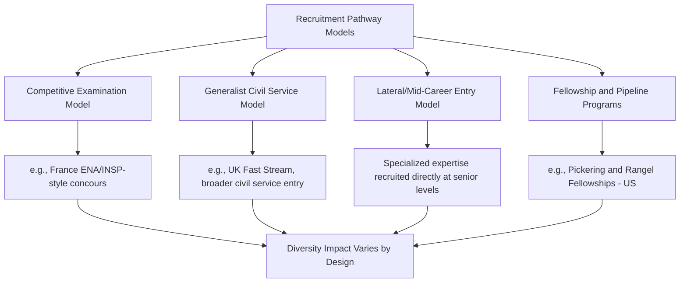

## Diversity in Diplomatic Recruitment and Representation

### Overview

Diversity in Diplomatic Recruitment and Representation examines how foreign ministries design entry pathways, selection mechanisms, and institutional structures to build a diplomatic corps that reflects the demographic, socioeconomic, racial, ethnic, and educational diversity of the sending country. This addresses the front-end of the talent pipeline — who enters the foreign service and how — complementing later-career concerns addressed in leadership pathway and inclusive leadership topics.

### Rationale for Diverse Recruitment

**Key Points**

- **Representational Legitimacy**: A diplomatic corps that mirrors national demographic composition strengthens domestic public confidence that foreign policy reflects the whole nation's interests, not a narrow elite.
- **Analytical and Cultural Capital**: Officers from diverse ethnic, linguistic, religious, or diaspora backgrounds often bring language skills and cultural fluency directly relevant to specific regional postings.
- **Public Diplomacy Effectiveness**: Diverse diplomatic representation can enhance credibility and relatability when engaging foreign publics, particularly in public diplomacy and cultural exchange programming.
- **Historical Correction**: In many states, foreign services historically recruited disproportionately from narrow elite educational and socioeconomic backgrounds; diversity initiatives are frequently framed as correcting this historical skew.

### Historical Recruitment Patterns

**Key Points**

- Many foreign services, particularly those with long institutional histories (e.g., the UK Foreign Office, French Quai d'Orsay, U.S. Department of State), historically drew recruits disproportionately from elite universities and socioeconomically privileged backgrounds.
- Entry examinations and interview processes in earlier eras often implicitly favored candidates with specific cultural capital (accent, dress, social manner) associated with dominant social classes, a dynamic documented in institutional histories and sociological studies of elite recruitment.
- Racial and ethnic minority representation in career diplomatic services in many Western countries remained minimal well into the late 20th century, with formal anti-discrimination recruitment reforms typically following broader civil rights-era legal changes.

[Unverified] Specific historical statistics on demographic composition of foreign services by decade vary by country and by how "minority" or "diverse" is defined in historical records; general patterns described here reflect commonly cited findings in diplomatic history and public administration literature.

### Recruitment Pathway Models

**Key Points on Model Variation**

- **Competitive Examination Models** (e.g., historically France's ENA, now INSP) have been critiqued for favoring candidates with access to specialized exam-preparation resources, often correlated with socioeconomic privilege, prompting periodic reform efforts.
- **Generalist Civil Service Models** (e.g., UK Diplomatic Service Fast Stream) integrate diplomatic recruitment within broader civil service diversity initiatives.
- **Fellowship and Pipeline Programs** are frequently the most direct diversity-targeted intervention, providing funded pathways (tuition support, mentorship, guaranteed interview stages) for underrepresented candidates.

### Illustrative Pipeline and Fellowship Programs

**Example**

| Program | Sponsoring Institution | Target Population |
| --- | --- | --- |
| Charles B. Rangel International Affairs Fellowship | U.S. Department of State / Howard University | Underrepresented minority students pursuing Foreign Service careers |
| Thomas R. Pickering Foreign Affairs Fellowship | U.S. Department of State / Institute for International Education | Financial need and diversity-focused candidates for Foreign Service |
| Diplomatic Academy Outreach Programs | Various foreign ministries | Broadening applicant pools beyond traditional elite universities |
| Regional/Minority Language Recruitment Initiatives | Various ministries | Candidates with strategically valuable but underrepresented language skills |

[Unverified] Program names, eligibility criteria, and funding status are subject to periodic government budget and policy changes; current details should be verified against the sponsoring ministry's official recruitment pages.

### Structural Barriers to Diverse Recruitment

**Key Points**

- **Examination Design Bias**: Written and oral examinations may implicitly favor candidates familiar with specific cultural reference points, communication styles, or test-taking conventions associated with dominant social groups.
- **Unpaid or Low-Paid Entry Tracks**: Unpaid internships or low-stipend junior positions, sometimes used as informal pipeline mechanisms, can disproportionately exclude candidates without independent financial support.
- **Geographic Concentration of Recruitment Outreach**: Recruitment events and information sessions concentrated at a small number of elite universities can limit awareness and access among broader candidate pools.
- **Security Clearance Processes**: In some countries, clearance processes have been documented (in specific legal and advocacy contexts) as having disparate impact on candidates with immigrant family backgrounds or certain international ties, an area of ongoing policy debate.
- **Network-Dependent Awareness**: Lack of exposure to diplomatic careers as a viable path, particularly in communities without existing alumni networks in the foreign service, functions as an early-stage barrier before formal application even occurs.

### Selection and Assessment Reform Approaches

**Example**

| Reform Approach | Mechanism |
| --- | --- |
| Blind/Anonymized Initial Screening | Removing name, university, and demographic identifiers from early application review stages |
| Structured Interview Panels | Standardized questions and scoring rubrics to reduce interviewer subjectivity |
| Diverse Panel Composition | Ensuring selection boards themselves include diverse membership |
| Competency-Based (vs. Pedigree-Based) Assessment | Evaluating demonstrated skills and potential rather than weighting prestige of prior education |
| Outreach Expansion | Recruitment events at a broader range of institutions, including community colleges, regional universities, and minority-serving institutions |
| Bias Training for Recruiters and Assessors | Training panel members on common bias patterns in candidate evaluation |

### Representation Measurement Frameworks

**Key Points**

- **Demographic Composition Reporting**: Many foreign ministries publish periodic workforce diversity reports comparing staff composition to national population benchmarks or general civil service benchmarks.
- **Entry vs. Retention vs. Leadership Disaggregation**: Effective measurement tracks representation separately at entry, mid-career, and senior leadership levels to distinguish recruitment success from retention/advancement challenges (see also Women in Diplomacy and Leadership Pathways for the analogous gender pipeline pattern).
- **Intersectional Data Collection**: Increasingly, ministries disaggregate data across combined demographic categories (e.g., race and gender jointly) rather than single-axis reporting alone, to capture compounding representation gaps.

$$RG_{\text{group}} = \frac{P_{\text{group,national}} - P_{\text{group,foreign service}}}{P_{\text{group,national}}}$$

Where $RG_{\text{group}}$ represents the proportional representation gap for a given demographic group, $P_{\text{group,national}}$ is that group's share of the national population, and $P_{\text{group,foreign service}}$ is its share of the diplomatic corps. A positive value indicates underrepresentation relative to national demographics. [Inference] This is a standard, generalized representation-gap formulation used broadly in workforce diversity analysis; specific ministries publishing diversity reports may use different benchmarking populations (e.g., national labor force rather than general population) or different formulas.

### Diagram: Recruitment Pipeline Diversity Funnel (SVG)

<svg xmlns="http://www.w3.org/2000/svg" viewBox="0 0 700 320">
<text x="350" y="25" font-size="16" font-weight="bold" text-anchor="middle" fill="#1a1a1a">Diplomatic Recruitment Diversity Funnel (svg_diagram)</text>
<polygon points="100,60 600,60 520,130 180,130" fill="#dbeafe" stroke="#2563eb" />
<text x="350" y="100" font-size="12" text-anchor="middle">Awareness / Outreach Stage</text>
<polygon points="180,140 520,140 460,200 240,200" fill="#bfdbfe" stroke="#2563eb" />
<text x="350" y="175" font-size="12" text-anchor="middle">Application Stage</text>
<polygon points="240,210 460,210 410,260 290,260" fill="#93c5fd" stroke="#2563eb" />
<text x="350" y="240" font-size="12" text-anchor="middle">Examination / Interview</text>
<polygon points="290,270 410,270 380,310 320,310" fill="#60a5fa" stroke="#2563eb" />
<text x="350" y="295" font-size="11" text-anchor="middle">Appointment</text>
<text x="620" y="95" font-size="10" fill="#555">Diversity loss point 1:</text>
<text x="620" y="108" font-size="10" fill="#555">network access</text>
<text x="620" y="170" font-size="10" fill="#555">Diversity loss point 2:</text>
<text x="620" y="183" font-size="10" fill="#555">exam design bias</text>
<text x="620" y="235" font-size="10" fill="#555">Diversity loss point 3:</text>
<text x="620" y="248" font-size="10" fill="#555">panel subjectivity</text>
</svg>

### Comparative Institutional Approaches

**Example**

- **United States**: Combines Foreign Service Officer Test (FSOT) merit-based entry with targeted fellowship pipelines (Pickering, Rangel) explicitly designed to diversify the applicant pool feeding into the standard competitive process.
- **United Kingdom**: FCDO Fast Stream civil service recruitment includes socioeconomic background monitoring and "contextual recruitment" practices that consider candidates' educational and social context alongside raw qualifications.
- **Canada**: Global Affairs Canada recruitment initiatives have emphasized Indigenous representation and bilingual (English/French) diversity alongside broader demographic diversity goals.
- **European External Action Service**: Balances diversity goals across EU member-state nationality representation requirements in addition to gender and other diversity dimensions, creating a distinctive multi-dimensional representation challenge specific to supranational diplomatic services.

[Unverified] Current program specifics, eligibility criteria, and comparative outcomes across these institutions should be verified against each ministry's most recent official recruitment and diversity reporting, as these programs are subject to periodic policy revision.

### Debates and Critiques

**Key Points**

- **Merit vs. Diversity Framing Tension**: Critics of targeted diversity recruitment programs sometimes argue such programs risk being perceived as compromising merit-based selection; proponents counter that traditional "merit" criteria themselves often embed unexamined structural bias, making the merit/diversity framing itself contested.
- **Tokenism and Retention Concerns**: Expanding diverse recruitment without corresponding inclusive leadership and retention reforms (see Inclusive Leadership Practices) risks high attrition among newly recruited diverse officers, producing a "revolving door" effect rather than durable representation gains.
- **Data Transparency Gaps**: Not all foreign ministries publish detailed, disaggregated workforce diversity data, limiting external accountability and cross-country comparison.
- **Balancing National Security Vetting with Inclusion**: Security clearance and vetting processes, while necessary, require careful design to avoid disparate impact on candidates with international family or personal ties, an area of ongoing institutional reform debate in several countries.

### Integration with the Broader Talent Lifecycle

Diverse recruitment functions as the entry point of a lifecycle that must connect to later-stage institutional mechanisms to produce durable representation gains:

### Conclusion

Diversity in diplomatic recruitment and representation addresses the structural design of entry pathways — examinations, fellowships, outreach, and selection panels — that determine who has access to a diplomatic career in the first place. While targeted fellowship and pipeline programs have demonstrated capacity to broaden applicant pools, sustainable representation gains depend on connecting recruitment reform to downstream institutional mechanisms: inclusive leadership practice, equitable performance evaluation, and bias-mitigated promotion processes. Without this full-lifecycle integration, diversity gains achieved at the recruitment stage risk being eroded by attrition at later career stages, reproducing the same representational gaps recruitment reform was designed to close.

**Next Steps**

- Fellowship and Pipeline Program Design for Underrepresented Candidates
- Contextual Recruitment and Socioeconomic Background Assessment
- Security Clearance Reform and Disparate Impact Considerations
- Comparative Analysis of Examination-Based vs. Generalist Civil Service Recruitment Models
- Linking Recruitment Diversity to Retention and Promotion Outcomes
- Workforce Diversity Data Transparency and Public Reporting Standards
- Diaspora and Heritage-Language Recruitment Strategies
- Multi-Dimensional Representation in Supranational Diplomatic Services (EEAS Model)