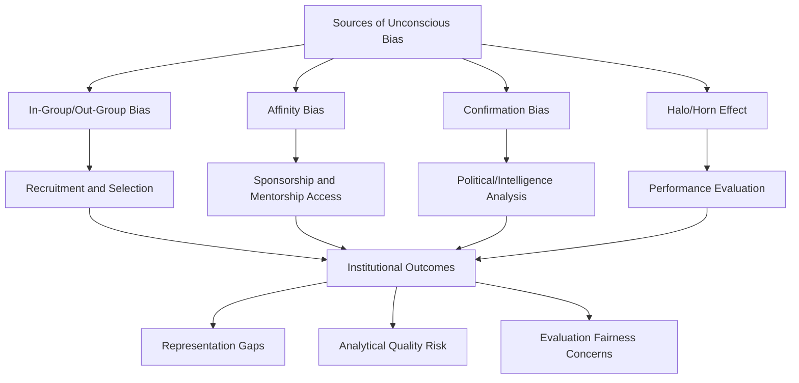
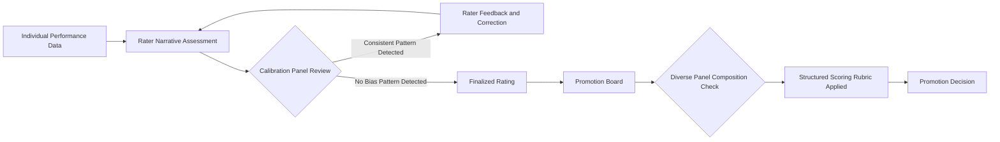

## Unconscious Bias Mitigation

### Overview

Unconscious Bias Mitigation refers to the systematic practices, training methodologies, and structural interventions diplomatic institutions use to identify and reduce the influence of implicit cognitive biases on decision-making — including recruitment, performance evaluation, promotion, policy analysis, and interpersonal interaction. Unconscious bias (also termed implicit bias) refers to automatic, unintentional associations and judgments that affect understanding, actions, and decisions without conscious awareness. In diplomatic contexts, mitigation efforts intersect directly with recruitment reform, performance evaluation design, and inclusive leadership practice, but focus specifically on the cognitive mechanisms and structural interventions rather than broader representational or cultural strategy.

### Conceptual Foundations

**Key Points**

- **Implicit Association**: The psychological theory, most associated with research using the [Implicit Association Test (IAT)](https://implicit.harvard.edu/implicit/) developed by researchers including Anthony Greenwald and Mahzarin Banaji, positing that individuals hold automatic mental associations between concepts (e.g., race, gender) and evaluative judgments that may diverge from consciously held beliefs.
- **In-Group/Out-Group Bias**: Tendency to favor members of one's own perceived group (nationality, alma mater, professional background) over out-group members, highly relevant in diplomatic settings where officers frequently interact across national, cultural, and institutional group lines.
- **Affinity Bias**: Preference for individuals who share similar backgrounds, interests, or communication styles with the evaluator — a well-documented factor in informal sponsorship and mentorship access (see Women in Diplomacy and Leadership Pathways).
- **Confirmation Bias**: Tendency to seek, interpret, and recall information that confirms pre-existing beliefs, directly relevant to political and intelligence analysis quality in diplomatic reporting.
- **Halo/Horn Effect**: Tendency for an initial positive or negative impression (e.g., prestigious educational background) to disproportionately color subsequent evaluation of unrelated competencies.

[Inference] While the IAT and related implicit-bias measurement tools are widely used in research and corporate training contexts, the psychological literature includes ongoing methodological debate about the IAT's predictive validity for individual behavior versus aggregate patterns; this is an active area of academic discussion rather than settled scientific consensus, and mitigation frameworks referenced here should be understood as drawing on a contested but widely applied research base.

### Relevance to Diplomatic Decision-Making

**Key Points**

- **Recruitment and Selection**: Bias in resume screening, interview evaluation, and examination scoring (cross-reference: Diversity in Diplomatic Recruitment and Representation).
- **Performance Evaluation**: Bias in narrative assessment tone, rating calibration across demographic groups, and promotion board deliberation (cross-reference: Performance Evaluation in Diplomatic Institutions).
- **Policy and Intelligence Analysis**: Confirmation bias and in-group bias can distort political risk assessment, particularly in analyzing unfamiliar political or cultural contexts — a documented concern in intelligence and foreign policy analysis literature (e.g., discussions of "mirror-imaging" bias, where analysts project their own cultural assumptions onto foreign actors).
- **Negotiation Dynamics**: Bias affecting perception of counterpart credibility or trustworthiness based on group identity rather than individual conduct.
- **Crisis Decision-Making**: Time pressure during crises is associated in decision-science research with increased reliance on heuristic, bias-prone judgment, making crisis contexts particularly susceptible to unconscious bias effects.

### Bias Mitigation Training Approaches

**Example**

| Approach | Description | Evidence Base Note |
| --- | --- | --- |
| Awareness Training (IAT-based) | Introduces participants to implicit bias concepts, often using IAT or similar self-assessment tools | Commonly used; effectiveness at producing durable behavior change is debated in training-evaluation literature |
| Structured Debiasing Training | Focuses on behavioral techniques (structured interviews, checklists) rather than awareness alone | Generally better supported by organizational behavior research than awareness-only training |
| Perspective-Taking Exercises | Structured exercises asking participants to consider a decision from an out-group member's perspective | Mixed evidence; short-term attitude shifts documented, durability less established |
| Bystander/Ally Intervention Training | Trains staff to recognize and interrupt biased behavior or comments in real time among peers | Increasingly incorporated into broader inclusive leadership training |
| Scenario-Based Simulation | Diplomatic-context role-play scenarios highlighting bias risk in negotiation or crisis settings | Emerging practice; diplomacy-specific evaluation data limited |

[Inference] A substantial body of organizational behavior research (including meta-analyses of corporate diversity training effectiveness) suggests that one-off awareness training alone produces limited durable behavior change, and that structural/procedural debiasing interventions tend to show more consistent effects; this finding derives primarily from general corporate training research rather than diplomacy-specific studies, though the general finding is reasonably extensible to diplomatic institutional training design.

### Structural Debiasing Mechanisms (Process-Level Interventions)

Rather than relying solely on individual awareness, many institutions pursue structural changes that reduce opportunities for bias to affect outcomes regardless of individual awareness levels.

**Key Points**

- **Blind/Anonymized Screening**: Removing identifying information (name, photo, university) from initial application or reporting review stages.
- **Structured Evaluation Rubrics**: Standardized, criterion-based scoring templates that constrain evaluator discretion, used in both recruitment interviews and performance evaluation narratives.
- **Calibration Panels**: Cross-rater review sessions where evaluators compare and reconcile ratings across similar cases to detect and correct systematic disparities before finalizing scores.
- **Diverse Panel Composition**: Ensuring selection and promotion boards include diverse membership to reduce the influence of any single evaluator's biases and introduce a wider range of perspective checks.
- **Devil's Advocate / Red Team Protocols**: Formal designation of a team member tasked with challenging group consensus, used in intelligence and policy analysis to counteract groupthink and confirmation bias.
- **Delayed/Anonymous Input Channels**: Written, anonymized input mechanisms in group decision processes to reduce anchoring on senior or majority-group voices.

### Bias Mitigation in Political and Intelligence Analysis

Diplomatic and intelligence analysis has a distinct tradition of structured analytic techniques designed explicitly to counteract cognitive bias, most notably formalized in Richards J. Heuer Jr.'s foundational work on the psychology of intelligence analysis.

**Example**

- **Analysis of Competing Hypotheses (ACH)**: A structured technique requiring analysts to systematically evaluate evidence against multiple competing hypotheses rather than seeking to confirm a single favored explanation, directly countering confirmation bias.
- **Key Assumptions Check**: A structured review process requiring analysts to explicitly list and interrogate the underlying assumptions driving their assessment.
- **Red Team Analysis**: Assigning a separate team to construct the strongest possible counter-argument to a prevailing assessment before finalizing a policy recommendation.
- **Devil's Advocacy**: Formally designating an individual or small group to challenge the majority view within an analytic or negotiating team.

[Inference] These structured analytic techniques are well-documented in intelligence community tradecraft literature (originating substantially from U.S. intelligence community practice, notably associated with the CIA's tradecraft standards) and have been adapted into broader diplomatic and foreign policy analysis training; the degree of formal adoption varies across different countries' foreign ministries and is not uniformly standardized globally.

### Bias Mitigation in Evaluation and Promotion Processes

**Key Points**

- Calibration review is most effective when it examines rating patterns in aggregate (e.g., whether narrative language systematically differs in tone or specificity across demographic groups) rather than relitigating individual scores in isolation.
- Structured rubrics reduce, but do not eliminate, discretion — narrative components of evaluation remain a common entry point for residual bias, requiring ongoing rater training rather than a one-time structural fix.

### Measurement of Bias Mitigation Effectiveness

**Key Points**

- **Outcome Disparity Tracking**: Monitoring promotion rates, evaluation score distributions, and attrition rates disaggregated by demographic group over time as an indirect indicator of bias mitigation program impact.
- **Pre/Post Training Assessment**: Comparing attitudinal or behavioral measures before and after training interventions, though [Inference] such assessments are subject to well-documented limitations, including social desirability bias in self-reported measures and the gap between stated attitude change and actual behavioral change.
- **Climate Survey Integration**: Incorporating bias-related perception items into broader inclusion climate surveys (cross-reference: Inclusive Leadership Practices) to track staff-perceived fairness over time.
- **Decision Audit Trails**: Reviewing documented rationale for key decisions (hiring, promotion, posting assignment) for patterns suggestive of systematic bias.

$$BD_{\text{group}} = |R_{\text{group}} - R_{\text{overall}}|$$

Where $BD_{\text{group}}$ represents an outcome disparity indicator for a given demographic group, $R_{\text{group}}$ is that group's rate of a given outcome (e.g., promotion within a standard timeframe), and $R_{\text{overall}}$ is the institution-wide average rate. Sustained, statistically significant disparities across multiple evaluation cycles are typically treated as a signal warranting structural review rather than proof of individual bias in any single case. [Inference] This is a generalized illustrative disparity-tracking formulation consistent with standard workforce equity analysis methodology; specific ministries' internal statistical thresholds and methodologies for flagging disparities are not uniformly published.

### Diagram: Layered Bias Mitigation Architecture (SVG)

<svg xmlns="http://www.w3.org/2000/svg" viewBox="0 0 800 300">
<text x="400" y="25" font-size="16" font-weight="bold" text-anchor="middle" fill="#1a1a1a">Layered Bias Mitigation Architecture (svg_diagram)</text>
<rect x="60" y="50" width="680" height="60" fill="#fef2f2" stroke="#dc2626" rx="6" />
<text x="400" y="75" font-size="12" font-weight="bold" text-anchor="middle" fill="#dc2626">Layer 1: Individual Awareness</text>
<text x="400" y="95" font-size="10" text-anchor="middle" fill="#555">IAT-based training, perspective-taking exercises</text>
<rect x="60" y="120" width="680" height="60" fill="#fffbeb" stroke="#d97706" rx="6" />
<text x="400" y="145" font-size="12" font-weight="bold" text-anchor="middle" fill="#d97706">Layer 2: Behavioral Practice</text>
<text x="400" y="165" font-size="10" text-anchor="middle" fill="#555">Structured interviews, bystander intervention, red-teaming</text>
<rect x="60" y="190" width="680" height="60" fill="#f0fdf4" stroke="#16a34a" rx="6" />
<text x="400" y="215" font-size="12" font-weight="bold" text-anchor="middle" fill="#16a34a">Layer 3: Structural/Process Redesign</text>
<text x="400" y="235" font-size="10" text-anchor="middle" fill="#555">Blind screening, calibration panels, diverse boards</text>
<rect x="60" y="260" width="680" height="30" fill="#eff6ff" stroke="#2563eb" rx="6" />
<text x="400" y="280" font-size="11" font-weight="bold" text-anchor="middle" fill="#2563eb">Layer 4: Outcome Monitoring and Accountability</text>
</svg>

### Common Critiques and Limitations

**Key Points**

- **Training Effectiveness Skepticism**: A substantial body of organizational research questions whether standalone awareness-based bias training produces measurable, durable change in actual decision-making behavior, prompting a shift in emphasis toward structural interventions.
- **Individual vs. Systemic Framing Tension**: Overemphasis on individual bias correction can obscure systemic and policy-level factors (e.g., structural barriers discussed in recruitment and leadership pathway topics) that also drive representation gaps.
- **Measurement Validity Concerns**: Tools like the IAT, while widely used, face ongoing academic debate regarding test-retest reliability and predictive validity for real-world discriminatory behavior at the individual level.
- **Backlash and Defensiveness Risk**: Poorly designed bias training can trigger defensive reactions that reduce rather than enhance openness to inclusive behavior change, a dynamic documented in some organizational psychology research on diversity training reception.
- **Resource and Prioritization Competition**: Bias mitigation initiatives compete for limited training time and institutional attention alongside substantive diplomatic skill development, requiring deliberate integration rather than treatment as a separate compliance exercise.

### Integration Across the Diplomatic Institutional Lifecycle

Unconscious bias mitigation functions most effectively as connective tissue across the full institutional lifecycle rather than a standalone training module:

**Key Points**

- **Recruitment Stage**: Structured, bias-mitigated screening and interview design (cross-reference: Diversity in Diplomatic Recruitment and Representation).
- **Evaluation Stage**: Calibration panels and structured rubrics embedded in performance evaluation systems (cross-reference: Performance Evaluation in Diplomatic Institutions).
- **Leadership Practice Stage**: Real-time bias interruption as a core inclusive leadership behavior (cross-reference: Inclusive Leadership Practices).
- **Policy Analysis Stage**: Structured analytic techniques (ACH, red-teaming) embedded in reporting and assessment workflows.

### Conclusion

Unconscious bias mitigation in diplomatic institutions requires moving beyond one-time awareness training toward layered interventions that combine individual awareness-building, behavioral practice, structural process redesign, and sustained outcome monitoring. Because implicit bias operates automatically and often outside conscious awareness, the most durable mitigation strategies rely on structural mechanisms — blind screening, calibration panels, structured analytic techniques, diverse decision-making bodies — that reduce opportunities for bias to influence outcomes regardless of any individual's self-awareness. Given the direct relevance of bias to both institutional fairness (recruitment, evaluation, promotion) and substantive diplomatic effectiveness (analytical quality, negotiation judgment, crisis decision-making), bias mitigation functions best when embedded across the full institutional lifecycle rather than treated as an isolated training compliance requirement.

**Related Topics**

- Structured Analytic Techniques in Diplomatic and Intelligence Reporting
- Calibration Panel Design for Performance Evaluation Fairness
- Mirror-Imaging and Cultural Projection Bias in Political Analysis
- Red-Teaming and Devil's Advocacy Protocols in Policy Formulation
- Evaluating the Effectiveness of Corporate and Institutional Bias Training
- Bystander Intervention Training for Diplomatic Teams
- Decision-Science Approaches to Crisis Diplomacy Under Time Pressure
- Outcome Disparity Auditing in Diplomatic Career Advancement