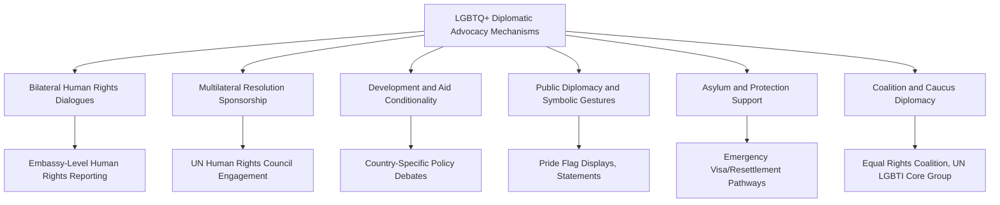
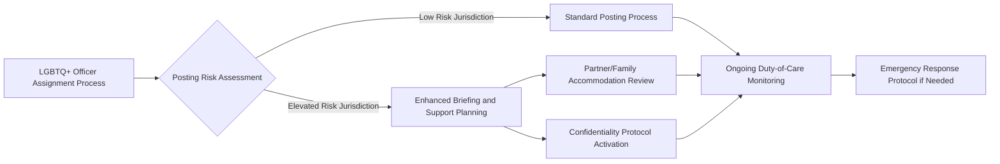

## LGBTQ+ Rights and Diplomatic Advocacy

### Overview

LGBTQ+ Rights and Diplomatic Advocacy examines how states, foreign ministries, and multilateral institutions integrate lesbian, gay, bisexual, transgender, and queer/questioning (LGBTQ+) rights considerations into foreign policy, bilateral relations, multilateral diplomacy, and internal institutional practice. This spans two interconnected dimensions: **external advocacy** (using diplomatic tools to promote LGBTQ+ human rights abroad and support LGBTQ+ individuals internationally) and **internal institutional practice** (duty-of-care policies for LGBTQ+ diplomatic personnel and their families, particularly in postings with restrictive legal or social environments).

### Conceptual and Normative Foundations

**Key Points**

- **Yogyakarta Principles (2006, updated 2017 as Yogyakarta Principles plus 10)**: A set of principles on the application of international human rights law to sexual orientation, gender identity, gender expression, and sex characteristics, developed by a group of international human rights experts; frequently cited as a normative reference point in diplomatic advocacy, though not a binding treaty instrument.
- **UN Human Rights Council Resolutions on Sexual Orientation and Gender Identity**: The UN Human Rights Council has passed several resolutions addressing violence and discrimination based on sexual orientation and gender identity, including the establishment of the mandate of the [Independent Expert on protection against violence and discrimination based on sexual orientation and gender identity](https://www.ohchr.org/en/special-procedures/ie-sexual-orientation-and-gender-identity) (established 2016).
- **Absence of a Dedicated Binding Global Treaty**: Unlike some other human rights domains, there is no single dedicated binding international treaty specifically on LGBTQ+ rights; advocacy typically proceeds through interpretation of existing instruments (e.g., the International Covenant on Civil and Political Rights) and through political resolutions and bilateral/multilateral diplomatic engagement.
- **Wide Global Divergence in Legal Status**: National legal frameworks regarding LGBTQ+ rights vary dramatically, from full marriage equality and anti-discrimination protections in some states to criminalization of same-sex relations (including capital punishment in a small number of jurisdictions) in others — a divergence that directly shapes both advocacy strategy and internal duty-of-care policy design.

[Unverified] The specific current count of states criminalizing same-sex relations, and the precise legal status in any individual country, changes periodically through legislative and judicial action; current figures should be verified against contemporary monitoring sources such as the [ILGA World State-Sponsored Homophobia report](https://ilga.org/) rather than treated as fixed.

### External Advocacy Mechanisms

**Key Points**

- **Bilateral Human Rights Dialogues**: Formal or informal diplomatic channels where LGBTQ+ rights concerns are raised as part of broader human rights engagement with a host government.
- **Multilateral Coalition Diplomacy**: Groupings such as the [UN LGBTI Core Group](https://www.un.org/en/) (a cross-regional group of UN member states) and the [Equal Rights Coalition](https://equalrightscoalition.org/) (an intergovernmental coalition focused on LGBTI human rights) coordinate multilateral advocacy efforts among like-minded states.
- **Development and Aid Linkage**: Some states have at various points linked development assistance considerations to human rights conditions, including LGBTQ+ rights; this approach is a subject of significant policy debate (see Critiques below).
- **Public Diplomacy Gestures**: Symbolic actions such as embassy Pride flag displays or public statements marking events like the International Day Against Homophobia, Biphobia, and Transphobia (IDAHOBIT), used to signal solidarity and visibility.
- **Protection and Asylum Channels**: Diplomatic missions in some countries maintain protocols for supporting LGBTQ+ individuals facing persecution, including expedited humanitarian visa consideration in specific circumstances, generally operating within each state's broader asylum and refugee protection legal framework.

### Institutional Frameworks Supporting LGBTQ+ Advocacy

**Example**

| Mechanism | Function |
| --- | --- |
| Special Envoy/Representative Positions | Dedicated diplomatic roles focused on LGBTQ+ human rights advocacy (e.g., the U.S. Special Envoy to Advance the Human Rights of LGBTQI+ Persons, a position within the Department of State) |
| UN LGBTI Core Group | Cross-regional coalition of UN member states coordinating multilateral advocacy |
| Equal Rights Coalition | Intergovernmental coalition of states committed to LGBTI rights protection, coordinating diplomatic and development cooperation |
| Embassy LGBTQ+ Focal Points | Designated mission staff responsible for liaison with local LGBTQ+ civil society and monitoring relevant developments |
| Human Rights Reporting Requirements | Statutory or policy requirements for missions to report on LGBTQ+ rights conditions as part of broader annual human rights reporting (e.g., the U.S. State Department's Country Reports on Human Rights Practices) |

[Unverified] The existence, current title, and staffing status of specific envoy positions are subject to change with changes in government administration and policy priorities; current status should be verified against the relevant foreign ministry's official current listings.

### Internal Institutional Practice: Duty of Care for LGBTQ+ Diplomatic Personnel

A significant and distinct dimension of this topic concerns how foreign ministries support their own LGBTQ+ staff and families, particularly given that diplomatic postings are involuntary and global in scope, potentially placing personnel in jurisdictions where their identity carries legal or social risk.

**Key Points**

- **Posting Risk Assessment**: Some foreign services incorporate LGBTQ+-specific risk factors into pre-posting briefings and, in some cases, posting assignment considerations, balancing career development needs against personal safety.
- **Partner and Family Recognition**: Historically, many foreign services did not extend spousal benefits, housing, or diplomatic accreditation to same-sex partners; reform in this area has proceeded unevenly and is linked to the sending state's own domestic legal recognition of same-sex relationships.
- **Confidentiality and Disclosure Support**: Policies addressing how and whether LGBTQ+ status is documented in personnel or security clearance files, balancing institutional support needs against risk of exposure.
- **Emergency Support Protocols**: Procedures for responding to situations where an LGBTQ+ officer or family member faces host-country legal jeopardy, harassment, or safety threats connected to their identity.
- **Affinity and Support Networks**: Internal employee resource groups (e.g., GLIFAA — Gays and Lesbians in Foreign Affairs Agencies, a long-standing U.S. Department of State-affiliated affinity organization) providing peer support and policy advocacy within the institution.

### Case Examples of Institutional Reform (Illustrative)

**Example**

- **U.S. Department of State**: Extended same-sex domestic partner benefits beginning in 2009, later adapting policy following U.S. domestic same-sex marriage legal recognition (Obergefell v. Hodges, 2015); established the Special Envoy for LGBTQI+ human rights position, and hosts GLIFAA as a recognized affinity organization.
- **Canada**: Global Affairs Canada has incorporated LGBTQ+ inclusion into both its Feminist International Assistance Policy framework and internal workforce diversity initiatives.
- **European External Action Service**: EU member states collectively maintain [LGBTI human rights guidelines](https://www.eeas.europa.eu/) for EU external action, though implementation intensity varies by individual member state diplomatic practice.

[Unverified] Specific current policy details, position titles, and organizational status for any of the above should be verified against current official sources, as LGBTQ+-related diplomatic policy has been subject to meaningful change across different government administrations in multiple countries.

### Tension Points and Strategic Complexity

**Key Points**

- **Sovereignty and "Cultural Imperialism" Critique**: Some governments and commentators characterize Western-led LGBTQ+ diplomatic advocacy as a form of cultural or ideological imposition, arguing it disregards local cultural, religious, or legal traditions — a framing actively contested by human rights advocates who argue LGBTQ+ rights are grounded in universal human rights principles rather than culturally specific values.
- **Aid Conditionality Backlash Risk**: Linking development assistance to LGBTQ+ rights conditions has, in some documented cases, been associated with backlash effects, including increased local hostility toward LGBTQ+ communities who may be scapegoated as being linked to foreign interference — a dynamic raised as a concern by some LGBTQ+ rights advocates and researchers themselves, complicating the conditionality strategy.
- **Balancing Advocacy with Broader Bilateral Relations**: Diplomats must navigate tension between advancing LGBTQ+ rights advocacy and maintaining broader strategic, security, or economic bilateral relationships with governments that oppose such advocacy.
- **Divergence Among "Like-Minded" States**: Even among states broadly supportive of LGBTQ+ rights advocacy, meaningful differences exist in preferred tactics (public statement-based advocacy vs. quiet diplomacy vs. conditionality), complicating coalition coordination.
- **Local Civil Society Agency**: Advocacy literature increasingly emphasizes the importance of diplomatic support being responsive to and led by local LGBTQ+ civil society priorities rather than externally imposed agendas, reflecting broader debates in human rights diplomacy about local ownership versus external prescription.

### Measurement and Reporting Frameworks

**Example**

| Instrument | Purpose |
| --- | --- |
| ILGA World State-Sponsored Homophobia Report | Annual global monitoring of laws affecting LGBTQ+ people by country |
| U.S. State Department Country Reports on Human Rights Practices | Annual statutory reporting including LGBTQ+ rights conditions by country |
| UN Independent Expert on SOGI Annual Reports | Thematic and country-specific reporting to the UN Human Rights Council |
| Internal Ministry Duty-of-Care Audits | Internal review of posting risk assessment and support protocol effectiveness for LGBTQ+ personnel |

### Diagram: Dual-Track Structure of LGBTQ+ Diplomatic Engagement (SVG)

<svg xmlns="http://www.w3.org/2000/svg" viewBox="0 0 800 260">
<text x="400" y="25" font-size="16" font-weight="bold" text-anchor="middle" fill="#1a1a1a">Dual-Track LGBTQ+ Diplomatic Engagement (svg_diagram)</text>
<rect x="50" y="55" width="320" height="180" fill="none" stroke="#7c3aed" stroke-width="1.5" rx="8" />
<text x="210" y="80" font-size="13" font-weight="bold" text-anchor="middle" fill="#7c3aed">External Advocacy Track</text>
<text x="70" y="110" font-size="11" fill="#333">- Bilateral human rights dialogue</text>
<text x="70" y="132" font-size="11" fill="#333">- Multilateral coalition diplomacy</text>
<text x="70" y="154" font-size="11" fill="#333">- Special envoy engagement</text>
<text x="70" y="176" font-size="11" fill="#333">- Public diplomacy gestures</text>
<text x="70" y="198" font-size="11" fill="#333">- Asylum/protection support</text>
<rect x="430" y="55" width="320" height="180" fill="none" stroke="#0891b2" stroke-width="1.5" rx="8" />
<text x="590" y="80" font-size="13" font-weight="bold" text-anchor="middle" fill="#0891b2">Internal Duty-of-Care Track</text>
<text x="450" y="110" font-size="11" fill="#333">- Posting risk assessment</text>
<text x="450" y="132" font-size="11" fill="#333">- Partner/family recognition</text>
<text x="450" y="154" font-size="11" fill="#333">- Confidentiality protocols</text>
<text x="450" y="176" font-size="11" fill="#333">- Emergency response planning</text>
<text x="450" y="198" font-size="11" fill="#333">- Affinity group support (e.g., GLIFAA)</text>
</svg>

### Integration with Broader Inclusion and Diversity Frameworks

LGBTQ+ diplomatic advocacy and internal support policy intersect substantively with other topics in this chapter:

**Key Points**

- **Intersectionality**: LGBTQ+ status intersects with gender, race, and disability considerations addressed in Women in Diplomacy and Diversity in Diplomatic Recruitment topics, requiring intersectional rather than siloed institutional analysis.
- **Inclusive Leadership Linkage**: Effective duty-of-care implementation depends on inclusive leadership practice at the mission level (cross-reference: Inclusive Leadership Practices), particularly in ensuring LGBTQ+ staff feel safe disclosing concerns to supervisors.
- **Bias Mitigation Relevance**: Unconscious bias affecting LGBTQ+ personnel in evaluation and promotion processes is addressed through the same structural mitigation mechanisms discussed in Unconscious Bias Mitigation.

### Conclusion

LGBTQ+ rights and diplomatic advocacy operates across two distinct but interconnected planes: the external projection of human rights advocacy through bilateral engagement, multilateral coalitions, and public diplomacy, and the internal institutional responsibility to protect and support LGBTQ+ diplomatic personnel navigating a global posting system spanning jurisdictions with widely divergent legal and social environments toward LGBTQ+ identity. Effective practice in this domain requires careful strategic navigation — balancing principled advocacy with sensitivity to sovereignty concerns and backlash risk, and balancing career opportunity with meaningful duty-of-care protection for personnel. As with other dimensions of inclusive diplomatic leadership, sustained progress depends on structural integration (risk assessment protocols, benefits parity, coalition-based advocacy) rather than symbolic gesture alone.

**Related Topics**

- UN LGBTI Core Group and Equal Rights Coalition Diplomacy in Depth
- Aid Conditionality Debates in Human Rights Diplomacy
- Duty-of-Care Policy Design for Diplomatic Personnel in High-Risk Postings
- Intersectionality in Diplomatic Diversity and Inclusion Policy
- Comparative National Approaches to LGBTQ+ Foreign Policy
- Local Civil Society Partnership Models in Human Rights Advocacy
- Special Envoy and Thematic Diplomatic Representative Roles
- Asylum and Protection Diplomacy for Persecuted Populations