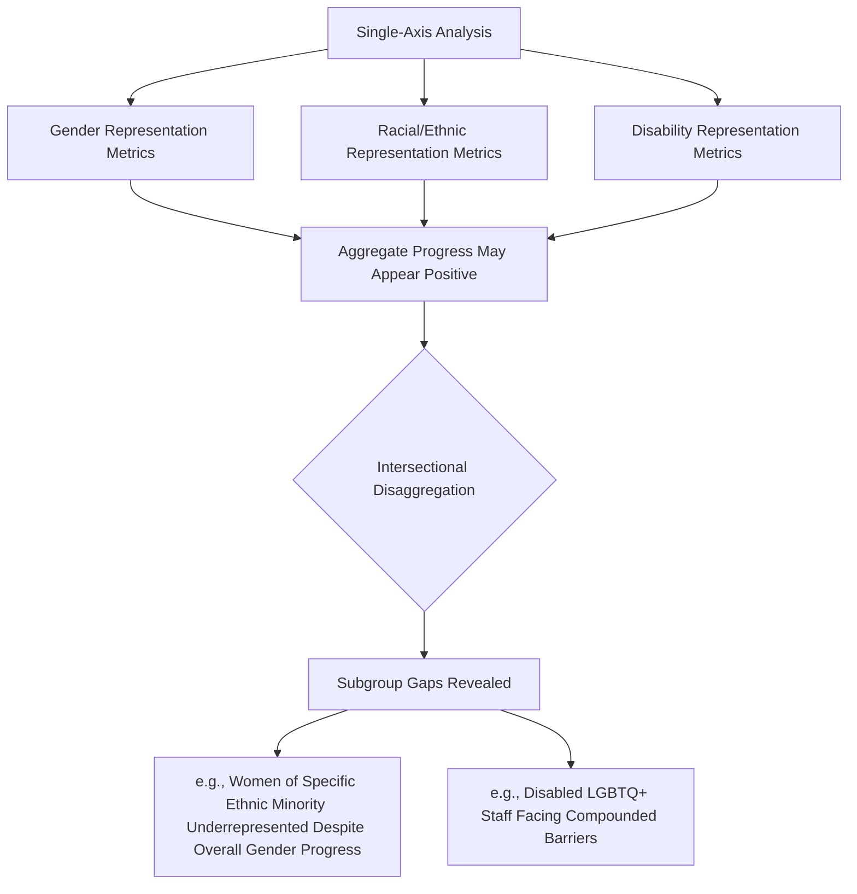
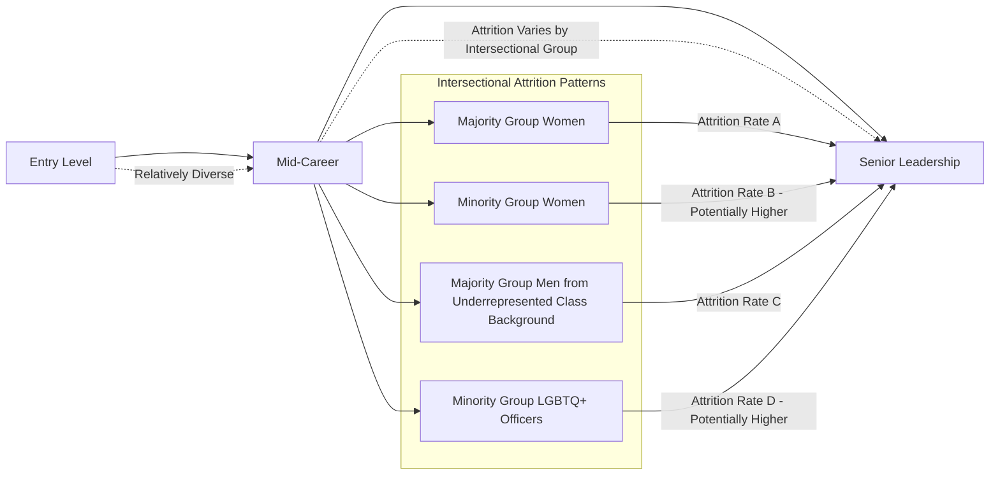

## Intersectionality in International Representation

### Overview

Intersectionality in International Representation examines how overlapping and interacting dimensions of identity — race, gender, ethnicity, disability, sexual orientation, socioeconomic origin, religion, and nationality — combine to produce distinct, non-additive experiences of advantage and disadvantage within diplomatic institutions and in the practice of international representation. Rather than treating diversity dimensions as separate, parallel tracks (a gender initiative here, a racial equity initiative there), an intersectional framework analyzes how these dimensions interact to shape access, advancement, and lived experience in ways that single-axis analysis misses.

### Conceptual Foundations

**Key Points**

- **Origin of the Concept**: The term "intersectionality" was coined by legal scholar Kimberlé Crenshaw in 1989, developed initially through analysis of how anti-discrimination law failed Black women by treating race and gender discrimination as separate, non-overlapping legal categories.
- **Core Analytical Claim**: Intersectionality holds that combined identities (e.g., being a Black woman, or a disabled LGBTQ+ person) produce qualitatively distinct experiences of structural bias that cannot be fully understood by summing the effects of each identity category in isolation.
- **Distinction from Single-Axis Diversity Frameworks**: Traditional diversity and inclusion programs frequently organize initiatives around single categories (a women's leadership program, a racial equity task force); intersectional analysis instead asks how these categories interact, often revealing that aggregate progress on one axis (e.g., overall gender representation gains) can mask persistent gaps for specific subgroups (e.g., women of a particular ethnic minority).
- **Structural, Not Merely Individual, Focus**: Intersectionality as originally theorized is fundamentally a structural and institutional analysis — examining how systems (law, employment structures, promotion criteria) produce compounded disadvantage — rather than solely a description of individual identity or lived experience.

[Inference] While Crenshaw's foundational framework is well-established in legal and social science scholarship, its specific application to diplomatic institutional analysis is a more recent and less extensively documented extension; much of the diplomacy-specific literature applying intersectionality is emerging scholarship and practitioner reporting rather than a long-established body of diplomacy-specific empirical research.

### Why Intersectionality Matters for Diplomatic Representation

**Key Points**

- **Masking Effect of Aggregate Data**: Foreign ministries reporting overall progress on gender representation (see Women in Diplomacy and Leadership Pathways) may simultaneously show minimal or no progress for women from specific racial, ethnic, or socioeconomic backgrounds, a pattern invisible without disaggregated intersectional data.
- **Compounded Barriers to Advancement**: An officer navigating both racial/ethnic minority status and gender minority status may face compounded barriers — for example, being simultaneously subject to affinity bias favoring majority-group candidates and exclusion from informal networks structured around both racial and gender homogeneity.
- **Differentiated Posting and Security Considerations**: Officers with intersecting identities (e.g., a Muslim woman diplomat, or a Black LGBTQ+ officer) may face distinct posting risk considerations that differ qualitatively from those facing officers who share only one of those identity dimensions.
- **Representational Complexity in Public Diplomacy**: Effective public diplomacy engagement with diverse foreign publics may benefit from diplomatic personnel whose intersectional identities offer distinct relational and cultural access points not captured by single-axis diversity metrics alone.

### Intersectional Analysis in Recruitment and Representation Data

**Example**

| Data Approach | Limitation Without Intersectional Lens | Intersectional Enhancement |
| --- | --- | --- |
| Overall % women in senior roles | Masks variation by race/ethnicity among women | Disaggregate by gender × race/ethnicity jointly |
| Overall % racial/ethnic minority staff | Masks gender variation within minority groups | Disaggregate by race/ethnicity × gender jointly |
| Overall disability representation | Masks compounding with gender, race, or LGBTQ+ status | Disaggregate disability status across other identity dimensions |
| Overall LGBTQ+ inclusion climate scores | Masks differential experience by race, gender identity within LGBTQ+ population | Disaggregate LGBTQ+ subgroup experience data |

[Unverified] The extent to which specific foreign ministries currently collect and publish intersectionally disaggregated workforce data varies significantly and is not uniformly documented; many ministries report single-axis diversity statistics publicly while intersectional data, where collected at all, may remain internal.

### Intersectionality in Career Pathway Analysis

**Key Points**

- Pipeline attrition research in broader organizational contexts (outside diplomacy specifically) has documented that attrition rates for women of color, for example, frequently differ meaningfully from attrition rates for white women, despite both groups being categorized simply as "women" in single-axis reporting.
- [Inference] Direct diplomacy-sector empirical data replicating these broader organizational-research patterns is limited in publicly available literature; the pattern is a reasonable extension of well-documented findings from adjacent sectors (corporate, academic, civil service) rather than a diplomacy-specific validated finding.

### Institutional Mechanisms for Intersectional Practice

**Key Points**

- **Intersectional Data Collection Systems**: HR information systems designed to capture and cross-tabulate multiple demographic dimensions while maintaining appropriate privacy and confidentiality safeguards, given the sensitivity of combined identity data.
- **Intersectional Employee Resource Group Coordination**: Facilitating coordination and joint advocacy across affinity groups (e.g., a women's network and an LGBTQ+ network jointly addressing the experience of LGBTQ+ women) rather than siloed single-identity groups operating independently.
- **Intersectional Review in Policy Design**: Explicitly reviewing new HR policies (parental leave, posting assignment criteria, security clearance procedures) for differentiated impact across intersecting identity combinations before implementation.
- **Intersectional Competency in Leadership Training**: Extending inclusive leadership training (see Inclusive Leadership Practices) to address compounded bias dynamics rather than treating each diversity dimension as a separate training module.
- **Intersectional Mentorship and Sponsorship Matching**: Recognizing that mentorship and sponsorship needs (see Women in Diplomacy and Leadership Pathways) may differ for officers navigating multiple marginalized identities, requiring more deliberately designed matching rather than relying solely on organic network formation.

### Intersectionality in External Diplomatic Practice

Beyond internal institutional representation, intersectional analysis also applies to the *substance* of diplomatic engagement:

**Key Points**

- **Gender-Responsive Diplomacy Intersection**: Applying intersectional analysis within gender-responsive negotiation practice (see Gender-Responsive Diplomacy and Negotiation) — for example, recognizing that women's interests in a peace negotiation are not homogenous but vary by ethnicity, class, disability status, and other factors among the affected population.
- **Human Rights Advocacy Precision**: Intersectional analysis in human rights diplomacy (including LGBTQ+ advocacy, see LGBTQ+ Rights and Diplomatic Advocacy) can help identify populations facing compounded vulnerability, such as LGBTQ+ refugees or disabled women in conflict settings, informing more precisely targeted diplomatic and humanitarian response.
- **Development and Humanitarian Diplomacy**: Development diplomacy increasingly incorporates intersectional vulnerability assessment (e.g., in disaster response or displacement contexts) rather than single-axis vulnerability categorization.

### Measurement Challenges

**Key Points**

- **Small Subgroup Sample Sizes**: Highly disaggregated intersectional categories (e.g., disabled LGBTQ+ women of a specific ethnic minority) may involve very small absolute numbers of staff within any single foreign ministry, creating both statistical reliability challenges and privacy/re-identification risks in reporting.
- **Privacy and Confidentiality Tensions**: Collecting granular intersectional demographic data must be balanced against staff privacy rights and the risk that detailed disaggregation could inadvertently identify individuals in small subgroups.
- **Category Definition Complexity**: Determining which identity dimensions to include in intersectional analysis (and how to categorize fluid or self-identified categories such as race, ethnicity, or gender identity) involves methodological choices that vary across institutions and national contexts.
- **Causal Attribution Difficulty**: Even where intersectional disparities are statistically documented, isolating the specific causal mechanisms driving a given subgroup's distinct outcomes (versus general noise in small-sample data) requires careful methodological design.

$$D_{ij} = P_{i,j} - \left(P_i \times P_j / P_{\text{total}}\right)$$

Where $D_{ij}$ represents an illustrative intersectional disparity indicator for the joint category combining dimension $i$ (e.g., gender) and dimension $j$ (e.g., race/ethnicity), $P_{i,j}$ is the observed representation rate for the intersectional subgroup at a given institutional level, and the subtracted term represents a statistically expected rate if the two dimensions combined independently (i.e., without compounding interaction effects). [Inference] This is an illustrative, simplified analytical framing intended to demonstrate the general logic of detecting non-additive compounding effects; actual intersectional workforce analysis methodologies used by specific institutions, where they exist, are typically more methodologically sophisticated and are not standardized across ministries.

### Diagram: Intersectionality as Compounding, Not Additive (SVG)

<svg xmlns="http://www.w3.org/2000/svg" viewBox="0 0 800 260">
<text x="400" y="25" font-size="16" font-weight="bold" text-anchor="middle" fill="#1a1a1a">Intersectionality: Compounding vs. Additive Model (svg_diagram)</text>
<text x="200" y="55" font-size="12" font-weight="bold" text-anchor="middle" fill="#555">Additive (Incorrect) Model</text>
<circle cx="140" cy="110" r="45" fill="#dbeafe" fill-opacity="0.6" stroke="#2563eb" />
<circle cx="220" cy="110" r="45" fill="#fce7f3" fill-opacity="0.6" stroke="#db2777" />
<text x="140" y="115" font-size="10" text-anchor="middle">Gender Bias</text>
<text x="220" y="115" font-size="10" text-anchor="middle">Race Bias</text>
<text x="180" y="180" font-size="10" text-anchor="middle" fill="#555">Treated as separate, summed effects</text>
<text x="600" y="55" font-size="12" font-weight="bold" text-anchor="middle" fill="#555">Intersectional (Accurate) Model</text>
<circle cx="600" cy="110" r="65" fill="#fef3c7" stroke="#d97706" stroke-width="2" />
<text x="600" y="105" font-size="10" text-anchor="middle">Distinct Compounded</text>
<text x="600" y="120" font-size="10" text-anchor="middle">Experience</text>
<text x="600" y="190" font-size="10" text-anchor="middle" fill="#555">Not reducible to sum of parts</text>
</svg>

### Critiques and Debates

**Key Points**

- **Implementation Complexity**: Critics note that fully intersectional institutional analysis can become methodologically and administratively unwieldy as the number of identity dimensions and combinations expands, raising practical questions about prioritization.
- **Risk of Fragmentation**: Some diversity practitioners caution that overly granular intersectional categorization risks fragmenting coalition-building efforts across affinity groups if not managed with deliberate cross-group coordination.
- **Data vs. Narrative Tension**: Scholars debate the appropriate balance between quantitative intersectional data analysis (subgroup statistics) and qualitative narrative approaches (lived experience documentation), with some arguing that Crenshaw's original framework was fundamentally structural/legal rather than primarily statistical in orientation, cautioning against purely metrics-driven applications that lose this structural analytical dimension.
- **Politicization in Some National Contexts**: In some political environments, intersectionality as a concept has become subject to broader political and ideological debate, which can affect institutional willingness to adopt the terminology explicitly even when pursuing substantively similar disaggregated equity analysis under different framing.

### Integration Across the Chapter's Themes

Intersectionality functions as a cross-cutting analytical lens rather than a standalone initiative, connecting directly to:

**Key Points**

- **Recruitment**: Ensuring diverse recruitment pipeline design (see Diversity in Diplomatic Recruitment and Representation) accounts for compounded barriers facing candidates at the intersection of multiple underrepresented identities.
- **Leadership Pathways**: Extending gender leadership pathway analysis (see Women in Diplomacy and Leadership Pathways) to examine how race, class, and other factors compound gender-based barriers to advancement.
- **Inclusive Leadership**: Equipping leaders with the analytical capacity to recognize compounded bias dynamics rather than addressing each diversity dimension in isolation (see Inclusive Leadership Practices).
- **Bias Mitigation**: Extending structural debiasing mechanisms (see Unconscious Bias Mitigation) to account for compounded bias patterns affecting intersectional subgroups specifically.

### Conclusion

Intersectionality in international representation provides an essential corrective to single-axis diversity analysis, revealing that aggregate progress on any one dimension of representation — gender, race, disability, sexual orientation — can obscure persistent, compounded disadvantage facing officers at the intersection of multiple underrepresented identities. Effective institutional practice requires disaggregated data collection (balanced carefully against privacy considerations), coordinated rather than siloed affinity group structures, and leadership and bias-mitigation training equipped to recognize compounding rather than merely additive bias dynamics. As a cross-cutting analytical lens, intersectionality strengthens rather than replaces the single-axis frameworks addressed elsewhere in this chapter, provided institutions invest in the data infrastructure and analytical capacity needed to move beyond aggregate representation metrics toward a fuller picture of who advances, who is retained, and who is genuinely included within diplomatic institutions.

**Related Topics**

- Kimberlé Crenshaw's Foundational Intersectionality Scholarship and Its Institutional Applications
- Disaggregated Workforce Data Design and Privacy Safeguards
- Coordinated Affinity Group Models in Foreign Ministries
- Intersectional Vulnerability Assessment in Humanitarian and Development Diplomacy
- Small-Sample Statistical Methods for Subgroup Equity Analysis
- Intersectionality in Gender-Responsive Peace Negotiation Design
- Cross-Identity Coalition Building in Institutional Reform
- Comparative National Approaches to Intersectional Equity Policy