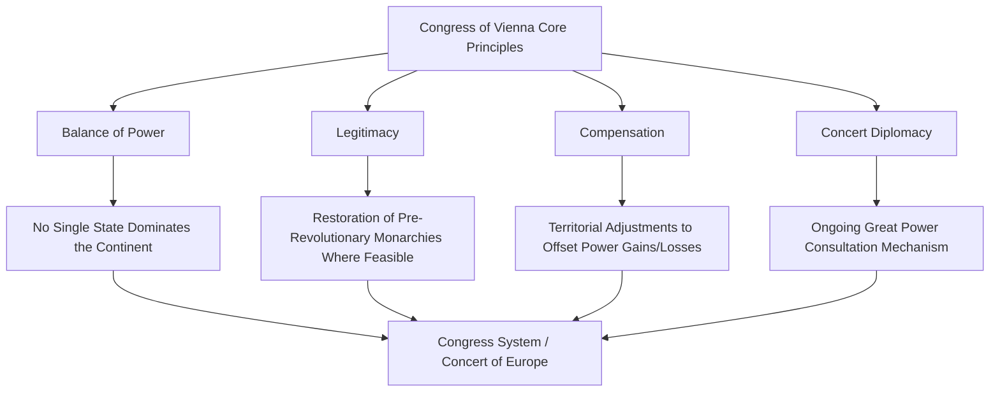
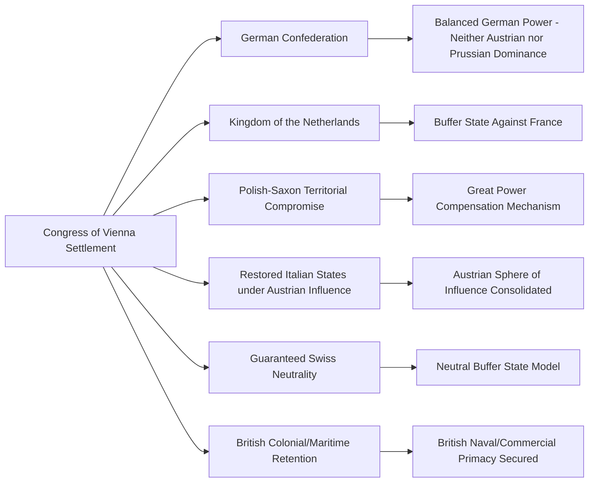

## The Congress of Vienna and Balance-of-Power Diplomacy

### Overview

The Congress of Vienna (September 1814 – June 1815) was a multilateral diplomatic conference convened by the major European powers following the defeat of Napoleonic France to redraw the political map of Europe and construct a durable post-war order. It is widely studied in diplomatic history as the foundational modern case study in balance-of-power diplomacy, multilateral congress-based negotiation, and the deliberate engineering of a stable international system through great-power coordination rather than through a single dominant hegemon or punitive settlement alone.

### Historical Context

**Key Points**

- **Preceding Conflict**: The Napoleonic Wars (1803–1815) had destabilized the European state system for over two decades, following on from the earlier French Revolutionary Wars, leaving the continent's monarchies determined to construct a settlement that would prevent renewed French expansionism and revolutionary upheaval.
- **Convening Powers**: The Congress was dominated by the "Great Powers" — Austria, Prussia, Russia, the United Kingdom, and (following the Treaty of Paris, 1814) a restored Bourbon France under Foreign Minister Talleyrand, who skillfully secured France's inclusion as a participating power rather than merely a defeated party subject to imposed terms.
- **Host and Central Figure**: The Congress convened in Vienna and was presided over substantively by Austrian Foreign Minister (later Chancellor) Klemens von Metternich, whose diplomatic vision heavily shaped both the process and the resulting order.
- **Format**: Unlike earlier peace settlements typically concluded through bilateral treaties, the Congress of Vienna was a genuinely multilateral gathering, involving representatives of nearly all European states, though substantive decisions were negotiated primarily among the five Great Powers in smaller, less formal settings.

### Key Diplomatic Figures

**Example**

| Figure | Role | Notable Contribution |
| --- | --- | --- |
| Klemens von Metternich | Austrian Foreign Minister | Chief architect of the conservative balance-of-power order; presided over Congress proceedings |
| Charles Maurice de Talleyrand | French Foreign Minister | Secured France's rehabilitation as a Great Power participant through skillful diplomatic maneuvering |
| Viscount Castlereagh | British Foreign Secretary | Advocated for a balanced continental settlement to secure British strategic interests without direct territorial ambition on the continent |
| Tsar Alexander I | Russian Emperor | Advanced Russian territorial interests (notably in Poland) and proposed the Holy Alliance |
| Prince Karl August von Hardenberg | Prussian State Chancellor | Represented Prussian territorial and security interests, notably regarding Saxony |

### Core Diplomatic Principles Established

**Key Points**

- **Balance of Power**: The organizing strategic principle that no single state should be permitted to achieve continental dominance, pursued through deliberate territorial redistribution designed to create roughly countervailing power blocs.
- **Legitimacy**: A principle, closely associated with Metternich and French representative Talleyrand, favoring the restoration of hereditary monarchies and established dynastic rulers as a stabilizing force against revolutionary upheaval, though applied selectively rather than absolutely.
- **Compensation**: The practice of offsetting a state's territorial losses in one area with territorial gains elsewhere, used extensively to satisfy competing great-power claims (for example, Prussia's gains in the Rhineland partially offset by not receiving the whole of Saxony as initially sought).
- **Concert Diplomacy**: The innovation of establishing an ongoing mechanism for great-power consultation on matters affecting European stability, rather than treating the Congress as a one-time settlement event.

### Major Territorial and Political Outcomes

**Example**

- **German Confederation**: Creation of a loose confederation of German states (replacing the dissolved Holy Roman Empire), balancing Austrian and Prussian influence rather than unifying Germany.
- **Kingdom of the Netherlands**: Union of the former Austrian Netherlands (modern Belgium) with the Dutch Republic, intended as a stronger buffer state against potential future French expansion northward.
- **Poland-Saxony Question**: A contentious negotiation over Russian ambitions in Poland and Prussian ambitions in Saxony, ultimately resolved through partition arrangements that partially satisfied both powers without fully gratifying either — frequently cited as a paradigmatic case of compensation-based balance-of-power negotiation.
- **Italian Settlement**: Restoration of Austrian influence over much of northern Italy, alongside restored monarchies elsewhere on the peninsula.
- **Swiss Neutrality**: Formal recognition and guarantee of Swiss neutrality by the Great Powers, an early and durable example of great-power-guaranteed permanent neutrality as a stabilizing diplomatic device.
- **Colonial and Maritime Adjustments**: Britain retained key strategic colonial and maritime possessions acquired during the wars, reflecting British emphasis on securing naval and commercial supremacy rather than continental territorial acquisition.

### The Concert of Europe as an Institutional Legacy

Perhaps the most significant and durable institutional innovation of the Congress was not any single territorial arrangement but the establishment of the **Concert of Europe** — an informal system of periodic great-power conferences intended to manage crises and preserve the settlement through ongoing collective consultation rather than unilateral action.

**Key Points**

- **Quadruple Alliance (later Quintuple with France's inclusion)**: The core great powers committed to periodic congresses to address emerging threats to the settlement, formalized initially through the Treaty of Chaumont (1814) and subsequent alliance instruments.
- **Subsequent Congresses**: The Concert system produced follow-up conferences, including the Congresses of Aix-la-Chapelle (1818), Troppau (1820), Laibach (1821), and Verona (1822), addressing issues such as revolutionary movements in Spain, Italy, and Greece.
- **Holy Alliance**: A related but distinct instrument proposed by Tsar Alexander I, invoking Christian monarchical solidarity; generally regarded by historians as more symbolically significant than operationally binding compared to the Quadruple Alliance's more concrete security commitments.
- **Erosion Over Time**: The Concert system's cohesion gradually weakened over subsequent decades as great-power interests diverged, particularly over the appropriate response to nationalist and liberal revolutionary movements, though elements of concert-based great-power diplomacy persisted in various forms through the 19th century.

[Inference] Historians generally regard the Concert of Europe as achieving a historically notable, though imperfect and gradually eroding, period of relative great-power peace in Europe through the mid-19th century (commonly referenced in relation to the absence of another continent-wide war until the Crimean War of 1853–1856, and no war on the scale of the Napoleonic conflicts until 1914); however, the precise causal weight attributable to the Vienna settlement's design versus other contributing historical factors remains a subject of ongoing historiographical debate.

### Diplomatic Techniques and Innovations

**Key Points**

- **Secret and Small-Group Negotiation Within a Formal Multilateral Framework**: While the Congress formally included representatives of numerous states, substantive decisions were negotiated primarily in smaller, often informal settings among the Great Powers, with smaller states largely excluded from core deliberations — an early example of the tension between formal multilateral inclusivity and practical great-power-driven negotiation dynamics that persists in later multilateral diplomacy.
- **Social and Informal Diplomacy**: The Congress became famous for its extensive social calendar (balls, receptions, informal gatherings), which served substantively as venues for informal negotiation and relationship-building alongside formal sessions — giving rise to the frequently cited (if somewhat apocryphal in precise attribution) observation that "the Congress dances but does not progress."
- **Personal Relationship-Driven Diplomacy**: The settlement's durability owed significantly to personal working relationships and mutual trust developed among key negotiators (particularly Metternich, Castlereagh, and eventually Talleyrand), illustrating the role of interpersonal diplomatic skill in multilateral negotiation outcomes.
- **Crisis Management Mid-Negotiation**: Napoleon's return from Elba and the ensuing "Hundred Days" (March–June 1815) occurred while the Congress was still in session, testing and ultimately reinforcing allied cohesion; the Congress's final act was signed shortly before the Battle of Waterloo.

### Balance-of-Power Theory: Analytical Framework

**Key Points**

- **Core Theoretical Premise**: Balance-of-power theory holds that international stability is best achieved not through the elimination of state competition but through the maintenance of roughly equivalent power distributions among major states, deterring any single state from pursuing hegemonic expansion.
- **Mechanisms for Maintaining Balance**: Territorial compensation, strategic alliance formation, buffer state creation, and periodic great-power consultation were the primary mechanisms employed at Vienna.
- **Contrast with Collective Security**: Balance-of-power diplomacy, as practiced at Vienna, differs conceptually from later 20th-century collective security models (e.g., the League of Nations, United Nations), which rest on the principle of collective response to aggression by any state against any other, rather than a managed distribution of power among a small set of great powers.
- **Realist International Relations Theory Reference Point**: The Congress of Vienna is frequently cited in international relations scholarship, particularly within the realist theoretical tradition, as a foundational historical case demonstrating balance-of-power principles in practice.

$$\sum_{i=1}^{n} P_i \approx \text{constant}, \quad \max(P_i) \not\gg \sum_{j \neq i} P_j$$

This notation illustrates, in simplified conceptual form, the balance-of-power logic: that the aggregate distribution of power $P_i$ among major states $i$ should avoid any single state's power vastly exceeding the combined power of the others. [Inference] This is a simplified illustrative formalization for conceptual clarity; balance-of-power theory as practiced diplomatically in 1814–1815 was not a mathematically precise doctrine but a set of qualitative strategic judgments applied through territorial and alliance arrangements.

### Diagram: Congress of Vienna Negotiation Structure (SVG)

<svg xmlns="http://www.w3.org/2000/svg" viewBox="0 0 800 280">
<text x="400" y="25" font-size="16" font-weight="bold" text-anchor="middle" fill="#1a1a1a">Congress of Vienna Negotiation Structure (svg_diagram)</text>
<circle cx="400" cy="150" r="55" fill="#fef3c7" stroke="#d97706" stroke-width="2" />
<text x="400" y="145" font-size="11" text-anchor="middle" font-weight="bold">Great Power</text>
<text x="400" y="160" font-size="11" text-anchor="middle" font-weight="bold">Core Negotiation</text>
<circle cx="180" cy="70" r="45" fill="#dbeafe" stroke="#2563eb" />
<text x="180" y="75" font-size="10" text-anchor="middle">Austria</text>
<text x="180" y="88" font-size="9" text-anchor="middle" fill="#555">(Metternich)</text>
<circle cx="620" cy="70" r="45" fill="#dbeafe" stroke="#2563eb" />
<text x="620" y="75" font-size="10" text-anchor="middle">Britain</text>
<text x="620" y="88" font-size="9" text-anchor="middle" fill="#555">(Castlereagh)</text>
<circle cx="180" cy="230" r="45" fill="#dbeafe" stroke="#2563eb" />
<text x="180" y="235" font-size="10" text-anchor="middle">Russia</text>
<text x="180" y="248" font-size="9" text-anchor="middle" fill="#555">(Alexander I)</text>
<circle cx="620" cy="230" r="45" fill="#dbeafe" stroke="#2563eb" />
<text x="620" y="235" font-size="10" text-anchor="middle">Prussia</text>
<text x="620" y="248" font-size="9" text-anchor="middle" fill="#555">(Hardenberg)</text>
<circle cx="700" cy="150" r="40" fill="#f0fdf4" stroke="#16a34a" />
<text x="700" y="155" font-size="10" text-anchor="middle">France</text>
<text x="700" y="168" font-size="9" text-anchor="middle" fill="#555">(Talleyrand)</text>
<line x1="220" y1="90" x2="360" y2="130" stroke="#666" stroke-width="1.2" />
<line x1="580" y1="90" x2="440" y2="130" stroke="#666" stroke-width="1.2" />
<line x1="220" y1="210" x2="360" y2="170" stroke="#666" stroke-width="1.2" />
<line x1="580" y1="210" x2="440" y2="170" stroke="#666" stroke-width="1.2" />
<line x1="665" y1="150" x2="455" y2="150" stroke="#666" stroke-width="1.2" stroke-dasharray="3,2" />
<text x="400" y="280" font-size="9" text-anchor="middle" fill="#777">Smaller states largely excluded from core deliberations</text>
</svg>

### Relevance to Modern Diplomatic Leadership Practice

**Key Points**

- **Multilateral Congress Design**: The Vienna model — combining formal multilateral inclusivity with substantive small-group great-power negotiation — remains a recognizable pattern in later multilateral settlements and continues to inform debates about the appropriate balance between broad participation and effective decision-making in modern multilateral diplomacy.
- **Institutionalized Consultation**: The Concert of Europe's innovation of ongoing, periodic great-power consultation prefigures later institutionalized diplomatic mechanisms, including aspects of the League of Nations and United Nations Security Council structures, though these later institutions differ significantly in formal legal architecture and membership scope.
- **Legitimacy and Inclusion of Defeated Powers**: Talleyrand's success in securing France's rehabilitation as a participating Great Power rather than a purely punitive settlement target is frequently cited in diplomatic leadership literature as an illustrative case in the strategic value of incorporating former adversaries into a stable post-conflict order — a theme with resonance in later post-conflict diplomatic design debates (contrasted, for instance, with the more punitive approach taken toward Germany after World War I).
- **Personal Diplomacy and Informal Channels**: The Congress's extensive social diplomacy illustrates the continuing relevance of informal relationship-building alongside formal negotiation sessions in complex multilateral settings.

### Critiques and Historiographical Debates

**Key Points**

- **Conservative and Anti-Nationalist Character**: The Vienna settlement is frequently critiqued for its conservative, restorationist character, which largely disregarded emerging nationalist and liberal political movements across Europe, contributing to later 19th-century revolutionary upheavals (notably 1830 and 1848).
- **Exclusion of Smaller States and Peoples**: The dominance of great-power negotiation, with smaller states and non-state populations largely excluded from substantive decision-making, is critiqued from later democratic and self-determination perspectives as a fundamentally elite, non-representative diplomatic model.
- **Durability Debate**: While the Concert system is often credited with a historically significant period of relative great-power peace, historians debate the degree to which this stability reflected the specific institutional design of Vienna versus other contributing factors, including war exhaustion, economic conditions, and the specific personalities and relationships among key statesmen.
- **Colonial Dimension Largely Unaddressed**: The Congress focused overwhelmingly on European territorial and political arrangements, with limited direct attention to colonial territories and populations, reflecting the era's broader diplomatic priorities and limitations.

### Conclusion

The Congress of Vienna stands as a foundational case study in balance-of-power diplomacy, demonstrating how deliberate multilateral negotiation — combining territorial compensation, strategic buffer-state creation, and durable frameworks for ongoing great-power consultation — can construct a stable post-conflict international order following a prolonged and destabilizing continental war. Its combination of principled framework (balance of power, legitimacy, compensation) with pragmatic, personally-driven negotiation technique, and its innovation of the Concert of Europe as an institutionalized consultation mechanism, established diplomatic patterns and analytical frameworks that continue to inform the study of multilateral negotiation, post-conflict settlement design, and great-power management in contemporary diplomatic leadership.

**Related Topics**

- The Concert of Europe: Institutional Mechanics and Later Congresses
- Realist International Relations Theory and Balance-of-Power Frameworks
- Talleyrand's Diplomatic Strategy and the Rehabilitation of Defeated Powers
- Comparative Post-Conflict Settlement Design: Vienna (1815) vs. Versailles (1919)
- Buffer State Theory in Territorial Diplomacy
- The Holy Alliance and Monarchical Legitimacy Diplomacy
- Informal and Social Diplomacy in Multilateral Negotiation
- Origins of Institutionalized Great-Power Consultation Mechanisms