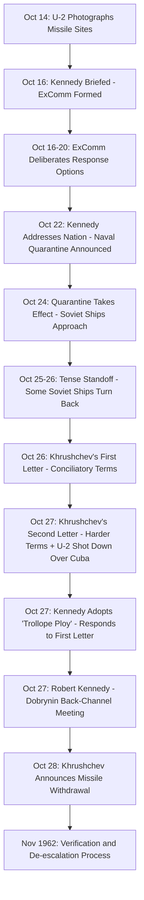
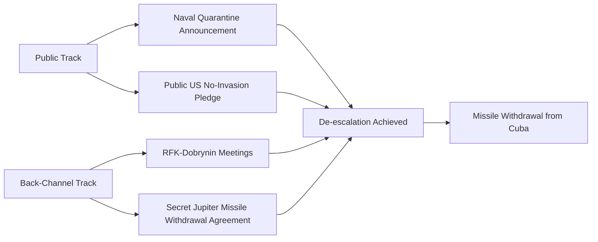
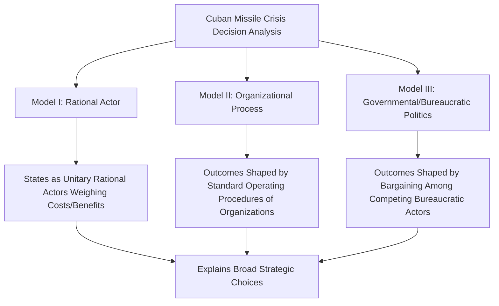

## The Cuban Missile Crisis and Crisis Diplomacy

### Overview

The Cuban Missile Crisis (October 16–28, 1962) was a thirteen-day confrontation between the United States and the Soviet Union triggered by the discovery of Soviet nuclear missile installations in Cuba, widely regarded as the closest the Cold War came to direct nuclear conflict between the two superpowers. It stands as the foundational modern case study in crisis diplomacy, illustrating principles of signaling, back-channel negotiation, decision-making under extreme time pressure and uncertainty, and the construction of face-saving off-ramps to enable de-escalation without capitulation.

### Historical Context

**Key Points**

- **Cold War Background**: The crisis occurred against the backdrop of heightened U.S.-Soviet tension following the 1961 Bay of Pigs invasion attempt against Cuba and the erection of the Berlin Wall, alongside an ongoing strategic nuclear arms race.
- **Soviet Motivation**: Soviet Premier Nikita Khrushchev's decision to place medium- and intermediate-range ballistic missiles in Cuba is generally understood by historians to have reflected multiple, likely overlapping motivations: addressing a perceived U.S. strategic nuclear advantage, protecting the Castro government from further U.S.-backed intervention following the Bay of Pigs, and responding to U.S. Jupiter missiles already deployed in Turkey and Italy near Soviet borders.
- **Discovery**: U.S. U-2 reconnaissance aircraft photographed missile installation sites in Cuba on October 14, 1962, with imagery analyzed and presented to President John F. Kennedy on October 16, initiating the crisis period.
- **Strategic Stakes**: The missiles, once operational, would have significantly reduced U.S. warning time for a potential Soviet nuclear strike, altering the strategic balance in ways U.S. policymakers assessed as unacceptable.

[Inference] Historians continue to debate the relative weight of Khrushchev's various motivations (strategic parity, Cuba's defense, and the Turkey/Italy missile parity concern); Soviet archival sources and post-Cold War historical research have informed but not fully resolved this debate, and the balance of scholarly interpretation should be understood as evolving rather than fixed.

### Timeline of Key Events

### Core Crisis Diplomacy Mechanisms Employed

**Key Points**

- **Executive Committee (ExComm) Structured Deliberation**: Kennedy convened a specially formed Executive Committee of the National Security Council, comprising senior advisors, to systematically evaluate response options ranging from diplomatic protest to full military invasion, illustrating structured, multi-option crisis decision-making rather than premature commitment to a single course of action.
- **Graduated, Calibrated Response**: The chosen response — a naval "quarantine" (a deliberately chosen term avoiding the more legally loaded term "blockade," which under international law could constitute an act of war) — represented a calibrated intermediate step between passive diplomatic protest and military strike, preserving further escalation and de-escalation options.
- **Back-Channel Communication**: Direct, discreet communication channels, most notably between Attorney General Robert F. Kennedy and Soviet Ambassador Anatoly Dobrynin, operated alongside formal diplomatic correspondence, enabling more candid negotiation than public or fully formal channels permitted.
- **Selective Response to Ambiguous Signals (the "Trollope Ploy")**: Facing two Soviet communications of differing tone and terms on October 26–27, Kennedy's team chose to publicly respond to the more conciliatory first letter while privately negotiating on the harder terms of the second — a technique later termed the "Trollope Ploy" (an allusion to a literary device in Anthony Trollope's novels), illustrating selective engagement with the most favorable available negotiating signal.
- **Face-Saving Off-Ramp Construction**: The final resolution included a public commitment by the U.S. not to invade Cuba, alongside a secret, separately negotiated agreement to remove U.S. Jupiter missiles from Turkey within several months — allowing Khrushchev a face-saving exit that was not publicly disclosed as a reciprocal concession at the time, preserving the U.S. public narrative of Soviet capitulation while providing the Soviets a genuine, if quiet, concession.

### Decision-Making Under Uncertainty

**Key Points**

- **Incomplete and Evolving Information**: U.S. decision-makers operated with significant uncertainty regarding Soviet intentions, the operational status of missiles already in Cuba, and the presence of tactical nuclear weapons and Soviet troop strength on the island — the latter substantially underestimated at the time, as later revealed through post-Cold War historical research.
- **Time Pressure**: The compressed thirteen-day timeline required rapid, high-stakes decision-making with limited opportunity for extended deliberation at each juncture, a defining feature distinguishing crisis diplomacy from standard negotiation processes.
- **Risk of Miscalculation and Accidental Escalation**: Several documented incidents during the crisis illustrate the risk of unintended escalation independent of top-level decision-making, including the October 27 shootdown of a U.S. U-2 aircraft over Cuba (later understood to have resulted from a local Soviet commander's independent decision rather than explicit Moscow authorization) and a separate incident involving a Soviet submarine (B-59) that reportedly came close to authorizing a nuclear-armed torpedo launch based on a senior officer's judgment under extreme stress, an incident that has received increased scholarly attention as archival information became available after the Cold War.
- **Groupthink Risk and Mitigation**: The ExComm process has been studied extensively in decision-science and crisis-management literature (including foundational work by Graham Allison's *Essence of Decision*) both as an example of structured deliberation mitigating impulsive decision-making and as a case illustrating persistent risks of groupthink dynamics even within formally structured advisory processes.

[Inference] The full extent of how close specific incidents (such as the B-59 submarine episode) came to producing unauthorized nuclear use remains a subject of historical interpretation dependent on incomplete archival and testimonial evidence; while frequently cited as a near-miss in popular and some scholarly accounts, the precise operational authority and probability of launch involved is not uniformly agreed upon across all historical accounts.

### Analytical Frameworks Derived from the Crisis

**Example**

| Framework | Originator/Association | Core Insight |
| --- | --- | --- |
| Essence of Decision (Three Models) | Graham Allison (1971) | Analyzes the crisis through Rational Actor, Organizational Process, and Governmental (Bureaucratic Politics) models, illustrating how institutional and bureaucratic dynamics shape decisions beyond simple rational calculation |
| Trollope Ploy | Diplomatic historiography | Selectively engaging with the most favorable of multiple, potentially contradictory negotiating signals |
| Graduated Response / Escalation Ladder | Crisis management theory (associated with thinkers such as Herman Kahn) | Employing calibrated intermediate responses to preserve future escalation and de-escalation options |
| Face-Saving Diplomacy | General diplomatic practice, prominently illustrated by this case | Structuring outcomes to allow a counterpart's genuine concession without public appearance of unilateral capitulation |

### Graham Allison's Essence of Decision: Analytical Models

**Key Points**

- Allison's framework, developed specifically through analysis of this crisis, remains widely taught in international relations and public policy curricula as a foundational multi-lens approach to understanding complex governmental decision-making, cautioning against relying solely on a simplified rational-actor model.
- [Inference] While Allison's three-model framework is broadly influential and widely cited, subsequent scholarship has proposed refinements and critiques of specific aspects of the original analysis as additional archival material (including Soviet-side records) became available after the book's initial 1971 publication and its 1999 revised edition.

### Communication and Signaling Challenges

**Key Points**

- **Formal Channel Delays**: Kennedy and Khrushchev lacked a direct, rapid communication link during the crisis, with formal messages relayed through embassies and requiring translation and transmission time, contributing to the risk of misunderstanding during a fast-moving situation.
- **Direct Communications Link Establishment**: This experience directly motivated the establishment of the U.S.-Soviet "Hotline" (formally the Washington-Moscow Direct Communications Link) in 1963, a dedicated rapid communication channel intended to prevent similar communication delays from exacerbating future crises.
- **Ambiguity in Written Correspondence**: The shifting tone and terms between Khrushchev's two key letters (October 26 and 27) illustrate the interpretive challenges crisis negotiators face when signals from a counterpart appear inconsistent, requiring judgment calls about which signal most accurately reflects the counterpart's actual negotiating position or internal decision-making state.

### Resolution and Immediate Aftermath

**Example**

- **Public Terms**: Soviet withdrawal of missiles from Cuba, verified through UN-monitored and U.S. aerial reconnaissance processes, in exchange for a U.S. public pledge not to invade Cuba.
- **Secret Terms**: A confidential U.S. commitment to remove Jupiter missiles from Turkey within a defined timeframe, not publicly disclosed as part of the settlement until years later, preserving the Kennedy administration's public narrative while providing Khrushchev a genuine reciprocal concession to justify the withdrawal domestically.
- **Longer-Term Institutional Legacy**: Beyond the Hotline agreement, the crisis is credited by many historians and arms control scholars with contributing to subsequent momentum toward arms control diplomacy, including the Partial Nuclear Test Ban Treaty (1963).

[Inference] The specific causal contribution of the Cuban Missile Crisis to subsequent arms control agreements, as distinct from other contemporaneous factors driving U.S.-Soviet arms control interest, is a matter of historical interpretation rather than a precisely quantifiable causal claim.

### Diagram: Crisis Diplomacy Decision Funnel (SVG)

<svg xmlns="http://www.w3.org/2000/svg" viewBox="0 0 800 280">
<text x="400" y="25" font-size="16" font-weight="bold" text-anchor="middle" fill="#1a1a1a">Crisis Diplomacy Decision Funnel (svg_diagram)</text>
<rect x="40" y="50" width="150" height="180" fill="#fef2f2" stroke="#dc2626" rx="6" />
<text x="115" y="75" font-size="11" font-weight="bold" text-anchor="middle" fill="#dc2626">Military Strike</text>
<text x="115" y="95" font-size="9" text-anchor="middle" fill="#555">Highest escalation</text>
<text x="115" y="110" font-size="9" text-anchor="middle" fill="#555">risk</text>
<rect x="220" y="50" width="150" height="180" fill="#fffbeb" stroke="#d97706" rx="6" />
<text x="295" y="75" font-size="11" font-weight="bold" text-anchor="middle" fill="#d97706">Naval Quarantine</text>
<text x="295" y="95" font-size="9" text-anchor="middle" fill="#555">Calibrated</text>
<text x="295" y="110" font-size="9" text-anchor="middle" fill="#555">intermediate step</text>
<text x="295" y="125" font-size="9" text-anchor="middle" fill="#555">(chosen option)</text>
<rect x="400" y="50" width="150" height="180" fill="#eff6ff" stroke="#2563eb" rx="6" />
<text x="475" y="75" font-size="11" font-weight="bold" text-anchor="middle" fill="#2563eb">Diplomatic Protest</text>
<text x="475" y="95" font-size="9" text-anchor="middle" fill="#555">Lower risk, lower</text>
<text x="475" y="110" font-size="9" text-anchor="middle" fill="#555">deterrent effect</text>
<rect x="580" y="50" width="150" height="180" fill="#f0fdf4" stroke="#16a34a" rx="6" />
<text x="655" y="75" font-size="11" font-weight="bold" text-anchor="middle" fill="#16a34a">Do Nothing/</text>
<text x="655" y="90" font-size="11" font-weight="bold" text-anchor="middle" fill="#16a34a">Accept</text>
<text x="655" y="110" font-size="9" text-anchor="middle" fill="#555">Rejected as</text>
<text x="655" y="125" font-size="9" text-anchor="middle" fill="#555">unacceptable</text>
<text x="400" y="255" font-size="10" text-anchor="middle" fill="#555">ExComm evaluated full spectrum before selecting calibrated quarantine response</text>
</svg>

### Relevance to Contemporary Diplomatic Leadership

**Key Points**

- **Structured Advisory Process Design**: The ExComm model continues to inform contemporary crisis management structure design, emphasizing the value of systematically generating and evaluating multiple response options rather than defaulting prematurely to a single course of action.
- **Value of Back-Channel Diplomacy**: The RFK-Dobrynin channel is frequently cited as a paradigmatic example of the strategic value of discreet, informal communication channels operating in parallel with formal diplomatic correspondence, particularly for sensitive concessions difficult to negotiate in fully public or formal settings.
- **Face-Saving Design in Modern Negotiation**: The secret Turkey missile withdrawal illustrates a technique with continued relevance in contemporary diplomacy: structuring settlements to allow a counterpart genuine concessions without domestic political humiliation, which can materially affect a counterpart's willingness to de-escalate.
- **Communication Infrastructure Investment**: The establishment of the Hotline demonstrates how crisis experiences can drive durable institutional and technical investment in crisis communication infrastructure, a principle extended in various forms to other bilateral and multilateral crisis communication mechanisms established since 1963.
- **Caution Against Overgeneralization**: Scholars caution against treating the Cuban Missile Crisis as a universally generalizable template, given its specific bipolar Cold War context, the particular personalities involved, and factors (such as the absence of non-state nuclear actors) that may not directly transfer to contemporary multipolar or asymmetric crisis contexts.

### Conclusion

The Cuban Missile Crisis remains the paradigmatic case study in crisis diplomacy, illustrating how structured decision-making processes, calibrated graduated responses, discreet back-channel communication, and deliberately constructed face-saving exit terms can enable de-escalation from the brink of catastrophic conflict. Its analytical legacy — most notably through Graham Allison's multi-model decision framework and the concrete institutional innovation of the U.S.-Soviet Hotline — continues to shape how diplomatic leaders design crisis management structures and negotiation strategy under conditions of extreme time pressure, incomplete information, and high stakes. While the crisis's specific Cold War bipolar context limits direct generalizability to all contemporary crises, its core lessons regarding structured deliberation, signal interpretation, and face-saving settlement design remain foundational reference points in diplomatic leadership training.

**Next Steps**

- Graham Allison's Essence of Decision: Three Models in Depth
- Back-Channel Diplomacy: Design and Risk Considerations
- Crisis Communication Infrastructure: From the Hotline to Modern Mechanisms
- Face-Saving Settlement Design in Contemporary Negotiation
- Comparative Nuclear Crisis Case Studies (e.g., 1973 Yom Kippur War Nuclear Alert)
- Groupthink and Structured Deliberation in High-Stakes Decision-Making
- Arms Control Diplomacy Following the Cuban Missile Crisis
- Bureaucratic Politics Theory in Foreign Policy Decision-Making