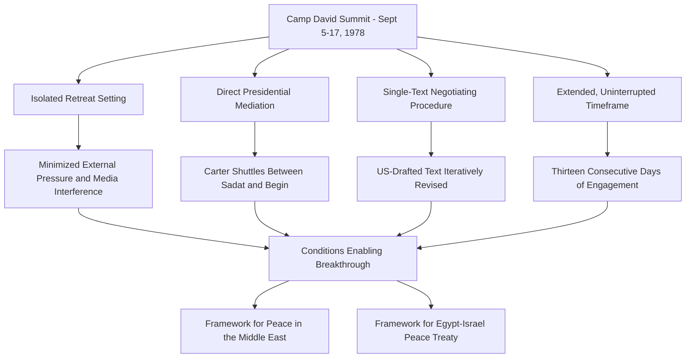
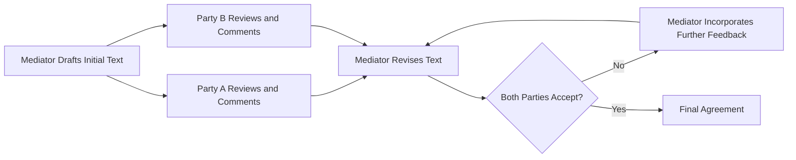

## The Camp David Accords and Mediated Peace Negotiation

### Overview

The Camp David Accords (September 1978) resulted from a thirteen-day mediated negotiation between Egyptian President Anwar Sadat and Israeli Prime Minister Menachem Begin, facilitated directly by U.S. President Jimmy Carter at the Camp David presidential retreat in Maryland. The process produced two framework agreements that subsequently led to the Egypt-Israel Peace Treaty (March 1979) — the first peace treaty between Israel and an Arab state. The case is widely studied as a foundational example of active third-party mediation, sustained high-level presidential engagement, and structured problem-solving negotiation technique applied to an intractable, deeply historically rooted conflict.

### Historical Context

**Key Points**

- **Preceding Conflicts**: The negotiation followed four Arab-Israeli wars (1948, 1956, 1967, and 1973), with the 1967 Six-Day War resulting in Israeli occupation of the Sinai Peninsula (Egyptian territory) and the 1973 Yom Kippur War having significantly altered the strategic and psychological landscape for both Egypt and Israel.
- **Sadat's Strategic Shift**: Sadat's unprecedented visit to Jerusalem in November 1977 and address to the Israeli Knesset marked a dramatic diplomatic opening, breaking a long-standing Arab League consensus against direct engagement with Israel and creating the political opening that made the subsequent Camp David process possible.
- **Bilateral Track Stalemate**: Direct bilateral talks following Sadat's Jerusalem visit had stalled by mid-1978 over core issues including the future of the Sinai, Israeli settlements, and the broader Palestinian question, prompting Carter's decision to convene direct, sustained, U.S.-mediated talks.
- **Domestic Political Risk for Both Leaders**: Both Sadat and Begin faced significant domestic and regional political risk in pursuing negotiation — Sadat facing broader Arab world isolation (Egypt was subsequently suspended from the Arab League following the treaty) and Begin facing opposition from factions within Israel resistant to territorial concessions in the Sinai.

### The Camp David Process: Structural Design

**Key Points**

- **Isolated Retreat Setting**: The choice of Camp David, a secluded presidential retreat, was deliberately designed to remove negotiators from media scrutiny, domestic political pressure, and the formal diplomatic protocol constraints of a conventional conference setting, enabling more candid engagement.
- **Direct Presidential Mediation**: Carter engaged personally and extensively throughout the process, including individual meetings with each leader and, at points, shuttling directly between separate cabins housing the two delegations after direct Sadat-Begin engagement became counterproductive due to personal friction between the two leaders.
- **Single-Text Negotiating Procedure**: A key procedural innovation involved U.S. mediators drafting a single negotiating text, which was then iteratively revised based on separate feedback from each delegation, rather than requiring the parties to negotiate directly over competing draft texts — a technique credited with reducing zero-sum positional bargaining dynamics.
- **Extended, Uninterrupted Timeframe**: The thirteen-day duration, unusually long and sustained for a single negotiating session, allowed the process to work through multiple rounds of proposal, deadlock, and revision without external interruption.

### Single-Text Mediation Technique

The single-text procedure, prominently associated with the Camp David negotiation and subsequently influential in negotiation theory (notably discussed in Roger Fisher and William Ury's *Getting to Yes*), represents a specific structural innovation in mediated negotiation.

**Key Points**

- **Reduces Positional Anchoring**: By having parties respond to a mediator-drafted text rather than to each other's competing drafts directly, the technique reduces the tendency toward entrenched positional bargaining and public commitment to fixed positions.
- **Shifts Focus to Interests**: The technique facilitates a shift from positional bargaining toward interest-based negotiation, as parties critique specific text elements rather than defending or attacking the other party's overall proposal.
- **Mediator Workload and Trust Requirements**: The technique places substantial drafting and synthesis burden on the mediating party and requires both parties to trust the mediator's genuine neutrality (or, in this case, accept a mediator perceived as sufficiently balanced despite the U.S.'s own strategic interests in the outcome).

[Inference] While the single-text procedure is widely credited as a significant contributing factor to the Camp David breakthrough and has become a recognized standard technique in negotiation theory literature, isolating its precise causal contribution relative to other factors (personal relationships, external pressure, domestic political calculations of the two leaders) is inherently difficult in a single historical case and remains a matter of scholarly interpretation.

### Key Outcomes

**Example**

| Agreement | Core Content |
| --- | --- |
| Framework for Peace in the Middle East | Addressed broader regional peace principles, including provisions on Palestinian self-governance (autonomy) in the West Bank and Gaza — provisions whose full implementation was not subsequently realized in the manner originally envisioned |
| Framework for the Conclusion of a Peace Treaty Between Egypt and Israel | Established the basis for a bilateral peace treaty, including Israeli withdrawal from the Sinai Peninsula and normalization of diplomatic relations |
| Egypt-Israel Peace Treaty (March 1979) | Formal treaty implementing the bilateral framework, including phased Israeli withdrawal from Sinai (completed 1982) and establishment of diplomatic relations |

[Unverified] The precise implementation status and subsequent historical evaluation of the Palestinian autonomy provisions specifically is a matter of extensive historical and political debate beyond the scope of a factual summary; the framework's Palestinian-related provisions are widely regarded by historians and policy analysts as having achieved substantially less implementation than the bilateral Egypt-Israel provisions, though characterizations of why and to what extent vary across different analytical and political perspectives.

### Leadership and Interpersonal Dynamics

**Key Points**

- **Personal Relationship Strain**: Direct Sadat-Begin engagement reportedly became strained relatively early in the process due to personal friction and sharply differing negotiating styles, leading Carter's team to shift toward a shuttle format with more limited direct leader-to-leader engagement for portions of the summit.
- **Carter's Sustained Personal Investment**: Carter's own extensive personal engagement, including direct drafting involvement and sustained attention over the full thirteen days, is frequently cited in diplomatic leadership literature as a case illustrating the potential impact of head-of-state-level, hands-on mediation commitment, as distinct from delegating mediation entirely to career diplomatic staff.
- **Managing Domestic Political Constraints**: Both Sadat and Begin required negotiating outcomes defensible to their respective domestic and regional political constituencies; skilled mediation required Carter's team to craft language and provisions that could be presented as consistent with each leader's prior public commitments and political redlines.
- **Use of Personal Gestures and Symbolic Diplomacy**: Accounts of the summit describe the use of personal gestures (including a notably cited episode involving Carter presenting Begin with photographs inscribed for his grandchildren at a critical late-stage impasse) as tools for shifting the emotional and relational register of the negotiation at moments of deadlock.

[Unverified] Specific anecdotal details of interpersonal exchanges during the summit are drawn from participant memoirs and subsequent historical accounts, which may vary in detail or emphasis across different sources; such accounts should be treated as illustrative of the broader dynamic rather than definitively verified in every specific detail.

### Diagram: Mediator Role Structure (SVG)

<svg xmlns="http://www.w3.org/2000/svg" viewBox="0 0 800 260">
<text x="400" y="25" font-size="16" font-weight="bold" text-anchor="middle" fill="#1a1a1a">Mediated Negotiation Structure at Camp David (svg_diagram)</text>
<circle cx="150" cy="140" r="60" fill="#dbeafe" stroke="#2563eb" stroke-width="2" />
<text x="150" y="135" font-size="11" text-anchor="middle" font-weight="bold">Sadat</text>
<text x="150" y="150" font-size="10" text-anchor="middle">(Egypt)</text>
<circle cx="650" cy="140" r="60" fill="#fce7f3" stroke="#db2777" stroke-width="2" />
<text x="650" y="135" font-size="11" text-anchor="middle" font-weight="bold">Begin</text>
<text x="650" y="150" font-size="10" text-anchor="middle">(Israel)</text>
<circle cx="400" cy="140" r="70" fill="#fef3c7" stroke="#d97706" stroke-width="2" />
<text x="400" y="130" font-size="12" text-anchor="middle" font-weight="bold">Carter</text>
<text x="400" y="148" font-size="10" text-anchor="middle">Active Mediator</text>
<text x="400" y="163" font-size="10" text-anchor="middle">(Single-Text Drafter)</text>
<path d="M210 140 L 330 140" stroke="#333" stroke-width="1.5" marker-end="url(#a1)" />
<path d="M470 140 L 590 140" stroke="#333" stroke-width="1.5" marker-end="url(#a1)" />
<path d="M180 90 Q 400 20 620 90" stroke="#999" stroke-width="1" fill="none" stroke-dasharray="4,3" />
<text x="400" y="45" font-size="9" text-anchor="middle" fill="#777">Limited direct engagement after early friction</text>
</svg>

### Analytical Frameworks Derived from the Case

**Key Points**

- **Interest-Based Negotiation Illustration**: The case is frequently used in negotiation pedagogy (notably in the Harvard Negotiation Project tradition) to illustrate the distinction between negotiating positions (e.g., Egypt's position on Sinai sovereignty, Israel's position on security guarantees) and underlying interests (Egyptian territorial integrity and sovereignty; Israeli security and defensible borders), with the eventual Sinai demilitarization and phased withdrawal arrangement often cited as addressing both parties' core underlying interests rather than merely splitting the difference on stated positions.
- **Mediator Leverage and Neutrality Balance**: The case illustrates how a mediator (the U.S.) with substantial independent strategic interest in the outcome, and correspondingly significant leverage (including economic and military aid relationships with both parties), can nonetheless function as an effective, broadly trusted mediator provided both parties perceive sufficient procedural fairness and mediator investment in a mutually acceptable outcome.
- **Sequencing and Issue Linkage**: The negotiation's structure — addressing bilateral Egypt-Israel issues with greater concreteness and success than the broader regional Palestinian framework — is frequently analyzed as an illustration of how partial issue-linkage sequencing can enable achievable agreement on more tractable bilateral issues while more intractable multilateral or regional issues remain comparatively unresolved.

### Comparative Context: Mediated vs. Direct Bilateral Negotiation

**Example**

| Dimension | Direct Bilateral Negotiation | Mediated Negotiation (Camp David Model) |
| --- | --- | --- |
| Communication Channel | Parties negotiate directly | Mediator often relays and reframes communication |
| Text Drafting | Parties draft and counter-draft | Single mediator-drafted text iteratively revised |
| De-escalation of Personal Friction | Limited buffer against interpersonal tension | Mediator can separate parties when direct engagement is counterproductive |
| Leverage Application | Parties rely on their own leverage | Mediator can apply independent leverage/incentives (aid, security guarantees) |
| Domestic Political Cover | Parties bear full visible responsibility for concessions | Mediator's framing can provide political cover for difficult concessions |

### Critiques and Limitations

**Key Points**

- **Incomplete Regional Resolution**: The Framework for Peace in the Middle East's Palestinian self-governance provisions were not implemented as originally envisioned, and the broader Israeli-Palestinian and Arab-Israeli regional conflict remained substantially unresolved, leading some analysts to characterize the accords as a significant but partial and bilaterally-limited achievement rather than a comprehensive regional peace settlement.
- **Egyptian Regional Isolation**: Egypt's subsequent suspension from the Arab League and broader regional isolation following the treaty illustrates the domestic and regional political costs Sadat bore for the agreement, and is frequently cited in discussions of the risks bilateral breakthrough agreements can pose to a leader's broader regional standing — Sadat's assassination in 1981, while attributed to multiple contributing factors, is frequently discussed in relation to the domestic political backlash associated with the peace process.
- **Generalizability Questions**: Scholars debate the extent to which the specific conditions enabling the Camp David breakthrough — sustained head-of-state engagement, an isolated retreat setting, and a mediator with substantial independent leverage over both parties — are replicable in other conflict contexts lacking a comparably resourced and motivated third-party mediator.
- **Asymmetric Mediator Interest**: Critics note that the U.S. mediator's own substantial strategic interests in the outcome (Cold War regional positioning, alliance relationships) complicate characterizations of the process as neutral third-party mediation in a purely disinterested sense, even though it is frequently studied as a mediation case.

### Relevance to Contemporary Diplomatic Leadership

**Key Points**

- **Active Mediation Model**: The case remains a primary reference point for "active mediation" approaches, in which the third party takes a substantive, hands-on role in shaping proposal content (via the single-text procedure) rather than serving solely as a neutral facilitator of party-to-party dialogue.
- **Retreat-Format Negotiation Design**: The isolated, extended-duration retreat format has influenced subsequent high-stakes negotiation design choices in various contexts requiring sustained, distraction-free engagement away from domestic media and political pressure.
- **Head-of-State Engagement Calculus**: The case is frequently referenced in discussions of when and how directly a head of state should personally engage in mediation versus delegating to career diplomatic staff, weighing the potential breakthrough value of sustained top-level engagement against the political risk of head-of-state association with a potential failure.
- **Single-Text Procedure Continued Use**: The single-text technique has been subsequently applied and adapted in various other complex multilateral and bilateral negotiations, reflecting its recognized value as a structural tool for reducing positional bargaining dynamics.

### Conclusion

The Camp David Accords remain a defining case study in mediated peace negotiation, illustrating how sustained, hands-on third-party mediation — combined with structural innovations such as the single-text negotiating procedure and a deliberately isolated, extended-duration retreat format — can produce breakthrough agreement on deeply entrenched bilateral conflict issues even where broader regional resolution remains elusive. The case demonstrates both the potential of active, head-of-state-level mediation and the practical limits of bilateral breakthrough in addressing more complex multilateral dimensions of a broader regional conflict. Its structural and procedural innovations continue to inform negotiation theory and mediation practice, while its incomplete regional legacy offers a cautionary illustration of the gap that can persist between successful bilateral agreement and comprehensive regional peace.

**Related Topics**

- Single-Text Negotiating Procedure: Design and Application Beyond Camp David
- Interest-Based Negotiation Theory (Harvard Negotiation Project / Getting to Yes)
- Comparative Case Study: Oslo Accords and Track Two Mediation
- Head-of-State vs. Career Diplomat Mediation Roles
- Domestic Political Constraints in International Peace Negotiation
- Retreat-Format and Isolated-Setting Negotiation Design
- Sadat's Jerusalem Visit and Diplomatic Risk-Taking
- Regional Isolation Costs of Bilateral Peace Agreements