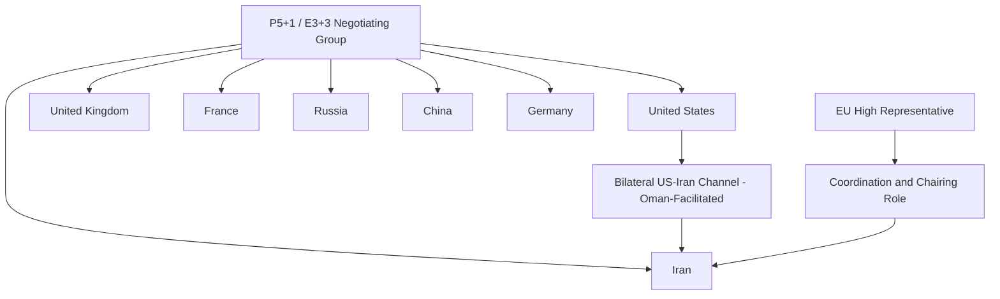
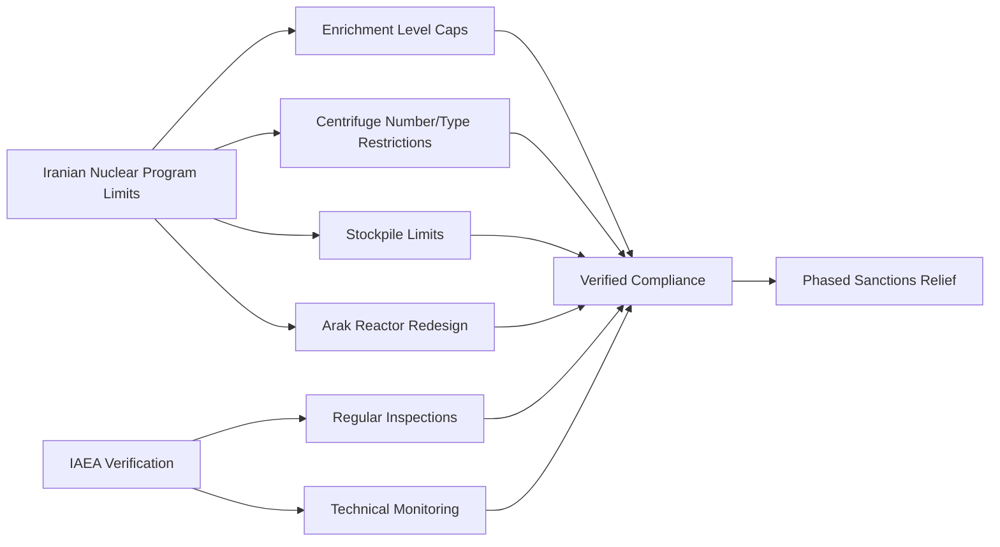

## The Iran Nuclear Deal and Multilateral Negotiation

### Overview

The Iran nuclear deal, formally the Joint Comprehensive Plan of Action (JCPOA), was concluded in July 2015 between Iran and the P5+1 group (the five permanent UN Security Council members — the United States, United Kingdom, France, Russia, and China — plus Germany), coordinated through the European Union's foreign policy representative. The agreement placed verified limits on Iran's nuclear program in exchange for phased relief from international sanctions. The case is a foundational example of complex, multi-party, technically intensive multilateral negotiation involving coalition management among negotiating partners with divergent interests, parallel bilateral and multilateral tracks, and detailed verification-based agreement design.

### Historical Context

**Key Points**

- **Origins of the Dispute**: International concern over Iran's nuclear program intensified from the early 2000s following revelations about previously undeclared nuclear facilities, leading to a series of UN Security Council resolutions and escalating international sanctions through the 2000s and early 2010s.
- **Sanctions Regime Development**: A multilayered sanctions architecture developed over this period, combining UN Security Council sanctions, unilateral U.S. sanctions, and coordinated EU sanctions, targeting Iran's oil exports, banking sector, and broader economy, which cumulatively imposed substantial economic pressure on Iran.
- **Interim Agreement (Joint Plan of Action, November 2013)**: A preliminary interim agreement, reached shortly after the election of Iranian President Hassan Rouhani (viewed as more moderate than his predecessor), established a framework freezing key aspects of Iran's nuclear program in exchange for limited sanctions relief while comprehensive negotiations proceeded.
- **Extended Negotiation Period**: Formal comprehensive negotiations toward the JCPOA extended over roughly twenty months following the interim agreement, involving multiple rounds of talks, missed deadlines, and extensions before the final agreement was reached in July 2015.

### The P5+1 Negotiating Structure

**Key Points**

- **P5+1 / E3+3 Composition**: The negotiating coalition combined the five permanent UN Security Council members with Germany, reflecting both UN Security Council authority over sanctions and the EU's (particularly the E3 — UK, France, Germany's) established role in earlier phases of the diplomatic engagement with Iran.
- **EU Coordinating Role**: The EU's High Representative for Foreign Affairs and Security Policy (Catherine Ashton, later Federica Mogherini) served as formal coordinator and chair of the P5+1 process, providing institutional continuity and a less bilaterally-charged convening role than any single P5+1 member state might have provided.
- **Parallel Bilateral US-Iran Channel**: A discreet bilateral channel between the U.S. and Iran, reportedly facilitated in part through Omani mediation, operated in parallel with the formal multilateral P5+1 process, illustrating how bilateral back-channels can complement formal multilateral negotiation tracks even within a nominally multilateral process.
- **Coalition Management Challenge**: The P5+1 grouping itself required significant internal coordination given the divergent interests and relationships each member state held with Iran — Russia and China maintaining more extensive economic and strategic ties with Iran than Western P5+1 members, requiring the coalition to maintain sufficient unity to preserve negotiating leverage over Iran while accommodating differing member priorities.

### Technical Complexity and Verification Architecture

**Key Points**

- **Highly Technical Subject Matter**: Unlike many diplomatic negotiations centered primarily on political or territorial questions, the JCPOA required negotiators and their technical support teams to engage deeply with nuclear physics, enrichment technology, and verification methodology, necessitating close integration of diplomatic negotiators with technical experts (including International Atomic Energy Agency (IAEA) specialists).
- **IAEA Verification Role**: The International Atomic Energy Agency was designated as the primary verification body under the agreement, tasked with monitoring Iranian compliance through inspections and technical monitoring mechanisms, illustrating the integration of an independent technical international organization into the verification architecture of a politically negotiated agreement.
- **Key Technical Provisions**: The agreement included specific, technically detailed limits on uranium enrichment levels, centrifuge numbers and types, heavy-water reactor design modification (at the Arak facility), and stockpile limits, alongside a phased sanctions relief schedule linked to verified compliance milestones.
- **Sunset Clause Design**: The agreement incorporated phased duration provisions, with certain restrictions set to expire or ease at specified future dates — a design feature that became a significant point of subsequent political controversy and critique regarding the deal's long-term durability.

### Negotiation Process Characteristics

**Key Points**

- **Multi-Track, Multi-Level Negotiation**: The process combined formal multilateral plenary sessions, smaller working-group technical negotiations, bilateral side-channels (notably US-Iran), and high-level ministerial engagement (including direct, sustained involvement by U.S. Secretary of State John Kerry and Iranian Foreign Minister Javad Zarif), illustrating a multi-level negotiation architecture operating simultaneously across several tracks.
- **Extended Duration and Deadline Extensions**: The formal comprehensive negotiation period involved multiple missed self-imposed deadlines and negotiated extensions, illustrating a pattern in complex multilateral technical negotiations where initial timelines frequently prove insufficient relative to the substantive complexity involved.
- **Personal Relationship Development**: Sustained, repeated direct engagement between Kerry and Zarif over the extended negotiation period is frequently cited as having contributed to developing sufficient working trust and communication efficiency to navigate technically and politically difficult final-stage sticking points.
- **Simultaneous Domestic Political Management**: Both the U.S. and Iranian negotiating teams operated under significant domestic political constraints throughout — the U.S. facing a skeptical Congress with independent sanctions authority, and Iran's negotiators operating within a domestic political system involving multiple centers of authority, including the Supreme Leader's ultimate oversight.

### Coalition Management in Multilateral Negotiation

**Example**

| Coalition Management Challenge | Approach Employed |
| --- | --- |
| Divergent P5+1 Member Interests | Regular internal P5+1 coordination sessions to maintain unified negotiating positions before engaging Iran |
| Russia/China vs. Western Member Relationship Asymmetries | EU coordinating role provided institutional buffer reducing perception of purely Western-driven process |
| Maintaining Sanctions Leverage Unity | Coordinated sanctions relief sequencing requiring consensus among P5+1 members on implementation |
| Balancing Bilateral and Multilateral Tracks | Discreet US-Iran channel operated in parallel without displacing formal P5+1 multilateral framework |

[Inference] The relative contribution of the parallel US-Iran bilateral channel versus the formal P5+1 multilateral process to the ultimate agreement is a matter of differing historical and analytical interpretation; both tracks are widely regarded as having played meaningfully complementary roles, though precise attribution of which track resolved which specific sticking points is not always clearly documented in publicly available accounts.

### Domestic Ratification and Implementation Mechanism

**Key Points**

- **Non-Treaty Political Commitment**: The JCPOA was structured as a political commitment rather than a legally binding treaty requiring formal ratification (such as U.S. Senate advice and consent), a design choice that avoided the higher procedural threshold formal treaty ratification would have required in the U.S. system, but which also left the agreement more vulnerable to reversal by subsequent administrations without a treaty's greater legal durability.
- **UN Security Council Endorsement**: UN Security Council Resolution 2231 (July 2015) endorsed the JCPOA and established a framework terminating prior UN sanctions resolutions, providing an additional layer of multilateral international legal grounding for the agreement.
- **U.S. Congressional Review Mechanism**: The Iran Nuclear Agreement Review Act (2015) established a specific U.S. congressional review process for the agreement, reflecting a negotiated domestic political compromise given the absence of formal treaty ratification.
- **Subsequent U.S. Withdrawal (2018)**: The United States withdrew from the JCPOA in May 2018 under the Trump administration, reimposing sanctions and prompting a gradual reduction in Iranian compliance with agreement provisions; other P5+1 parties (notably the E3, Russia, and China) initially sought to preserve the agreement's remaining framework without full U.S. participation.

[Unverified] The subsequent status of Iran's nuclear program, JCPOA-related diplomatic engagement, and any successor negotiation efforts have continued to evolve significantly since 2018 and particularly in the period closer to and following this content's knowledge boundary; current status should be verified through up-to-date reporting given the fluid and continuing nature of this diplomatic issue.

### Diagram: Multilateral Negotiation Track Architecture (SVG)

<svg xmlns="http://www.w3.org/2000/svg" viewBox="0 0 800 300">
<text x="400" y="25" font-size="16" font-weight="bold" text-anchor="middle" fill="#1a1a1a">JCPOA Multi-Track Negotiation Architecture (svg_diagram)</text>
<rect x="40" y="55" width="720" height="55" fill="#eff6ff" stroke="#2563eb" rx="6" />
<text x="400" y="80" font-size="12" font-weight="bold" text-anchor="middle" fill="#2563eb">Track 1: Formal P5+1 Plenary (EU-Coordinated)</text>
<text x="400" y="98" font-size="9" text-anchor="middle" fill="#555">High-level ministerial sessions, political framework agreement</text>
<rect x="40" y="125" width="720" height="55" fill="#f0fdf4" stroke="#16a34a" rx="6" />
<text x="400" y="150" font-size="12" font-weight="bold" text-anchor="middle" fill="#16a34a">Track 2: Technical Working Groups</text>
<text x="400" y="168" font-size="9" text-anchor="middle" fill="#555">Nuclear scientists, IAEA specialists, verification detail negotiation</text>
<rect x="40" y="195" width="720" height="55" fill="#fef3c7" stroke="#d97706" rx="6" />
<text x="400" y="220" font-size="12" font-weight="bold" text-anchor="middle" fill="#d97706">Track 3: Bilateral US-Iran Back-Channel</text>
<text x="400" y="238" font-size="9" text-anchor="middle" fill="#555">Discreet direct engagement, Oman-facilitated, sensitive sticking points</text>
<text x="400" y="280" font-size="10" text-anchor="middle" fill="#555">Tracks operated in parallel, feeding into unified final agreement text</text>
</svg>

### Analytical Frameworks and Lessons

**Key Points**

- **Complex Multiparty Coalition Negotiation**: The case illustrates the distinct challenges of negotiating simultaneously across two dimensions — coalition management among P5+1 partners with divergent interests, and substantive bargaining with the counterpart state (Iran) — requiring negotiators to secure and maintain internal coalition unity as a precondition for effective external negotiation leverage.
- **Integration of Technical and Diplomatic Expertise**: The prominent role of nuclear scientists and IAEA technical experts working alongside career diplomats illustrates a negotiation model increasingly relevant to technically complex modern diplomatic issues (cybersecurity, climate, biotechnology) requiring deep subject-matter integration into negotiating teams rather than purely generalist diplomatic skill.
- **Political Commitment vs. Treaty Durability Trade-off**: The choice to structure the agreement as a political commitment rather than a ratified treaty illustrates a recurring strategic trade-off in international agreement design between achieving a politically feasible agreement in the near term versus securing the greater long-term legal durability a formal treaty ratification process can provide.
- **Sanctions as Negotiating Leverage Design**: The case is frequently studied as an example of how coordinated multilateral sanctions regimes can be deliberately constructed and sequenced as negotiating leverage, with phased relief calibrated to verified counterpart compliance as a structuring principle for the eventual agreement.

### Critiques and Debates

**Key Points**

- **Sunset Clause Controversy**: Critics, including some U.S. domestic political figures and regional actors such as Israel and some Gulf states, argued the agreement's phased duration provisions ("sunset clauses") provided insufficient long-term assurance against renewed Iranian nuclear weapons development after restrictions eased.
- **Scope Limitation Critique**: Critics also noted the agreement's narrow focus on the nuclear program specifically, without addressing other significant regional concerns (ballistic missile development, regional proxy activities), a scope limitation that reflected a deliberate negotiating choice to achieve an achievable agreement on the nuclear dimension specifically rather than a broader, likely less achievable comprehensive settlement.
- **Verification Adequacy Debate**: Supporters and the IAEA generally characterized the verification regime as robust and unprecedented in its access provisions; critics questioned whether inspection access provisions were sufficiently intrusive, particularly regarding military site access.
- **Durability and Withdrawal Consequences**: The 2018 U.S. withdrawal and subsequent developments are frequently cited in diplomatic and negotiation theory literature as illustrating the durability risks associated with the political-commitment (versus treaty) design choice, informing ongoing debates about how to balance negotiating feasibility against long-term agreement durability in future complex multilateral agreements.

### Relevance to Contemporary Diplomatic Leadership

**Key Points**

- **Coalition-Based Multilateral Negotiation Model**: The P5+1 structure offers a reference model for coalition-based approaches to negotiating with a single counterpart state on a matter of shared multilateral concern, particularly regarding the EU coordinating role as a mechanism for managing internal coalition dynamics.
- **Technical-Diplomatic Team Integration**: The case underscores the growing importance of integrating deep technical subject-matter expertise directly into diplomatic negotiating team structure for technically complex contemporary issues.
- **Sanctions Diplomacy Design**: The case remains a key reference point in the study of sanctions as a diplomatic tool, particularly regarding coordinated multilateral sanctions design and phased relief sequencing as negotiating leverage mechanisms.
- **Agreement Durability Design Trade-offs**: The case is frequently cited in contemporary discussions of international agreement design regarding the trade-offs between political feasibility (favoring executive-level political commitments) and long-term durability (favoring formal treaty ratification), a consideration directly relevant to diplomatic leaders designing future complex international agreements.

### Conclusion

The Iran nuclear deal (JCPOA) stands as a defining case study in complex, technically intensive multilateral negotiation, illustrating the distinct challenges of coalition management among negotiating partners with divergent interests, the integration of deep technical expertise into diplomatic negotiating teams, and the strategic trade-offs involved in agreement design choices such as political commitment versus treaty ratification. The EU's coordinating role, the parallel operation of bilateral and multilateral negotiating tracks, and the detailed verification architecture developed in partnership with the IAEA collectively illustrate a multi-track, multi-level negotiation model with continued relevance to contemporary technically complex diplomatic challenges. The agreement's subsequent trajectory — including the 2018 U.S. withdrawal — offers an important cautionary case study in the durability risks associated with non-treaty political commitment agreements, informing ongoing diplomatic practice regarding the design of durable multilateral agreements on technically complex and politically contested issues.

**Related Topics**

- P5+1/E3+3 Coalition Coordination Mechanisms in Depth
- Integration of Technical Expertise into Diplomatic Negotiating Teams
- Sanctions Diplomacy: Design, Sequencing, and Leverage Theory
- IAEA Verification Architecture and International Technical Oversight Bodies
- Political Commitment vs. Treaty Ratification in International Agreement Design
- Comparative Case Study: Six-Party Talks on North Korean Denuclearization
- Bilateral Back-Channel Diplomacy Within Multilateral Frameworks
- Post-Withdrawal Diplomacy and Agreement Preservation Strategies