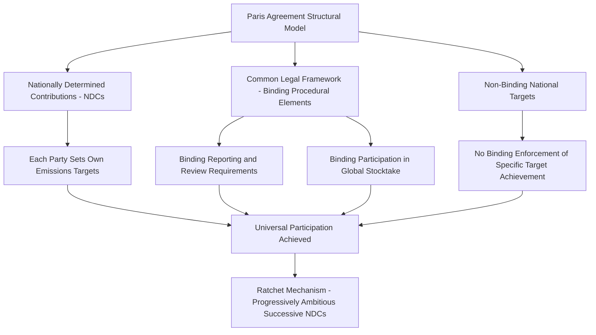
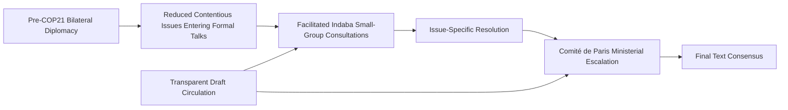

## The Paris Agreement and Consensus-Building on Climate

### Overview

The Paris Agreement, adopted in December 2015 at the 21st Conference of the Parties (COP21) to the UN Framework Convention on Climate Change (UNFCCC), represents a landmark case in large-scale, near-universal multilateral consensus-building. Negotiated among nearly 200 parties with widely divergent economic development levels, historical emissions responsibility, and domestic political constraints, the agreement is studied as a foundational example of hybrid legal architecture, bottom-up nationally determined commitment design, and structured facilitation technique deployed to achieve consensus among an unusually large and heterogeneous negotiating body.

### Historical Context

**Key Points**

- **UNFCCC Framework**: The Paris Agreement operates within the institutional architecture of the UN Framework Convention on Climate Change (adopted 1992, entered into force 1994), which established the annual Conference of the Parties (COP) as the primary multilateral climate negotiation forum.
- **Kyoto Protocol Precedent and Limitations**: The earlier Kyoto Protocol (1997) had established binding emissions reduction targets but only for a defined set of developed ("Annex I") countries, a structure that became increasingly contentious as major developing-country emitters (notably China and India) grew substantially in emissions share, and which the United States never ratified.
- **Copenhagen Failure (COP15, 2009)**: The widely regarded failure to reach a comprehensive binding agreement at the 2009 Copenhagen conference is frequently cited as a critical inflection point, prompting substantial rethinking of negotiation strategy and architecture ahead of subsequent COPs, including a shift toward the bottom-up, nationally determined approach later adopted at Paris.
- **Pre-Paris Diplomatic Groundwork**: Extensive bilateral and plenary diplomatic groundwork preceded COP21, including a notable 2014 U.S.-China joint announcement on emissions targets, widely regarded as having created significant positive momentum ahead of the Paris conference by demonstrating the two largest emitters' willingness to engage substantively.

### Structural Innovation: The Bottom-Up NDC Model

**Key Points**

- **Nationally Determined Contributions (NDCs)**: The core structural innovation of the Paris Agreement, whereby each party determines and submits its own emissions reduction targets and climate action plans, rather than having binding targets negotiated and imposed multilaterally as under the Kyoto Protocol model.
- **Bifurcated Legal Bindingness**: The agreement's architecture deliberately separates binding procedural obligations (submitting NDCs, reporting on progress, participating in periodic global stocktakes) from non-binding substantive targets (the specific emissions reduction figures within each NDC), a hybrid design credited with enabling near-universal participation, including by the United States without requiring formal Senate treaty ratification.
- **Ratchet Mechanism**: The agreement established a five-year cycle requiring parties to submit progressively more ambitious successive NDCs, designed to create an escalating ambition trajectory over time rather than relying on a single fixed target negotiated once.
- **Common but Differentiated Responsibilities**: The agreement retained the UNFCCC's foundational principle of "common but differentiated responsibilities and respective capabilities," acknowledging differing historical emissions responsibility and development capacity among parties, while applying this principle with greater flexibility than the Kyoto Protocol's more rigid developed/developing country binary.

### Consensus-Building Techniques Employed

**Key Points**

- **French COP21 Presidency Facilitation Strategy**: The French COP21 presidency, led substantively by Foreign Minister Laurent Fabius and supported by an extensive diplomatic preparation effort, is widely credited with employing a deliberate, carefully sequenced facilitation strategy distinct from less successful prior COP presidencies.
- **Extensive Pre-Conference Bilateral Diplomacy**: French diplomats conducted extensive bilateral outreach to individual parties and blocs in the months preceding COP21, seeking to identify and address key sticking points before the formal conference began, reducing the volume of unresolved contentious issues requiring resolution during the compressed formal negotiation period.
- **"Indaba" Consultation Method**: The conference employed a facilitation technique known as an "indaba" (drawing on a South African/Zulu tradition of inclusive community consultation, previously used in earlier UNFCCC contexts), involving smaller, more intimate facilitated group discussions among country representatives to work through specific contentious text issues in a less formal, less adversarial setting than full plenary sessions.
- **Transparency and Inclusivity in Text Development**: The French presidency emphasized transparent, continuously updated draft text circulation and inclusive consultation with negotiating blocs throughout the conference, aiming to ensure all parties felt genuinely heard even while working toward a text acceptable to the full body.
- **High-Level Ministerial "Comité de Paris"**: A structured ministerial-level committee mechanism was used to escalate and resolve specific unresolved issues that lower-level negotiators could not independently settle, providing an escalation pathway for the most politically sensitive remaining disagreements.

### Negotiating Bloc Dynamics

**Example**

| Negotiating Bloc | Core Priorities |
| --- | --- |
| European Union | Strong binding-style ambition, leadership positioning on climate diplomacy |
| United States | Flexible, non-treaty-ratification-requiring architecture; broad participation over rigid binding targets |
| China / BASIC Countries (Brazil, South Africa, India, China) | Preservation of differentiated responsibility principles; development-compatible flexibility |
| G77 + China (Developing Country Bloc) | Climate finance commitments; loss and damage recognition; differentiated obligations |
| Small Island Developing States (AOSIS) | Ambitious temperature goals (1.5°C emphasis); existential vulnerability considerations; loss and damage mechanisms |
| Like-Minded Developing Countries | Emphasis on historical responsibility of developed countries; resistance to symmetric obligations |

[Inference] The specific internal coalition dynamics and negotiating priorities of blocs such as BASIC, G77+China, and AOSIS involve significant internal diversity of member-state interests within each bloc; the summary above reflects commonly cited general bloc priorities in Paris Agreement historiography rather than a claim of complete internal bloc unanimity on every issue.

### The 1.5°C vs. 2°C Temperature Goal Negotiation

**Key Points**

- **Contested Ambition Level**: A significant negotiating dynamic centered on whether the agreement's temperature goal should reference limiting warming to "well below 2°C" or the more ambitious 1.5°C, with Small Island Developing States and other climate-vulnerable nations advocating strongly for the more ambitious figure given existential risks (including sea-level rise) associated with higher warming levels.
- **Dual-Reference Compromise**: The final agreement text incorporated both figures, committing to holding warming "well below 2°C" while "pursuing efforts to limit" the increase to 1.5°C — a textual compromise allowing both more ambitious and more cautious negotiating positions to claim the outcome as consistent with their priorities.
- **Symbolic and Substantive Significance**: This compromise language is frequently cited in climate diplomacy and negotiation literature as an example of constructive ambiguity — deliberately flexible language enabling consensus among parties with differing ambition preferences without requiring any single party to fully abandon its preferred formulation.

### Diagram: Paris Agreement Legal Architecture (SVG)

<svg xmlns="http://www.w3.org/2000/svg" viewBox="0 0 800 260">
<text x="400" y="25" font-size="16" font-weight="bold" text-anchor="middle" fill="#1a1a1a">Paris Agreement Hybrid Legal Architecture (svg_diagram)</text>
<rect x="60" y="55" width="330" height="170" fill="#eff6ff" stroke="#2563eb" stroke-width="1.5" rx="8" />
<text x="225" y="80" font-size="13" font-weight="bold" text-anchor="middle" fill="#2563eb">Binding Elements</text>
<text x="80" y="110" font-size="10" fill="#333">- Submit NDCs regularly</text>
<text x="80" y="132" font-size="10" fill="#333">- Report on progress (transparency)</text>
<text x="80" y="154" font-size="10" fill="#333">- Participate in Global Stocktake</text>
<text x="80" y="176" font-size="10" fill="#333">- Pursue domestic mitigation measures</text>
<text x="80" y="198" font-size="10" fill="#333">- No backsliding on ambition (ratchet)</text>
<rect x="420" y="55" width="330" height="170" fill="#fef3c7" stroke="#d97706" stroke-width="1.5" rx="8" />
<text x="585" y="80" font-size="13" font-weight="bold" text-anchor="middle" fill="#d97706">Non-Binding Elements</text>
<text x="440" y="110" font-size="10" fill="#333">- Specific emissions reduction figures</text>
<text x="440" y="132" font-size="10" fill="#333">- Achievement of stated NDC targets</text>
<text x="440" y="154" font-size="10" fill="#333">- Specific finance contribution amounts</text>
<text x="440" y="176" font-size="10" fill="#333">- No binding enforcement penalties for</text>
<text x="440" y="192" font-size="10" fill="#333"> target non-achievement</text>
</svg>

### Climate Finance and the Loss and Damage Dimension

**Key Points**

- **Climate Finance Commitments**: The negotiation included substantial focus on climate finance provisions, addressing developed countries' commitments to support developing country mitigation and adaptation efforts financially, building on earlier UNFCCC finance commitments (including the previously established goal of mobilizing $100 billion annually by 2020, a figure and its achievement status subject to ongoing tracking and debate).
- **Loss and Damage**: The Paris Agreement formally incorporated recognition of "loss and damage" associated with climate change impacts as a distinct element (Article 8), reflecting sustained advocacy from vulnerable developing countries and small island states, though the agreement's loss and damage provisions notably did not establish a liability or compensation mechanism, reflecting continued resistance from some developed countries to language implying legal liability.
- **Subsequent Loss and Damage Fund Development**: [Unverified] Formal operationalization of dedicated loss and damage funding mechanisms has continued to evolve through subsequent COP negotiations after Paris; specific current status and funding commitments should be verified against current UNFCCC reporting given ongoing developments in this area.

### Analytical Frameworks and Lessons

**Key Points**

- **Bottom-Up vs. Top-Down Negotiation Design**: The Paris Agreement's shift toward a bottom-up, nationally determined commitment structure — in contrast to the Kyoto Protocol's top-down, negotiated binding target model — is widely studied as a case illustrating how relaxing binding specificity on substantive outcomes can, under certain conditions, enable broader participation and political durability, at the cost of weaker direct enforcement of ambition levels.
- **Constructive Ambiguity as Consensus Tool**: The 1.5°C/2°C dual-goal compromise exemplifies the broader technique of constructive ambiguity — carefully calibrated language flexible enough to accommodate divergent negotiating positions — as a mechanism for achieving consensus text among a very large negotiating body.
- **Facilitation Technique Value in Large-N Negotiation**: The indaba consultation method and extensive pre-conference bilateral groundwork illustrate techniques specifically suited to managing consensus-building among an unusually large number of parties (nearly 200), where full-plenary negotiation of every contentious issue would be impractical.
- **Legal Architecture as Negotiating Tool**: The deliberate design choice to bifurcate binding procedural obligations from non-binding substantive targets illustrates how legal architecture itself can function as a negotiating tool, enabling participation from parties (such as the United States) whose domestic ratification processes would make a fully binding treaty politically difficult to achieve.

### Critiques and Debates

**Key Points**

- **Enforcement and Ambition Gap Concerns**: Critics argue the non-binding nature of specific NDC targets creates a structural "ambition gap" risk, wherein aggregate voluntary national commitments may prove insufficient to achieve the agreement's stated temperature goals absent binding enforcement mechanisms — a concern reflected in various subsequent independent assessments comparing aggregate NDC ambition against required global emissions trajectories.
- **U.S. Withdrawal and Re-entry Pattern**: The United States withdrew from the Paris Agreement in 2020 (under the Trump administration, following the required withdrawal notice period), rejoined under the Biden administration in 2021, illustrating the durability vulnerability associated with non-treaty political commitment agreements to changes in domestic political administration — a pattern with direct parallels to the Iran nuclear deal case regarding political commitment versus treaty ratification trade-offs.
- **Loss and Damage Liability Avoidance Critique**: Developing country and civil society critics have argued the agreement's explicit avoidance of liability and compensation language on loss and damage reflects continued unwillingness among major historical emitters to accept legal responsibility for climate impacts disproportionately affecting lower-emitting, more vulnerable states.
- **Differentiated Responsibility Application Debate**: Ongoing debate continues regarding whether the agreement's more flexible application of differentiated responsibility (compared to Kyoto's binary structure) adequately reflects genuine differences in historical emissions responsibility and development capacity, or whether it insufficiently distinguishes between major current emitters regardless of development status.

[Unverified] Current U.S. participation status and any further developments regarding Paris Agreement membership, NDC ambition levels, or loss and damage fund implementation should be verified against current reporting, as these are dynamic, ongoing areas of international climate diplomacy subject to continued change.

### Relevance to Contemporary Diplomatic Leadership

**Key Points**

- **Large-N Multilateral Consensus Technique**: The Paris Agreement negotiation offers a reference model for consensus-building techniques (indaba-style facilitated small-group consultation, extensive pre-conference bilateral groundwork, ministerial escalation mechanisms) applicable to other large-scale multilateral negotiations involving heterogeneous interests among a very large number of parties.
- **Hybrid Legal Design for Broad Participation**: The bifurcated binding/non-binding architecture offers a reusable design template for negotiators seeking to maximize participation breadth in contexts where fully binding treaty commitments would be politically infeasible for key parties.
- **Presidency/Chair Role Significance**: The case underscores the substantial influence a well-resourced, strategically prepared conference presidency or chair can exercise over negotiation outcomes through careful process design, sequencing, and facilitation technique, independent of that country's own substantive negotiating position.
- **Durability Trade-off Awareness**: Consistent with lessons from the Iran nuclear deal case, the Paris Agreement's post-adoption withdrawal and re-entry pattern reinforces the broader diplomatic leadership lesson regarding the durability trade-offs inherent in political-commitment versus treaty-ratification agreement design choices.

### Conclusion

The Paris Agreement stands as a landmark case in large-scale multilateral consensus-building, demonstrating how a carefully designed hybrid legal architecture — combining binding procedural obligations with non-binding substantive national targets — enabled near-universal participation among nearly 200 parties with sharply divergent interests and capacities. The French COP21 presidency's deliberate facilitation strategy, including extensive pre-conference bilateral diplomacy and the indaba consultation method, offers a widely studied model for managing consensus-building among an unusually large and heterogeneous negotiating body. At the same time, the agreement's structural reliance on voluntary national ambition, its subsequent vulnerability to U.S. withdrawal and re-entry, and ongoing debates over loss and damage liability illustrate the persistent trade-offs between achieving broad political participation and securing binding, durable, and sufficiently ambitious collective action — trade-offs that remain central to contemporary multilateral diplomatic leadership across a range of global governance challenges beyond climate specifically.

**Next Steps**

- The Indaba Consultation Method: Origins and Broader Application
- Nationally Determined Contributions: Design, Ratchet Mechanism, and Ambition Gap Analysis
- Constructive Ambiguity as a Multilateral Negotiation Technique
- Comparative Case Study: Kyoto Protocol vs. Paris Agreement Architecture
- Climate Finance Architecture and the $100 Billion Commitment
- Loss and Damage Diplomacy and Fund Operationalization
- COP Presidency Design and Facilitation Strategy Across Successive Conferences
- Political Commitment vs. Treaty Durability Across Multilateral Agreement Case Studies