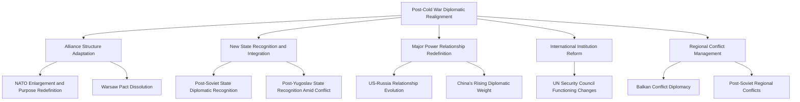
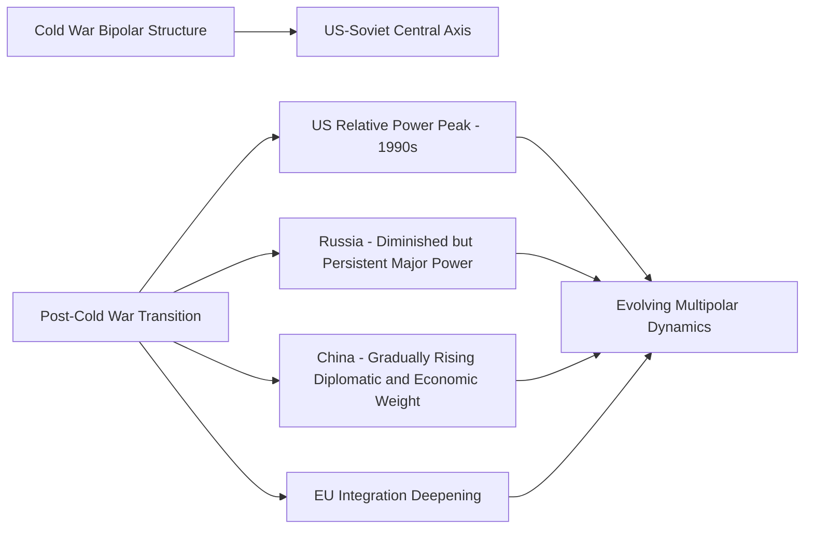

## Post-Cold War Diplomatic Realignments

### Overview

Post-Cold War Diplomatic Realignments encompasses the sweeping restructuring of international relationships, institutional architecture, and diplomatic practice that followed the collapse of Soviet communism and the end of the bipolar Cold War order (1989–1991). This period required diplomats and foreign ministries worldwide to navigate the dissolution of established alliance structures, the emergence of newly independent states, the redefinition of major-power relationships, and the search for new organizing principles for international order in the absence of the bipolar framework that had structured global diplomacy for over four decades.

### Historical Context

**Key Points**

- **Key Inflection Events**: The fall of the Berlin Wall (November 1989), the reunification of Germany (October 1990), the dissolution of the Warsaw Pact (1991), and the formal dissolution of the Soviet Union (December 1991) collectively marked the structural end of the Cold War bipolar order within roughly a two-year period.
- **Emergence of New States**: The Soviet Union's dissolution produced fifteen newly independent states, while the earlier and roughly contemporaneous breakup of Yugoslavia (beginning 1991) produced additional new states amid violent conflict, together generating an unprecedented wave of new diplomatic recognition, embassy establishment, and international organization membership processes within a compressed timeframe.
- **"Unipolar Moment" Framing**: The immediate post-Cold War period was frequently characterized, notably in influential contemporaneous commentary (such as Charles Krauthammer's 1990 essay "The Unipolar Moment"), as a period of unprecedented U.S. relative power and diplomatic influence, though the durability and precise characterization of this "unipolar" framing has been subject to extensive subsequent debate as other power centers developed.
- **German Reunification as a Diplomatic Case**: German reunification required intensive multilateral diplomacy (the "Two Plus Four" negotiations, involving East and West Germany plus the U.S., UK, France, and Soviet Union) to address the security and territorial implications of reunification for neighboring states and the broader European security architecture, resulting in the Treaty on the Final Settlement with Respect to Germany (1990).

### Major Dimensions of Realignment

### NATO Enlargement and Purpose Redefinition

**Key Points**

- **Existential Question for NATO**: The dissolution of the Warsaw Pact and Soviet Union raised fundamental questions about NATO's continued purpose and rationale, prompting extensive internal alliance diplomacy regarding the organization's future mission beyond its original Soviet-containment rationale.
- **Partnership for Peace (1994)**: An initial framework program established to build cooperative relationships between NATO and former Warsaw Pact and Soviet states, functioning as an intermediate diplomatic mechanism before full membership decisions.
- **Sequential Enlargement Rounds**: NATO underwent multiple enlargement rounds beginning with Poland, Hungary, and the Czech Republic (1999), followed by subsequent rounds incorporating additional Central and Eastern European states, a process that required extensive diplomatic negotiation both within the alliance regarding candidate criteria and with Russia regarding the security implications of enlargement.
- **Russian Objections and NATO-Russia Relations**: NATO enlargement generated significant and sustained Russian diplomatic objection, with debate continuing among historians and international relations scholars regarding the nature and clarity of any informal assurances given to Soviet/Russian leadership during unification-era diplomacy regarding future alliance expansion — a matter of substantial historiographical and political controversy. The NATO-Russia Founding Act (1997) and subsequent NATO-Russia Council (2002) represented parallel diplomatic efforts to institutionalize a cooperative relationship alongside enlargement.

[Inference] The precise content, formality, and legal status of any assurances regarding NATO non-enlargement made during the German reunification negotiations remains a genuinely contested question among historians, with differing interpretations based on available archival and testimonial evidence; this is an area of active historiographical debate rather than a settled factual matter, and characterizations should be presented with appropriate acknowledgment of this contestation.

### New State Recognition and Diplomatic Integration

**Example**

| Region | Diplomatic Challenge |
| --- | --- |
| Post-Soviet Space | Recognition and diplomatic relationship establishment with 15 newly independent states; Russia's status as the Soviet Union's primary successor state regarding UN Security Council permanent membership and nuclear weapons custodianship |
| Former Yugoslavia | Recognition amid active violent conflict, requiring diplomats to navigate recognition timing and criteria decisions with direct bearing on conflict dynamics (notably the EU's 1991-92 recognition of Croatia and Slovenia, a decision subject to ongoing historical debate regarding its effects on the broader Yugoslav conflict) |
| Reunified Germany | Integration of former East Germany into the reunified state's international treaty and institutional obligations |
| Central Asian Post-Soviet States | Establishment of entirely new bilateral and multilateral diplomatic relationships with states possessing limited prior independent diplomatic infrastructure |

**Key Points**

- **Russia as Soviet Successor State**: A critical diplomatic and legal question involved determining state succession arrangements, resolved through Russia assuming the Soviet Union's UN Security Council permanent seat and primary responsibility for Soviet nuclear arsenal custodianship, while other former Soviet republics (including Ukraine, Belarus, and Kazakhstan) transferred nuclear weapons to Russia under negotiated arrangements including the Budapest Memorandum (1994), which included security assurances to Ukraine in exchange for its nuclear disarmament.
- **Rapid Diplomatic Infrastructure Building**: Newly independent states required rapid establishment of foreign ministries, diplomatic training institutions, and embassy networks essentially from a limited or non-existent prior independent diplomatic apparatus, presenting distinct institution-building challenges compared to more gradual historical processes of state formation elsewhere.
- **Recognition Timing as Diplomatic Leverage and Risk**: The Yugoslav dissolution illustrated how the timing and sequencing of diplomatic recognition decisions by external powers can directly influence conflict dynamics, a lesson frequently referenced in subsequent diplomatic practice regarding recognition of contested or emerging states.

### Major Power Relationship Redefinition

**Key Points**

- **US-Russia Relationship Trajectory**: The immediate post-Cold War period saw initial cooperative engagement (including Russian participation in G7/G8 formats and various cooperative security initiatives), followed by a gradually more complex and, at various points, more adversarial relationship trajectory through subsequent decades, shaped by factors including NATO enlargement, regional conflicts, and diverging strategic interests.
- **China's Gradual Diplomatic Ascent**: While China's most dramatic economic and diplomatic weight increase occurred progressively over subsequent decades rather than immediately in 1991, the post-Cold War removal of bipolar bloc constraints created diplomatic space for China's gradually increasing multilateral and bilateral engagement, contributing to the longer-term evolution away from any simple unipolar characterization of the international system.
- **European Integration Deepening**: The post-Cold War period saw accelerated European integration, including the Maastricht Treaty (1992) establishing the European Union and subsequent EU enlargement incorporating former Eastern Bloc states, representing a parallel and interconnected diplomatic realignment process alongside NATO's own enlargement.
- **Historiographical Debate on "Unipolarity"**: International relations scholarship has extensively debated the degree to which the immediate post-Cold War period constituted genuine unipolarity versus an early and comparatively brief phase within a longer-term trajectory toward renewed multipolarity; this remains an active area of scholarly and policy debate rather than a settled characterization.

### International Institution Adaptation

**Key Points**

- **UN Security Council Functioning Changes**: The end of superpower bipolar veto gridlock enabled a notable, though not unlimited, increase in UN Security Council functional cooperation during parts of the 1990s, including authorization of significant peacekeeping and enforcement actions (such as the 1991 Gulf War coalition authorization) that would have been comparatively more difficult to achieve during the Cold War's more consistent veto-based gridlock dynamics.
- **Expansion of UN Peacekeeping Scope**: The 1990s saw significant expansion in the scope and complexity of UN peacekeeping operations, extending beyond traditional interstate ceasefire monitoring toward more complex multidimensional operations involving state-building, election support, and civil conflict management — accompanied by significant and well-documented challenges and failures in several prominent cases (including Rwanda and Bosnia/Srebrenica), which generated substantial subsequent institutional reform debate regarding peacekeeping mandate design and international response to mass atrocity.
- **International Financial Institution Engagement with Transition Economies**: The IMF and World Bank engaged extensively with post-Soviet and post-communist states navigating economic transition, a process involving significant diplomatic as well as technical economic dimensions, and one subject to considerable subsequent debate regarding the effectiveness and social consequences of the economic reform approaches employed (often characterized under the contested label of "shock therapy" in some contexts).
- **G7/G8 Evolution**: Russia's inclusion in the G7 framework (forming the G8, 1997–2014) represented a notable, though ultimately not permanent, institutional embrace of Russia within core major-power economic diplomatic coordination, with Russia's subsequent suspension following the 2014 Crimea annexation marking a significant reversal of this integrative trajectory.

### Regional Conflict Diplomacy in the Realignment Period

**Example**

| Conflict/Region | Diplomatic Response Characteristics |
| --- | --- |
| Yugoslav Wars (1991–2001, various phases) | Extended, initially fragmented international diplomatic response; eventual NATO intervention in Bosnia and Kosovo; Dayton Accords (1995) as a significant US-mediated settlement case |
| Gulf War (1990–1991) | Notable case of broad UN Security Council-authorized multilateral coalition response, frequently cited as illustrating post-Cold War potential for coordinated great-power action absent bipolar veto gridlock |
| Post-Soviet "Frozen Conflicts" | Diplomatic management (with varying degrees of resolution) of conflicts including Nagorno-Karabakh, Transnistria, and Abkhazia/South Ossetia, several of which remained substantially unresolved for extended periods and, in some cases, saw renewed violent conflict well after the immediate post-Cold War period |
| Rwanda (1994) | Widely documented and extensively analyzed case of international diplomatic and institutional failure to prevent or halt genocide, generating significant subsequent doctrine development regarding humanitarian intervention and the "Responsibility to Protect" concept |

[Inference] The Dayton Accords and Kosovo interventions are frequently cited as significant post-Cold War diplomatic and military intervention case studies in their own right; a full technical treatment of either would typically constitute a distinct case study topic rather than a subsection here, and the summary provided is necessarily abbreviated.

### Diagram: Post-Cold War Diplomatic Transition Timeline (SVG)

<svg xmlns="http://www.w3.org/2000/svg" viewBox="0 0 800 220">
<text x="400" y="25" font-size="16" font-weight="bold" text-anchor="middle" fill="#1a1a1a">Post-Cold War Realignment Timeline (svg_diagram)</text>
<line x1="50" y1="110" x2="750" y2="110" stroke="#333" stroke-width="2" />
<circle cx="90" cy="110" r="7" fill="#2563eb" />
<text x="90" y="140" font-size="10" text-anchor="middle">1989</text>
<text x="90" y="155" font-size="9" text-anchor="middle" fill="#555">Berlin Wall Falls</text>
<circle cx="220" cy="110" r="7" fill="#2563eb" />
<text x="220" y="140" font-size="10" text-anchor="middle">1990</text>
<text x="220" y="155" font-size="9" text-anchor="middle" fill="#555">German Reunification</text>
<circle cx="350" cy="110" r="7" fill="#2563eb" />
<text x="350" y="140" font-size="10" text-anchor="middle">1991</text>
<text x="350" y="155" font-size="9" text-anchor="middle" fill="#555">USSR Dissolves / Gulf War</text>
<circle cx="480" cy="110" r="7" fill="#2563eb" />
<text x="480" y="140" font-size="10" text-anchor="middle">1994-97</text>
<text x="480" y="155" font-size="9" text-anchor="middle" fill="#555">Partnership for Peace / NATO-Russia Act</text>
<circle cx="610" cy="110" r="7" fill="#2563eb" />
<text x="610" y="140" font-size="10" text-anchor="middle">1999</text>
<text x="610" y="155" font-size="9" text-anchor="middle" fill="#555">First NATO Enlargement Round</text>
<circle cx="710" cy="110" r="7" fill="#2563eb" />
<text x="710" y="140" font-size="10" text-anchor="middle">2001+</text>
<text x="710" y="155" font-size="9" text-anchor="middle" fill="#555">Continued Multipolar Evolution</text>
</svg>

### Diplomatic Leadership Lessons from the Realignment Period

**Key Points**

- **Managing Rapid, Simultaneous Multi-Front Diplomatic Change**: Foreign ministries during this period were required to simultaneously manage alliance restructuring, new state recognition, major power relationship redefinition, and active regional conflict diplomacy, illustrating the demands of diplomatic leadership during periods of rapid, multi-dimensional systemic change rather than more incremental, single-issue diplomatic challenges.
- **Institutional Adaptation Under Uncertainty**: NATO's extended internal debate over its post-Cold War purpose illustrates the challenge diplomatic and institutional leaders face in redefining organizational mission and rationale following the disappearance of an organization's original founding strategic rationale.
- **Recognition Diplomacy as Consequential Leverage**: The Yugoslav dissolution experience reinforced the significance of diplomatic recognition timing and sequencing decisions as a form of consequential diplomatic leverage with direct bearing on conflict dynamics, a lesson informing subsequent diplomatic practice regarding contested state recognition.
- **Institutional Failure and Reform Impetus**: The Rwanda case in particular generated substantial subsequent doctrinal development (including the Responsibility to Protect framework, formally articulated in the following decade) illustrating how significant diplomatic and institutional failures during this period directly shaped subsequent international norm development regarding humanitarian intervention.
- **Contested Historical Interpretation as Ongoing Diplomatic Factor**: The continuing historiographical and political controversy regarding NATO enlargement assurances illustrates how contested interpretations of diplomatic history from this period continue to actively shape contemporary diplomatic relationships and grievance narratives, particularly in the Russia-West relationship, well beyond the immediate realignment period itself.

### Conclusion

Post-Cold War diplomatic realignment represented an unusually compressed and multi-dimensional period of systemic international change, requiring diplomatic institutions worldwide to simultaneously navigate alliance restructuring, an unprecedented wave of new state recognition, fundamental major-power relationship redefinition, and evolving international institutional practice, all while managing significant regional conflicts often directly connected to the broader systemic transition. The period's diplomatic legacy remains actively contested and consequential: NATO enlargement's disputed historical assurances continue to shape contemporary Russia-West diplomatic tension, the Rwanda and Yugoslav conflict experiences directly shaped subsequent humanitarian intervention doctrine, and the debated trajectory from "unipolar moment" toward renewed multipolarity continues to frame contemporary analysis of the current international diplomatic order. The period offers diplomatic leadership case material illustrating both the opportunities for constructive institutional adaptation during systemic transition and the significant risks of diplomatic failure and long-term grievance generation when such transitions are managed without adequate attention to the perspectives and security concerns of all major affected parties.

**Related Topics**

- The Two Plus Four Negotiations and German Reunification Diplomacy
- NATO Enlargement: Sequencing, Criteria, and Russian Relations
- The Dayton Accords: Structure and Mediation Technique
- State Succession Law and the Soviet Dissolution
- The Responsibility to Protect Doctrine: Origins in 1990s Institutional Failure
- Comparative Analysis of Unipolarity and Multipolarity in International Relations Theory
- The Budapest Memorandum and Nuclear Disarmament Diplomacy
- G7/G8 Evolution and Russia's Integration and Suspension