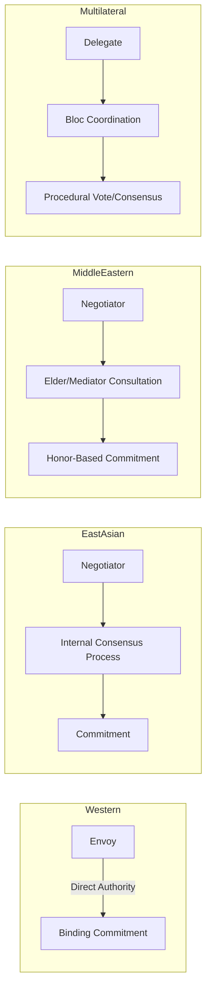

## Comparative Analysis Across Diplomatic Traditions

### Overview

Comparative analysis across diplomatic traditions examines how distinct cultural, institutional, and historical contexts shape negotiation behavior, protocol, decision-making authority, and conceptions of leadership in diplomacy. This framework contrasts Western (particularly Anglo-American and European), East Asian (notably Chinese and Japanese), Middle Eastern/Islamic, and multilateral institutional traditions to identify transferable leadership competencies and context-specific adaptations required of practitioners operating across these systems.

### Foundational Frameworks for Comparison

**Key Points**

- Diplomatic traditions differ along several analytical axes: time orientation (linear vs. cyclical negotiation pacing), authority structure (centralized vs. consensus-based mandate), communication style (low-context/explicit vs. high-context/implicit), and the relative weight given to relationship-building versus transactional outcomes.
- Edward T. Hall's high-context/low-context communication theory remains a standard reference point, though it is a simplification that individual practitioners and specific bilateral relationships can deviate from significantly. [Inference]
- Hofstede's cultural dimensions (power distance, individualism-collectivism, uncertainty avoidance, long-term orientation) are frequently applied to diplomatic behavior analysis, though these dimensions describe national population tendencies rather than predicting individual negotiator behavior. [Inference]

### Western Diplomatic Tradition (Anglo-American/European)

#### Structural Characteristics

- Rooted in Westphalian sovereignty concepts (1648) and codified through the Congress of Vienna (1815) system of formal accreditation, precedence, and reciprocity.
- Legalistic emphasis: agreements are typically documented in detailed, explicit written instruments intended to be self-contained and binding independent of the personal relationship between negotiators.
- Leadership model favors individual plenipotentiary authority — an ambassador or envoy often holds delegated authority to negotiate and provisionally commit, subject to ratification.

#### Leadership Behaviors

- Direct, explicit communication; disagreement is often stated openly in formal sessions.
- Time-bound negotiation structures (deadlines, sunset clauses) used as leverage tools.
- **Example**: The Camp David Accords (1978) exemplify Western-style shuttle diplomacy under strong individual executive leadership (Carter), with intensive, time-compressed, document-driven negotiation.

### East Asian Diplomatic Tradition (Chinese and Japanese Models)

#### Structural Characteristics

- Greater emphasis on relationship (*guanxi* in Chinese contexts) as a precondition for substantive negotiation; trust-building often precedes formal agenda items.
- Consensus-oriented internal decision-making (*ringi* system in Japanese organizational and diplomatic contexts) means individual negotiators frequently have narrower unilateral authority and must consult before committing.
- Face (*mianzi*) preservation is a structural constraint on negotiation tactics; public confrontation or explicit rejection is avoided in favor of indirect signaling.

#### Leadership Behaviors

- Leaders prioritize long-term relationship continuity over single-negotiation optimization.
- Ambiguity is sometimes strategically preserved in agreements to allow flexible future interpretation, contrasting with the Western preference for precise textual specification. [Inference]
- **Example**: Sino-Japanese and Sino-ASEAN economic negotiations often proceed through extended informal consultation phases before formal sessions, reflecting the consensus-building leadership style.

### Middle Eastern and Islamic Diplomatic Tradition

#### Structural Characteristics

- Historical roots in pre-Islamic Arab tribal mediation (*sulha*, *wasta*) and Islamic legal-ethical frameworks governing treaties (*hudna*, *ahd*).
- Mediation by respected third-party elders or religious authorities carries structural legitimacy distinct from state-only negotiation channels.
- Personal honor and reciprocal hospitality function as trust-signaling mechanisms integral to negotiation legitimacy.

#### Leadership Behaviors

- Leadership often blends religious, tribal, and state authority; a diplomat's personal standing and lineage can materially affect negotiating credibility.
- Negotiations may proceed through informal, extended dialogue before formal commitments, similar in structure to East Asian consensus models but distinct in social basis (kinship/honor vs. institutional consensus). [Inference]

### Multilateral Institutional Tradition

#### Structural Characteristics

- Diplomacy conducted through standing bodies (UN, WTO, regional organizations) with codified procedural rules, rotating chairs, and bloc-based coalition dynamics.
- Leadership authority is procedural and coalition-dependent rather than purely individual; effective leaders must build cross-bloc consensus under formal voting or consensus rules.
- **Example**: UN Security Council presidency rotation requires leadership adaptable to procedural constraints rather than unilateral agenda control.

### Comparative Matrix

| Dimension | Western | East Asian | Middle Eastern/Islamic | Multilateral |
| --- | --- | --- | --- | --- |
| Communication | Low-context, explicit | High-context, indirect | High-context, honor-mediated | Procedural, codified |
| Authority | Individual plenipotentiary | Consensus-delegated | Blended personal/institutional | Coalition-dependent |
| Agreement form | Detailed written text | Flexible/ambiguous text | Relationship + text | Formal resolutions |
| Time orientation | Deadline-driven | Long-term relational | Extended dialogue | Session/cycle-bound |

### Diagram: Comparative Decision-Authority Flow

### Transferable Leadership Competencies

- **Cultural code-switching**: the capacity to shift communication directness and pacing depending on counterpart tradition, without abandoning core negotiating objectives.
- **Dual-track patience**: maintaining formal-track momentum while allowing informal relationship-building tracks to mature at their own pace, particularly relevant in East Asian and Middle Eastern contexts.
- **Ambiguity management**: recognizing when textual precision (Western norm) versus interpretive flexibility (East Asian/Middle Eastern norm) better serves durable agreement — this is a judgment call dependent on the specific relationship and issue area. [Inference]
- **Coalition literacy**: in multilateral settings, leadership effectiveness correlates with a diplomat's ability to read and shape bloc alignments rather than rely on bilateral leverage alone.

### Common Comparative Pitfalls

- Misreading silence: Western-trained negotiators may interpret silence as assent or disengagement, while in several East Asian contexts it may signal careful consideration. Behavior varies by individual and context; this is a documented tendency rather than a universal rule.
- Overvaluing written text: assuming a signed document fully resolves ambiguity when the counterpart tradition treats it as one component within an ongoing relationship.
- Underestimating informal authority: dismissing non-state mediators (elders, religious figures) as peripheral when they may hold decisive influence in Middle Eastern contexts.

### Related Topics

- Track II (unofficial) diplomacy and its role across traditions
- Comparative treaty interpretation doctrines (textualism vs. relational contract theory)
- Gender and diplomatic leadership across cultural traditions
- Colonial legacy and its influence on postcolonial diplomatic institutional design
- Digital diplomacy and its homogenizing/differentiating effects on traditional practices