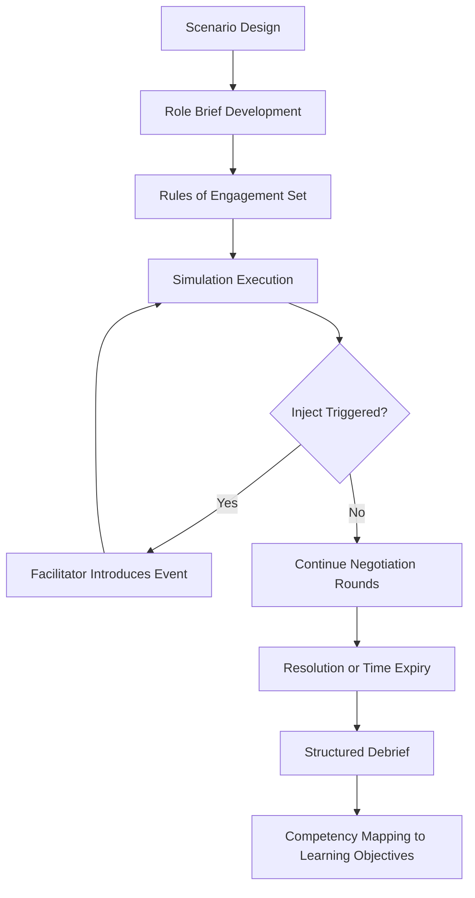

## Diplomatic Simulation and Role-Play Exercises

### Overview

Diplomatic simulation and role-play exercises are structured pedagogical methods that place participants in negotiator, mediator, or crisis-decision roles within a designed scenario to build applied judgment, cultural adaptability, and procedural fluency. Unlike lecture-based instruction, simulations generate experiential learning through consequence, ambiguity, time pressure, and interpersonal dynamics that mirror real diplomatic environments.

### Pedagogical Foundations

**Key Points**

- Grounded in experiential learning theory (Kolb's cycle: concrete experience → reflective observation → abstract conceptualization → active experimentation), applied specifically to negotiation and crisis-response training.
- Simulations differ from case studies in that participants generate outcomes through their own decisions rather than analyzing a fixed historical record.
- Effectiveness depends heavily on debrief quality; the simulation itself surfaces behavior, but structured reflection converts that behavior into transferable insight. [Inference]

### Core Simulation Formats

#### Bilateral Negotiation Simulation

- Two-party structure, typically with private caucus instructions ("confidential brief") given to each side specifying interests, constraints, and reservation points (walk-away conditions) unknown to the counterpart.
- Trains: interest-based bargaining, BATNA (Best Alternative to a Negotiated Agreement) discipline, concession sequencing.

#### Multilateral/Model Diplomacy Simulation

- Structured after real institutional bodies (UN Security Council, G20, regional bodies); participants represent state or bloc positions under procedural rules (speaking order, voting thresholds, amendment procedures).
- Trains: coalition-building, procedural leverage, public-position versus private-interest management.
- **Example**: Model UN and Model NATO formats are the most widely institutionalized version of this format in academic settings.

#### Crisis Simulation

- Time-compressed scenario with escalating stakes, incomplete information, and injected events ("inject" system) delivered by facilitators to force real-time adaptation.
- Trains: decision-making under uncertainty, inter-agency coordination, communication discipline during high-stakes ambiguity.

#### Mediation/Track II Simulation

- Introduces a third-party facilitator role distinct from the negotiating parties; tests skills in reframing, managing power asymmetries, and building integrative (non-zero-sum) options.

### Design Architecture of a Simulation

#### Structural Components

1. **Scenario framework**: historical, hypothetical, or hybrid setting with defined actors, stakes, and constraints.
2. **Role briefs**: private, role-specific documents establishing each participant's mandate, red lines, and informational asymmetries relative to other roles.
3. **Rules of engagement**: procedural constraints (time limits, permitted communication channels, escalation triggers).
4. **Injects**: facilitator-introduced events during the exercise that alter conditions (e.g., leaked information, third-party intervention, resource shocks).
5. **Debrief protocol**: structured post-exercise analysis separating process observations (how decisions were made) from outcome observations (what was decided).

#### Design Diagram

### Facilitation Technique

**Key Points**

- Facilitators must balance scenario realism against pedagogical control; excessive realism can obscure the specific competencies being trained, while excessive artificiality reduces engagement and transfer. [Inference]
- "Hot" facilitation (active real-time intervention via injects) suits crisis training; "cold" facilitation (minimal intervention, natural negotiation flow) suits bilateral interest-based bargaining training.
- Role brief asymmetry should be calibrated: too little asymmetry produces flat, low-tension exercises; too much can make positions unresolvable within the session's time constraints.

### Assessment and Debrief Methodology

#### Debrief Structure

- **Immediate reactions round**: unstructured, allows emotional/experiential venting before analytical discussion begins.
- **Process reconstruction**: sequential walk-through of key decision points, often supported by facilitator observation notes or session transcripts.
- **Alternative path analysis**: counterfactual discussion — what other choices were available at each decision point and their likely consequences.
- **Competency mapping**: explicit linkage of observed behaviors to the specific leadership/negotiation competencies the exercise targeted.

#### Common Assessment Dimensions

| Dimension | Indicator |
| --- | --- |
| Interest identification | Distinguished positions from underlying interests |
| Information management | Controlled disclosure appropriately; avoided premature concession |
| Coalition behavior | Built or maintained alliances effectively in multilateral formats |
| Adaptability | Adjusted strategy appropriately after injects/new information |
| Communication calibration | Matched directness/formality to counterpart's apparent tradition |

### Technology-Enhanced Simulation

- Written/asynchronous simulations (email-based negotiation over days) train sustained strategic patience distinct from synchronous, real-time formats.
- Hybrid and virtual simulation platforms have expanded access to geographically distributed cohorts, though facilitator ability to read nonverbal cues is reduced relative to in-person formats. [Inference]
- AI-assisted counterpart simulation (using a language model to role-play a negotiating counterpart with defined behavioral parameters) is an emerging supplementary tool for solo practice; instructional design quality depends on how well the counterpart's parameters are specified. [Inference]

### Common Pitfalls in Exercise Design

- Overloading scenarios with excessive background material, causing participants to spend disproportionate time on comprehension rather than negotiation.
- Weak debrief allocation — insufficient time reserved for reflection relative to exercise execution undermines the primary learning mechanism.
- Static repeated use of identical scenarios across cohorts, which can allow prior participants to transmit "solutions" that undermine the exercise's designed ambiguity.
- Failing to align role brief incentives with realistic diplomatic constraints, producing behavior that is dramatically effective in-exercise but non-transferable to actual practice.

### Related Topics

- Scenario design methodology for crisis and wargaming exercises
- Debrief facilitation techniques and cognitive bias correction
- BATNA and interest-based negotiation theory (Fisher and Ury framework)
- Model UN and Model NATO institutional program design
- Evaluating negotiation competency: rubric design and inter-rater reliability