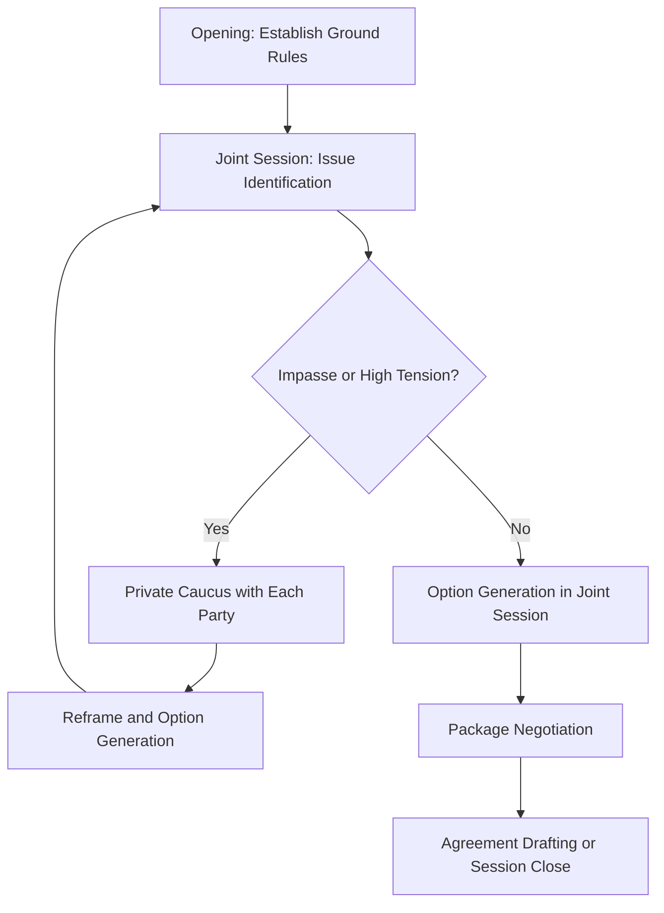

## Mock Negotiation and Mediation Practicums

### Overview

Mock negotiation and mediation practicums are extended, closely supervised applied-practice formats that go beyond single-session simulations to develop sustained procedural competence in both direct negotiation and third-party mediation roles. Practicums typically involve multiple structured sessions, iterative skill-building, individualized coaching, and formal competency evaluation, positioning them as capstone or certification-track components within diplomatic leadership training rather than one-off exercises.

### Distinguishing Practicums from Single Simulations

**Key Points**

- A practicum is a structured *program* of repeated, scaffolded practice with feedback loops, whereas a simulation is typically a single bounded exercise.
- Practicums usually incorporate rotation through multiple roles (negotiator, mediator, observer) so participants build both advocacy and neutral-facilitation competencies.
- Assessment in practicums is typically cumulative and rubric-based across sessions, rather than a single post-exercise debrief.

### Negotiation Practicum Design

#### Structural Progression

1. **Foundational drills**: short, low-stakes bilateral exercises isolating a single skill (active listening, interest identification, anchoring/counter-anchoring).
2. **Integrated negotiations**: multi-issue scenarios requiring trade-off packaging across several variables simultaneously.
3. **Complex multi-party negotiations**: three or more stakeholders with divergent interests, often including coalition-formation dynamics.
4. **High-stakes capstone negotiation**: full-scale scenario, frequently video-recorded, evaluated against a formal competency rubric.

#### Core Skill Modules

- **Interest-based bargaining**: distinguishing stated positions from underlying interests (Fisher and Ury's principled negotiation framework is the standard reference model).
- **Anchoring and concession strategy**: sequencing offers to shape counterpart expectations without triggering impasse.
- **BATNA discipline**: maintaining awareness of one's best alternative to a negotiated agreement to avoid accepting inferior terms under pressure.
- **Package/trade-off construction**: bundling issues of differing value to each party to create integrative (mutually beneficial) rather than purely distributive outcomes.

### Mediation Practicum Design

#### Role Distinction from Negotiation

- The mediator holds no substantive stake in the outcome and exercises process authority rather than outcome authority — a structurally distinct skill set from advocacy-based negotiation.
- Core mediator competencies: active listening, reframing, managing power imbalances between parties, and generating options the parties have not themselves identified.

#### Structural Progression

1. **Facilitative mediation drills**: mediator purely manages process (agenda, turn-taking, summarization) without proposing substantive solutions.
2. **Evaluative mediation drills**: mediator offers assessments or recommendations on likely outcomes, appropriate in contexts where parties request substantive guidance.
3. **Complex/multi-party mediation**: mediator manages coalition dynamics and caucusing (private separate sessions with each party) across several stakeholders.
4. **Crisis mediation capstone**: time-compressed, high-tension scenario testing composure and rapid reframing under pressure.

#### Mediation Process Flow

### Coaching and Feedback Architecture

**Key Points**

- Individualized coaching in practicums typically uses recorded sessions reviewed against specific behavioral indicators rather than general impressions.
- Peer observation roles (participants assigned to observe rather than negotiate in a given round) build evaluative literacy that transfers back into the observer's own subsequent performance. [Inference]
- Effective feedback separates *process* critique (how the negotiator/mediator behaved) from *outcome* critique (what terms were reached), since strong process can still yield a weak outcome due to counterpart behavior, and vice versa.

#### Sample Competency Rubric Dimensions

| Competency | Negotiator Indicator | Mediator Indicator |
| --- | --- | --- |
| Preparation | Clear interest/BATNA analysis pre-session | Clear process plan and ground rules prepared |
| Communication | Calibrated directness, active listening | Neutral framing, balanced airtime management |
| Adaptability | Adjusted strategy to new information | Managed unexpected impasse or escalation |
| Outcome quality | Achieved interest-aligned agreement | Facilitated durable, mutually accepted resolution |
| Ethical conduct | Avoided misrepresentation/bad faith tactics | Maintained impartiality and confidentiality |

### Practicum Logistics and Supervision Models

- **Cohort-based rotation**: participants rotate through negotiator, mediator, and observer roles across sessions to ensure balanced skill exposure.
- **Supervisor/facilitator ratio**: smaller ratios (e.g., one facilitator per 2–3 negotiating pairs) allow closer real-time coaching but require more institutional resourcing; ratio trade-offs depend on program scale and available faculty. [Inference]
- **Video review sessions**: recorded practicum rounds reviewed in follow-up coaching sessions are a widely used method for behavioral feedback, though require informed consent and clear data-handling protocols.

### Assessment and Certification Pathways

- Many advanced diplomatic training programs use practicum performance as a gating requirement for capstone certification, with cumulative rubric scores across multiple rounds rather than a single evaluated session.
- Self-assessment components (participant-authored reflective logs after each round) are frequently paired with facilitator evaluation to build metacognitive awareness of one's own negotiation/mediation tendencies.

### Common Pitfalls

- Insufficient role rotation, producing participants who are strong negotiators but underdeveloped as mediators (or vice versa).
- Overemphasis on outcome metrics (deal reached/not reached) at the expense of process competency evaluation, incentivizing aggressive tactics over durable skill-building.
- Inadequate caucus training in mediation practicums, leaving mediators unprepared for the confidentiality management and information-flow control that private sessions require.
- Scenario reuse without variation, allowing "known solutions" to propagate through cohorts and undermining the practicum's diagnostic value.

### Related Topics

- Fisher and Ury's principled negotiation framework (interests vs. positions)
- Facilitative vs. evaluative mediation models
- Rubric design and inter-rater reliability in skills assessment
- Caucusing technique and confidentiality management in mediation
- Capstone certification design for diplomatic training programs