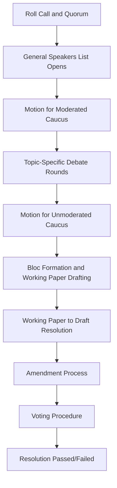

## Model UN and Multilateral Simulation Methodology

### Overview

Model UN and multilateral simulation methodology is the structured pedagogical framework for replicating institutional multilateral diplomacy — most commonly the United Nations system, but extended to bodies such as the G20, regional organizations, and specialized agencies. This methodology trains procedural fluency, coalition-building, and public-position management under codified rules of procedure, distinguishing it from bilateral negotiation simulation through its emphasis on formal parliamentary process and bloc dynamics.

### Institutional Design Foundations

**Key Points**

- Model UN methodology originated from intercollegiate mock League of Nations/UN assemblies in the early-to-mid 20th century and has since standardized around a small number of dominant rules-of-procedure systems.
- The two most widely used procedural traditions are Harvard-style (or "American") parliamentary procedure and the UN's own actual Rules of Procedure (used in more advanced/realistic simulations); programs differ in which they adopt. [Inference]
- Core pedagogical goal: participants represent a country, bloc, or institutional actor's *position*, not their personal views, training role-based advocacy distinct from authentic self-representation.

### Core Structural Components

#### Committee Architecture

- **General Assembly-style bodies**: large committees (dozens to hundreds of delegates), emphasizing broad resolution drafting and bloc coalition-building over granular negotiation.
- **Security Council-style bodies**: small committees with veto-power dynamics (P5 equivalents), emphasizing high-stakes procedural leverage and crisis response.
- **Specialized/ECOSOC-style committees**: narrower thematic mandates (e.g., health, environment, economic development), often with more technical, less politically charged debate.
- **Crisis committees**: real-time evolving scenarios with continuous "crisis updates" (injects) requiring rapid joint directive drafting, distinct from standard resolution-based committees.

#### Rules of Procedure Elements

| Element | Function |
| --- | --- |
| Roll call | Establishes quorum and delegate presence/voting status |
| Speakers' list | Formal queue for floor time allocation |
| Moderated caucus | Structured debate on a sub-topic with fixed speaking time |
| Unmoderated caucus | Informal negotiation period for bloc/coalition-building |
| Points and motions | Procedural tools (point of order, point of inquiry, motion to move into caucus) governing session flow |
| Draft resolution/working paper | Formal document requiring sponsor and signatory thresholds before introduction |
| Voting procedure | Simple majority, two-thirds majority, or consensus depending on body type |

### Procedural Flow

### Delegate Skill Modules

#### Research and Position Development

- **Country/actor position papers**: pre-session documents outlining the represented actor's stance, historical voting record, and policy priorities on the committee topic — foundational to credible role performance.
- **Bloc mapping**: identifying likely coalition partners based on shared interests, regional alignment, or historical voting patterns before the session begins.

#### In-Session Competencies

- **Public speaking and position articulation**: delivering concise, persuasive floor speeches within tight time limits (often 30–90 seconds).
- **Coalition negotiation**: building working papers with multiple co-sponsors during unmoderated caucus, requiring rapid interest-alignment across several parties simultaneously.
- **Procedural literacy**: correctly deploying points and motions to shape debate flow — a distinct tactical skill from substantive argumentation.
- **Amendment strategy**: modifying draft resolution language to secure broader support without diluting core objectives, a direct analog to real multilateral treaty negotiation.

### Facilitation and Dais (Chair) Methodology

- The dais (chair team) enforces procedural rules impartially, manages speaking time, and rules on motions — requiring facilitators to balance procedural rigor against pedagogical flow.
- Crisis committee directors additionally author and pace injects, calibrating scenario escalation to maintain engagement without overwhelming delegate decision capacity. [Inference]
- Effective dais feedback (delegate evaluations) typically assesses both public procedural performance and behind-the-scenes coalition contribution, since strong committee outcomes often depend heavily on caucus-phase work invisible in formal speeches.

### Assessment Dimensions

| Dimension | Indicator |
| --- | --- |
| Substantive knowledge | Accurate representation of actor's real position and policy history |
| Procedural fluency | Correct and strategic use of motions, points, and caucus tools |
| Coalition-building | Successfully co-sponsored or built support for working papers |
| Public communication | Clear, persuasive, time-disciplined floor speeches |
| Adaptability | Responded effectively to crisis injects or shifting bloc dynamics |

### Extensions Beyond UN-Specific Format

- **Model NATO, Model G20, Model AU**: apply the same procedural-simulation methodology to alternative institutional structures, adjusting rules of procedure to reflect the represented body's actual decision rules (e.g., NATO consensus requirements vs. UNSC veto structure).
- **Track II multilateral simulations**: less procedurally rigid, emphasizing informal multilateral dialogue dynamics (e.g., regional forums) over strict parliamentary process.

### Common Pitfalls

- Over-indexing on procedural mastery at the expense of substantive policy accuracy, producing delegates who are tactically skilled but represent their actor's position inaccurately.
- Bloc gridlock in unmoderated caucus due to insufficient facilitator guidance on time management, consuming session time without producing viable working papers.
- Crisis committee injects poorly calibrated to delegate capacity — too frequent or complex injects can overwhelm decision-making rather than train adaptive response. [Inference]
- Treating the simulation as purely competitive (best speech, "winning" delegate) rather than as a training environment for the collaborative, consensus-building competencies multilateral diplomacy actually requires.

### Related Topics

- UN Rules of Procedure vs. Harvard-style parliamentary procedure comparison
- Crisis committee design and inject pacing methodology
- Bloc politics and coalition theory in multilateral negotiation
- Position paper research methodology and source evaluation
- Comparative institutional design: UN, NATO, G20, and regional bodies