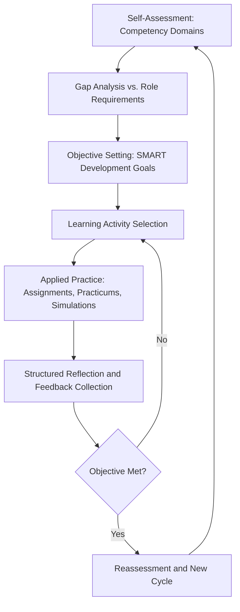

## Personal Diplomatic Leadership Development Planning

### Overview

Personal diplomatic leadership development planning is the structured, individualized process by which a practitioner assesses current competencies, defines targeted growth objectives, and sequences learning activities to build sustained diplomatic leadership capability over time. It shifts training from program-delivered content toward practitioner-owned, self-directed continuous development, integrating self-assessment, mentorship, deliberate practice, and reflective review into a coherent long-term plan.

### Foundational Framework

**Key Points**

- Development planning in this domain typically follows a cyclical model: assess → set objectives → act (practice/experience) → reflect → reassess, rather than a linear one-time exercise.
- Diplomatic leadership development spans multiple competency domains simultaneously — analytical (policy/regional expertise), relational (cross-cultural communication, trust-building), and procedural (negotiation mechanics, institutional literacy) — and effective plans address all three rather than over-indexing on one. [Inference]
- Personal plans are most effective when tied to concrete near-term opportunities (an upcoming assignment, practicum, or role) rather than remaining abstract. [Inference]

### Self-Assessment Methodology

#### Competency Domains for Assessment

| Domain | Sub-competencies |
| --- | --- |
| Analytical | Regional/country expertise, policy analysis, risk assessment |
| Relational | Cross-cultural communication, trust-building, active listening |
| Procedural | Negotiation technique, institutional/parliamentary literacy, protocol |
| Strategic | Long-term relationship management, coalition strategy, crisis judgment |
| Personal/reflective | Emotional regulation under pressure, ethical judgment, adaptability |

#### Assessment Tools

- **360-degree feedback**: structured input from supervisors, peers, and, where appropriate, counterparts or mentees, reducing reliance on self-perception alone.
- **Simulation and practicum performance review**: using rubric-scored outcomes from mock negotiations, mediations, or Model UN-style exercises as objective behavioral data points.
- **Reflective journaling**: structured post-engagement logs capturing decision points, emotional responses, and alternative approaches considered — supports the reflective stage of the development cycle.
- **Competency self-rating against a defined framework**: comparing current perceived skill level against a structured rubric (such as the domains above) to identify priority gaps.

### Objective-Setting Methodology

#### SMART-Style Objective Structuring

Development objectives are typically structured to be Specific, Measurable, Achievable, Relevant, and Time-bound — adapted here to diplomatic leadership contexts:

- *Specific*: tied to a named competency (e.g., "improve coalition-building in multiparty settings") rather than a vague aspiration.
- *Measurable*: linked to an observable indicator (e.g., rubric score improvement across successive practicum rounds).
- *Time-bound*: sequenced against realistic milestones (e.g., a specific upcoming rotation, practicum cycle, or assignment).

#### Prioritization Approach

- **Gap-severity mapping**: cross-referencing self-assessment results against role requirements to identify the highest-impact development priorities rather than addressing all gaps simultaneously.
- **Readiness-based sequencing**: foundational competencies (e.g., active listening, interest-based bargaining) are typically prioritized before advanced ones (e.g., multiparty coalition mediation) that depend on them.

### Development Planning Cycle

### Learning Activity Portfolio

#### Activity Types by Competency Domain

- **Analytical growth**: structured regional/policy study, briefing rotation, exposure to varied issue areas.
- **Relational growth**: cross-cultural immersion experiences, mentorship from practitioners of differing diplomatic traditions, deliberate exposure to counterparts outside one's usual cultural comfort zone.
- **Procedural growth**: repeated practicum cycles (negotiation and mediation rotations), formal training in specific frameworks (e.g., principled negotiation, mediation theory).
- **Strategic/reflective growth**: mentorship relationships, case study analysis of senior practitioners' decision-making, structured after-action reviews following real or simulated high-stakes engagements.

### Mentorship Integration

**Key Points**

- Mentorship in diplomatic leadership development typically serves two distinct functions: *sponsorship* (advocacy for opportunities and visibility) and *coaching* (skill-specific feedback and modeling) — effective plans often draw on both, sometimes from different individuals. [Inference]
- Reverse mentoring (junior practitioners providing perspective to senior ones, e.g., on emerging digital diplomacy tools or generational communication shifts) is an increasingly recognized supplementary model. [Inference]

### Reflective Review Practice

#### After-Action Review Structure

- **What was intended**: the objective or expected approach going into the engagement.
- **What actually happened**: factual account of decisions and outcomes.
- **Why the variance occurred**: analysis of the gap between intention and outcome.
- **What will change going forward**: concrete adjustment to future practice, feeding directly back into the development plan's next cycle.

#### Portfolio Documentation

- Maintaining a structured portfolio (practicum evaluations, 360 feedback summaries, reflective logs, position papers) supports longitudinal tracking of development across multiple cycles and provides evidence for career advancement or certification processes.

### Common Pitfalls

- Setting overly broad or vague development objectives ("become a better negotiator") that cannot be measured or sequenced into concrete activities.
- Neglecting relational and reflective competencies in favor of easily measurable procedural/technical skills, producing technically proficient but culturally inflexible practitioners. [Inference]
- Treating development planning as a one-time onboarding exercise rather than a recurring cycle, allowing skills to plateau or specific gaps (e.g., crisis composure) to persist unaddressed.
- Relying solely on self-assessment without external feedback (360-degree input, mentor observation), risking blind spots in self-perception.

### Related Topics

- 360-degree feedback design for leadership competency assessment
- After-action review methodology in high-stakes decision contexts
- Mentorship and sponsorship models in professional diplomatic development
- Competency framework design for negotiation and mediation training
- Longitudinal portfolio assessment for diplomatic certification pathways