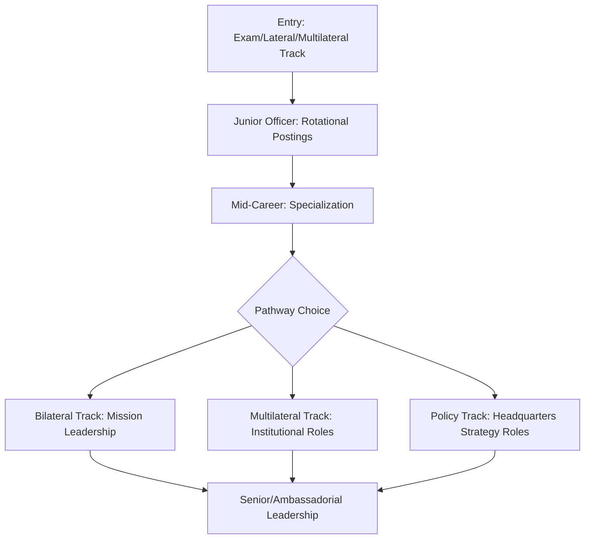

## Mentorship and Career Pathways in Diplomacy

### Overview

Mentorship and career pathways in diplomacy encompass the structured relationships, institutional progression routes, and developmental support systems through which practitioners advance from entry-level roles into senior diplomatic leadership. This domain integrates formal mentorship program design with the structural realities of career progression across foreign service, multilateral institutions, and adjacent diplomatic-adjacent fields (development, international law, track II organizations).

### Career Pathway Architecture

#### Common Entry Routes

- **Foreign service examination/competitive entry**: standard route into national diplomatic corps, typically involving written examinations, oral assessment panels, and structured probationary postings.
- **Lateral entry from adjacent fields**: practitioners transitioning from international law, development, academia, journalism, or the private sector into diplomatic roles, often at mid-career levels.
- **Multilateral institution pathways**: entry through international organizations (UN system, regional bodies) via junior professional officer programs, internships, or specialized recruitment tracks distinct from national foreign services.
- **Track II and non-state pathways**: roles in think tanks, NGOs, and mediation organizations that build diplomatic-adjacent competencies without formal state accreditation.

#### Typical Progression Structure

| Stage | Characteristics |
| --- | --- |
| Entry/junior officer | Rotational postings, generalist skill-building, close supervision |
| Mid-career | Specialization (regional or thematic), increased autonomy, first leadership responsibilities |
| Senior/management | Mission leadership, policy formulation input, significant negotiating authority |
| Principal/ambassadorial | Full plenipotentiary representation, institutional leadership, strategic direction-setting |

### Career Pathway Flow

### Mentorship Program Design

#### Functional Models of Mentorship

- **Coaching mentorship**: skill-specific feedback on negotiation, drafting, or protocol competencies, typically from a more experienced practitioner in a similar role track.
- **Sponsorship mentorship**: active advocacy for the mentee's visibility, assignment opportunities, and advancement — distinct from coaching in that it involves the mentor's own institutional capital.
- **Peer mentorship**: lateral relationships among practitioners at similar career stages, useful for shared problem-solving and morale support absent hierarchical dynamics.
- **Reverse mentorship**: junior practitioners advising senior ones on emerging domains (digital diplomacy tools, shifting generational communication norms), increasingly incorporated into formal programs. [Inference]

#### Structural Components of Formal Programs

- **Matching methodology**: pairing based on career track alignment, complementary expertise, or deliberate diversity of background to broaden mentee perspective.
- **Cadence and format**: regular structured check-ins (monthly/quarterly) versus ad hoc informal contact; formal programs typically specify minimum contact frequency to sustain the relationship.
- **Defined duration and review points**: many institutional programs set a bounded term (e.g., one posting cycle or one year) with a review checkpoint to assess fit and renew or conclude the pairing.

### Institutional Support Structures

- **Professional development boards/panels**: internal bodies reviewing promotion readiness, often incorporating mentor input alongside formal performance evaluation.
- **Rotational assignment planning**: deliberate sequencing of postings (regional variety, bilateral/multilateral mix, headquarters versus field) to build a broad competency base before senior specialization.
- **Professional associations and alumni networks**: external bodies (foreign service associations, multilateral alumni networks) that supplement internal institutional mentorship, particularly valuable for lateral entrants without an internal sponsor base. [Inference]

### Career Pathway Decision Factors

| Factor | Consideration |
| --- | --- |
| Generalist vs. specialist track | Broad rotational exposure vs. deep regional/thematic expertise |
| Bilateral vs. multilateral focus | Mission-based representation vs. institutional/procedural leadership |
| Field vs. headquarters balance | Direct negotiation/representation experience vs. policy formulation influence |
| Public vs. track II sector | Formal state accreditation vs. non-state mediation/advocacy roles |

### Common Pitfalls

- Passive mentee engagement — treating mentorship as a service received rather than a relationship requiring the mentee's own initiative in seeking feedback and opportunities. [Inference]
- Over-reliance on a single mentor for all developmental needs, when coaching, sponsorship, and peer support functions are often better served by multiple distinct relationships.
- Institutional programs with weak matching methodology, producing pairings with insufficient common ground to sustain a productive relationship.
- Career pathway planning that over-prioritizes rapid advancement at the expense of building the broad rotational foundation senior roles typically require. [Inference]
- Neglecting network-building among lateral entrants and multilateral-track practitioners, who often lack the internal sponsorship networks generalist-track entrants accumulate through rotational postings.

### Related Topics

- Foreign service examination and assessment center design
- Sponsorship vs. coaching mentorship models in professional development
- Rotational assignment planning and specialization timing
- Track II career pathways and non-state diplomatic roles
- Professional development boards and promotion readiness evaluation