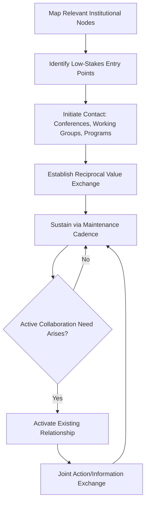

## Building a Professional Network Across Institutions

### Overview

Building a professional network across institutions is the deliberate cultivation of relationships spanning national foreign services, multilateral bodies, track II organizations, academia, and adjacent sectors, enabling diplomatic practitioners to access information, coordinate action, and build credibility beyond their home institution's formal channels. Unlike mentorship (a vertical, developmental relationship), institutional network-building is primarily lateral and cross-boundary, oriented toward long-term relational capital that supports both individual career mobility and collective diplomatic effectiveness.

### Strategic Rationale

**Key Points**

- Cross-institutional networks function as informal information channels that often move faster and more candidly than formal diplomatic correspondence, particularly valuable during fast-moving or ambiguous situations. [Inference]
- Networks built before a crisis or negotiation are structurally more valuable than relationships initiated under pressure, since trust and communication norms take time to establish. [Inference]
- Diplomatic effectiveness increasingly depends on coordination across institutional boundaries (state, multilateral, NGO, private sector) as issue areas like climate, cyber, and public health rarely map cleanly onto a single institutional mandate.

### Network Architecture Types

#### By Institutional Category

| Network Type | Primary Value |
| --- | --- |
| Bilateral peer networks | Counterpart relationships across foreign services, enabling informal channel communication |
| Multilateral institutional networks | Cross-agency relationships within UN system, regional bodies, specialized agencies |
| Track II/NGO networks | Access to unofficial dialogue channels, issue expertise, and mediation resources |
| Academic/think tank networks | Access to research, scenario analysis, and emerging policy framing |
| Private sector/technical networks | Domain expertise on issue areas requiring specialized technical knowledge (cyber, finance, energy) |

#### By Relational Function

- **Information networks**: relationships primarily valuable for early or candid situational awareness.
- **Coordination networks**: relationships enabling joint action or aligned positioning across institutions on shared issues.
- **Credibility networks**: relationships that lend institutional legitimacy or vouching capacity when entering new institutional contexts.

### Network-Building Methodology

#### Structured Approaches

1. **Mapping exercise**: identifying key institutional nodes relevant to one's portfolio (regional, thematic, or functional) before initiating outreach.
2. **Low-stakes initial contact**: engaging through conferences, working groups, or shared professional development programs before high-stakes negotiation contexts arise.
3. **Reciprocal value exchange**: sustaining relationships through mutual usefulness (sharing relevant information, making introductions) rather than one-directional requests.
4. **Deliberate maintenance cadence**: periodic low-effort contact (updates, congratulations on new roles, relevant article shares) to sustain relationships between active collaboration periods.

#### Network-Building Flow

### Cross-Institutional Trust-Building

**Key Points**

- Trust across institutional boundaries is built incrementally through demonstrated reliability (following through on small commitments) before being extended to higher-stakes engagement. [Inference]
- Confidentiality discipline — consistently respecting the boundaries of what can be shared across institutional lines — is foundational to sustaining cross-institutional relationships, particularly in track II and multilateral contexts where information sensitivity varies significantly.
- Cultural and institutional literacy (understanding a counterpart institution's internal incentive structures and constraints) improves the realism and effectiveness of cross-institutional coordination attempts. [Inference]

### Platforms and Venues for Network Development

- **Professional conferences and forums**: recurring convenings (regional dialogues, thematic summits, alumni gatherings) that provide low-stakes, repeated-contact opportunities for relationship development.
- **Joint training and practicum programs**: shared simulation, mediation, or negotiation training cohorts that build relationships through shared experiential learning rather than transactional contact alone.
- **Digital professional platforms**: LinkedIn and sector-specific professional networks increasingly supplement in-person relationship-building, particularly for maintaining lighter-touch contact across geographically dispersed networks.
- **Alumni and fellowship networks**: structured communities (e.g., exchange program alumni, fellowship cohorts) that provide built-in trust and shared reference points facilitating faster relationship development.

### Network Maintenance and Portfolio Management

#### Practical Techniques

- **Contact mapping/CRM-style tracking**: maintaining structured records of key contacts, last interaction, and relevant shared interests to support consistent, non-transactional follow-up.
- **Tiered engagement prioritization**: allocating relationship-maintenance effort proportionally to a contact's relevance to current and anticipated portfolio needs, rather than attempting uniform engagement across an entire network.
- **Introduction brokering**: proactively connecting contacts within one's network to each other, which builds the network-builder's own centrality and perceived value within the broader system. [Inference]

### Common Pitfalls

- Purely transactional networking — initiating contact only when something is needed, which erodes trust and reduces willingness to engage over time.
- Over-concentration on peer-level contacts within one's own institution type, neglecting the cross-institutional breadth (track II, private sector, academic) that provides the most distinctive strategic value.
- Inadequate confidentiality discipline across institutional lines, which can permanently damage trust and close off future access.
- Treating network-building as a one-time activity rather than a sustained practice requiring ongoing maintenance investment even during periods without active collaboration needs.
- Failing to map networks strategically, resulting in broad but shallow contact lists that lack depth where it matters most for one's specific portfolio.

### Related Topics

- Track II diplomacy and non-state coordination mechanisms
- Trust-building and confidentiality management across institutional boundaries
- Alumni and fellowship network design for diplomatic training programs
- Digital professional networking tools and diplomatic practice
- Coalition-building and multi-institutional coordination in cross-cutting issue areas