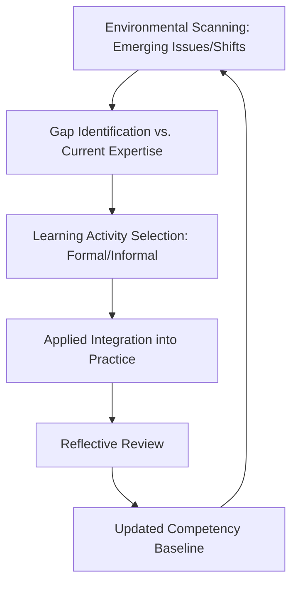

## Lifelong Learning in Diplomatic Practice

### Overview

Lifelong learning in diplomatic practice is the sustained, career-spanning commitment to updating knowledge, refining skills, and adapting judgment in response to evolving geopolitical conditions, emerging issue domains, and technological change. Distinct from bounded training programs or single development cycles, lifelong learning is an ongoing practitioner orientation that treats professional competence as perpetually provisional rather than achieved at a fixed point.

### Rationale and Foundational Principles

**Key Points**

- Diplomatic environments change continuously — new technologies, shifting alliance structures, emerging issue domains (cyber, climate, pandemic governance) — meaning static expertise depreciates over a career span. [Inference]
- Lifelong learning integrates both formal (structured courses, credentialing) and informal (reading, reflection, peer exchange) learning modes, with informal modes typically constituting the larger share of a practitioner's ongoing development over time. [Inference]
- The orientation requires a specific mindset component — intellectual humility and comfort with continued not-knowing — distinct from the credential-acquisition mindset common in early-career training. [Inference]

### Domains Requiring Continuous Update

#### Substantive Knowledge Domains

- **Regional and country expertise**: political, economic, and social developments requiring continuous monitoring even within a practitioner's established specialization.
- **Emerging issue areas**: domains without deep historical precedent in traditional diplomatic training (cybersecurity governance, AI governance, climate diplomacy, pandemic preparedness), requiring practitioners to build new expertise mid-career.
- **Legal and institutional frameworks**: evolving international law, treaty regimes, and institutional procedures that shift over a career span.

#### Skill Domains

- **Negotiation and mediation technique**: refinement through repeated practice, feedback, and exposure to varied counterpart styles over time.
- **Technological literacy**: familiarity with digital diplomacy tools, secure communication practices, and data-informed analysis methods that have significantly changed diplomatic practice in recent decades. [Inference]
- **Cross-cultural adaptability**: continued exposure to varied diplomatic traditions beyond initial training, deepening the comparative fluency addressed elsewhere in this curriculum.

### Structural Modes of Lifelong Learning

#### Formal Modes

- **Mid-career training programs**: institutional courses or fellowships (e.g., senior seminar programs at national diplomatic academies) designed for practitioners returning to structured learning after years of field experience.
- **Executive education and academic credentialing**: graduate coursework, executive certificates, or accreditation in specialized areas (international law, conflict resolution, regional studies) pursued alongside an active career.
- **Rotational exposure as structured learning**: deliberate posting sequences designed explicitly to build breadth (discussed further under career pathway planning) function as a formal learning mechanism embedded in career structure.

#### Informal Modes

- **Structured reading practice**: sustained engagement with policy journals, primary-source reporting, and scholarly literature relevant to one's portfolio.
- **Reflective practice**: the after-action review and journaling techniques used in development planning, applied continuously rather than only around discrete practicum cycles.
- **Peer learning communities**: informal or semi-formal groups of practitioners exchanging case insights, lessons learned, and emerging practice observations.
- **Cross-sector engagement**: exposure to adjacent fields (academia, private sector, technology) that introduces frameworks and knowledge not native to traditional diplomatic training.

### Lifelong Learning Cycle

### Institutional Support Structures

- **Sabbatical and study leave provisions**: formal mechanisms in many foreign services allowing extended focused learning periods (academic placement, fellowship) at defined career points.
- **Communities of practice**: institutionally sponsored or informally organized groups focused on specific thematic or regional expertise, sustaining peer learning across postings.
- **Knowledge management systems**: institutional repositories of lessons learned, after-action reports, and analytical products that support organizational (not just individual) learning continuity. [Inference]

### Practitioner-Level Practice Techniques

| Technique | Application |
| --- | --- |
| Structured reading rotation | Scheduled engagement across policy, regional, and cross-disciplinary sources |
| Recurring reflective log | Periodic (weekly/monthly) capture of lessons from recent engagements |
| Deliberate discomfort exposure | Seeking assignments or dialogues outside one's comfort zone to build adaptive range |
| Periodic competency reassessment | Revisiting the self-assessment frameworks used in development planning on a recurring cycle, not only at major career transitions |
| Cross-sector sabbatical/exchange | Temporary placement outside one's home institution to build comparative perspective |

### Common Pitfalls

- Treating lifelong learning as complete after formal training concludes, allowing substantive and skill expertise to plateau or become outdated over a career span. [Inference]
- Over-reliance on passive consumption (reading without reflection or application) rather than integrating new knowledge into active practice and decision-making.
- Neglecting skill domains (negotiation, mediation technique) in favor of substantive knowledge updates, despite skill degradation being equally possible without continued deliberate practice. [Inference]
- Institutional cultures that under-incentivize continued learning relative to operational output, reducing practitioner time and motivation for sustained development. [Inference]
- Failure to update technological literacy, leaving practitioners increasingly disconnected from tools and communication norms that shape contemporary diplomatic practice.

### Related Topics

- Mid-career diplomatic training and senior seminar program design
- Communities of practice and institutional knowledge management
- Emerging issue diplomacy: cyber, climate, and AI governance domains
- Reflective practice and after-action review methodology
- Personal diplomatic leadership development planning cycles