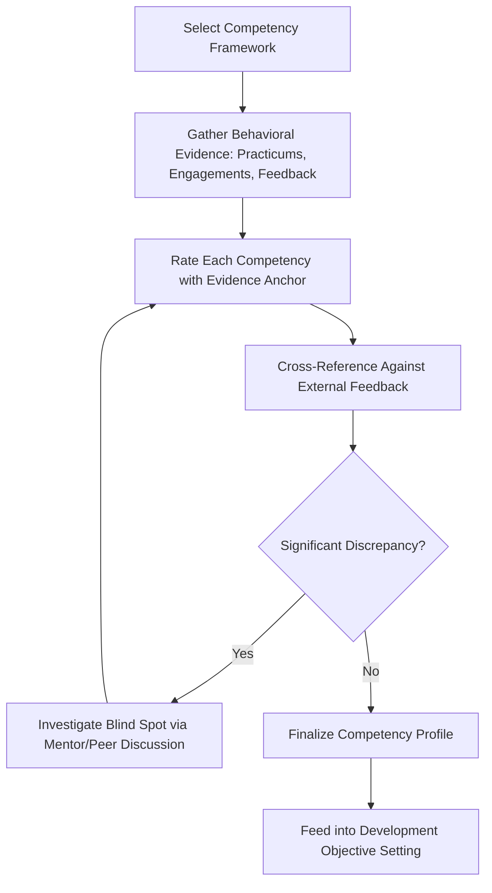

## Self-Assessment Against Diplomatic Leadership Competencies

### Overview

Self-assessment against diplomatic leadership competencies is the structured process by which a practitioner evaluates their own performance against a defined competency framework, generating an evidence-based understanding of current strengths and gaps to inform development planning. This methodology focuses specifically on the assessment instrument and process design, distinct from the broader development-planning cycle it feeds into.

### Purpose and Position in the Development Cycle

**Key Points**

- Self-assessment functions as the diagnostic input stage that precedes objective-setting in personal development planning; the quality of downstream planning depends directly on the rigor of this assessment stage.
- Unlike external evaluation (360-degree feedback, supervisor review), self-assessment carries an inherent risk of blind spots and requires deliberate structural safeguards to maintain validity. [Inference]
- Effective self-assessment balances confidence-building (recognizing genuine strengths) against growth orientation (honestly identifying gaps), since excessive self-criticism and excessive self-affirmation both undermine accurate calibration. [Inference]

### Competency Framework Structure

#### Standard Domain Categories

| Domain | Representative Competencies |
| --- | --- |
| Analytical | Regional/policy expertise, risk assessment, scenario analysis |
| Relational | Cross-cultural communication, active listening, trust-building |
| Procedural | Negotiation technique, mediation skill, institutional/parliamentary literacy |
| Strategic | Coalition-building, long-term relationship management, crisis judgment |
| Personal/reflective | Emotional regulation, ethical judgment, adaptability under uncertainty |

#### Proficiency Level Structuring

Self-assessment instruments typically anchor ratings to behaviorally specific descriptors rather than abstract numeric scales alone, since concrete behavioral anchors improve rating consistency and self-awareness:

- **Novice**: competency demonstrated only under close guidance or in low-stakes settings.
- **Developing**: competency demonstrated independently but inconsistently across contexts.
- **Proficient**: competency demonstrated reliably across standard diplomatic contexts.
- **Advanced**: competency demonstrated reliably even under high-stakes or novel conditions, with capacity to model or coach the skill in others.

### Self-Assessment Methodology

#### Evidence-Based Rating Approach

- **Behavioral evidence anchoring**: rating each competency against specific recalled instances of performance rather than general self-impression, improving assessment validity.
- **Comparative benchmarking**: where available, referencing rubric-scored practicum or simulation outcomes as objective evidence to calibrate self-ratings, reducing purely subjective drift.
- **Critical incident analysis**: identifying specific high-stakes or memorable engagements and analyzing competency demonstration within them in detail, rather than rating uniformly across an entire career span.

#### Process Flow

### Mitigating Self-Assessment Bias

**Key Points**

- **Triangulation with external feedback**: cross-referencing self-ratings against 360-degree input or supervisor evaluation is the most direct structural safeguard against blind spots.
- **Structured rather than open-ended format**: behaviorally anchored rubrics reduce the variance and self-serving bias associated with unstructured self-reflection. [Inference]
- **Temporal distancing**: assessing performance some time after an engagement, rather than immediately, can reduce both acute overconfidence and acute self-criticism tied to immediate emotional response. [Inference]
- **Peer calibration discussion**: comparing self-ratings with peers assessing similar competencies can surface systematic over- or under-rating tendencies specific to an individual.

### Common Self-Assessment Instruments

| Instrument Type | Description |
| --- | --- |
| Behaviorally anchored rating scale (BARS) | Competency ratings tied to specific described behaviors at each level |
| Critical incident log | Narrative analysis of specific high-stakes engagements against competency framework |
| Structured reflective questionnaire | Guided prompts addressing each competency domain with evidence requirements |
| Comparative practicum scorecard review | Self-rating conducted alongside review of prior rubric-scored practicum outcomes |

### Integration with Development Planning

- Self-assessment results directly populate the gap-analysis stage of the broader development-planning cycle, identifying priority competencies for objective-setting.
- Recurring self-assessment (rather than a single initial instance) allows longitudinal tracking of competency growth, supporting evidence-based portfolio documentation for career advancement.
- Discrepancies surfaced between self-assessment and external feedback often represent the highest-value development targets, since they indicate blind spots rather than merely known weaknesses. [Inference]

### Common Pitfalls

- Rating competencies from general self-impression rather than specific behavioral evidence, reducing both accuracy and actionable specificity.
- Conducting self-assessment only once (e.g., at program entry) rather than as a recurring practice, losing the ability to track development over time.
- Ignoring discrepancies between self-rating and external feedback rather than treating them as priority investigation targets.
- Applying assessment frameworks inconsistently across review cycles, undermining longitudinal comparability of results.
- Allowing recency bias to dominate ratings, where a single recent strong or weak performance disproportionately shapes the overall competency profile rather than a fuller evidence base. [Inference]

### Related Topics

- Behaviorally anchored rating scale (BARS) design methodology
- 360-degree feedback integration with self-assessment processes
- Personal diplomatic leadership development planning cycles
- Critical incident analysis technique in professional reflection
- Longitudinal portfolio assessment for diplomatic certification pathways