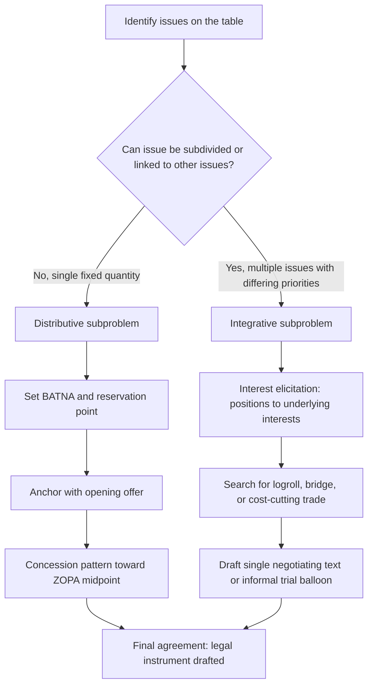

## Distributive versus Integrative Bargaining in Diplomatic Negotiation

### Theoretical Foundations

**Distributive bargaining** is a negotiation mode structured around the division of a fixed quantity of value, commonly modeled as a zero-sum or constant-sum interaction: whatever one party gains, the other loses. The theoretical apparatus for this mode comes from bargaining theory's treatment of a single-issue contract zone, bounded by each party's **reservation point** (the minimum/maximum a party will accept before walking away) and characterized by a **ZOPA** (zone of possible agreement) — the range between the two reservation points where a deal is mutually acceptable. If the parties' reservation points do not overlap, no ZOPA exists and no rational agreement is possible absent a change in either party's alternatives or valuation.

**Integrative bargaining**, by contrast, treats the negotiation as a multi-issue problem in which value can be created — not merely divided — by exploiting differences in the parties' priorities, risk tolerances, time preferences, or underlying interests. The theoretical basis is the distinction, drawn from negotiation analysis (most systematically in Raiffa's *The Art and Science of Negotiation*, 1982), between **positions** (a party's stated demand) and **interests** (the underlying needs or objectives a position is meant to satisfy). Because parties frequently hold divergent interests even when their positions appear to conflict, integrative bargaining searches for **Pareto-improving** trades: outcomes that make at least one party better off without making the other worse off relative to some alternative agreement.

The two modes are not mutually exclusive within a single negotiation. Walton and McKersie's *A Behavioral Theory of Labor Negotiations* (1965) — the foundational text distinguishing these terms — frames real negotiations as containing both a distributive "claiming value" subprocess and an integrative "creating value" subprocess, often occurring in sequence: parties first expand the pie through integrative trades, then divide the enlarged pie through distributive bargaining over the remaining fixed-sum residue. Lax and Sebenius later formalized this as the **"negotiator's dilemma"**: the tactics that best serve value-claiming (withholding information, exaggerating one's reservation point) are frequently the tactics that inhibit value-creation (which requires information exchange to identify complementary interests), so a negotiator must manage a tension between the two modes within the same encounter rather than treating them as a binary choice.

### Distributive Bargaining: Mechanism and Diplomatic Application

**Anchoring and the reservation point.** In distributive bargaining, the first credible offer statistically exerts disproportionate influence on the final settlement point (the anchoring effect, per Kahneman and Tversky's work on judgment under uncertainty). A diplomatic delegation's opening position is therefore rarely a genuine statement of preference; it is a strategic anchor intended to shift the counterpart's perception of the ZOPA's midpoint. A **BATNA** (best alternative to a negotiated agreement — the outcome a party would obtain if talks fail, coined by Fisher and Ury in *Getting to Yes*, 1981) is the analytic tool used to set a party's true reservation point, since a rational negotiator should never accept a deal worse than their BATNA.

**Diplomatic application.** Distributive dynamics dominate negotiations over territory, reparations, or binary sovereignty questions, where the subject matter resists subdivision into separable interests. The Paris Peace Conference's territorial and reparations provisions (1919) illustrate a heavily distributive structure: French demands for reparations and Rhineland security guarantees were substantially in tension with the United States' and Britain's competing priorities on German economic viability, and the final Treaty of Versailles reparations figure represented a claimed-value outcome rather than a jointly optimized one. [Inference: characterizing Versailles as "predominantly distributive" is a widely used pedagogical simplification of a negotiation that also contained integrative elements, such as trade-offs over colonial mandates.]

A more contained example is the 1978–79 **maritime boundary distributive core** of many bilateral delimitation disputes, where the total sea-bed area is fixed and a boundary line necessarily allocates it between two claimants — a structurally zero-sum subproblem even when it sits inside a broader, more integrative bilateral relationship.

### Integrative Bargaining: Mechanism and Diplomatic Application

**Interest differentiation and logrolling.** Integrative outcomes typically arise through one of several identified mechanisms:

- **Logrolling**: trading concessions across issues that parties value differently, so each party "wins" on the issue it cares about most while "losing" on issues it cares about least.
- **Bridging**: inventing a new option that satisfies the underlying interests of both parties without conceding on either's originally stated position.
- **Cost-cutting**: compensating a party for the cost of a concession through an unrelated benefit, rather than reversing the concession itself.

**Diplomatic application: Camp David Accords (1978).** The Israeli–Egyptian negotiations over the Sinai Peninsula, mediated by the United States, are the paradigmatic diplomatic case of integrative reframing. Israel's positional demand was continued security control of Sinai; Egypt's positional demand was the return of Sinai under full Egyptian sovereignty. Interest-level analysis revealed that Israel's underlying interest was security from attack across the Sinai, not territorial control per se, while Egypt's underlying interest was sovereignty and the restoration of national dignity, not necessarily an unrestricted military presence. The resulting agreement — full Egyptian sovereignty over Sinai combined with demilitarized buffer zones and phased Israeli withdrawal — satisfied both underlying interests simultaneously, a bridging solution unavailable to either party's original position. [Fisher and Ury use this case explicitly to illustrate positions-versus-interests analysis.]

**Diplomatic application: Iran nuclear negotiations (JCPOA, 2015).** The multilateral P5+1–Iran talks combined logrolling across technical, economic, and temporal dimensions: Iran's interest in sanctions relief and international economic reintegration was traded against the P5+1's interest in verified nuclear constraint, with phased sunset clauses functioning as a cost-cutting mechanism that allowed Iran to accept short-term restrictions in exchange for a credible long-term normalization pathway.

### The Negotiator's Dilemma in Practice

Because integrative value-creation requires information disclosure (revealing true priorities to identify complementary trades) while distributive value-claiming rewards strategic misrepresentation, diplomatic negotiators face a structural incentive problem: a party that discloses its interests to enable a bridging solution exposes itself to exploitation if the counterpart uses that information purely to extract concessions. Practitioners manage this through:

- **Conditional and hypothetical framing**: proposing trades as "if you could accept X, would Y be possible?" rather than firm concessions, preserving the ability to withdraw the offer.
- **Single negotiating text procedures**: a third-party mediator (rather than either principal) drafts and iteratively revises a composite proposal, allowing both parties to react to draft language without disclosing reservation points directly to each other. This procedure was used at Camp David 1978 by U.S. mediators precisely to manage this dilemma.
- **Track II or back-channel exploration**: informal, non-binding contacts (often academics or retired officials rather than sitting officials) test integrative possibilities without committing either government, reducing the domestic political cost of a floated concession that does not materialize. The Oslo Accords (1993) back-channel talks are a documented instance of this mechanism preceding a formal, more distributive endgame on borders and settlements. [The effectiveness of Track II diplomacy as a reliable causal mechanism, rather than a facilitating condition alongside formal talks, remains disputed in the diplomatic-practice literature; proponents point to Oslo and the Norway-mediated Guatemala peace process, while skeptics note Track II's frequent failure to translate into binding Track I outcomes, as in decades of Track II Israeli-Palestinian and Cyprus contacts that did not produce ratified settlements.]

### Diagnostic Heuristics for Practitioners

A negotiator entering a session typically runs an informal structural diagnosis before selecting a bargaining posture:

### Legal Form of the Outcome

Regardless of bargaining mode, a diplomatic negotiation that concludes successfully must resolve into a legal instrument governed by the Vienna Convention on the Law of Treaties (VCLT, 1969). **Article 2(1)(a) VCLT** defines a treaty as "an international agreement concluded between States in written form and governed by international law," a definitional threshold relevant because integrative side-deals (informal understandings, non-binding memoranda) frequently accompany a formal treaty text precisely because they do not need to satisfy this threshold — allowing parties to record integrative trades (e.g., aid commitments, informal security assurances) outside the binding instrument where domestic ratification politics make binding commitment costly. The Camp David Accords themselves took the form of two framework documents under **Article 2(1)(a)**, later codified into the binding 1979 Egypt–Israel Peace Treaty; the informal U.S. aid commitments to both parties that helped make the deal integrative were conveyed through separate, non-treaty diplomatic notes rather than treaty text.

**Key Points**

- Distributive bargaining divides a fixed-value quantity along a single dimension bounded by each party's reservation point and BATNA; integrative bargaining creates value across multiple issues by exploiting differing priorities.
- Walton and McKersie's dual-process framework treats these as concurrent subprocesses within one negotiation, not alternative negotiation types.
- The negotiator's dilemma (Lax and Sebenius) captures the structural tension: value-claiming rewards information concealment, value-creation requires information disclosure.
- Camp David 1978 is the canonical diplomatic case for positions-versus-interests bridging; Versailles 1919 illustrates a heavily distributive structure; Oslo 1993 illustrates Track II back-channel exploration preceding formal talks.
- Successful outcomes still require translation into a VCLT-governed instrument (Article 2(1)(a)) or accompanying non-binding diplomatic correspondence for integrative side-commitments.

**Related Topics**

- BATNA construction and reservation-point estimation under asymmetric information
- Single negotiating text procedure and third-party mediation design
- Track I versus Track II diplomacy: institutional boundaries and effectiveness debates
- VCLT Articles 31–33: treaty interpretation and its effect on ambiguous integrative drafting
- Multiparty coalition dynamics in integrative bargaining (e.g., P5+1 structure)
- Rebus sic stantibus and treaty renegotiation as a distributive re-opening mechanism